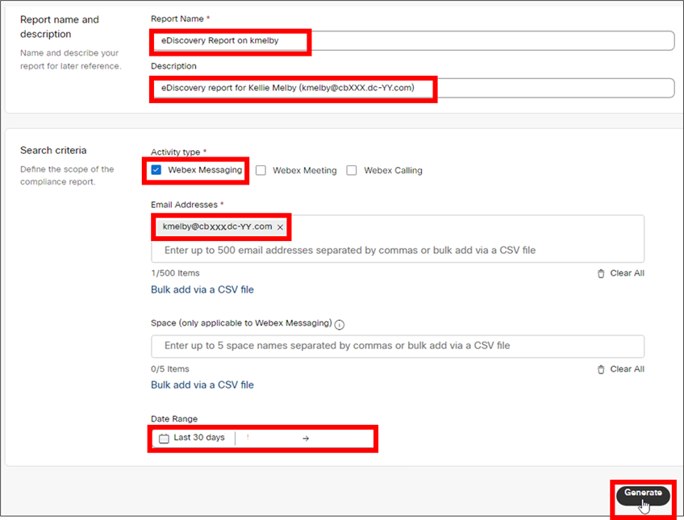
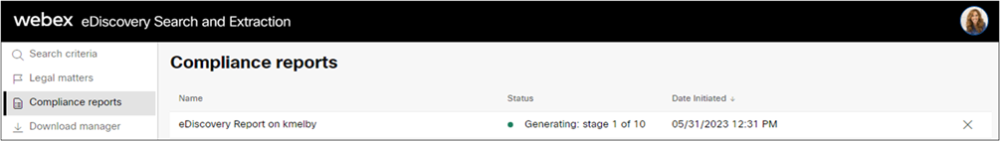
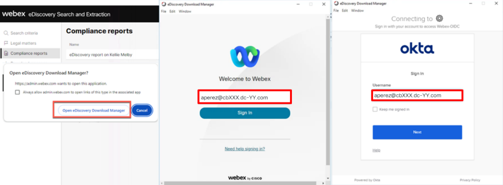
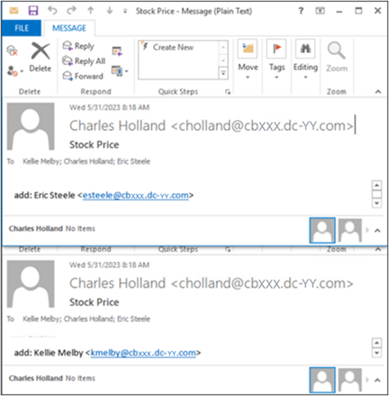
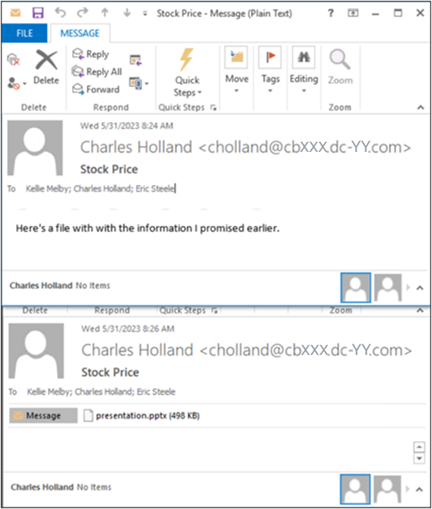
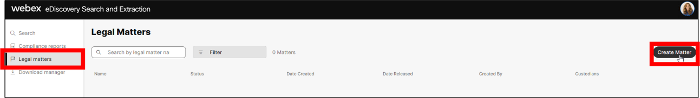

# Appendix
NOTE: The following module is not part of this lab but has been included here for your reference. If you wish to explore this module, please complete the rest of the lab before proceeding. Screenshots have been provided so even if the lab environment is no longer available, you will still be able to explore this topic.

## Explore Webex eDiscovery Search and Extraction Portal
eDiscovery is the mechanism for searching through and retrieving data from the retained user data archive of an organization. This ensures that the compliance officer has full access to all retained user data as needed for compliance management and enforcement.
Webex includes a built-in eDiscovery tool which provides access to up to 90 days of user data by default. With Webex Pro Pack](https://help.webex.com/en-us/article/np3c1rm/Pro-Pack-For-Control-Hub), eDiscovery provides access to unlimited user data (up to the configured retention period).

1. Navigate to the Webex eDiscovery Search and Extraction portal. From the Chrome browser on Anita Perez's workstation (WKST2), login to Webex Control Hub (<https://admin.webex.com>) if required, with username / password: **aperez@cbXXX.dc-YY.com** / **dCloud123!** (see your pod sheet for 'XXX' and 'YY' values and the non-SSO password if you didn't complete Module 1).
   
    
    Once logged in, click **Troubleshooting** in the left-hand navigation window. Then, click **Status**. Finally, in the Tools tile, click the **View eDiscovery** button to navigate to the eDiscovery portal. 
   
      
   
    Once connected to the eDiscovery Search and Extraction portal, you'll see the main search page for eDiscovery where the administrator or compliance officer can search against all retained user data records across all media types including messages, files, and meeting transcripts.
       

1. Create an eDiscovery report on user Kellie Melby Webex's eDiscovery tool does not provide direct search of user data records. Instead, the compliance officer must generate a report for all activity for a particular user or set of users or for all activity within one or more messaging spaces.  Let's generate an eDiscovery report for one of our users: Kellie Melby.  Enter the following information on the Search and Generate Compliance Report page:

    Report Name: **eDiscovery report on Kellie Melby**Description: **eDiscovery report for Kellie Melby (kmelby@cbXXX.dc-YY.com)**Activity type: **Webex Messaging**Email addresses: **kmelby@cbXXX.dc-YY.com** (refer to pod sheet for 'XXX' and 'YY' values)Date Range: Leave at '**Last 30 days**'. Click the **Generate** button to start the report generation process.
   
       
   
    Generation of the eDiscovery report starts immediately. 
   
     
  
    The report generation will take some time to complete, in the meantime, go ahead and install the eDiscovery Download Manager which is required to download eDiscovery reports. 

1. Download and install the eDiscovery Download Manager The eDiscovery Download Manager is available for download from the eDiscovery portal.

    Download the eDiscovery download tool. Click '**Download Manager**' in the left-hand navigation panel.
   
    
    On the Download Manager page, click **Download for Windows 10** to begin download of the software. 
   
       

    Install eDiscovery Download Manager.
   
    Once the software download completes, click the arrow next to the download file at the bottom of the Chrome browser window and select 'Open' to open the executable install file.
   
    After a moment the eDiscovery Download Manager install process will begin.
   
    Allow the install to compete and then click the Finish button to close the install process.
   
       

1. After the eDiscovery report is complete, download summary report and full report.
   
    Return to the Compliance reports page to ensure report generation is complete.

    Review the eDiscovery report summary. Once the report status shows 'Completed', click the report name to load the report details. 
   
       
   
    Review the report information and the content summary. If you followed the instructions in the section Generate User Data with Webex App, the report should contain spaces, activities, and files. 
   
      **** 
   
    **Note:** Depending on the compliance/DLP platform you selected, the numbers and data in your report may not match what is shown in the screen shots in this section. 

    Download the eDiscovery report summary and full report. Click the **Download** button to download the eDiscovery report.
   
    Click the **Open eDiscovery Download Manager** button when prompted by the browser.
   
    The eDiscovery Download Manager requires user authentication by a user with the compliance officer role to download eDiscovery reports. Login with Anita Perez's Webex account. 
   
       
   
    Once logged in to the eDiscovery Download Manager, click the top **Download** button to download the eDiscovery Summary Report. Once the summary report download is complete, click the **Dismiss** button and then, click the bottom **Download** button to download the Full Report. 
   
       
   
    Both the summary report and the full report are downloaded to the Downloads directory (C:\\Users\\aperez\\Downloads). 

1. Review eDiscovery reports Open and review the .csv summary report.
   
    The summary report doesn't provide the user data, but it's a good starting point for reviewing a user or group of users' data.
   
    Open the File Explorer on WKST2 and navigate to C:\\Users\\aperez\\Downloads\\.
   
    Locate the .csv file (file ending with '-spaces.csv) and double-click to open the file and review. When prompted for Microsoft Office setup, click 'X' in upper right corner to dismiss. Once open, note the file includes a row with spaceID for each space in the report. For each space included in the report, you'll see information including space name, activities, and members. 
   
       

    Open the full report .zip file and review the full report contents.
   
    The full report zip file contains a nested set of folders for each space in the report with email (.eml) formatted files corresponding to each message, space activity, and shared file. The set of **.eml** files is the full set of user data within a specific space.
   
    Return to the File Explorer window and double click into the zip file of the full report to navigate and browse through the folders of .eml files corresponding to each space.
   
      
   
    You can view individual email messages (.eml files), by double clicking them. When opening the first .eml file, Outlook will prompt you to create a mail profile. Enter any word (e.g., 'Anita', 'Webex', etc.) as the profile name and click to proceed with Outlook application to open and display the .eml file.
   
    See if you can locate messages showing space activities (e.g., users added to a space), messages with compliance violations (e.g., social security number, credit card #), and files (as attachment to the messages).
   
    See the examples below:
   
    Space activities 
   
       
   
    Messages with compliance violations 
   
       
   
    Shared files
   
      
   
    
    While user data is certainly available and discoverable through the Webex eDiscovery Search and Extraction tool, reviewing the data in the reports and locating specific pieces of data can be tedious, particularly when the reports contain large numbers of users or spaces. 

1. Legal Hold
   
    The Webex eDiscovery Search and Extraction tool also provides support for Legal Hold support. Legal Hold is a mechanism for creating and managing cases related to legal investigations where specific user data records must be maintained beyond the normal corporate data retention policies. User data records associated to a Legal Hold are maintained indefinitely until the Legal Hold case is closed.

    Navigate to 'Legal matters' page on eDiscovery portal.
   
    From the Chrome browser on Anita Perez's workstation (WKST2), return to the eDiscovery Search and Extraction tool session you were using earlier. Log in again, if required (**aperez@cbXXX.dc-YY.com** / **dCloud123!** - see your pod sheet for 'XXX' and 'YY' values and the non-SSO password if you didn't complete Module 1).
   
    To create and manage Legal Hold cases, navigate to the 'Legal matters' page by selecting '**Legal matters**' from the left-hand navigation menu. Note that currently no Legal Holds have been created.
   
      

    Create a Legal matter (Legal Hold) for user/custodian Kellie Melby.
   
    Click the '**Create Matter**' button to configure a Legal Hold. In this case, you'll create a Legal Hold for the same user you ran an eDiscovery report on earlier: Kellie Melby (kmelby).
   
    Enter the following values in the 'Create Matter' dialog:

    Name: **LH-M001001**Description: **Legal hold LH-M001001 on user Kellie Melby**
      
   
    Click 'Download CSV Template' to download the custodian import template. We'll use this template to add a user (custodian) to a Legal Hold/Legal matter.
   
    Open the downloaded CSV template in Excel and add Kellie Melby's email address **kmelby@cbXXX.dc-YY.com** to the second row (values for 'XXX' and 'YY' are on your pod sheet).
   
    Click the save icon to save your change to the template file.
   
    Click **Yes** to maintain the custodian file in CSV format.
   
      
   
    Return to the Create Matter dialog and click **Browse**. Locate the CustodianImportTemplate.csv file you just edited and select. Click **Open**.
   
    Click **Save** to finish creating the legal matter. Keep an eye on the 'Create Matter' process and ensure that the legal matter setup completes. Click **Close** to acknowledge once the matter is created.
   
      
   
    Returning to the Legal matters page, you will see that there is now an active legal matter. Click the matter name to load the legal matter details. Notice there are options to add/remove user/custodians as well as to 'Release' (or close) a matter.
   
      
   
    At this point there is nothing left to do for this legal matter. Note that all users/custodians associated to a legal matter / Legal Hold will have all their available data retained beyond the configured retention period.
   
    In this case, this means that all of Kellie Melby's user generated data will be retained indefinitely, overriding the current Webex Control Hub configured retention period of 360 days which we reviewed earlier. If/when the Legal Hold is released for this matter / custodian, the 360-day period for data retention would apply.

Theta Lake also supports near real-time DLP for files and messages with automatic remediation.