# Appendix
NOTE: The following sections are not part of this lab but have been included here for your reference. If you wish to explore this module, please complete the rest of the lab before proceeding. Screenshots have been provided so even if the lab environment is no longer available, you will still be able to explore these topics.

i. [Explore Webex eDiscovery Search and Extraction Portal](#explore-webex-ediscovery-search-and-extraction-portl)

ii. [Webex Integrations to Webex Compliance Hub](#webex-integrations-to-webex-compliance-hub)

## Explore Webex eDiscovery Search and Extraction Portal
eDiscovery is the mechanism for searching through and retrieving data from the retained user data archive of an organization. This ensures that the compliance officer has full access to all retained user data as needed for compliance management and enforcement.
Webex includes a built-in eDiscovery tool which provides access to up to 90 days of user data by default. With Webex Pro Pack](https://help.webex.com/en-us/article/np3c1rm/Pro-Pack-For-Control-Hub), eDiscovery provides access to unlimited user data (up to the configured retention period).

1. Navigate to the Webex eDiscovery Search and Extraction portal. From the Chrome browser on Anita Perez's workstation (WKST2), login to Webex Control Hub (<https://admin.webex.com>) if required, with username / password: **aperez@cbXXX.dc-YY.com** / **dCloud123!** (see your pod sheet for 'XXX' and 'YY' values and the non-SSO password if you didn't complete Module 1).
   
    
    Once logged in, click **Troubleshooting** in the left-hand navigation window. Then, click **Status**. Finally, in the Tools tile, click the **View eDiscovery** button to navigate to the eDiscovery portal. 
   
      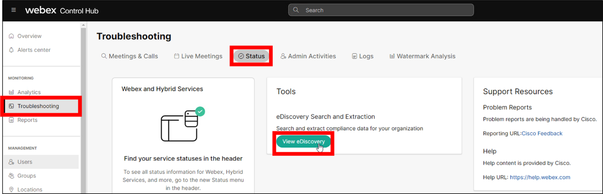{ width="400" style="border: 1px solid #888; border-radius: 4px;" }
   
    Once connected to the eDiscovery Search and Extraction portal, you'll see the main search page for eDiscovery where the administrator or compliance officer can search against all retained user data records across all media types including messages, files, and meeting transcripts.
      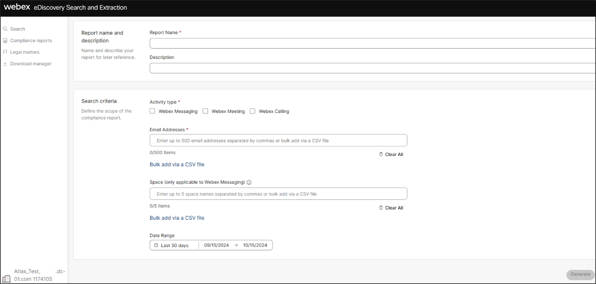 

1. Create an eDiscovery report on user Kellie Melby Webex's eDiscovery tool does not provide direct search of user data records. Instead, the compliance officer must generate a report for all activity for a particular user or set of users or for all activity within one or more messaging spaces.  Let's generate an eDiscovery report for one of our users: Kellie Melby.  Enter the following information on the Search and Generate Compliance Report page:

    Report Name: **eDiscovery report on Kellie Melby**Description: **eDiscovery report for Kellie Melby (kmelby@cbXXX.dc-YY.com)**Activity type: **Webex Messaging**Email addresses: **kmelby@cbXXX.dc-YY.com** (refer to pod sheet for 'XXX' and 'YY' values)Date Range: Leave at '**Last 30 days**'. Click the **Generate** button to start the report generation process.
   
      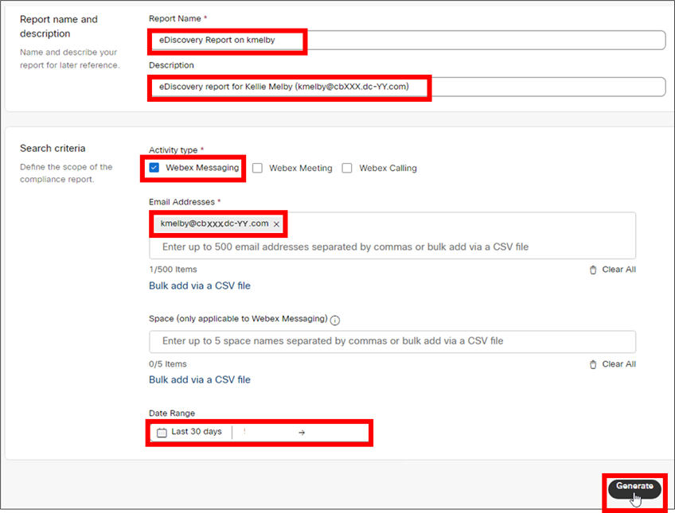 
   
    Generation of the eDiscovery report starts immediately. 
   
    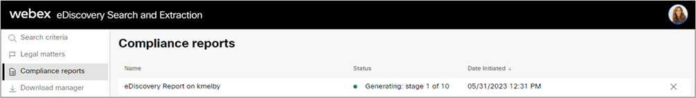 
  
    The report generation will take some time to complete, in the meantime, go ahead and install the eDiscovery Download Manager which is required to download eDiscovery reports. 

1. Download and install the eDiscovery Download Manager The eDiscovery Download Manager is available for download from the eDiscovery portal.

    Download the eDiscovery download tool. Click '**Download Manager**' in the left-hand navigation panel.
   
    
    On the Download Manager page, click **Download for Windows 10** to begin download of the software. 
   
      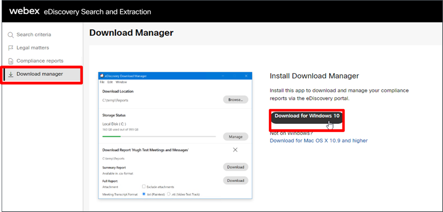 

    Install eDiscovery Download Manager.
   
    Once the software download completes, click the arrow next to the download file at the bottom of the Chrome browser window and select 'Open' to open the executable install file.
   
    After a moment the eDiscovery Download Manager install process will begin.
   
    Allow the install to compete and then click the Finish button to close the install process.
   
      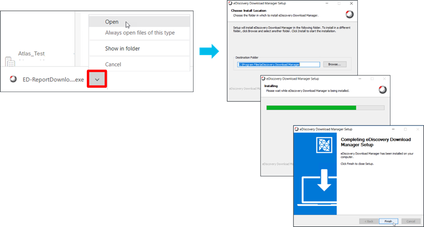 

1. After the eDiscovery report is complete, download summary report and full report.
   
    Return to the Compliance reports page to ensure report generation is complete.

    Review the eDiscovery report summary. Once the report status shows 'Completed', click the report name to load the report details. 
   
      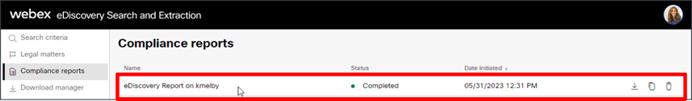 
   
    Review the report information and the content summary. If you followed the instructions in the section Generate User Data with Webex App, the report should contain spaces, activities, and files. 
   
      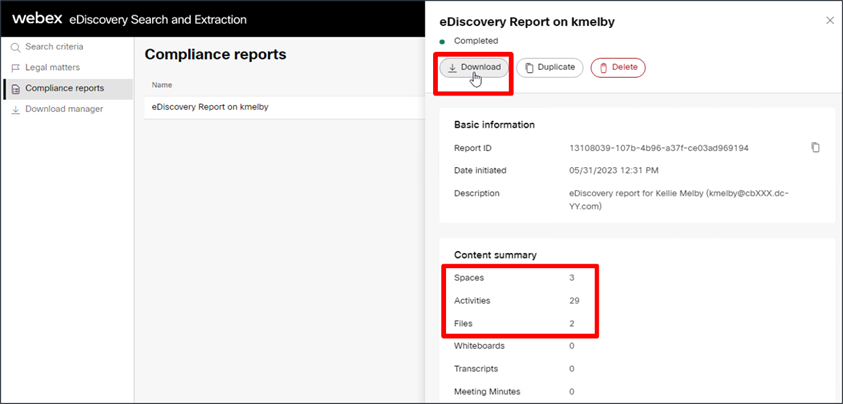**** 
   
    **Note:** Depending on the compliance/DLP platform you selected, the numbers and data in your report may not match what is shown in the screen shots in this section. 

    Download the eDiscovery report summary and full report. Click the **Download** button to download the eDiscovery report.
   
    Click the **Open eDiscovery Download Manager** button when prompted by the browser.
   
    The eDiscovery Download Manager requires user authentication by a user with the compliance officer role to download eDiscovery reports. Login with Anita Perez's Webex account. 
   
      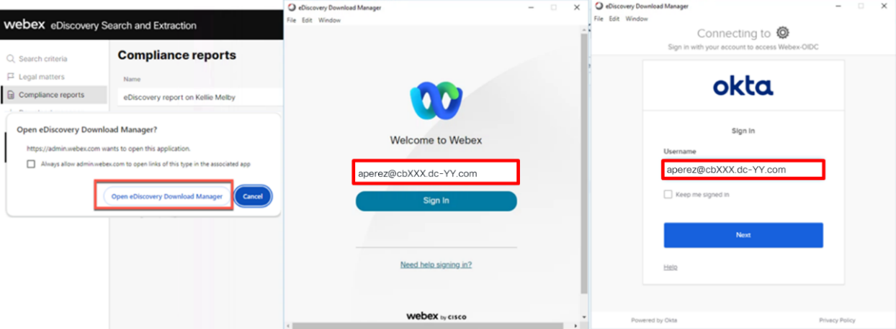 
   
    Once logged in to the eDiscovery Download Manager, click the top **Download** button to download the eDiscovery Summary Report. Once the summary report download is complete, click the **Dismiss** button and then, click the bottom **Download** button to download the Full Report. 
   
      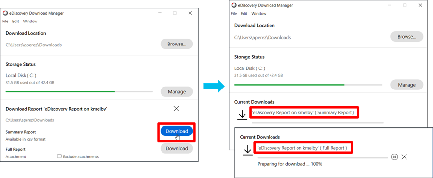 
   
    Both the summary report and the full report are downloaded to the Downloads directory (C:\\Users\\aperez\\Downloads). 

1. Review eDiscovery reports Open and review the .csv summary report.
   
    The summary report doesn't provide the user data, but it's a good starting point for reviewing a user or group of users' data.
   
    Open the File Explorer on WKST2 and navigate to C:\\Users\\aperez\\Downloads\\.
   
    Locate the .csv file (file ending with '-spaces.csv) and double-click to open the file and review. When prompted for Microsoft Office setup, click 'X' in upper right corner to dismiss. Once open, note the file includes a row with spaceID for each space in the report. For each space included in the report, you'll see information including space name, activities, and members. 
   
      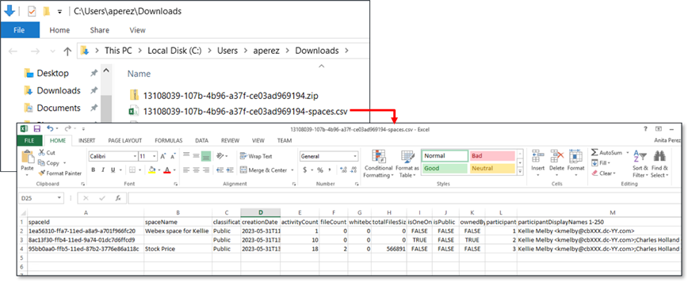 

    Open the full report .zip file and review the full report contents.
   
    The full report zip file contains a nested set of folders for each space in the report with email (.eml) formatted files corresponding to each message, space activity, and shared file. The set of **.eml** files is the full set of user data within a specific space.
   
    Return to the File Explorer window and double click into the zip file of the full report to navigate and browse through the folders of .eml files corresponding to each space.
   
      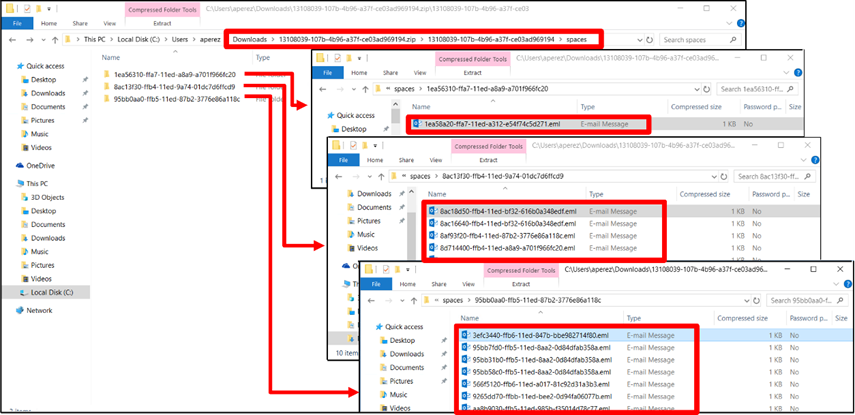{ width="400" style="border: 1px solid #888; border-radius: 4px;" }
   
    You can view individual email messages (.eml files), by double clicking them. When opening the first .eml file, Outlook will prompt you to create a mail profile. Enter any word (e.g., 'Anita', 'Webex', etc.) as the profile name and click to proceed with Outlook application to open and display the .eml file.
   
    See if you can locate messages showing space activities (e.g., users added to a space), messages with compliance violations (e.g., social security number, credit card #), and files (as attachment to the messages).
   
    See the examples below:
   
    Space activities 
   
      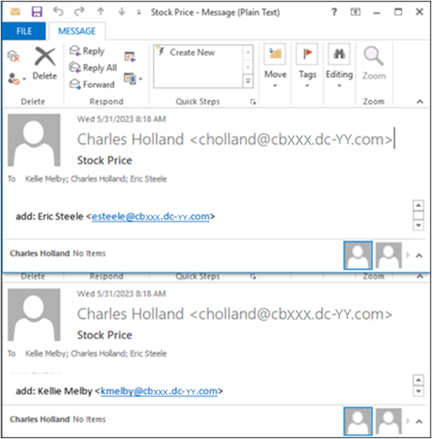 
   
    Messages with compliance violations 
   
      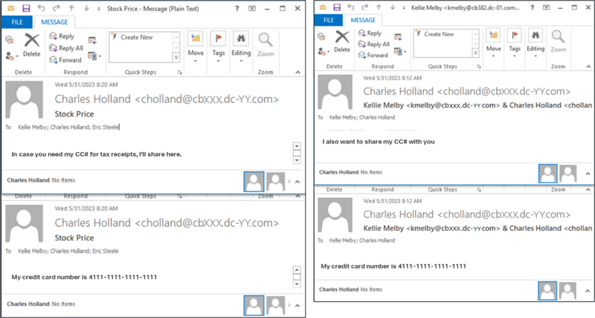 
   
    Shared files
   
      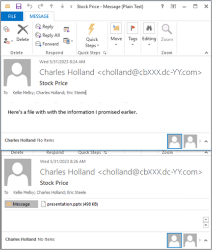{ width="400" style="border: 1px solid #888; border-radius: 4px;" }
   
    
    While user data is certainly available and discoverable through the Webex eDiscovery Search and Extraction tool, reviewing the data in the reports and locating specific pieces of data can be tedious, particularly when the reports contain large numbers of users or spaces. 

1. Legal Hold
   
    The Webex eDiscovery Search and Extraction tool also provides support for Legal Hold support. Legal Hold is a mechanism for creating and managing cases related to legal investigations where specific user data records must be maintained beyond the normal corporate data retention policies. User data records associated to a Legal Hold are maintained indefinitely until the Legal Hold case is closed.

    Navigate to 'Legal matters' page on eDiscovery portal.
   
    From the Chrome browser on Anita Perez's workstation (WKST2), return to the eDiscovery Search and Extraction tool session you were using earlier. Log in again, if required (**aperez@cbXXX.dc-YY.com** / **dCloud123!** - see your pod sheet for 'XXX' and 'YY' values and the non-SSO password if you didn't complete Module 1).
   
    To create and manage Legal Hold cases, navigate to the 'Legal matters' page by selecting '**Legal matters**' from the left-hand navigation menu. Note that currently no Legal Holds have been created.
   
      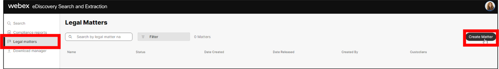{ width="400" style="border: 1px solid #888; border-radius: 4px;" }

    Create a Legal matter (Legal Hold) for user/custodian Kellie Melby.
   
    Click the '**Create Matter**' button to configure a Legal Hold. In this case, you'll create a Legal Hold for the same user you ran an eDiscovery report on earlier: Kellie Melby (kmelby).
   
    Enter the following values in the 'Create Matter' dialog:

    Name: **LH-M001001**Description: **Legal hold LH-M001001 on user Kellie Melby**
      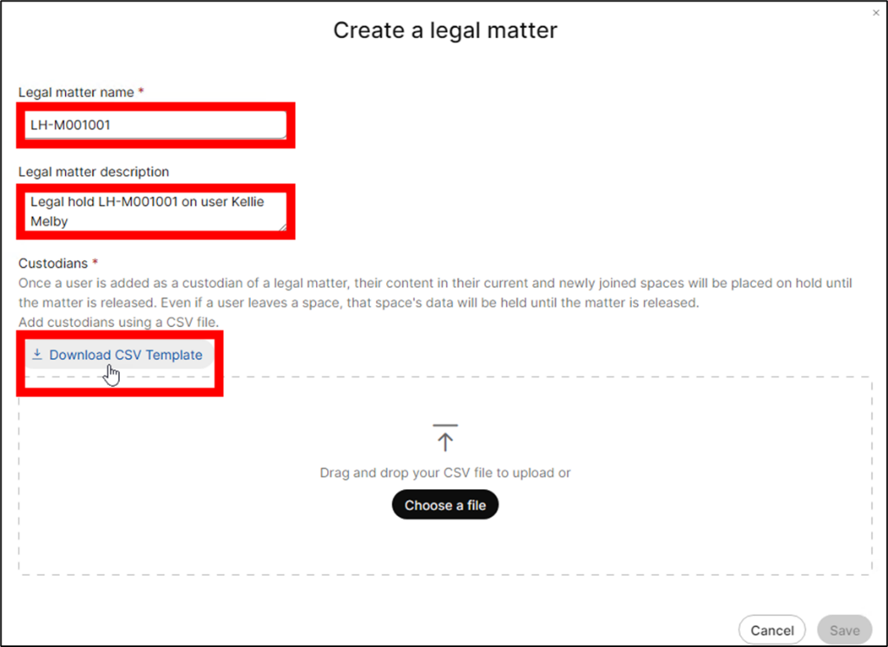{ width="400" style="border: 1px solid #888; border-radius: 4px;" }
   
    Click 'Download CSV Template' to download the custodian import template. We'll use this template to add a user (custodian) to a Legal Hold/Legal matter.
   
    Open the downloaded CSV template in Excel and add Kellie Melby's email address **kmelby@cbXXX.dc-YY.com** to the second row (values for 'XXX' and 'YY' are on your pod sheet).
   
    Click the save icon to save your change to the template file.
   
    Click **Yes** to maintain the custodian file in CSV format.
   
      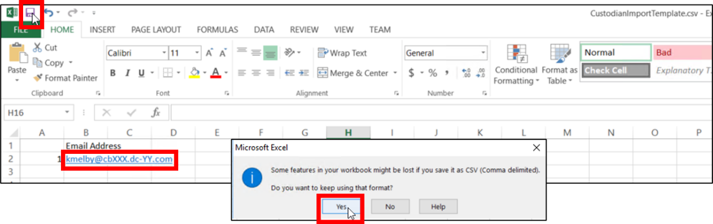{ width="400" style="border: 1px solid #888; border-radius: 4px;" }
   
    Return to the Create Matter dialog and click **Browse**. Locate the CustodianImportTemplate.csv file you just edited and select. Click **Open**.
   
    Click **Save** to finish creating the legal matter. Keep an eye on the 'Create Matter' process and ensure that the legal matter setup completes. Click **Close** to acknowledge once the matter is created.
   
      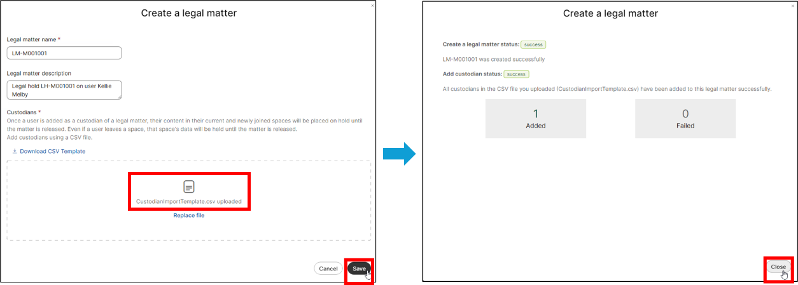{ width="400" style="border: 1px solid #888; border-radius: 4px;" }
   
    Returning to the Legal matters page, you will see that there is now an active legal matter. Click the matter name to load the legal matter details. Notice there are options to add/remove user/custodians as well as to 'Release' (or close) a matter.
   
      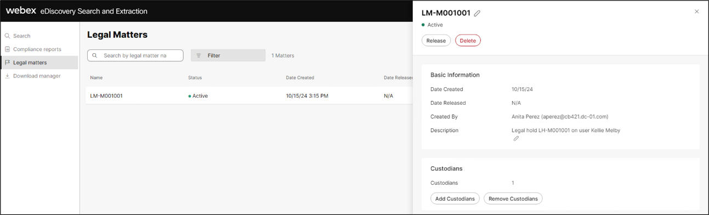{ width="400" style="border: 1px solid #888; border-radius: 4px;" }
      
    At this point there is nothing left to do for this legal matter. Note that all users/custodians associated to a legal matter / Legal Hold will have all their available data retained beyond the configured retention period.
   
    In this case, this means that all of Kellie Melby's user generated data will be retained indefinitely, overriding the current Webex Control Hub configured retention period of 360 days which we reviewed earlier. If/when the Legal Hold is released for this matter / custodian, the 360-day period for data retention would apply.

## Webex Integrations to Webex Compliance Hub

As with other external compliance platforms, Webex Compliance Hub leverages the Webex Events API to monitor Webex data and periodically ingest this persisted data from the Webex organization to the platform.

In order to make Webex Events API endpoint calls, the Webex Compliance Hub tenant must securely integrate with the Webex organization with authorization by the Webex  compliance officer. This compliance officer’s Webex account must be assigned the ‘Compliance Officer’ role within the Webex organization prior to configuring the integration with Webex Compliance Hub.

In this section, you will configure one or more Webex service integrations on a Webex Compliance Hub tenant to understand the Webex integration process. Please keep the following in mind before proceeding:

- The Webex Compliance Hub tenant you will be accessing is a <u>**shared resource**</u> and you will access this resource using an administrator account. This means you will be able to view and manipulate other lab attendee’s data in addition to your own. Please use caution when accessing the system and <u>do **NOT** take action on any data that does not originate from your Webex organization</u> – specifically your assigned domain: **cbXXX.dc-YY.com**.
- It takes **4 hours for Webex Compliance Hub to begin ingesting data from your Webex organization** once you authorize the integration. Further, <strong>only data generated after the Webex integration is authorized and started will be ingested</strong>. Data generated prior to the integration will not be ingested into the Webex Compliance Hub tenant.
- Because this is a 4-hour lab, any data you generate during this lab will not be available in Webex Compliance Hub before the lab ends. However, if you would like to view the specific data you generated in your Webex organization during the lab (after you enabled the integration), record the Webex Compliance Hub administrator portal URL and account credentials provided in step 1 below so you can access the tenant later to review your data. Your Webex data will be maintained in the shared Webex Compliance Hub for approximately 14 days before all data is removed. 

<i>Note: Your data will only be available in Webex Compliance Hub if you complete the Webex integration for the Webex service(s) you generate data from. For example, if you don’t send messages in a Webex space (direct/1:1 or group), no messaging data will be generated by Webex and in turn, no data will be ingested into the Webex Compliance Hub tenant.</i>

1. Login to the shared Webex Compliance Hub tenant 
    Open a new incognito Chrome browser window on Workstation 2 (WKST2) and navigate to the Webex Compliance Hub portal at https://useast.thetalake.ai/. 
    
    Login to the shared Webex Compliance Hub tenant using the following credentials:

    - Email: **collabdemorg@gmail.com** 
    - Password: **dCloud321!**

    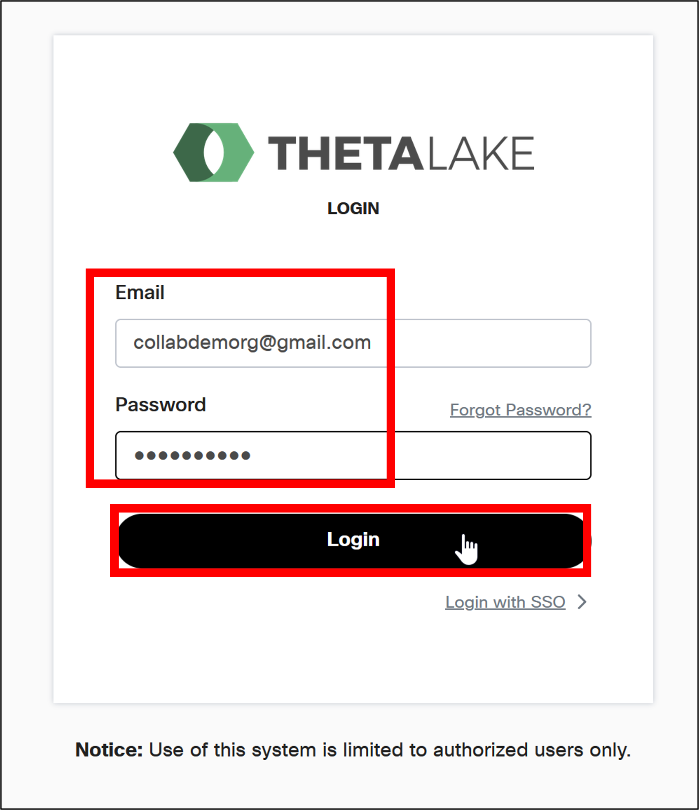{ width="400" style="border: 1px solid #888; border-radius: 4px;" }

    Please remember this is a <strong><u>shared resource</u></strong>. Use caution when accessing the system and <u>do NOT take action</u> on any data or integrations that <u>do not originate</u> from your Webex organization – specifically your assigned domain: <strong>*cbXXX.dc-YY.com</strong> .

    After logging in, the ****Policies** page will be displayed. This is where data ingestion characteristics are configured including collaboration platform integrations (Content Source), data policies and data ingestion flows (Content Analysis and Content Routing, respectively), and data storage (Content Destination). 

    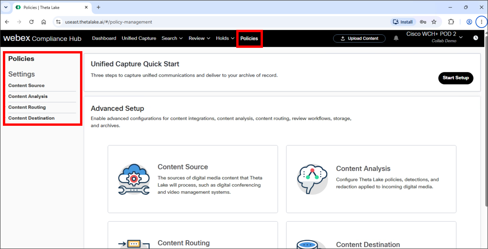{ width="800" style="border: 1px solid #888; border-radius: 4px;" }

    To ingest data into Webex Compliance Hub a Content Source must be configured – specifically a Collaboration Platform is required. Note that Content Analysis, Content Routing, Content Destination configurations are already in place and should not be changed.

1. Start collaboration platform integration for a Webex service.

    Click ‘**Content Source**’ in the left-hand navigation pane to expand the menu and then, click ‘**Collaboration Platforms**’.

    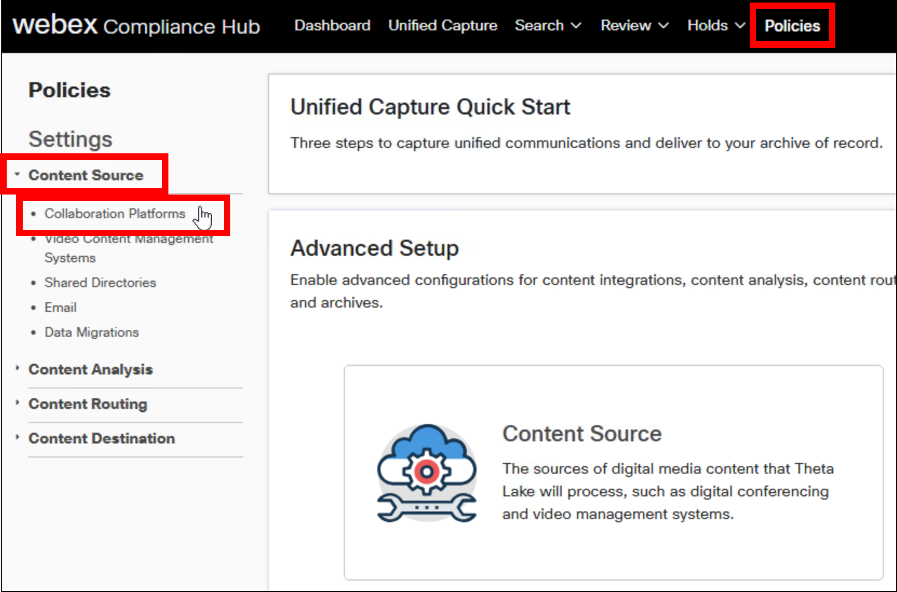{ width="650" style="border: 1px solid #888; border-radius: 4px;" }

    <u>Note</u>: As this is a shared tenant, other collaboration platform integrations may already be configured and listed. Please do not edit or pause other integrations. 

    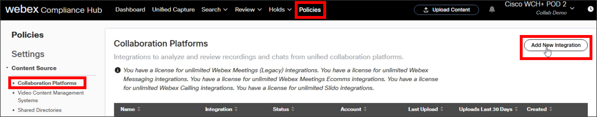{ width="800" style="border: 1px solid #888; border-radius: 4px;" }

    Click the ‘**Add New Integration**’ button to start the integration configuration.

    Type ‘**Webex**’ in the search window to load the Webex integration options.

    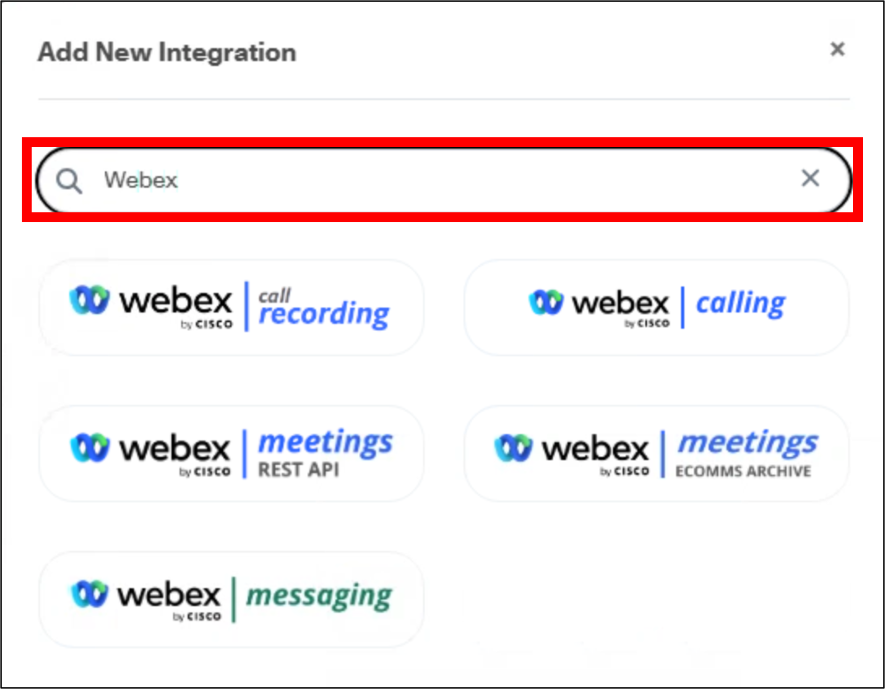{ width="400" style="border: 1px solid #888; border-radius: 4px;" }

    Options include: 

    - Webex Calling – This integration ingests Webex Calling recordings and transcripts (from the Webex recording platform) including voicemail messages.
    - Webex Meetings REST API – This integration ingests Webex Meeting recordings, and AI Assistant generated AI summaries (highlights, action items) and transcripts. 
    - Webex Meetings ECOMMS ARCHIVE – This integration ingests Webex Meetings public/group chat as well as legacy built-in Q&A and polling (no longer recommended), and Webex Assistant generated transcripts and AI summaries. (Note: 1:1 meeting chats are not retained so there is no 1:1 meeting chat data available for ingestion).
    - Webex Messaging – This integration ingests Webex Messaging messages and files shared in both group and 1:1 spaces.

    Note: An integration is also available for Slido, although, a Slido tenant is not available in this lab. This integration ingests Slido Q&A, polling, and ideas. This is the preferred Q&A and polling method for Webex meetings.

    Note: You probably noticed there are many other Collaboration Platform integrations, besides just Webex, supported by the Theta Lake platform including Microsoft, Ring Central, Slack, and Zoom.  However, Webex Compliance Hub only supports integrations to Webex (e.g., Webex Calling, Webex Meetings, etc.). Other collaboration platform integrations would not be supported on a Webex Compliance Hub tenant. If a customer is interested in integrating non-Webex collaboration platforms, they should work with a Theta Lake account team to secure a full Theta Lake tenant.

1. Configure a Webex Messaging service integration.

    Click the Webex messaging integration option in the **Add New Integration** dialog box.

    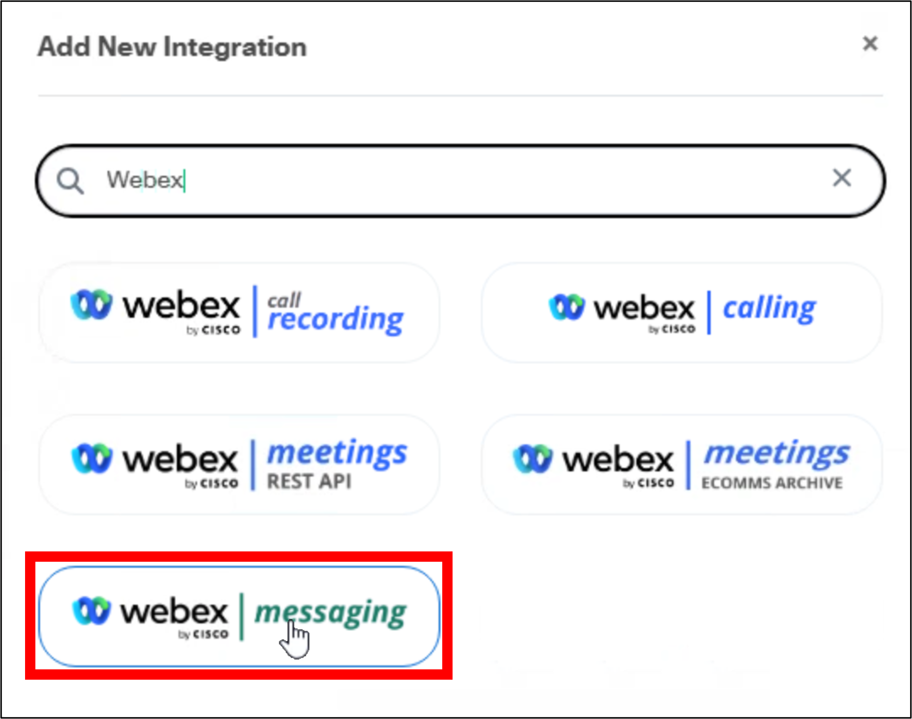{ width="400" style="border: 1px solid #888; border-radius: 4px;" }

    Next, click the ‘**Connect**’ button to continue.

    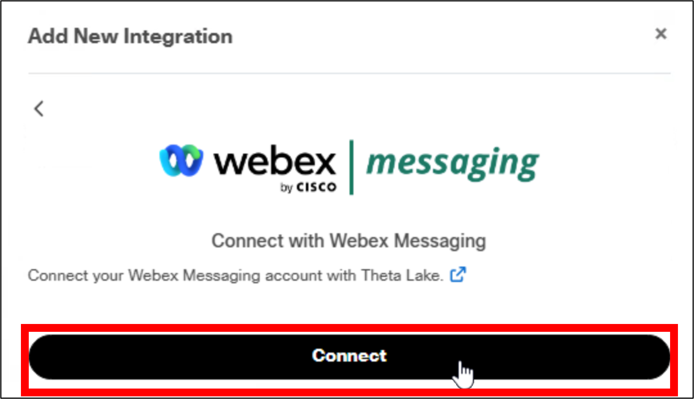{ width="400" style="border: 1px solid #888; border-radius: 4px;" }

    At the login prompt enter your compliance officer Anita Perez’s email (**aperez@cbXXX.dc-YY.com**) and click the ‘**Sign In**’ button to login into Webex to authorize the integration.
  
    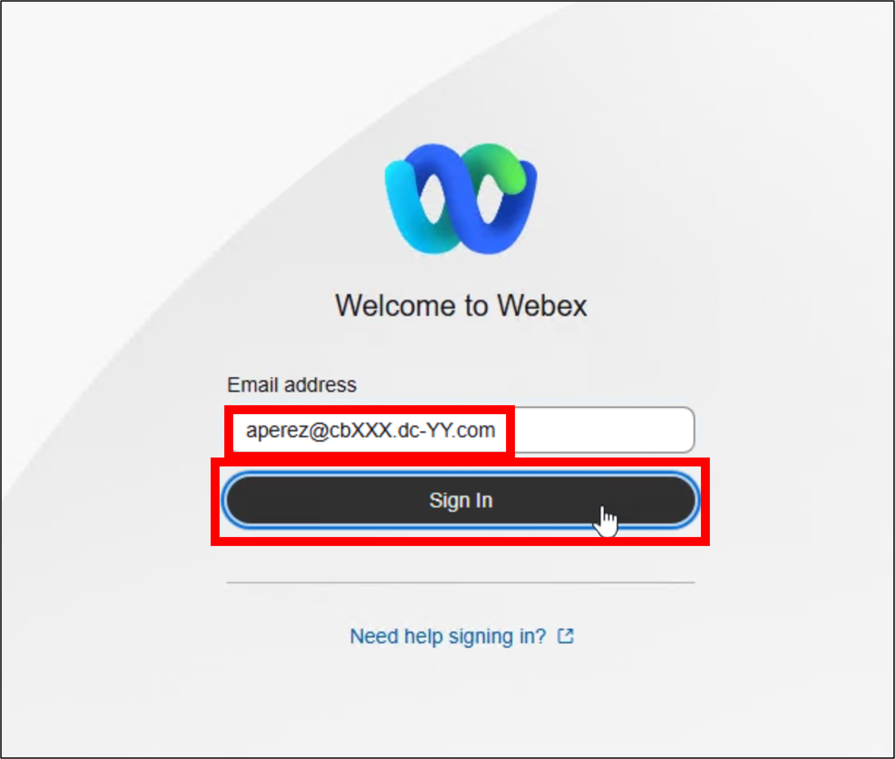{ width="400" style="border: 1px solid #888; border-radius: 4px;" }

    When prompted, enter the account password: **dCloud123!** (if you did not complete Module 1, then the non-SSO password is dCloudZZZZ!). 

    Next, the compliance platform requests required permissions for this service integration. These permissions will vary depending on the service. In all cases, these permissions are granted based on the compliance officer authorization. Click the ‘**Accept**’ button to proceed.

    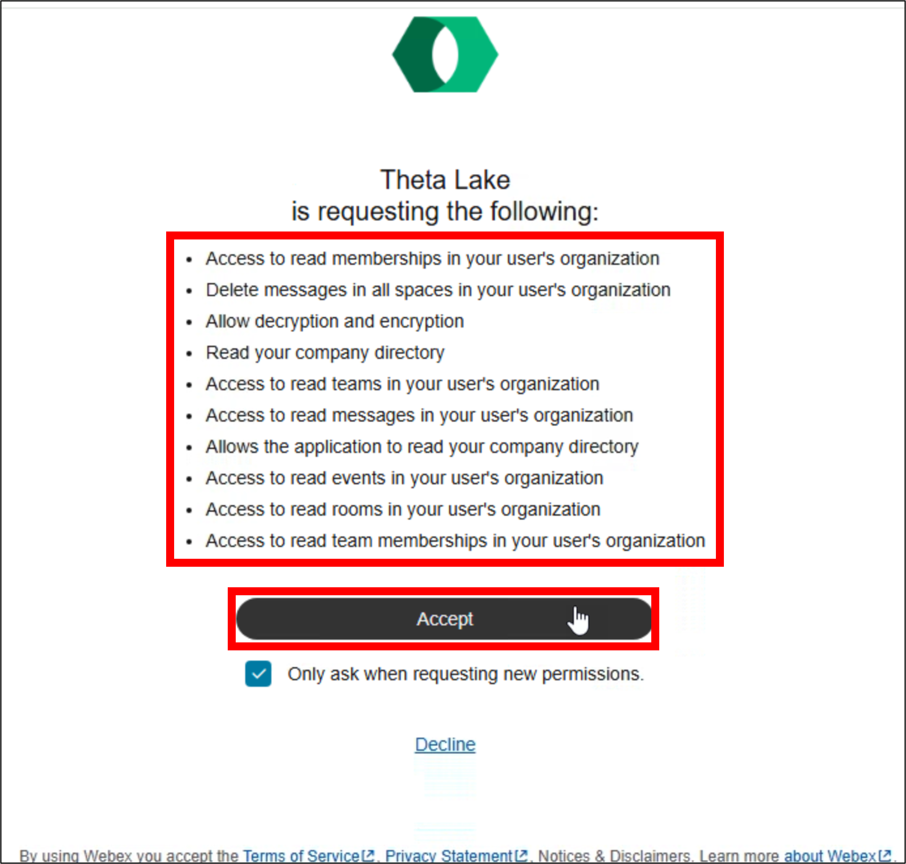{ width="600" style="border: 1px solid #888; border-radius: 4px;" }

    Enter a name for the integration (e.g., **Webex Messaging (cbXXX)**). Then, click ‘**Next**’.

    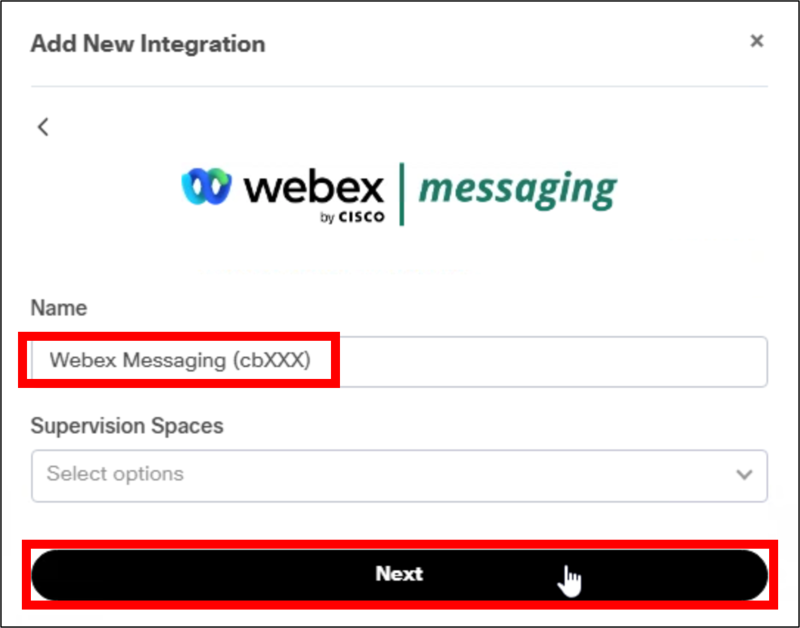{ width="400" style="border: 1px solid #888; border-radius: 4px;" }

    Finally, click the ‘**Save and Start**’ button to save the configuration and enable the integration.
    
    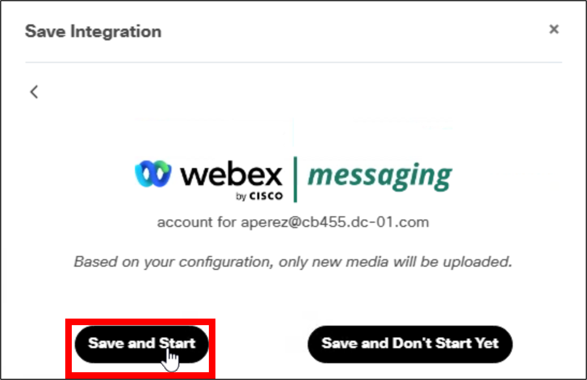{ width="400" style="border: 1px solid #888; border-radius: 4px;" }

    Once this happens, Webex Compliance Hub will begin ingesting messaging data from the integrated Webex organization. Keep in mind it will take 4 hours from the time data is generated until the data is ingested.

1. Confirm the Webex integration is saved and queued for data ingestion
    
    After returning to the Collaboration Platforms page, confirm the Webex Messaging integration is listed and that the status is ‘**Queued**’ indicating the system is ready to ingest Webex Messaging data.

    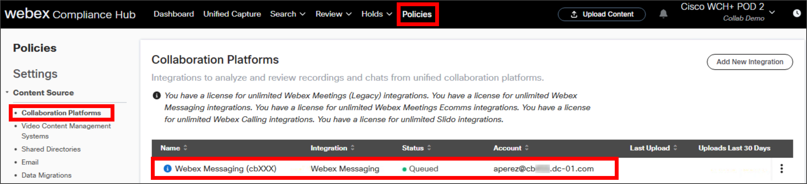{ width="800" style="border: 1px solid #888; border-radius: 4px;" }

    <u>Note</u>: As this is a shared tenant, other collaboration platform integrations may be listed. Please do not edit, pause, or start integrations you didn’t configure. 

    If your integration does not show *Queued*, make sure the integration was started when you saved.

    Click the three dots to the far right of the integration listing and then select ‘**Start**’ to start the integration.

    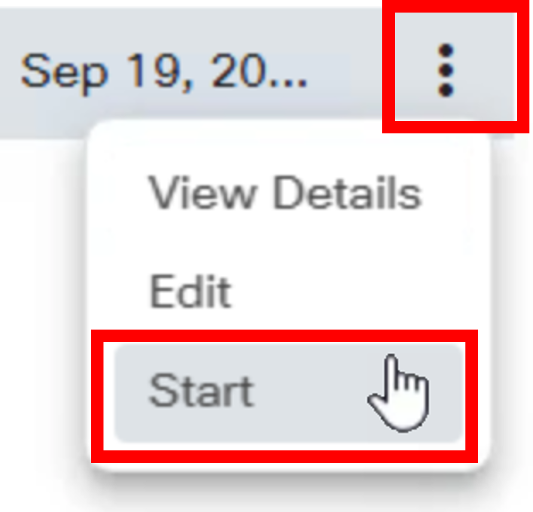{ width="150" style="border: 1px solid #888; border-radius: 4px;" }

1. Configure additional Webex service integration (optional)

    Feel free to configure additional integrations for other Webex services in your Webex organization. Configuration will be the same as with the Webex Messaging integration.

    **Webex Calling Integration:**

    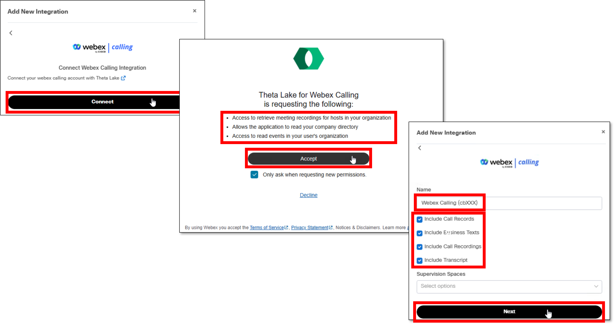{ width="850" }

    **Webex Meetings REST Integration:**

    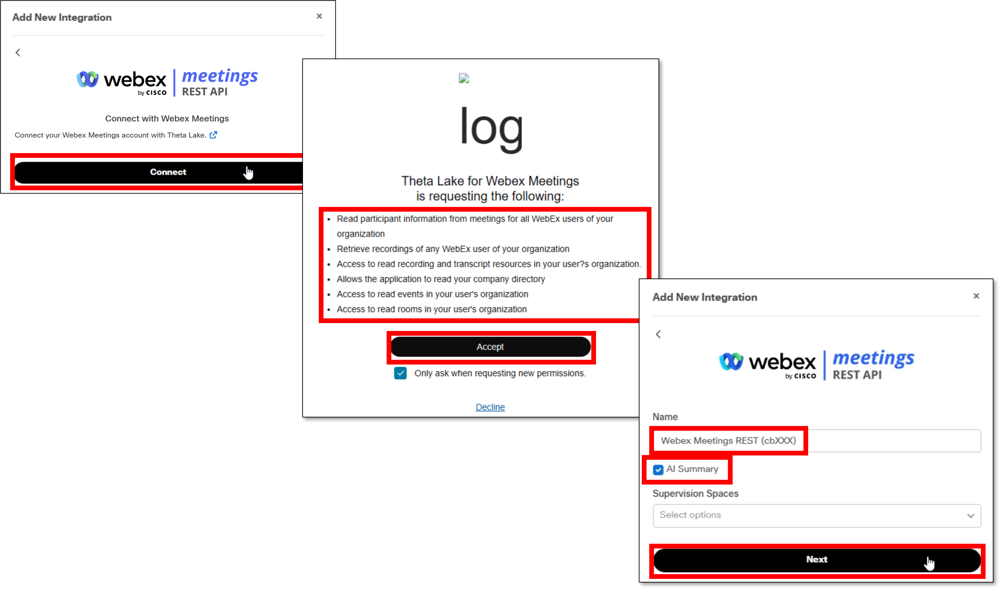{ width="850" }

    **Webex Meetings eComms Integration:**
    
    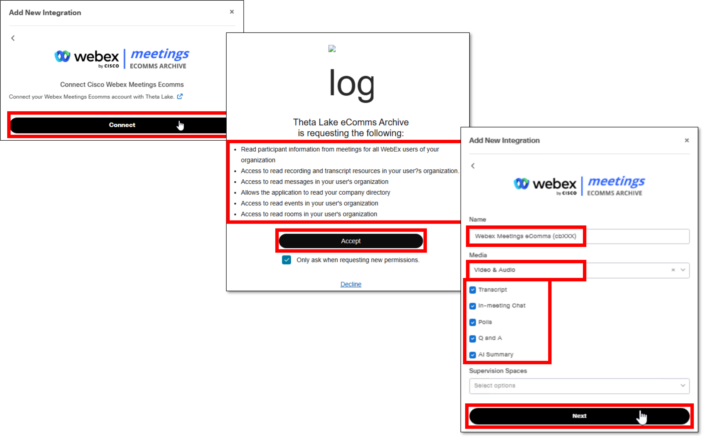{ width="850" }

    In all cases, remember to click the ‘**Save and Start**’ button to start the integration.

    All of the integrations you configure should show a status of ‘Queued’.

    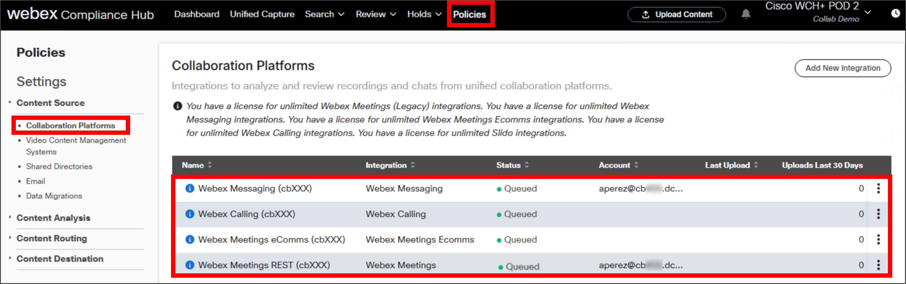{ width="800" style="border: 1px solid #888; border-radius: 4px;" }

    Note: As this is a shared tenant, other collaboration platform integrations may be listed. Please do not edit, pause, or start integrations you didn’t configure. 

1. Generate data (optional)

    If you would like to see data from your Webex org in the Webex Compliance Hub tenant, you must generate new Webex data. 
    
    Generate data in one of the following ways:

    - Use the Webex App on one of the workstations to send messages in a space. Be sure to include data that will generate a compliance violation – e.g., ‘*My social security number is 234-18-9081*’ or ‘*My credit card number is 5109-2539-9299-6938*’ **<-- Recommended method for generating data quickly**.
    - Use the Webex App on two of the workstations to make and answer a Webex call between the two users.  Be sure to record the call so that data is generated and persisted after the call. And ensure you include data that will generate a compliance violation – e.g., on the call say  ‘*My social security number is 234-18-9081*’ or ‘*My credit card number is 5109-2539-9299-6938*’.
    - Use the Webex App on two or more workstations to schedule and then join a Webex meeting. Be sure to record the meeting or send a public chat message during the meeting so that data is generated and persisted after the meeting. And ensure you include data that will generate a compliance violation – e.g., during the meeting say  ‘*My social security number is 234-18-9081*’ or ‘*My credit card number is 5109-2539-9299-6938*’ or type into the meeting chat.
