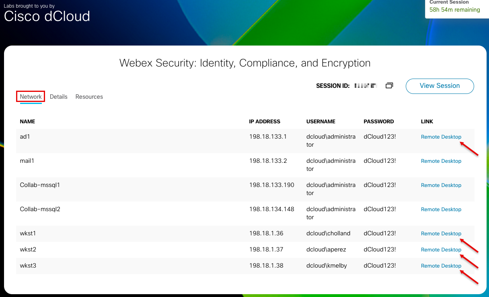

# Lab Setup

Before starting the lab modules, you'll need to configure this guide with your unique dCloud pod values. This page will help you find those values and enter them so that all credentials and URLs throughout the guide are customized for your specific lab environment.

---

## Finding Your dCloud Pod Number, Datacenter ID, and Session ID

### Step 1: Access Your eXpo Page

Navigate to your eXpo URL and click **Explore**. On the eXpo page, you will see two important tabs: **Network** and **Details**.

### Step 2: Find Your Session ID and Domain

Click **Details** > **DNS Address** on your eXpo page to find your unique domain and session ID values.

From this page, note:
- **Pod Number** - The 3-digit number in your domain (e.g., cb**123**.dc-01.com)
- **Datacenter** - The 2-digit datacenter code (e.g., cb123.dc-**01**.com)
- **Session ID** - The last 4 digits of your Session ID

---

## Enter Your Values

Once you have your values, enter them in the configuration box below. After saving, all credentials and URLs throughout the entire lab guide will be automatically customized with your specific values.

---

## What Happens After You Save?

After entering and saving your values:

1. ✅ The page will refresh to apply your configuration
2. ✅ All credentials and URLs throughout the guide will display your actual values
3. ✅ Your values are saved in your browser and will persist even if you close and reopen the browser
4. ✅ You can return to this page anytime to update your values if needed

!!! tip "Values Persist Across Sessions"
    Your configuration is saved in your browser's local storage. You only need to enter these values once, and they'll be remembered even if you close your browser and come back later.

!!! warning "Browser-Specific"
    These values are stored in your browser only. If you switch to a different browser or device, you'll need to enter your values again.

---

## Ready to Start?

Once you've configured your lab values above, proceed to one of the modules to begin the lab:

**[Module 1: Webex Identity and Authentication/Authorization with Duo](module1_identity.md)**

**[Module 2: Webex Meetings, Calling, and Slido Compliance and End-to-End Encrypted Meetings with Zero Trust](module2_zero_trust_encryption.md)**

**[Module 3: Webex Compliance with Cisco Cloudlock and Theta Lake](module3_compliance.md)**