# Module 1: Webex Identity and Authentication/Authorization with Duo
In this module, you will start by integrating an on-premises Active Directory (AD) with a Duo tenant. From there, you will set up an integration between Duo and Webex for user provisioning via SCIM 2.0. This is designed to simulate a common scenario where an organization needs to migrate away from an on-premises AD deployment to a cloud platform for identity. Once the migration from AD to Duo has been completed, there will be a brief section covering licensing information so you can ensure that you are properly licensing your users. Next, you will configure Single Sign-On (SSO) with Duo using SAML and OpenID Connect (OIDC). During the process you will learn the configuration differences along with some of the advantages and disadvantages of SAML and OIDC. Finally, you will explore enabling built-in Multi-Factor Authentication for Webex.

There are 6 sections in this module:

i.  [Sync Users from Active Directory to Duo](#sync-users-from-active-directory-to-duo)

ii. [Sync Users from Duo to Webex](#sync-users-from-duo-to-webex)

iii. [Webex Licensing and Settings Templates](#webex-licensing-and-settings-templates)

iv. [Configuring Duo To Use Active Directory for User Authentication](#configuring-duo-to-use-active-directory-for-user-authentication)

v.  [Single Sign-On with Webex and Duo (SAML and OIDC)](#single-sign-on-with-webex-and-duo-saml-and-oidc)

vi. [Multiple Identity Providers with Webex](#multiple-identity-providers-with-webex)

vii. [Enable Multi-Factor Authentication (MFA) using Duo](#enable-multi-factor-authentication-mfa-using-duo)

## Sync Users from Active Directory to Duo
The [Duo Authentication Proxy](https://duo.com/docs/authproxy-reference) is a tool that allows administrators to connect their on-premises identity infrastructure to Duo. In this section of the lab, you will use Duo Authentication Proxy to add the on-premises AD users to your Duo tenant. Integrating your on-premises directories with Duo reduces friction for users during authentication by providing a common identity for accessing both cloud and on-premises resources.

At the end of this section, you will have synchronized on-premises AD users into Duo.

1. First, you need to access your Duo tenant so you can set up a connection between Duo Authentication Proxy and your AD server.

1. Connect to the Active Directory server (**ad1**) via **Remote Desktop**.

      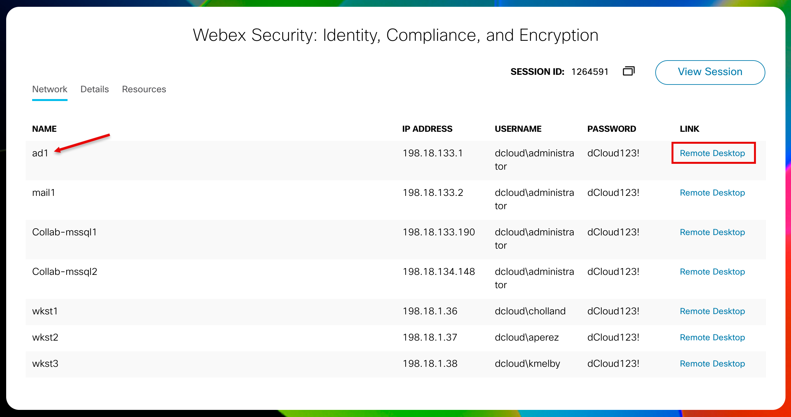{ width="400" style="border: 1px solid #888; border-radius: 4px;" }

1. Open the **DUO** folder on desktop, then open the **Duo-URL.txt** document.

      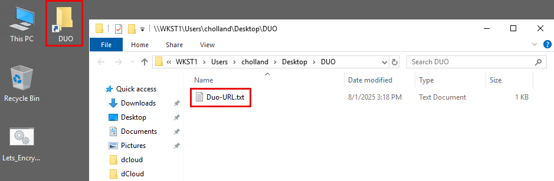{ width="400" style="border: 1px solid #888; border-radius: 4px;" }

1. Copy and paste the URL in this document into the browser.

      { width="400" style="border: 1px solid #888; border-radius: 4px;" }

1. This page will provide you with your Duo admin email address. Note that the password here is a suggestion -- not a requirement. Click **Activate Account** \> **Get started** to begin setting up your admin account.

      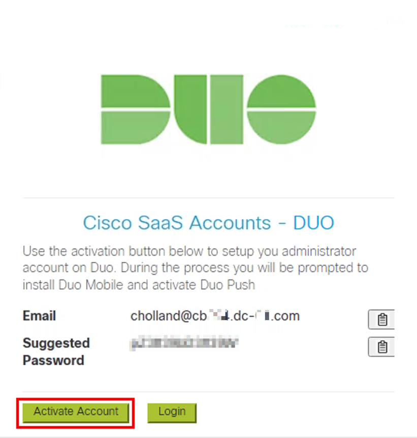{ width="400" style="border: 1px solid #888; border-radius: 4px;" }

      { width="400" style="border: 1px solid #888; border-radius: 4px;" }

1. When prompted for a password, use **dCloud12345!**

1. Next, you need to add your second factor, so click **Continue.**

      { width="400" style="border: 1px solid #888; border-radius: 4px;" }

1. You will not be using a Passkey, so click **Skip for now**.

      { width="400" style="border: 1px solid #888; border-radius: 4px;" }

1. Scan the QR code with your mobile device or raise your hand for a proctor to scan with a lab device and then click Continue.

      { width="400" style="border: 1px solid #888; border-radius: 4px;" }

1. Click **Continue to Duo Admin Panel Login**.

      { width="400" style="border: 1px solid #888; border-radius: 4px;" }

1. Log in with the account you just created ([**cholland@cbXXX.dc-YY.com**](mailto:cholland@cbXXX.dc-YY.com) // **dCloud12345!**). If you do not see a password prompt, navigate to [**https://admin-demodemo.duosecurity.com**](https://admin-demodemo.duosecurity.com) to log in.

1. After authenticating, navigate to **Users** \> **Administrators** \> **Admin Login Settings**.

      { width="400" style="border: 1px solid #888; border-radius: 4px;" }
      { width="400" style="border: 1px solid #888; border-radius: 4px;" }

1. Disable **Always require a Verified Duo Push**.

      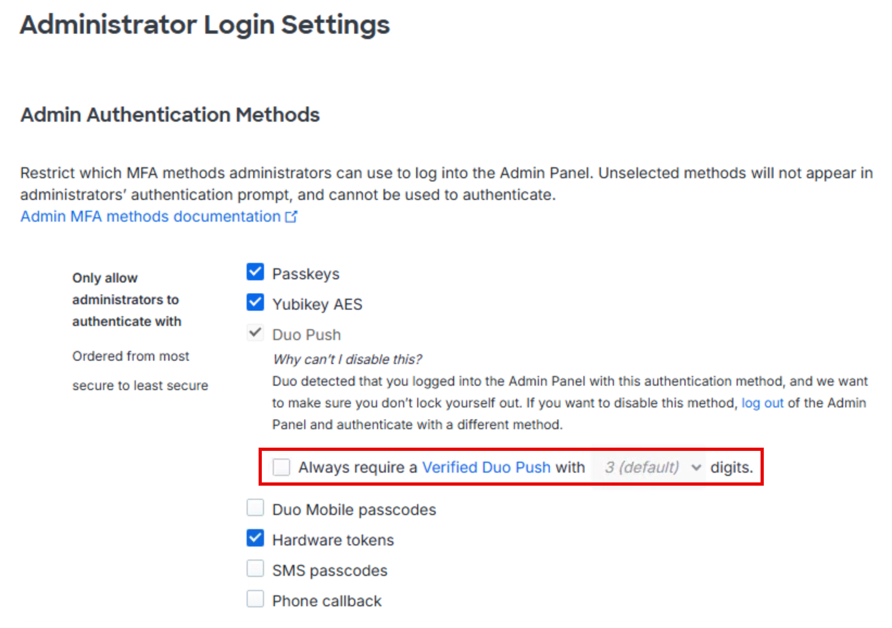{ width="400" style="border: 1px solid #888; border-radius: 4px;" }

1. Scroll down and set the **Absolute Session Length** to **10 hours**.

      { width="400" style="border: 1px solid #888; border-radius: 4px;" }

1. Next, navigate to **Users \> External Directories**:

      { width="400" style="border: 1px solid #888; border-radius: 4px;" }

1. Click **Add External Directory \> Active Directory:**

      { width="400" style="border: 1px solid #888; border-radius: 4px;" }

1. Select **Add new connection \> Continue**:

      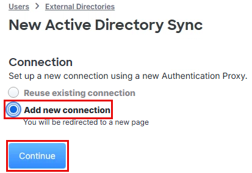{ width="400" style="border: 1px solid #888; border-radius: 4px;" }

1. Minimize the browser and launch the **Duo Authentication Proxy Manager** from Desktop. Once the application is open, **delete all text from the configuration**, then can paste the below config into your auth proxy:

      >**[cloud]** 
      >**ikey=** 
      >**skey=** 
      >api_host=api-demodemo.duosecurity.com 
      >**[ad_client]** 
      >host=ad1.dcloud.cisco.com 
      >service_account_username=administrator 
      >service_account_password=dCloud123! 
      >search_dn=DC=dcloud,DC=cisco,DC=com
   
      You will need to pull the **ikey** and **skey** from your Duo admin
      portal:
   
      { width="400" style="border: 1px solid #888; border-radius: 4px;" }
   
      The **\[cloud\]** section of the authproxy.cfg provides a means by
      which the auth proxy can connect to your Duo tenant.
   
      The **\[ad_client\]** section provides credentials allowing the auth
      proxy to search and authenticate users from AD.
   
      In this lab, we are not encrypting the password but in a production
      environment, it is strongly recommended to do so. Information on how
      to do that can be found here:
   
      <https://duo.com/docs/adsync#encrypting-passwords>.

1. Once you have filled in the config, click **Validate** in the **Duo Authentication Proxy Manager** and verify that there are no errors in the **Output.** If you see additional text in the config, you may not have cleared the text that is entered by default. Please repeat step 16 so that your configuration looks like the below screenshot.

      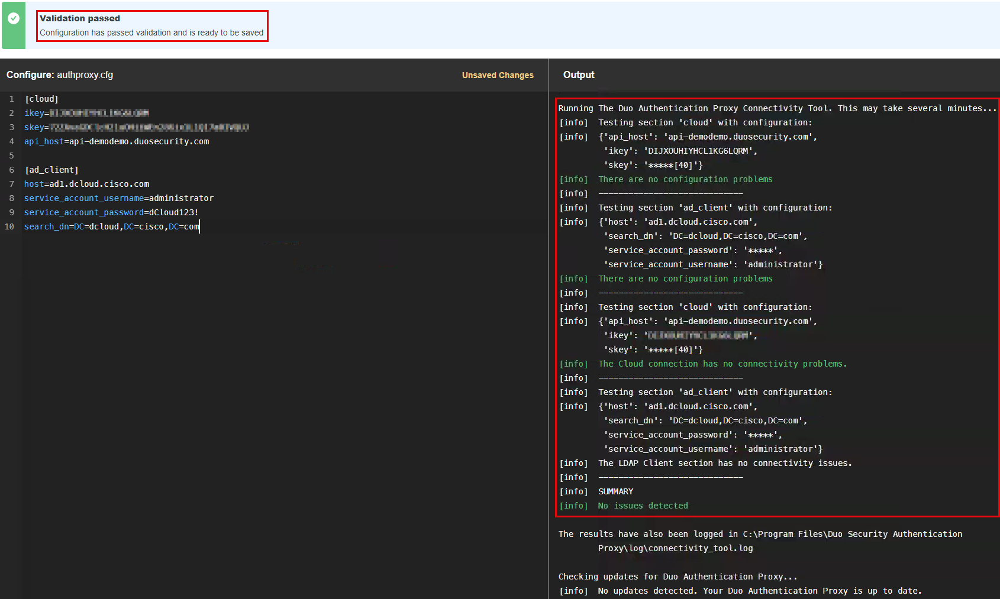{ width="400" style="border: 1px solid #888; border-radius: 4px;" }
      
      >Note: If you see any red or yellow text, verify that there is nothing missing in the configuration.

1. Once your configuration validates successfully, click **Save.**

      { width="400" style="border: 1px solid #888; border-radius: 4px;" }

1. Finally, click **Start Service**, wait a few seconds, and verify that the service starts successfully.

      { width="400" style="border: 1px solid #888; border-radius: 4px;" }
      { width="400" style="border: 1px solid #888; border-radius: 4px;" }

1. With the Auth proxy configured and the service running on AD1, go back to the Duo Admin portal. If you were logged out, log back in with your admin account (<cholland@cbXXX.dc-YY.com> // dCloud12345!) and select **Users** \> **External Directories** \> **AD Sync** \> **Edit connection**.

      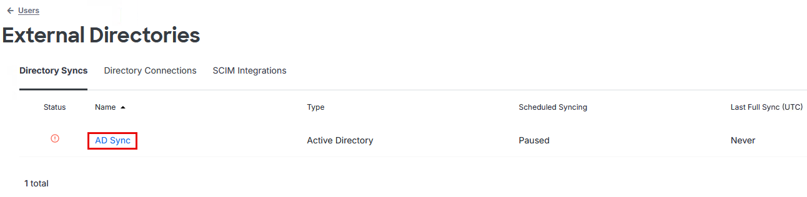{ width="400" style="border: 1px solid #888; border-radius: 4px;" }

      { width="400" style="border: 1px solid #888; border-radius: 4px;" }

1. Once you're on the **AD Sync Connection** page, click **Test Connection** (step 5).

      { width="400" style="border: 1px solid #888; border-radius: 4px;" }

1. The **Status** section should still reflect that the Auth Proxy is **Not Connected** but you should see a check next to **Add Authentication Proxy**.

      { width="400" style="border: 1px solid #888; border-radius: 4px;" }

1. Scroll down and fill out the **Directory Configuration** section with the following information:

      > Domain controller Hostname: **ad1.dcloud.cisco.com** 
      > Port: **389** 
      > Base DN: **DC=dcloud,DC=cisco,DC=com** 
      > Authentication type: **Integrated** 
      > Transport type: **Clear** 

      { width="400" style="border: 1px solid #888; border-radius: 4px;" }

1. Click **Save** and verify that the Status changes to **Connected.**

      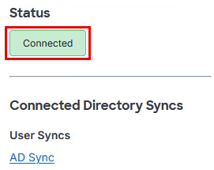{ width="400" style="border: 1px solid #888; border-radius: 4px;" }

1. Click **Back to AD Sync** at the top of the page and you will now see the **AD Connection** is **Connected to Duo.**

      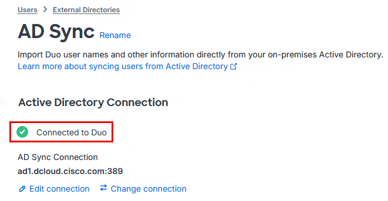{ width="400" style="border: 1px solid #888; border-radius: 4px;" }

1. Add the **Lab Users** group to the **Groups** field (scroll down to find the group, list is alphabetical).

1. In the **Synced Attributes** section make a few changes:

    a.  Change **Username** to **userprincipalname** 
    b.  Change Email Adress to **userprincipalname** 
    c.  **Add Attribute** \> **First Name** 
    d.  **Add Attribute \> Last Name**

      { width="400" style="border: 1px solid #888; border-radius: 4px;" }

1. Click **Complete Setup**

      { width="400" style="border: 1px solid #888; border-radius: 4px;" }

1. The page will refresh, and you can now configure the sync schedule or select specific users that you want to sync. For now, click **Enable high frequency syncing for this directory** and click **Sync Now.**

      { width="400" style="border: 1px solid #888; border-radius: 4px;" }

      You should see 31 users and 1 group synced. If not, investigate this
      before proceeding.

      { width="400" style="border: 1px solid #888; border-radius: 4px;" }

1. Navigate to **Users** \> **Users** and verify that you have 31 users listed and that their username and email address match:

      { width="400" style="border: 1px solid #888; border-radius: 4px;" }

At this point, all the demo users have been synced from the on-prem AD into Duo. Next, you will provision these users from Duo to Webex. Some of these users already exist on Webex as they were provisioned through some other process. Integrating Duo with Webex for provisioning will allow future changes for these existing users to be reflected on Webex. Also, any new users added to the **Lab Users** group will be automatically provisioned to Webex.

## Sync Users from Duo to Webex
To facilitate user provisioning to Webex, you will utilize the SCIM 2.0 API endpoints available in Webex. With other connectors, this required pulling an API token with the appropriate scopes. However, Duo has a connector that is much easier to configure.

1. On the Duo Admin portal, navigate to **Applications** \> **Applications**

1. Click **Add application** and then click **+ Add** for **Cisco Webex (with Control Hub)**

      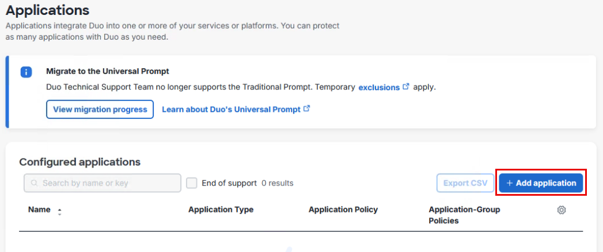{ width="400" style="border: 1px solid #888; border-radius: 4px;" }

      { width="400" style="border: 1px solid #888; border-radius: 4px;" }

1. We will not be configuring Single Sign-On yet, so click the **Provisioning** tab. Select the **Cloud Connection** authentication mode, then select **Add new connection \> Continue**.

      { width="400" style="border: 1px solid #888; border-radius: 4px;" }
   
      A new tab will open requiring you to log into Webex with your
      administrator account. The URL used for this tab allows Duo to acquire
      an OAuth access token with the necessary scopes for user provisioning
      to Webex. A refresh token is also provided so that the integration
      should never need reauthorization (unless it is paused for an extended
      period).

1. Authenticate with cholland@cbXXX.dc-YY.com // dCloudZZZZ!

      { width="400" style="border: 1px solid #888; border-radius: 4px;" }

1. After authenticating, you will be advised of the scopes that Duo is requesting.

      { width="400" style="border: 1px solid #888; border-radius: 4px;" }

1. Click **Accept** and you will be redirected back to Duo with an indication that the connection from Duo to Webex has been established:

      { width="400" style="border: 1px solid #888; border-radius: 4px;" }

      Notice that you can see the org name here (in case you have multiple
      Webex applications in your Duo org. You are also given the name of the
      administrator that authorized the connection.
      
      Finally, notice that there is a **Reauthorize** button. This would be
      necessary if Duo's access and refresh tokens expire, which would only
      happen if the integration were paused for an extended period. If this
      occurs, clicking **Reauthorize** would walk you through the same flow
      you just completed so Duo could acquire new tokens.

1. The default configuration maps the Duo email address to the username in Webex. This is the only required field but not ideal. To add a few commonly used values, click the **Edit Mappings** button and select:

      **displayName** 
      **name.familyName** 
      **name.givenName** 

      { width="400" style="border: 1px solid #888; border-radius: 4px;" }

1. Click **Save Mapping.**

1. Next change the **Email Address** attribute to **Username** and notice that the default Duo mappings to the newly selected attributes is correct:

      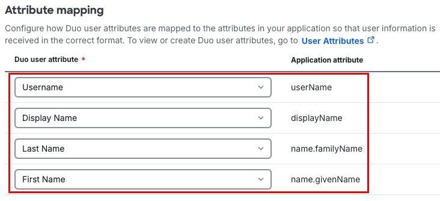{ width="400" style="border: 1px solid #888; border-radius: 4px;" }

1. Finally, to select the users you want to sync, scroll down to the **Groups** section and select the **Lab Users** group.

      { width="400" style="border: 1px solid #888; border-radius: 4px;" }

      By default, Duo will sync the members of the **Lab Users** group and
      create a Lab Users group on Webex. Any members of this group on Duo
      will also be members of the newly created Webex group. This is great
      for automating license and settings assignment on groups of users,
      however, if you prefer not to sync group objects, you can tick the
      **Exclude group information** box.

      **For this lab, leave the box unticked so the group object is included
      in the sync.**

1. Click **Save and enable** and wait about 5-10 seconds, then click the refresh button in the **Recent logs** section:

      { width="400" style="border: 1px solid #888; border-radius: 4px;" }

      Scroll down and you should see successful user and group provisioning.
      If you see any errors here, they need to be corrected before
      proceeding. A common failure point is leaving the Webex username
      attribute set to **Email Address** in Duo. This attribute needs to be
      adjusted so that you are syncing the user's Duo Username to Webex.

1. Once you have validated that there are no provisioning errors, navigate to Control Hub (<https://admin.webex.com>) and log in with your admin account ([cholland@cbXXX.dc-YY.com](mailto:cholland@cbXXX.dc-YY.com)).

1. Select **Organization Settings** and change **Control Hub's idle timeout** to **No timeout** then click **Save**.

      { width="400" style="border: 1px solid #888; border-radius: 4px;" }

1. Select **Groups** and you should see your **Lab Users** group in the **Webex groups** section.

      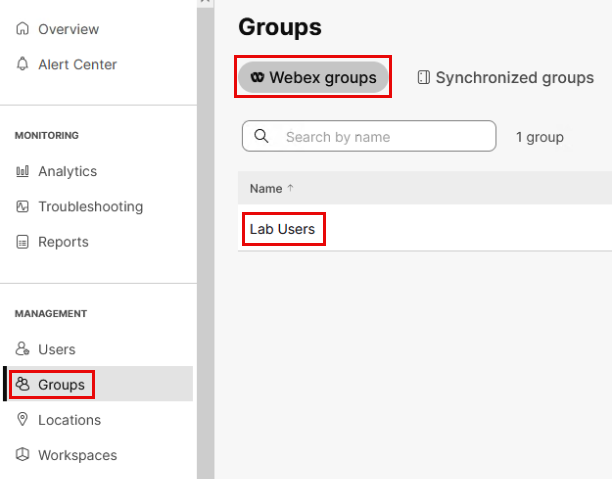{ width="400" style="border: 1px solid #888; border-radius: 4px;" }

1. Click **Create a group** and name the group **Messaging** and click **Next**

      { width="400" style="border: 1px solid #888; border-radius: 4px;" }

1. Click **Add manually**, add the following users, then click **Save** \> **Done**:

      Anita Perez 
      Charles Holland 
      Eric Steele 
      Kellie Melby 
      Ricardo Filice 
      Taylor Bard 

      { width="400" style="border: 1px solid #888; border-radius: 4px;" }

1. The **Members** tab for the group should reflect the 6 new members.

      { width="400" style="border: 1px solid #888; border-radius: 4px;" }

You have now configured user/group provisioning from Duo to Webex. Any new users added to the Lab Users group on AD would be automatically provisioned to Webex.

## Webex Licensing and Settings Templates
Now that you're synchronizing users and groups into Webex, you can use these groups to manage [licensing](https://help.webex.com/en-us/article/n3ijtao/Set-up-automatic-license-assignments-in-Control-Hub) and [settings](https://help.webex.com/en-us/article/n5uf91x/Configure-settings-templates) for your users. Automated license and settings template assignment can be done on a group no matter how it was created (synchronized, locally created in Control Hub, or created via the [Groups API](https://developer.webex.com/docs/api/v1/groups) or the [SCIM 2.0 Groups API endpoint](https://developer.webex.com/admin/docs/api/v1/scim-2-groups/create-a-group)). This automation can be configured before syncing users into Webex, but the more common scenario is an organization where the users are already synced, and the licensing or settings configuration needs to be modified
-- that's what you will do in this section.

Webex uses a combination of Organization-based licensing and Group-based licensing:
   
   **Organization-based licensing →** All users that are synchronized
   into the organization will be granted these licenses. Typically, this
   is used to grant all users access to basic features like basic
   messaging and meetings.

   **Group-based licensing →** Each group can be assigned specific
   licenses and users who are members of those groups will receive those
   licenses automatically. Users can be members of multiple groups so
   each premium feature can be tied to a different group for granular
   control over license distribution.

When these two features are combined with disabling license preservation, the following will occur:

- All users synced to the org will have access to basic features.

- As users are added to specific groups, they can be assigned licenses
  for premium features.

- If the user is subsequently removed from a group, any license granted
  by being a member of that group will be removed.

This is an effective way to automate license management while ensuring that oversubscription does not occur. While this is very powerful, this is not a universal solution. In some scenarios, a subset of users in a specific directory group(s) will need different licenses than other users in those group(s). In these scenarios, license management can be handled by using local Webex groups either manually via Control Hub or programmatically via API.

1. Click **Users** \> **Licenses**.

1. Click **Set up** under the **Organization-based licenses** section.

      { width="400" style="border: 1px solid #888; border-radius: 4px;" }

1. In the Messaging section, you should find that **Basic Messaging** is already assigned. If it is not, tick the box to select it:

      { width="400" style="border: 1px solid #888; border-radius: 4px;" }

1. Select **Calling** and ensure that **Call on Webex (1:1 call, non-PSTN)** is ticked.

1. To ensure that these licenses are assigned to all your users, tick the **Existing users** box and untick **Preserve licenses for existing users**. This will ensure that users are only granted licenses for the basic features unless they are granted premium licenses by being a member of specific groups.

      { width="400" style="border: 1px solid #888; border-radius: 4px;" }

1. Take some time to read the prompt so that you understand how disabling **Preserve licenses for existing users** works. When you are ready, tick the box and click **Ok**.

      { width="400" style="border: 1px solid #888; border-radius: 4px;" }

1. Click **Save**. At this point in the lab, users only have access to **basic messaging, basic meetings,** and **Call on Webex**. You can verify this by going to the **Users** page and selecting any user, you should see the following:

      { width="400" style="border: 1px solid #888; border-radius: 4px;" }
   
      Note that this may take a minute to apply to all users so wait a minute and refresh the page if you still see additional licenses. Moving forward, you will assign premium features to users in specific groups.

1. Navigate to **Users \> Licenses** and click **Manage** in the **Group-based licenses** section.

      { width="400" style="border: 1px solid #888; border-radius: 4px;" }

1. Select the **Messaging** group in the **Webex groups** tab.

1. Click **Assignments \> Set up**.

      { width="400" style="border: 1px solid #888; border-radius: 4px;" }

1. You may be unable to click the **Set up** button if licenses are still being adjusted from your previous change. If you see this message, you can just wait until the **Background tasks running...** banner disappears and then refresh the page.

      { width="400" style="border: 1px solid #888; border-radius: 4px;" }
   
1. Next, you will configure all licenses that should be assigned to members of this group.

    a.  Tick **Advanced Messaging** in the **Messaging** section.

    { width="400" style="border: 1px solid #888; border-radius: 4px;" }

    b.  Select **Calling** and untick **Call on Webex**.

    c.  Ensure **Existing users** and **Preserve licenses for existing
        users** are both ticked, then click Save at the bottom of the page.

    { width="400" style="border: 1px solid #888; border-radius: 4px;" }

1. You'll automatically return to **Messaging \> Assignments** where you can see your license template assigned to the group.

    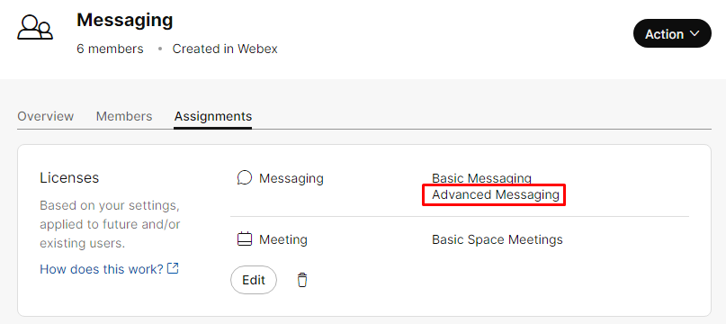{ width="400" style="border: 1px solid #888; border-radius: 4px;" }

1. Click **Groups** in the side panel and click **Create a group**.

1. Enter **Meetings** as the group name and click **Next**.

1. Click **Add manually**.

    { width="400" style="border: 1px solid #888; border-radius: 4px;" }

1. Type cholland and select [**cholland@cbXXX.dc-YY.com**](mailto:cholland@cbXXX.dc-YY.com). Type aperez and select **<aperez@cbXXX.dc-YY.com>** (see your eXpo page for the \'XXX\' and \'YY\' values):

    { width="400" style="border: 1px solid #888; border-radius: 4px;" }

1. Click **Save**.

1. Click **Assign group resources**.

1. Click **Set up** in the **Licenses** section.

    { width="400" style="border: 1px solid #888; border-radius: 4px;" }

1. Here you will configure all licenses that should be assigned to members of this group.

    a.  Disable all **Messaging** and **Calling** licenses and select
        **Webex Meetings Suite** in the **Meeting** section.

    b.  Tick **Existing users** to ensure that these licenses are
        applied to the two existing members of this group, not just
        newly added members. Untick **Preserve licenses for existing
        users**.

      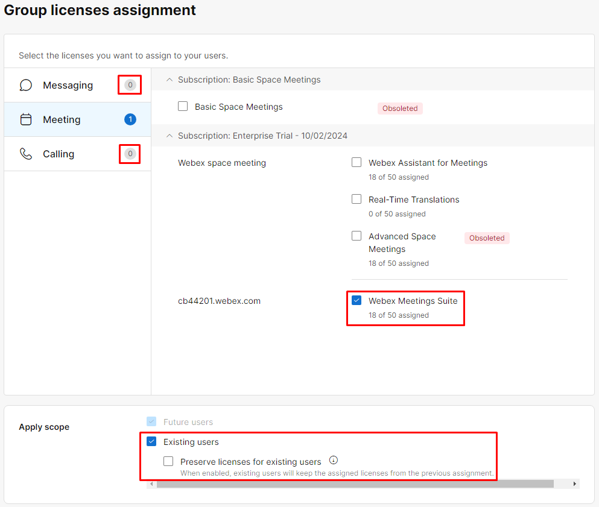{ width="400" style="border: 1px solid #888; border-radius: 4px;" }

1. Click **Save**.

1. You'll automatically return to the **Meetings \> Assignments** where you can see your licenses template assigned to the group.

      { width="400" style="border: 1px solid #888; border-radius: 4px;" }

1. To verify that your licenses were successfully applied to Charles Holland and Anita Perez (due to their group membership), click the **Members** tab and click on [**cholland@cbXXX.dc-YY.com**](mailto:cholland@cbXXX.dc-YY.com) or [**aperez@cbXXX.dc-YY.com**](mailto:aperez@cbXXX.dc-YY.com). On the **Summary** tab, you should see **Advanced Messaging** and the **Meetings Suite** licenses applied due to their membership in the Messaging and Meetings groups. You will also see licensing for the basic Webex features due to the **Organization licensing** configuration.

      { width="400" style="border: 1px solid #888; border-radius: 4px;" }

1. Lastly, go back to the **Users \> Licenses** page and toggle the **Preserve licenses for users joining another group** option off. Disabling this option forces Webex to check a user's group membership(s) any time they are added to or removed from any group. Any licenses they should be granted (or no longer have access to) will be adjusted accordingly.

1. Click **Remove license preservation** to continue.

      { width="400" style="border: 1px solid #888; border-radius: 4px;" }
> **Note:** Any license(s) manually applied to a user independent of a group membership change (such as via API or Control Hub) would also be removed when a user's group membership changes.

Here are some of the key takeaways regarding Webex licensing:

- Webex uses a combination of Organization-based licensing and
  Group-based licensing depending on the organization's configuration.

- If **Preserve licenses for users joining another group** is enabled,
  removing a user from a group will not remove the licenses they
  received when joining that group, so it **will not** help prevent
  oversubscription.

- Service licenses are assigned to users regardless of their status. For
  example, an inactive user still consumes a license. You should remove
  licenses from any user if they don\'t need the services anymore.

- More information about license management in Control Hub can be found
  [here](https://help.webex.com/en-us/article/n3ijtao/Set-up-automatic-license-assignments-in-Control-Hub#Cisco_Concept.dita_cd9293ee-1611-44f3-85c1-94fc2f08acbc).

Next, you will explore settings templates.

1. Navigate to **Services \> Messaging \> Templates \> Create template**.

      { width="400" style="border: 1px solid #888; border-radius: 4px;" }

1. Select **Use a predefined template \> Teachers \> Next**.

      { width="400" style="border: 1px solid #888; border-radius: 4px;" }

1. No changes need to be made so set the template name to **No Restrictions** and click **Create template and next**.

      { width="400" style="border: 1px solid #888; border-radius: 4px;" }

1. Click the search box and enter **Messaging**, then select the **Messaging** group, and click **Done**.

      { width="400" style="border: 1px solid #888; border-radius: 4px;" }

1. You will be taken back to the **Messaging \> Templates** page for **Messaging**.

1. Click **Create template** \> **Use a predefined template \> Students \> Next**.

1. Leave the template name as **Students**, disable all of the toggles, and click **Create template and next.**

      { width="400" style="border: 1px solid #888; border-radius: 4px;" }

1. Search for and select the **Meetings** group, then click **Done.**

      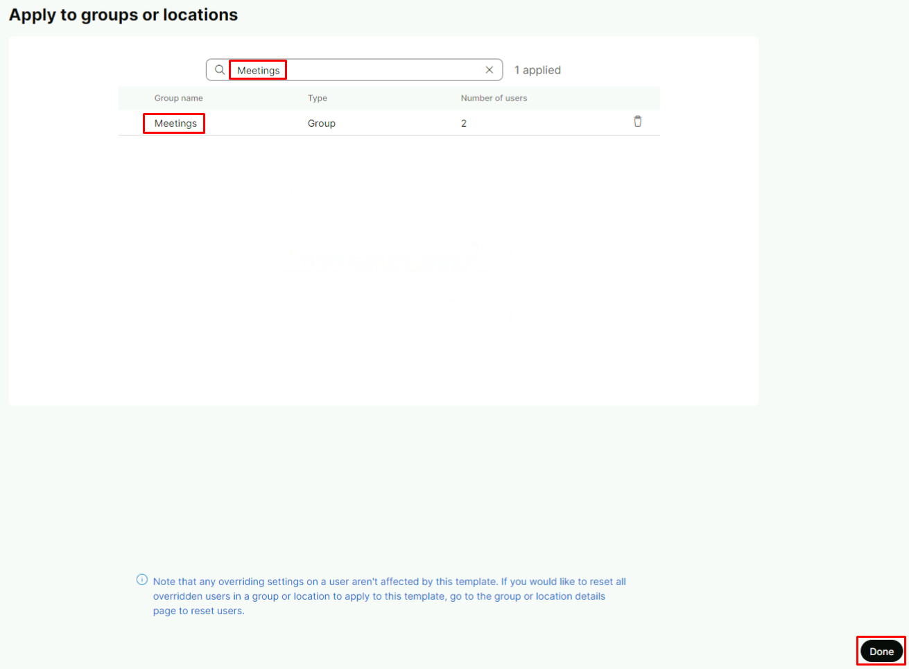{ width="400" style="border: 1px solid #888; border-radius: 4px;" }

1. You will be taken back to the settings template page for **Messaging.** Notice that there are now two templates and the rank for these templates can be modified by clicking **Rank**.
    
    Settings templates allow you to configure settings for a large group of users very quickly. These templates allow application of pre-defined settings to users and they can must be given a rank.
    
    If a user is a member of two groups and both groups have different settings templates for the same product (Messaging, Meetings, or Calling), then the template with the higher rank is applied to the user. For reference, the highest rank is **1**.
    
    { width="400" style="border: 1px solid #888; border-radius: 4px;" }

1. Select **Groups \> Messaging \> Assignments** and notice that the **No Restrictions** settings template has been applied to the group.

      { width="400" style="border: 1px solid #888; border-radius: 4px;" }

1. Select **Users \> Charles Holland** and notice that he is a member of three groups -- two of which have a messaging settings template applied.

      { width="400" style="border: 1px solid #888; border-radius: 4px;" }

1. Click the **Messaging** tab and notice that Charles' messaging settings are coming from the **No Restrictions** template with all toggles enabled. Because the **No Restrictions** template has a higher rank than the **Students** template, it was applied to Charles Holland.

      { width="400" style="border: 1px solid #888; border-radius: 4px;" }
  Using groups to automatically apply settings and licenses to users when they are provisioned is a powerful feature that greatly reduces administrative overhead in large environments.

## Configuring Duo to Use Active Directory for User Authentication
To summarize your progress thus far:

- You've synced your on-prem AD users and groups to Duo.

- Any changes made to these users and groups on AD will sync to Duo.

- The Duo catalog application is provisioning the selected users and
  groups to Webex via SCIM 2.

- You've learned the basics of license and settings templates to help
  minimize administrative overhead after provisioning users.

As Duo is configured right now, it will attempt to authenticate users
locally. This will not work as none of the users have credentials in Duo. To work around this, you will configure Duo to authenticate users via the **Duo Authentication Proxy**. This allows AD to be leveraged for authentication so all users can log in with their existing credentials.

1. Open your tab to the Duo admin portal or navigate to
    <https://admin-demodemo.duosecurity.com> and log in with your admin
    account
    [cholland@cbXXX.dc-YY.com](mailto:cholland@cbXXX.dc-YY.com)

1. Click **Applications \> SSO Settings**

      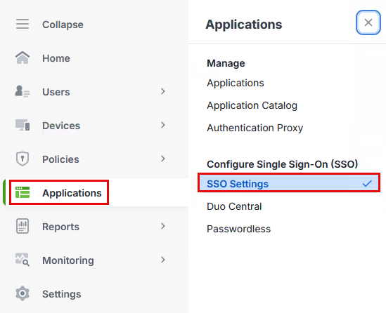{ width="400" style="border: 1px solid #888; border-radius: 4px;" }

1. Select **External Authentication Sources** \> **Add Source**.

      { width="400" style="border: 1px solid #888; border-radius: 4px;" }

1. Click **Add Active Directory**, tick the box regarding the privacy statement, then click **Configure Active Directory.**

      { width="400" style="border: 1px solid #888; border-radius: 4px;" }

1. Click **Add Authentication Proxy**

      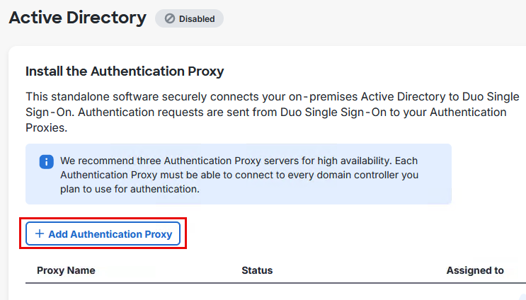{ width="400" style="border: 1px solid #888; border-radius: 4px;" }

1. Scroll down and ensure that you have Windows selected and copy the \[**sso\]** section in **Step 1.2**

      { width="400" style="border: 1px solid #888; border-radius: 4px;" }

1. Step 1.1 in Duo provides the location of the authproxy.cfg file where this section needs to be added, however, the **Duo Authentication Proxy Manager** should still be running and in your taskbar so open the window and paste the **\[sso\]** section at the end of your config.

      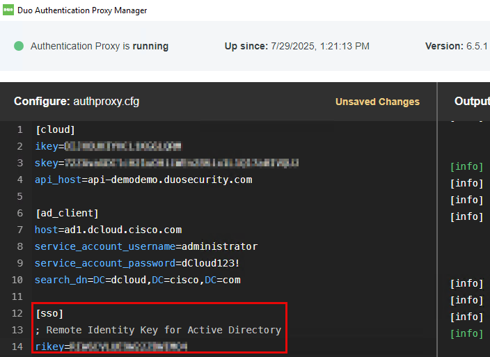{ width="400" style="border: 1px solid #888; border-radius: 4px;" }

1. Once you have added this section to your config, click the Windows button, enter **cmd** and launch **Command Prompt.**

      { width="400" style="border: 1px solid #888; border-radius: 4px;" }

1. Back in the Duo admin portal, copy the text in **step 2.**

      { width="400" style="border: 1px solid #888; border-radius: 4px;" }

1. Paste this text into the command prompt and ensure that the proxy service is restarted successfully.

      { width="400" style="border: 1px solid #888; border-radius: 4px;" }

1. Your auth proxy is now connected to the cloud. Open the **Duo Authentication Proxy Manager** window.

1. Click **Validate**, ensure there are no errors, and then click **Save**.

      Note: If you attempt to do the Validate/Save before running the
      command above, you will see this error:

      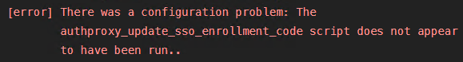{ width="400" style="border: 1px solid #888; border-radius: 4px;" }

1. Finally, as the program instructs \-- click **Restart Service**.

      { width="400" style="border: 1px solid #888; border-radius: 4px;" }

1. Back in the Duo Admin panel, click the **Run test** button and verify that the status changes to **Connected to Duo**.

      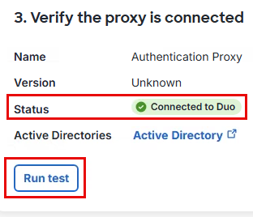{ width="400" style="border: 1px solid #888; border-radius: 4px;" }

1. Scroll back to the top of this page and click **Active Directory Configuration**.

      { width="400" style="border: 1px solid #888; border-radius: 4px;" }

1. Scroll down and update the **Active Directory server configuration** section:

      > Domain controller(s): **ad1.dcloud.cisco.com** 
      > Port: **389** 
      > Base DNs: **DC=dcloud,DC=cisco,DC=com** 
      > Authentication type: **Integrated** 
      > Transport Type: **Clear - unencrypted**
         
      { width="400" style="border: 1px solid #888; border-radius: 4px;" }

1. Set the **Email** and **Duo username attribute** to **userprincipalname** and set **Username normalization** to **None**

      { width="400" style="border: 1px solid #888; border-radius: 4px;" }

1. Scroll down and click Save and enable.

      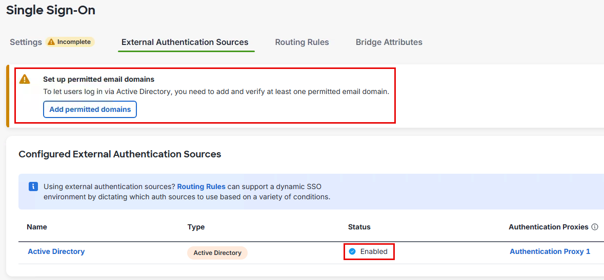{ width="400" style="border: 1px solid #888; border-radius: 4px;" }

1. After saving, you will be taken back to the **External Authentication Sources** tab where the Active Directory source you just configured will be **Enabled**. You will also see a notification that you must configure a permitted domain to allow for authentication via AD.

      To provide some clarity on the current state of the environment --
      previously you configured the Duo Authentication Proxy to sync users
      from the on-prem AD server to Duo. You have now configured the proxy
      to receive authentication requests from Duo when users attempt to log
      in, validate their credentials with AD, and send the result back to
      Duo.
      
      At this stage, Duo will not leverage the proxy for authentication
      because it authenticates users locally, by default. Before you can use the proxy, you must verify your dCloud domain in Duo so that you can route authentication to the proxy.
 

1. To proceed, click **Add permitted domains.**

      { width="400" style="border: 1px solid #888; border-radius: 4px;" }

1. Scroll down and click **Add email domain** in the **Permitted Domains** section.

      { width="400" style="border: 1px solid #888; border-radius: 4px;" }

1. Enter your pod domain on this page (cbXXX.dc-YY.com) and click **Add**.

      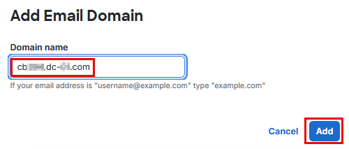{ width="400" style="border: 1px solid #888; border-radius: 4px;" }

1. After adding the domain, note the **Status** column. If the status is **Verified**, skip to step 28. If the status is **Unverified**, you will need to verify it manually, so click **Copy** next to the verification code.

      { width="400" style="border: 1px solid #888; border-radius: 4px;" }

1. Next, open the home page in your browser and select **Identity and Misc. Links** \> **DNS Verification**.

      { width="400" style="border: 1px solid #888; border-radius: 4px;" }

1. Click **Load session.xml** and navigate to **C:\\dcloud** to find the **session.xml** file, then click **Open**.

      { width="400" style="border: 1px solid #888; border-radius: 4px;" }

1. Notice that the boxes will be filled in from the XML file. Paste the verification code copied in previous step into the Value field Click **Submit**.

      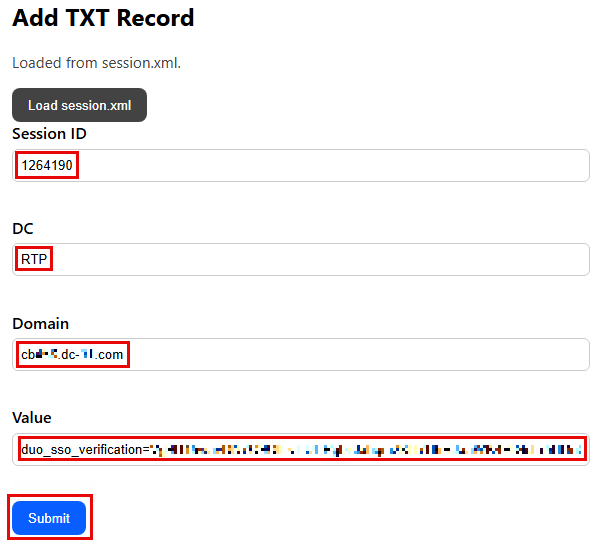{ width="400" style="border: 1px solid #888; border-radius: 4px;" }

1. Back on the Duo Admin panel, click **Verify.**

      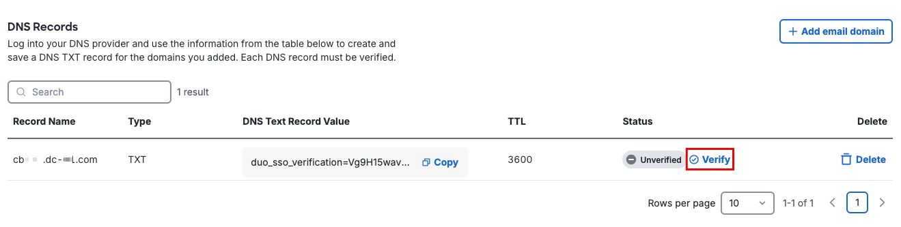{ width="400" style="border: 1px solid #888; border-radius: 4px;" }

      If you receive an **Unable to verify** error, the TXT record is not present on the DNS server yet -- wait another minute and try again.

      Do not proceed until the domain is **Verified**.

      { width="400" style="border: 1px solid #888; border-radius: 4px;" }

1. After verifying the domain, scroll up and click the **Routing Rules** tab and change the Default rule to the **Active Directory** authentication source then click **Save**.

      { width="400" style="border: 1px solid #888; border-radius: 4px;" }

Now, any user that Duo attempts to log in to an application protected by Duo will be authenticated in the background by Active Directory via the authentication proxy. Administrators can configure SSO routing rules in Duo to authenticate users via different sources based on specific criteria:

   - Duo application being accessed

   - Domain of user's email address
    
   - User's network (individual address, address range, or CIDR block)

Routing rules are not needed for this lab.

## Single Sign-On with Webex and Duo (SAML and OIDC)
The next section walks you through enabling SSO and explains some of the differences between SAML and OpenID Connect. Duo supports both SAML and OIDC, so that will allow you to configure two separate IdPs on Webex using the same Duo tenant. Webex supports the use of multiple IdPs which allows you to route users to a specific identity provider based on the domain of their email address or their group membership in Webex. You will configure two separate applications in Duo (one SAML, and one OIDC) both authenticating users for the same Webex org to simulate two different identity providers.

**The next section will require multiple logins to test various aspects of SSO on Webex. If you receive an error at any point during your testing, try using a new browser or closing ALL private/incognito windows to ensure you're using a fresh session with no cached logins.**

### Duo SSO Setup (SAML)
In this section, you will learn how to configure SSO for Webex using Duo as the Identity Provider (IdP). This integration will utilize SAML.

At this point in the lab guide, you have configured the **Duo Authentication Proxy** to synchronize users from AD to Duo and to authenticate user credentials for Duo. Now you can proceed with configuring SSO on Webex.

1. Log in to Control Hub (<https://admin.webex.com>) using [**cholland@cbXXX.dc-YY.com**](mailto:cholland@cbXXX.dc-YY.com).

1. Navigate to **Security & Privacy** and select the **Authentication** tab then click **Activate SSO**.

      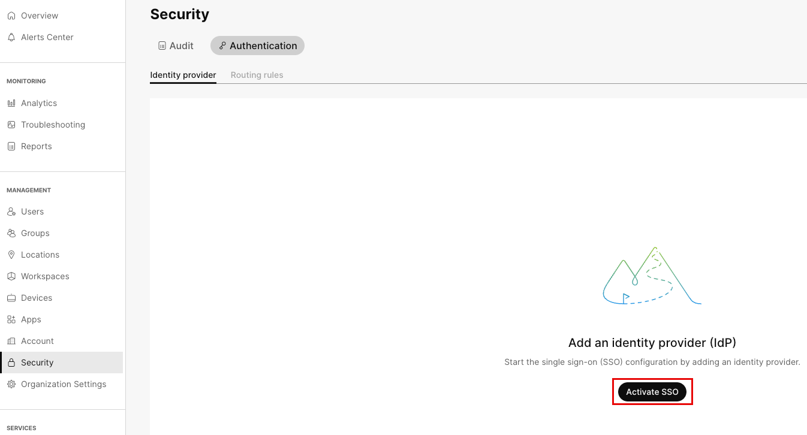{ width="400" style="border: 1px solid #888; border-radius: 4px;" }

1. Select **SAML** and click **Next**.

      { width="400" style="border: 1px solid #888; border-radius: 4px;" }

1. Select the **Self-signed by Cisco** certificate option and click **Download metadata** and click **Next**.

    a.  Leave this tab open on **Step 3: Configure IdP metadata** -- you
        will come back to this page after performing some changes in
        Duo.

      { width="400" style="border: 1px solid #888; border-radius: 4px;" }

1. Next, open your Duo Admin panel tab or navigate to
    <https://admin-demodemo.duosecurity.com> and log in with your admin
    account
    ([cholland@cbXXX.dc-YY.com](mailto:cholland@cbXXX.dc-YY.com)).

1. Navigate to **Applications \> Applications** and select **Cisco Webex (with Control Hub) - Single Sign-On**.

      { width="400" style="border: 1px solid #888; border-radius: 4px;" }

1. On the **Single Sign-On** tab:

    a.  Rename the application **Cisco Webex (with Control Hub) --
        SAML+SCIM**.

    b.  In the **User access** section, select **Enable for all users.**

    c.  Click **Download XML** to get a copy of the Duo metadata.

    d.  In the Service Provider section, click browse and select the
        **idb-meta-...-SP.xml** file that you downloaded from Webex in
        step 4.

    e.  Tick the **Custom Attribute** box and enter **userprincipalname
        to ensure the correct value is returned from AD to Duo.**

      { width="400" style="border: 1px solid #888; border-radius: 4px;" }

1. Scroll to the bottom of the page and click **Save**.

1. After you save the changes, scroll down and select **Edit Global Policy**.

    a.  If you see a frame inside of your existing tab after clicking
        **Edit Global Policy** proceed to step 10.

    b.  If after clicking **Edit Global Policy**, you are taken to a new
        tab, this is because Duo is auto enrolling some tenants in a
        beta view for Policies. You can click the **Switch to Legacy
        Editor** link to get back to the window that we are using in
        this guide. After you switch to the Legacy editor and make the
        changes below, you'll need to go back to **Applications \>
        Applications \>** Select **Cisco Webex (with Control Hub) -
        SAML+SCIM.**

      { width="400" style="border: 1px solid #888; border-radius: 4px;" }

1. Enable **Bypass 2FA** in the **Authentication policy** section and click **Save Policy**.

      { width="400" style="border: 1px solid #888; border-radius: 4px;" }

1. Go back to your Control Hub tab and on **Step 3: Configure IdP metadata**:

    a.  Select **Upload your IdP's metadata**

    b.  Select **Less secure**

    c.  Click **Browse** and select the metadata file you downloaded
        from Duo.

      { width="400" style="border: 1px solid #888; border-radius: 4px;" }

1. Click **Next**.

      Note that you have the option to enable Just-In-Time (JIT) provisioning at this point to allow Webex to create users if they have a valid assertion from your IdP, but they do not exist in Webex. You will not be configuring Just-In-Time user provisioning in this lab but feel free to click **Show optional attributes** to see which attributes are available, then click **Next.**
      
      { width="400" style="border: 1px solid #888; border-radius: 4px;" }

1. Click **Copy URL to clipboard** and open a new incognito tab in Chrome (Ctrl+Shift+N) or Firefox (Ctrl+Shift+P).

      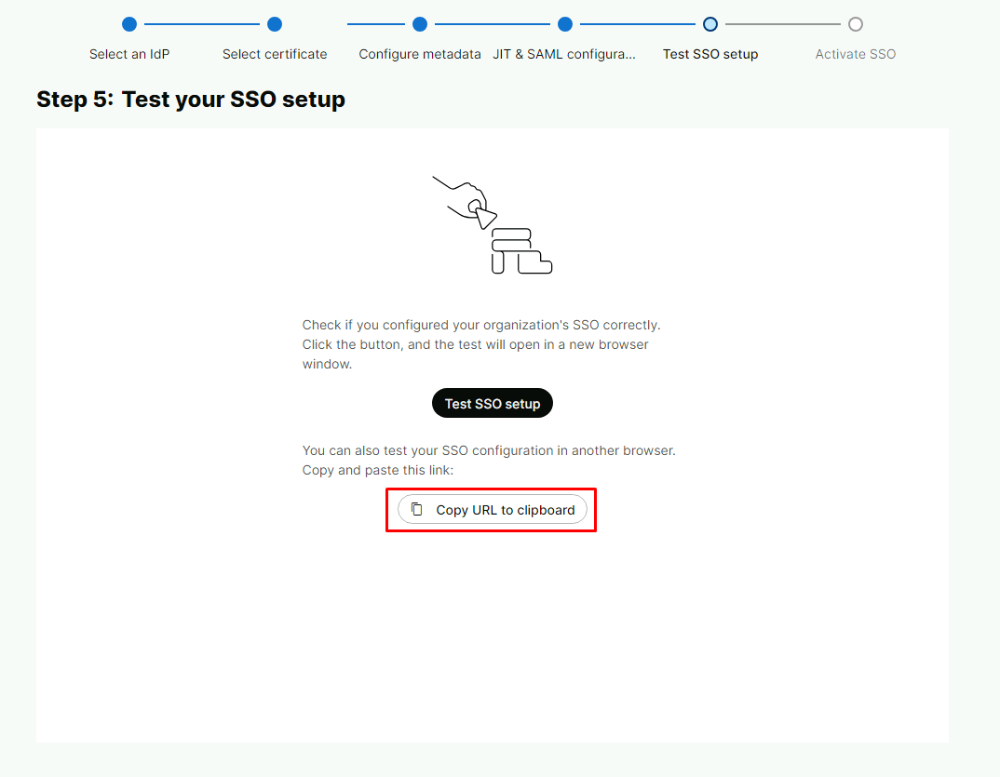{ width="400" style="border: 1px solid #888; border-radius: 4px;" }

1. Paste the URL in the private window and you will be prompted to sign in to Duo. You can use the same [**cholland@cbXXX.dc-YY.com**](mailto:cholland@cbXXX.dc-YY.com) you've used up to this point -- account info is in eXpo.

1. When prompted for the password, you will need to use the password stored in AD (**dCloud123!**).

1. You should see a **Single Sign-on succeeded** message.

      { width="400" style="border: 1px solid #888; border-radius: 4px;" }

1. At this point, you can close the private window and go back to SSO test page. Click **Next** and select **Successful test**, then click **Activate.**

      { width="400" style="border: 1px solid #888; border-radius: 4px;" }

You now have a working SSO configuration with Duo using SAML. The next step is creating a second SSO integration with Duo that uses OpenID Connect so that you can see the configuration differences.

### Duo SSO Setup (OIDC)
OIDC is an identity layer that is added to the OAuth 2.0 protocol. One of the advantages of OIDC compared to SAML is that certificates are no longer needed to establish a trust relationship between the client and IdP. OIDC utilizes a client ID and client secret generated during setup to establish trust between the two entities. This translates into less administrative overhead from an initial configuration perspective (no metadata file exchange) along with lower risk of user impact (such as logins failing because the SP or IdP certificate was renewed or expired, and metadata was not properly re-exchanged).

1. Start by navigating to <https://admin-demodemo.duosecurity.com>.

1. Navigate to **Applications \> Application Catalog** and search for Generic OIDC Relying Party then click **Add**.

      { width="400" style="border: 1px solid #888; border-radius: 4px;" }

1. Update the configuration:

      > Name: **Webex OIDC** 
      > User Access: **Enable for all users** 
      > Allow PKCE only authentication: **Enabled** 
      > Refresh Tokens: **Enabled** 
      > Sign-In Redirect URLs: **https://idbroker-b-us.webex.com/idb/Consumer/oidc/sp** 
      > Scopes: Enable **profile** and **email**

      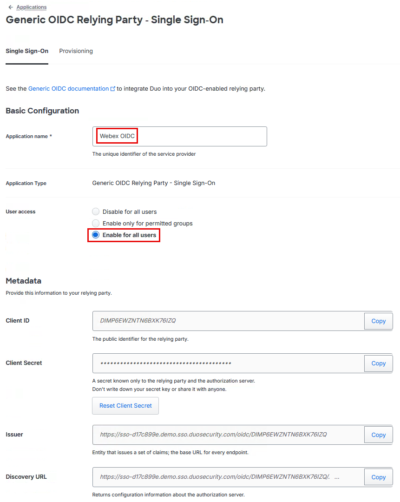{ width="400" style="border: 1px solid #888; border-radius: 4px;" }
      { width="400" style="border: 1px solid #888; border-radius: 4px;" }
      { width="400" style="border: 1px solid #888; border-radius: 4px;" }

1. Since you have already modified the global policy to disable the 2FA requirement, scroll to the bottom of the page and click **Save.**

1. Leave this tab open and switch to your <https://admin.webex.com> tab and log back in if needed.

1. Navigate to **Security** \> **Authentication** \> **Add an IdP.**

      { width="400" style="border: 1px solid #888; border-radius: 4px;" }

1. Select **OpenID Connect** and click **Next**.

      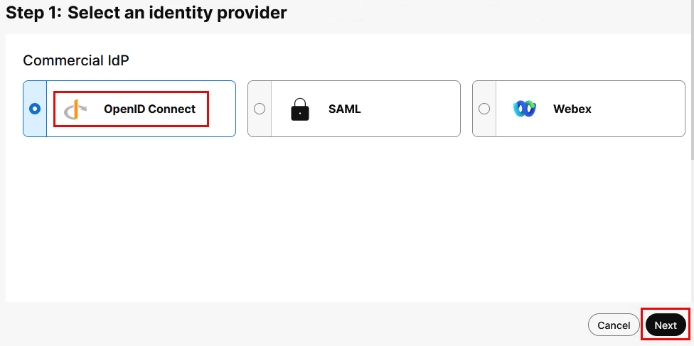{ width="400" style="border: 1px solid #888; border-radius: 4px;" }

1. You will need to fill in a few required boxes:

    a.  **Name** → Duo_OIDC

    b.  **Client ID and Client Secret** → You can find these in the **Metadata** section in Duo - Click the **Copy** buttons and paste this information into Webex.

       { width="400" style="border: 1px solid #888; border-radius: 4px;" }
       
       When pasting the Client ID and secret into Webex, notice that the Webex redirect URL is provided here. This is the same for all Webex orgs and matches what you pasted into Duo in step 3.

    c.  **Scopes**

       - This lets you define what optional information the Relying party can request. The **email** scope is required since that's how users are identified in Webex and **openid** is required because it indicates that Webex will request an OIDC ID token.

       - Disable **address**, **phone**, and **profile** as you do not need them for this lab.

    d.  **Allow Proof Key for Code Exchange (PKCE) Configuration**

       - Toggle this on to improve the security of your authentication process. More detail will be provided about how PKCE works and its purpose after you've finished configuring the OIDC IdP.

    e.  **Discovery URL**

       - This allows the relying party to request the capabilities and endpoint URLs from the OpenID Provider (IdP).

       - This will be specific to your Duo tenant and can be found on your Webex OIDC application page in Duo. Copy and paste this value into Webex.

       { width="400" style="border: 1px solid #888; border-radius: 4px;" }

1. Verify that you have filled in all the information before proceeding:

      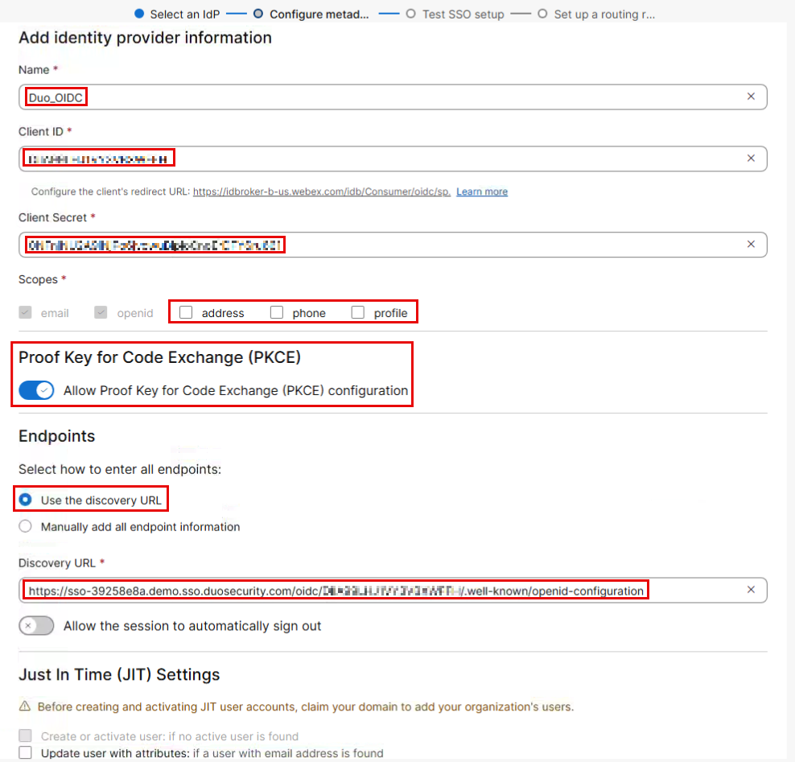{ width="400" style="border: 1px solid #888; border-radius: 4px;" }
 
      Notice that you can enable JIT provisioning/update with OpenID Connect as you could with SAML. You will not be using it in this lab, but it is an option for your production environment.

1. Once you have provided the required information, click **Next**. You need to perform another SSO test to verify that your configuration is correct. Click Copy URL to clipboard and open a new incognito tab in Chrome (Ctrl+Shift+N) or Firefox (Ctrl+Shift+P).

      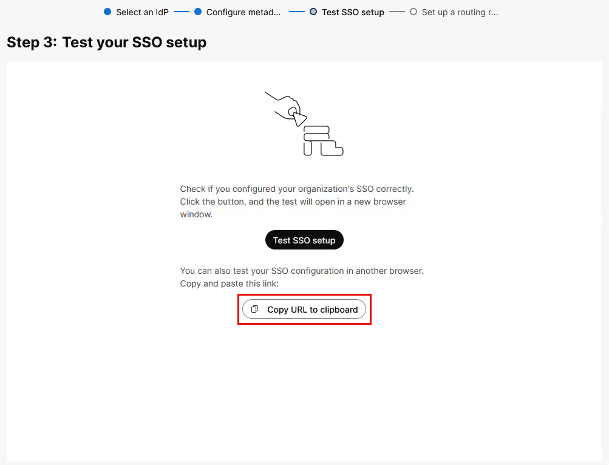{ width="400" style="border: 1px solid #888; border-radius: 4px;" }

1. Paste the URL in the private window and you will be prompted to sign in to Duo. You can use the same [cholland@cb**XXX**.dc-**YY**.com](mailto:cholland@cbXXX.dc-YY.com) you've been using -- account info is on your eXpo page.

1. Once you see **Single Sign-on succeeded**, you can close the incognito tab and click **Next.**

    a.  If you receive **Single Sign On Failed** when performing your
        SSO test, a configuration error has occurred. A common issue is
        pasting a URL, client ID, or client secret with a space appended
        to the end. Be sure to check all your values to make sure there
        is no trailing space.

      { width="400" style="border: 1px solid #888; border-radius: 4px;" }

1. Since this is your second IdP, you will be prompted to configure a routing rule. This allows Webex to have criteria that dictate to which IdP a user will be routed during authentication.

1. On the **Set up a routing rule** page, enter a rule name of **GroupRule**, select a routing type of **groups**, and search for and select the **Meetings** group, then click **Add**.

      { width="400" style="border: 1px solid #888; border-radius: 4px;" }

      Note that you have the option of allowing built-in MFA within Webex
      for any user authenticating through this IdP. This can be a great
      option to increase security for Webex logins without needing to make
      changes on the IdP. For now, leave the option on **Keep the current
      MFA status** which will use the global config in **Organization
      Settings.**

1. Back on the **Single sign-on & multiple identity providers** page, you'll see your SAML IdP and your new OIDC IdP. In this lab, both are using the same Duo tenant, however, that is just for demonstration purposes. You can have different Duo tenants, or completely different identity platforms configured for SSO.

      { width="400" style="border: 1px solid #888; border-radius: 4px;" }

      > **Note**: If at any point you become locked out of your org, you can access <https://admin.webex.com/manage-sso> using **cholland@cbXXX.dc-YY.com** to disable SSO. You will need to open Outlook on WKST1 to get a code that will be emailed to cholland.

### OpenID Connect -- Proof Key for Code Exchange (PKCE)
When enabling SSO with OIDC, you enabled the option to allow PKCE:

{ width="400" style="border: 1px solid #888; border-radius: 4px;" }

Unlike SAML, OIDC has different login flows which make it very flexible and suitable for many deployment types. The most common OAuth flows are listed below, in order of least secure to most secure:

1. Implicit Flow (deprecated in OAuth 2.1 -- included here for awareness)

1. Device Authorization Flow

1. Authorization Code Flow

1. Authorization Code Flow with PKCE

By default, the Webex application uses Authorization Code Flow when authenticating users. In this model, the user never directly sees access or refresh tokens. Instead, the Identity Provider (IdP) issues a short-lived authorization code, which the Webex application forwards to the Webex cloud. Webex then exchanges that code for access, refresh, and ID tokens over a secure backchannel using its client credentials. This ensures that tokens are never exposed in the browser or during redirects, reducing the risk of interception.

**Authorization Code Flow with PKCE** is an enhancement designed for public clients like the Webex desktop and mobile apps, which cannot safely store a client secret. Instead of a static secret, the app generates a one-time **code verifier** and sends a hashed version of it (the **code challenge**) during the initial request. When redeeming the authorization code, the app must present the original verifier. If an attacker were to intercept the authorization code, they would not be able to exchange it for tokens without also having the verifier.

This is why PKCE is recommended for any deployment where the client is not a secure backend server that can be trusted to store sensitive secrets --- such as the Webex application. Refer to the diagram below for a visualization of the login process when PKCE is enabled.

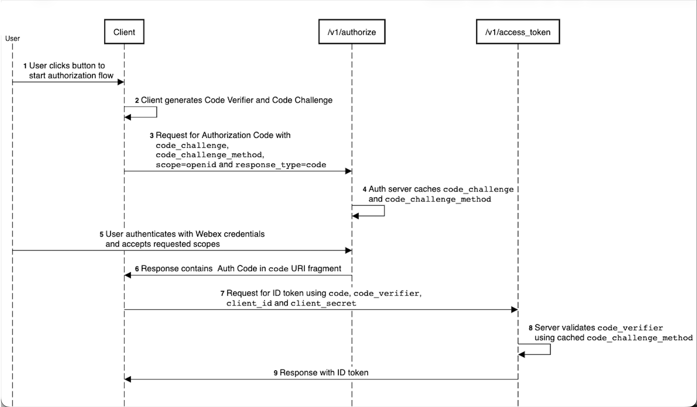{ width="400" style="border: 1px solid #888; border-radius: 4px;" }

For more technical information, refer to the RFC for Auth Code Flow w/ PKCE: <https://datatracker.ietf.org/doc/html/rfc7636>

## Multiple Identity Providers with Webex
Multiple IdPs is a powerful tool that allows administrators to route users to a different IdP depending on either their group or their
domain. This feature also allows you to use Webex Common Identity (CI) as an IdP which means users will use local Webex authentication rather than being routed to a third-party IdP. Some common use-cases for this feature include:

- Mergers and acquisitions

- Education or government institutions

- Partners using Webex as a consumer service

- Global enterprises with separate IT organizations

While powerful, this feature should only be used as a last resort. A rogue administrator could configure Webex to route users to an IdP that may not be monitored by an organization's security admins. If this IdP looked identical to the one with which users were accustomed to authenticating, users may not be aware that they are giving their credentials to a bad actor. In a different scenario, an IdP could be configured with a less strict password policy than is required by the security team.

Due to the inherent risk of a feature like this, new alerts have been created to notify administrators when key changes are made. These alerts can be found at **Security & Privacy \> Audit \> Admin activities**:

- When IdP is added to Webex, an alert is generated.

   { width="400" style="border: 1px solid #888; border-radius: 4px;" }

- When an IdP is deleted, an alert is generated.

   { width="400" style="border: 1px solid #888; border-radius: 4px;" }

- When a routing rule is created, an alert is generated.

   { width="400" style="border: 1px solid #888; border-radius: 4px;" }

- When the routing rule order is modified, an alert is generated.

   { width="400" style="border: 1px solid #888; border-radius: 4px;" }

These alerts provide notice if an administrator makes changes to the SSO
configuration. In addition, you can also enable logging of authentication events by navigating to **Security** \> **Audit** \> **Authentication Activities \> Generate Access** and enable **Allow user authentication data**. Refer to the screenshot below for sample data with this toggle enabled.

   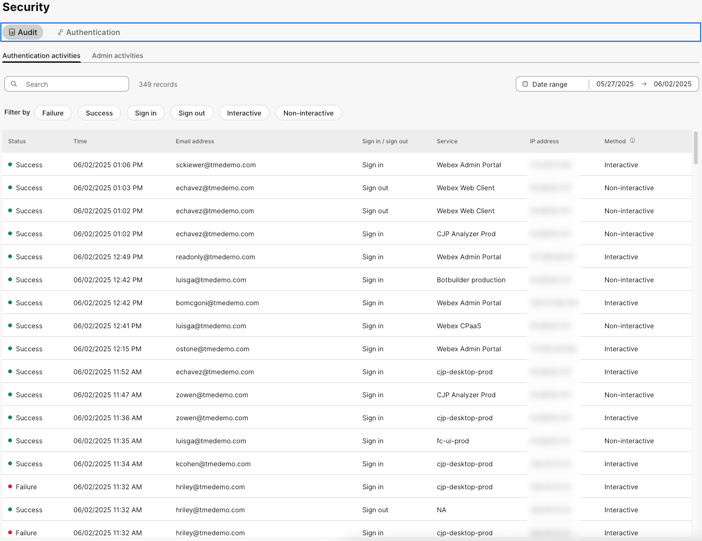{ width="400" style="border: 1px solid #888; border-radius: 4px;" }

If there is an issue with SSO at any point, a full administrator can use <https://admin.webex.com/manage-sso> to disable SSO or update the IdP
metadata.

At this point in the lab, you have already configured two IdPs, Duo (SAML) and Duo (OIDC). Since you configured the SAML integration first, it is configured as your default IdP. This means that any users not matching the GroupRule routing rule you created will be sent to your SAML integration. Note that in this lab, we're using the same Duo tenant for both IdPs but in a production environment, these can be separate Duo tenants, or separate providers such as Entra ID, PingFederate, AD FS, ForgeRock, Shibboleth, etc.

In the next section, you will configure local Webex authentication for a group of users and set up appropriate routing rules so that users are authenticated locally with Webex rather than routed to an external IdP.

1. Return to Control Hub and navigate to the **Groups** page in the **Management** section of the side panel.

1. In the **Webex groups** section, click the **Create a group** button:

      { width="400" style="border: 1px solid #888; border-radius: 4px;" }

1. Enter **WxLocalAuth** as the group name and click **Next**.

1. Select **Add manually**, then search for **chall** and **tbard** and select both users to add them to the group.

      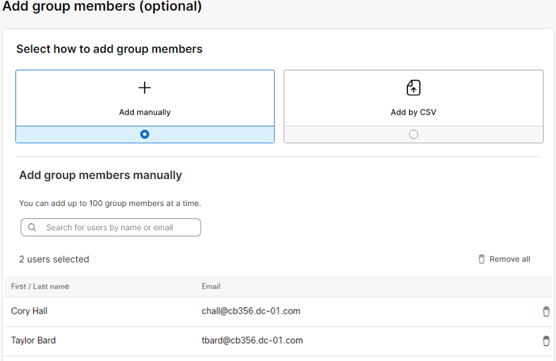{ width="400" style="border: 1px solid #888; border-radius: 4px;" }

1. Click **Save** then **Done**.

1. Navigate to **Security & Privacy** \> **Authentication** \> **Identity Provider** \> **Add an IdP**

1. Select **Webex**, then click **Next**.

      { width="400" style="border: 1px solid #888; border-radius: 4px;" }

1. Take a minute to read the disclaimer providing more information about utilizing local Webex authentication.

1. Tick the box for **I've read and understood how Webex IdP works**. And click **Next**.

1. On the **Set up a routing rule** page, add the following rule:

    a.  Rule Name: **WxLocalAuthRule**

    b.  Routing Type: **groups**

    c.  Selected groups: **WxLocalAuth**

      { width="400" style="border: 1px solid #888; border-radius: 4px;" }

1. Click **Add** and you will be sent back to the **Identity Provider** tab with a new **Webex** entry:
    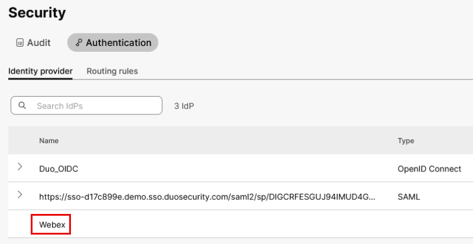{ width="400" style="border: 1px solid #888; border-radius: 4px;" }

1. Click the **Routing Rules** tab and move the **WxLocalAuthRule** to the top of the list by clicking the handle on the left side of the box and dragging the rule up.

      { width="400" style="border: 1px solid #888; border-radius: 4px;" }

1. A few key notes about routing rules:

    a.  Any time a user logs in to an account in this organization,
        Webex will check their uid (email address) against these rules.
        These rules are checked in order of priority and the user will
        be routed based on the first rule they match.

    b.  Due to this logic, rules should be placed in a **most specific
        \> least specific** order.

    c.  Domain rules require that the domain(s) be verified or claimed,
        or you will not be able to add them to the rule.

    d.  Domain rules can consist of multiple domains.

    e.  Group rules can specify either locally created Webex groups or
        synchronized groups.

    f.  Groups rules can consist of multiple groups.

    g.  In this scenario, the two users that you added to the
        WxLocalAuth group (**chall** and **tbard**) will match Rule #1
        and they will route to the Webex Identity Broker for
        authentication. No other users will match that rule, so they
        would then be checked against Rule #2. If they don't match that
        rule, they would match the Default Rule, so they would be
        redirected to Duo for authentication via the SAML application.

    h.  The default rule does not have a filter so it will match all
        users. It is likely that some users will match multiple rules
        (for example, they may match two different group rules or a
        group and domain rule). Remember, however, that Webex checks the
        user against rules **in order** and the user will be routed as
        soon as they match a rule -- they will not be checked against
        lower priority rules.

1. Open a new incognito or private window in your browser and navigate to <https://web.webex.com>. Click **Sign in** and enter [**tbard@cbXXX.dc-YY.com**](mailto:tbard@cbXXX.dc-YY.com) (refer to your eXpo page for **XXX** and **YY** values). and click next. You should be routed to Webex rather than Duo for authentication. This means that your rule is working as expected -- **no need to log in**.

      { width="400" style="border: 1px solid #888; border-radius: 4px;" }

1. Next, close your private/incognito window to clear any cached information, then open a new private/incognito window.

1. Navigate to <https://web.webex.com> and enter [**aperez@cbXXX.dc-YY.com**](mailto:aperez@cbXXX.dc-YY.com) (ensuring that you update the XXX and YY with your session #s).

    a.  This user's group membership will be checked to see if she
        matches the criteria for the **WxLocalAuthRule.** Since Anita
        Perez is not in the **WxLocalAuth** group, she will not match
        the rule.

    b.  Next, her group membership will be checked against
        **GroupRule**. She is in the selected group, so you should be
        routed to **Duo_OIDC** for authentication.

    c.  In a few steps, you will check the Authentication log in Duo to
        verify that users are being routed to the SAML and OIDC
        integrations as expected so be sure to complete a successful
        login with
        [aperez@cbXXX.dc-YY.com](mailto:aperez@cbXXX.dc-YY.com).

1. Finally, close your private/incognito window to clear any cached information, then open a new private/incognito window.

1. Navigate to <https://web.webex.com> and log in with [jdock@cbXXX.dc-YY.com](mailto:jdock@cbXXX.dc-YY.com) (ensuring that you update the XXX and YY with your session #s)jdock@cbXXX.dc-YY.com.

1. Now that you've successfully authenticated to both the OIDC application (**aperez**) and SAML application (**jdock**), open the Duo admin portal (<https://admin-demodemo.duosecurity.com>).

1. Navigate to **Reports** \> **Authentication Log**.

      { width="400" style="border: 1px solid #888; border-radius: 4px;" }

1. Verify that **jdock** and **aperez** authenticated to the correct applications:

      { width="400" style="border: 1px solid #888; border-radius: 4px;" }

It is very common to attempt this test in a browser that has a cached login for a different user (such as jdock or aperez). **If you receive an error during testing, try using a new browser or try to close ALL private/incognito windows to ensure you're using a fresh session with no cached logins.**

You now have a working multiple IdP configuration. This configuration can be much more complex -- this scenario was designed to provide a high-level introduction and overview of the feature.

## Enable Multi-Factor Authentication (MFA) using Duo
NOTE: Enabling MFA on Webex through Control Hub requires **Duo Authenticator**. This can only be installed on Android or iOS. If you want to proceed with this section but you do not want to install the Authenticator on your mobile device, please raise your hand and let a proctor know and we can use one of our lab devices for you. If you'd rather not go through this section, feel free to skip to the next module as the rest of the guide is not contingent on this feature.

Webex has native support for MFA using the Duo Authenticator. Administrators are given 3 different options when enabling this feature in Control Hub:

- Allow MFA per user (users in the org have the **option** to enable
  MFA)

- Mandatory MFA when accessing Control Hub

- Mandatory MFA for the organization (MFA required when accessing any
  Webex service).

For this lab, you will enable MFA for anyone accessing Control Hub.

1. Navigate to <https://admin.webex.com> and log in as Charles Holland ([cholland@cbXXX.dc-YY.com](mailto:cholland@cbXXX.dc-YY.com)).

1. Select **Organization Settings** and search for **Multi-factor Authentication**.

1. Select **Allow Multi-Factor Authentication** \> **Require mandatory MFA for selected applications** \> **Allow MFA**.

      { width="400" style="border: 1px solid #888; border-radius: 4px;" }

1. Click **Save**.

1. Next, open an incognito or private window in your browser. **Ensure that there are no other incognito windows open because any Webex sessions from those window(s) can cause issues.**

1. Navigate to <https://admin.webex.com> and log in as Charles Holland ([cholland@cb**XXX**.dc-**YY**.com](mailto:cholland@cbXXX.dc-YY.com)).

1. You will go through the SSO login flow with Duo but since you are now forcing MFA on Webex, you will be prompted to set up Duo Authenticator after you authenticate:

      { width="400" style="border: 1px solid #888; border-radius: 4px;" }

1. Click **Next.**

1. You will be presented with a QR code. Launch the Duo Authenticator on your mobile device and tap **Add** (or raise your hand and request to use a proctor's device).

1. Once the code has been scanned into the Duo Authenticator app, click **Next**.

1. You will be asked to enter the 6-digit Time-based One-Time Password (TOTP) after which you will be redirected to Control Hub.

      { width="400" style="border: 1px solid #888; border-radius: 4px;" }

1. After the code is successfully confirmed, close the incognito/private window and you should still be logged into Control Hub in your other browser session.

1. Toggle **Allow Multi-Factor Authentication** off and click **Save.**

      { width="400" style="border: 1px solid #888; border-radius: 4px;" }

This section demonstrates that even when SSO is enabled, the collaboration administrator can still force an increased level of security for Webex. This may seem unnecessary if the IdP already requires MFA, but some organizations don't force MFA and collaboration administrators can still choose to utilize this feature to increase security on the Webex platform.

This concludes the module on Webex Identity. Before proceeding to the next module, close your remote session to AD1 since modules 2 and 3 both require usage of Workstations 1-3.

**END of MODULE 1**

Continue with either Module 2 or Module 3:

- [Module 1: Webex Identity](module1_identity.md) *(current)*
- [Module 2: Zero Trust Encryption](module2_zero_trust_encryption.md)
- [Module 3: Webex Compliance](module3_compliance.md)
- [Conclusion](conclusion.md)