# Module 2: Zero Trust End-to-End Encrypted Calling and Meetings, Media Watermarking, and Deepfake Detection.
In this module, you will learn about Zero-Trust End-to-End Encrypted calling and meetings, learn how you can use watermarking for preventing media leakage. Finally we will walkthrough the process of deepfake detection in a meeting.

There are 6 sections in this module:

1. [Schedule an End-to-End Encrypted Meeting](#schedule-an-end-to-end-encrypted-meeting)

2. [Features in an End-to-End Encrypted Meeting](#features-in-an-end-to-end-encrypted-meeting)

3. [Audio and Visual Watermarking and Watermark Analysis](#audio-and-visual-watermarking-and-watermark-analysis)

4. [Deepfake Detection with GetReal Labs and Webex](#deepfake-detection-with-getreal-labs-and-webex)

5. [Provision Users and Configure Zero Trust End-to-End Encrypted Calling](#provision-users-and-configure-zero-trust-end-to-end-encrypted-calling) 

6. [Zero Trust End-to-End Encrypted Calling](#zero-trust-end-to-end-encrypted-calling)

## Schedule an End-to-End Encrypted Meeting

In this section, you will learn how to schedule an E2EE meeting and learn the benefits and features of an E2EE meeting.

Before proceeding with the configuration, it's important to understand
how an E2EE meeting works at a high level. End-to-end encrypted meetings
are designed to ensure that meeting content can only be accessed by the
desired parties. The meeting content encryption key is generated by the
meeting host, encrypted with media encryption key, and shared with other
participants. Webex cloud services DO NOT have access to content
encryption key. Without the encryption key, Webex cannot decrypt any of
the meeting content, so features like meeting chat transcripts, files, whiteboards, annotations, and recordings are not available when the meeting ends.

Features that can be provided by processing information locally device are available in End-to-End encrypted meetings:

- Audio and video watermarking
- Face and gesture recognition
- Room interpretation
- People presence detection
- Proximity pairing
- Background noise removal

Additionally, E2EE meetings are available to enterprise and consumer
customers and are supported by the Webex App (desktop and mobile) and
Webex devices with up to 1000 participants.

Before you start this section, lets enable watermarking capabilities in Control Hub, you will need it for the next section.

1. Ensure that you are logged into Control Hub i.e. https://admin.webex.com with Charles Holland's credentials from WKST1. In **Control Hub**, navigate to **Organization Settings** and scroll down to the option for 'Add an audio watermark' and 'Show visual watermarks' and enable them. Enable all the three options below 'Show visual watermarks'. Click **Save**.

      

      This will enable the digital watermarking option to present itself to users when scheduling meetings of supported types. Please note that it will take some time in some cases about 15 minutes for the option to appear for end users once enabled in Control Hub.

      You will now schedule an end-to-end encrypted meeting.

1. RDP to WKST1, ensure that you are logged into the Webex app with Charles's credentials , cholland@cbXXX.dc-YY.com and password dCloud123! (if you didn't complete module 1, refer to last 4-digits of Session ID on eXpo dCloud Session View page for the non-SSO password).. 

1. Navigate to admin.webex.com and click on **Sign in** with credentials for cholland, <cholland@cbXXX.dc-YY.com> and password **dCloud123!** (if you didn't complete module 1, refer to last 4-digits of Session ID on eXpo dCloud Session View page for the non-SSO password).

      Go to Services\--\>Meeting and copy the site name.

      

1. Open an instance of Chrome browser and navigate to the sitename e.g. cb46001.webex.com and sign in with credentials for cholland, cholland@cbXXX.dc-YY.com and password dCloud123! (if you didn't complete module 1, refer to last 4-digits of Session ID on eXpo dCloud Session View page for the non-SSO password). Click Schedule \> Schedule a meeting, set the meeting type to **Webex Meetings Pro-End to End Encryption_VOIPonly**.

      

1. Set a **Meeting topic, Date/Time**, and invitees (Anita Perez <aperez@cbXXX.dc-YY.com> and Kellie Melby <kmelby@cbXXX.dc-YY.com>).

      

      

1. Click on **Schedule** and click **Start**. Click 'Open Webex' to start the meeting in the Webex App.

      

1. To start, let Charles be the only participant in the meeting. Click OK on the **No Microphone found** prompt and Click on Start Meeting.Click OK on the "No Microphone found" after starting the meeting. Observe the blue shield icon at the top left of the meeting window, the padlock indicates that this is an E2EE meeting.

      

1. In the meeting window, click the **Meeting Info** option and then **Security**. Ensure that you are seeing the security code, the server connection as **TLS with AES-256-GCM-SHA384**, and Media connection is **AEAD-AES-256-GCM**.

      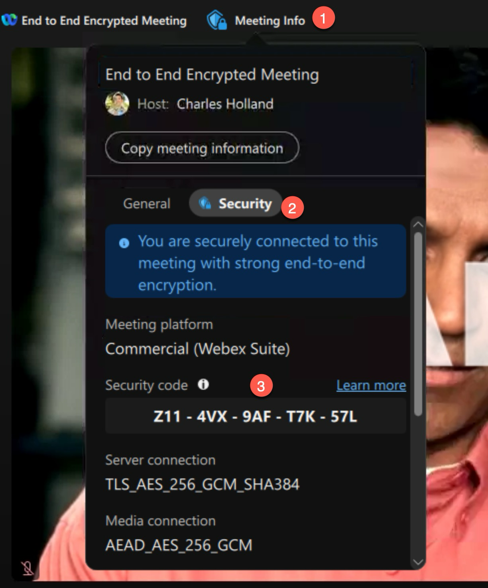

      Make a note of the security code.

      Navigate to the Participants Tab and click on the "i" icon next to Charles's name. You will see the certificate and therefore the identity of Charles is verified by **Webex**. You can click the "i" to see the certificate information.

      

1. Now login to **WKST2** with **dcloud\\aperez** (password **dCloud123!**). Launch the Webex App and login with [**aperez@cbXXX.dc-YY.com**](mailto:aperez@cbXXX.dc-YY.com) and password **dCloud123!** (if you didn't complete module 1, refer to last 4-digits of Session ID on eXpo dCloud Session View page for the non-SSO password). You will see the Join meeting notification:

      

1. Click on **Join**, click **OK** in the **No microphone found** prompt. Click Join Meeting to enter the meeting.

      Click on **Meeting Info** then select **Security** and observe the security code. It has changed now that a new attendee has joined. Feel free to verify the certificate for Anita.

1. Login to **WKST3** with **dcloud\\kmelby** (password provided in the pod sheet). Launch the Webex App and login with [**kmelby@cbXXX.dc-YY.com**](mailto:kmelby@cbXXX.dc-YY.com) and password **dCloud123!** (if you didn't complete module 1, refer to last 4-digits of Session ID on eXpo dCloud Session View page for the non-SSO password). You will see the Join meeting notification, join the meeting by clicking on the green **Join** button.

      Click on **Meeting Info \> Security** and verify that the security code has changed again. Feel free to verify the certificate for Kellie.

      **Note: Message Layer Security (MLS)** uses key packages to identify users and to generate new meeting encryption keys as participants join the meeting. Note that, like the meeting security code, the meeting encryption key changes every time a new participant joins the end-to-end encrypted meeting.

Each MLS key package contains:

- Participant's Identity Info & Public Key (Verified Credentials/certificate).
- A tree hash value that represents the cryptographic group state and credentials of the group members (meeting participants).
- An identifier for the current version of the meeting encryption key.
- A new meeting encryption key is created when participants join or leave the meeting.

**Note: Secure Frames:** Secure Media Frames provide an extra layer of authenticated encryption for media.

The whole media frame is encrypted before being placed into individual SRTP payloads. SFrames use MLS to provide the encryption keys that each meeting participant needs to decrypt media.

## Features in an End-to-End Encrypted Meeting

In this section, you will learn some features that are made available in an End-to-End Encrypted (E2EE) meeting.

1. Record the Meeting: Navigate to WKST1 and open the meeting that is still in progress. Click the record button. The only option that is made available is 'Save to my computer'. There is no cloud recording option available because Webex does not have access to the media encryption keys needed to decrypt the media:

      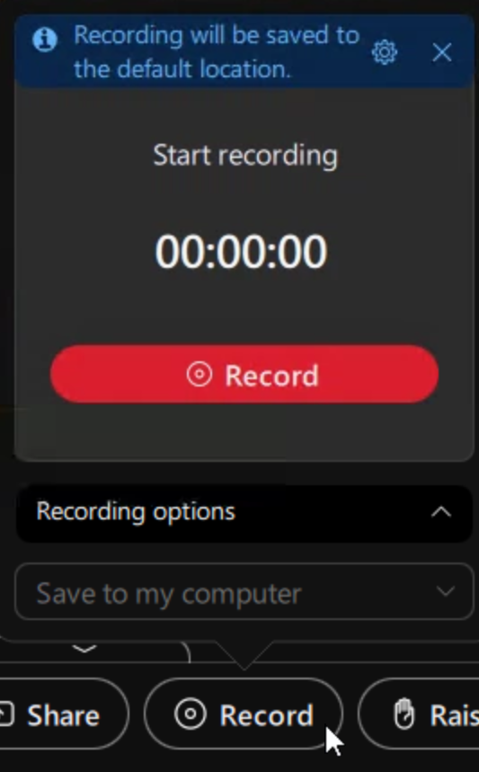

      Note the message that displays when you hover over the Record button indicating that AI summaries are only available for cloud-based recordings. Since the only option here is to record to the local computer, AI meeting summaries won't be available.This is important point to remember about end-to-end encrypted meetings.

      

1. Connect to a Video System: In an E2EE meeting, Cisco video devices (RoomOS) can seamlessly join a meeting. In this lab, there are no video endpoints available for testing. However, you should know that Cisco video devices (RoomOS) can join an E2EE meeting. Refer to the screenshots below showing a video device joining a meeting and the identity certificate issued to the device.

      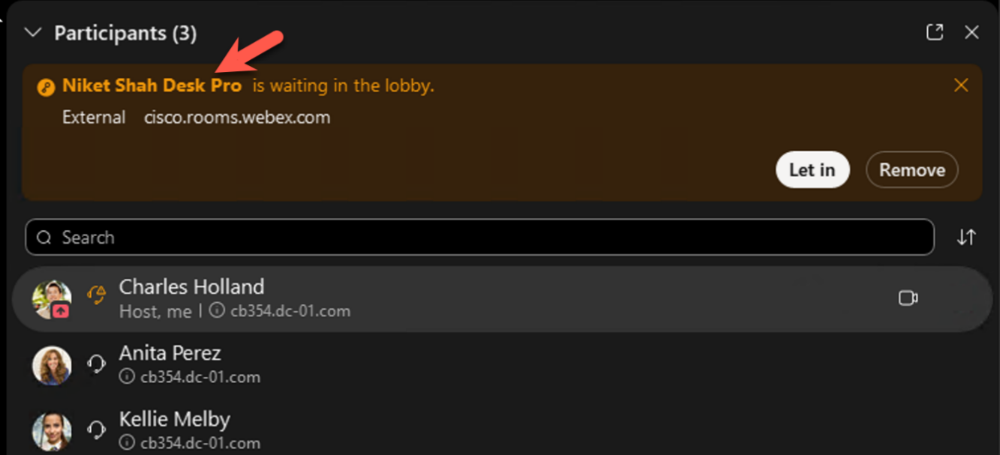

      

1. Click the arrow next to the Unmute button to review. Audio Options: Zero Trust E2EE meetings do not give Webex access to meeting encryption keys. This means that cloud services and endpoints that need to decrypt meeting content cannot participate in E2EE meetings: e.g., PSTN and SIP endpoints. So, the only audio-only option available is a computer running the Webex App.

      

1. Webex Smart Audio: Webex Smart Audio and noise removal is available in an E2EE meeting because the processing for this feature is handled locally on the device.

      

1. Gestures and Reactions: Gestures and reactions are available in an E2EE meeting.

      

1. Raise hand is available in an E2EE Meeting from both the Webex app and the video endpoint.

      

1. On WKST1, navigate to the desktop, there is PowerPoint presentation called presentation.pptx, launch the presentation.

      

1. Return to Webex App and click on share, select Show me in Front of Presentation and select Microsoft PowerPoint from the options and click Share.Once completed "Stop Sharing"

      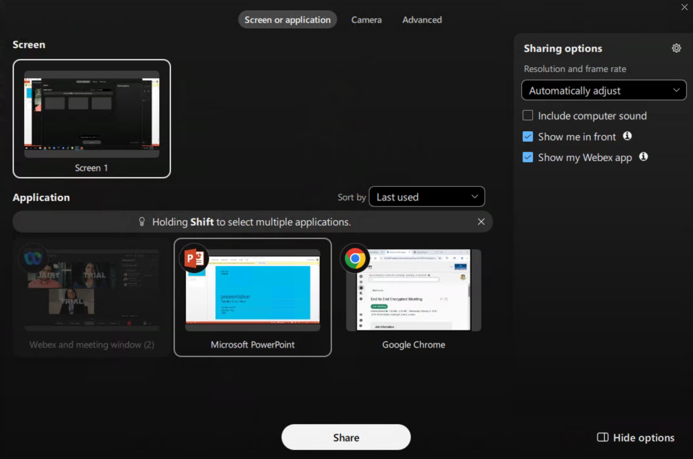

      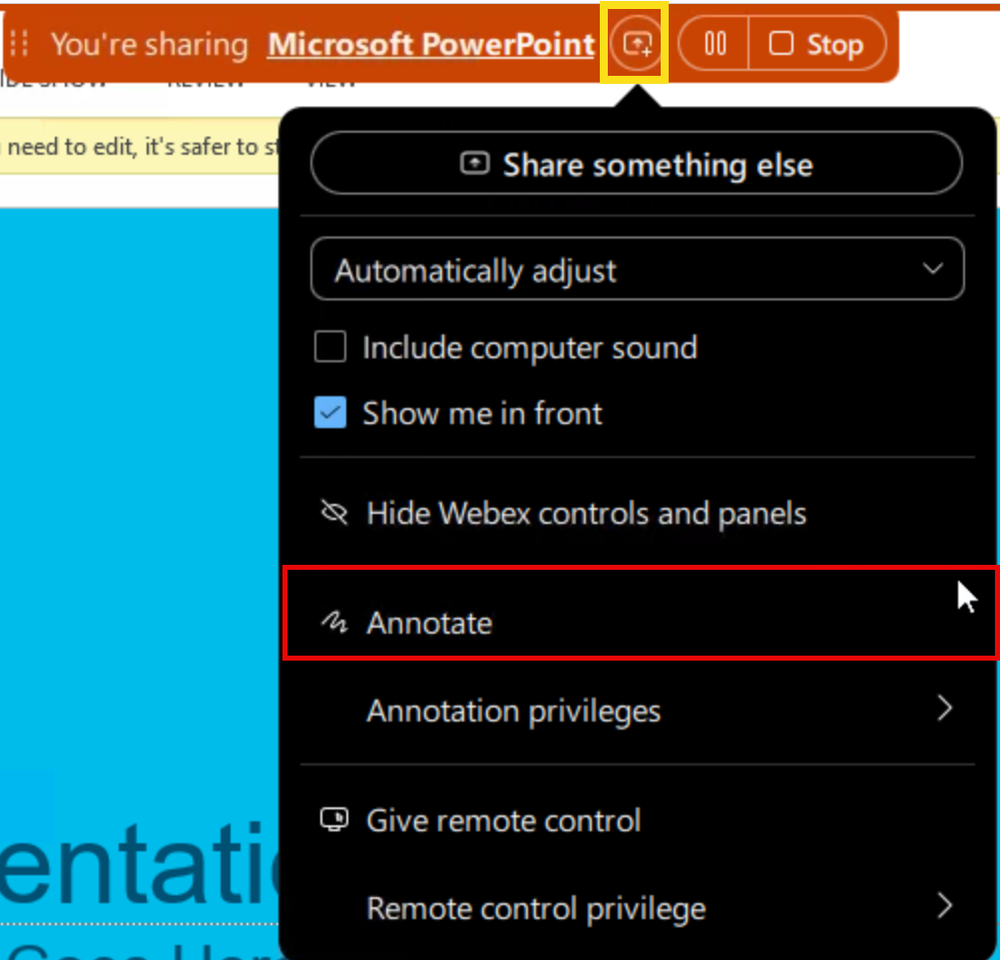

1. Click on the ellipsis icon "..." next to reactions and explore other features available in an end to end encrypted meetings like "whiteboards" and "Enable Sign Language Interpretation" and designate Anita as the interpreter.

1. Finally the end the meeting for All.

## Audio and Visual Watermarking and Watermark Analysis
In this section, you will learn how watermarking can help with data
leak protection. Audio and visual watermarking can help identify the
source of unauthorized recordings, images, captures of confidential
meetings.

**Audio Watermark**

The audio watermark feature can't identify the person responsible for recording the meeting, but it can help identify the source client or device that was recorded.

Feature details:

- Add a unique identifier (indiscernible, hidden watermark) for each client or device in a watermarked meeting.
- Available with all Meetings.
- Admin can control availability of the audio watermarking feature for their organization.
- Admin can upload media files for watermark analysis via Control Hub to identify the source client or device that was recorded.
- Admin can get details of the meeting from identified watermarks, such as meeting number, host name, etc.
- Admin can only analyze watermarks for meetings hosted in their organization.
- Watermark information is retained for the same duration as the organization's meeting information.

**Visual Watermark**

- Visual watermarks superimpose a watermark image over the meeting video and shared content. Each meeting participant sees a watermark image with their own email address. If a meeting participant isn\'t signed in to Webex, the watermark includes their display name and email address. Users can adjust the watermark opacity, so the pattern is visible but doesn\'t cause too much distraction.
- Local recordings are disabled when audio watermarks are turned on.

Let's look at enabling and testing these features: <strong>We have already enabled the Control Hub Toggles for these features at the beginning of the module.</strong>

**Step 1: Audio Watermarking**

1. If not already logged in, log in to **WKST1** as **dCloud\\cholland** and **dCloud123!** Launch the Webex App and go to Meetings. Click on Schedule a Meeting and invite Anita and Kelly to the meeting. Ensure that the meeting link is set to "Generate a one-time meeting link"

      

1. Click on Advanced Settings. Select the Security tab on top and select the tick for Add watermarks to meeting audio.

      

1. Pay close attention to the capabilities available with watermarking.

      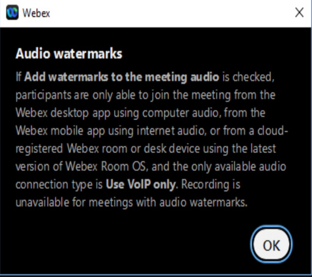

      Click on the arrow next to Advanced Settings on the top of the window to return to basic settings.

      

1. Click on Schedule, there is no need to start the meeting as you shall
use a shared org to test watermark analysis.

**For the purpose of this lab and the practicality of multiple participants
recording audio simultaneously for testing this feature, the below part
is review only. Please see a proctor to get an audio file for testing
with a shared org in Step 2 below.**

*There are many factors involved in successfully decoding a recorded
watermark. These include distance between the recording device and the
speaker outputting the audio, audio volume, environmental noise,
etc.*

*Webex watermarking has additional resiliency to being encoded multiple
times as might happen when the media is shared. The goal of the feature
is to enable a successful decode of the watermark identifier in a broad
but reasonable set of circumstances. The goal is that a recording
device, such as a mobile phone, laying on a desk near a personal
endpoint or laptop client will create a recording that yields a
successful analysis. As the recording device is moved away from the
source or obscured from hearing the full audio spectrum it will degrade
the chances of a successful analysis. In summary, the recording device
needs a reasonable capture of the meeting audio. If a user captures the audio on the computer that is hosting the client, then no limitations should apply.*

Once about 90 seconds have elapsed, end the meeting and the stop the recording.

**Step 2: Watermark Analysis:**

Next, you will analyze if the watermarks are present in the recording.

1. Please reach out to one of the proctors for an audio file for analysis.

1. If not already logged in, log in to **WKST1** and open an incognito
instance of Chrome.

1. If you haven\'t received the file, please do not proceed to step 4.

      Navigate to admin.webex.com and login with **cholland@cb460.dc-01.com** and password as **dCloud8088!** - (please note this is a shared instance that will be used by other attendees, kindly do not make any changes).

      In **Control Hub**, navigate to **Troubleshooting** listed in the sidebar.

      Select the **Watermark Analysis** tab and select Analyze File.

      The **Analyze audio watermark** popup allows you to provide a name e.g., Pod1watermark for the analysis and some additional notes to help associate this request to any internal investigation case or point of contact. The file requirements are listed on the dialog and as of this writing we are guiding to a minimum supported length of 90 seconds.

      

1. The following audio file formats are supported: .wav, .aac, .mp3, .mp4, .avi or .mov. Upload the recorded meeting .mp4 file to the analysis tool and provide an **Analysis name** and **note** for reference:

      

1. The dialog will guide you through the process. Once the upload has completed, click **Close**. The analysis depends on the size of the file. After a short delay, you should see that the analysis is complete.

      Note that since other lab attendees are also uploading files you may see multiple instances of watermark analysis in the list.

      

1. Now, if the meeting recording was leaked, or if someone was recording the meeting using a phone or other source, an administrator could use this feature to determine which user's device, or location may have been compromised during the meeting. When you click on the analyzed file you will quickly see the leak / watermark source where this mp4/mp3 file originated from.

      

      When Audio Watermarking is enabled, the meeting audio includes a unique identifier for each participant. An administrator can upload audio recordings to Control Hub where an analysis is performed, and these watermarks can be detected.

      - To be analyzed, the recording must be an AAC, MP3, M4A, WAV, MP4, AVI, or MOV file no larger than 500MB.
      - The recording must be longer than 90 seconds.
      - You can only analyze recordings for meetings hosted by users in your organization.
      - Analyzed recordings are deleted as soon as the analysis is complete.

1. Logout of the test control hub and use the login credentials provided
in your eXpo dCloud Session for the subsequent sections.

**Step 3: Visual Watermarking**

1. If not already logged in, log in to **WKST1** as **dCloud\\cholland** and **dCloud123!** (if you didn't complete module 1, refer to last 4-digits of Session ID on eXpo dCloud Session View page for the non-SSO password).

1. If required, launch the Webex App and go to Meetings. Click on Schedule a Meeting and invite Anita and Kelly to the meeting. Ensure that the meeting link is set to "Generate a one-time meeting link"

      

1. Click on Advanced Settings. Select the Security tab on top and select the option for "Add Visual watermarks to participant videos and shared content".

1. There is a slider to adjust the watermark's opacity level with a preview of what the watermark will look like. This gives you control over how visible the watermark will be during a meeting. Lower opacity means less distraction for meeting participants, while higher opacity shows a much clearer watermark. Set the opacity level to higher than 50%.

      

1. Click on the arrow next to Advanced Settings on the top of the window to return to basic settings.

      

1. Click on **Schedule** and click on **Start meeting**.

      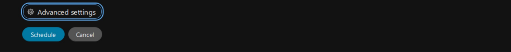

1. Click **OK** in the Microphone Not Available prompt. Click 'Start meeting' to launch the meeting.

      Login to WKST2 with Anita and WKST3 as Kellie and join the meeting.

      Navigate to WKST1 and explore the recording capabilities. Only cloud recording capabilities are available when visual watermarks are enabled. Once enabled for a meeting during scheduling, the visual watermark feature cannot be turned off. To have a meeting without visual watermarking, a new meeting must be scheduled. If a user is on an older version that does not support visual watermarking and attempts to join a meeting where it is required, they will not be allowed to join the meeting. Local recording is always disabled when visual watermark is turned on for a meeting.On WKST 1, share a document named presentation.pptx, now navigate to WKST2 and see that the watermark is present on the shared content. This provides traceability of the data loss to the source that captured or took screenshots.

      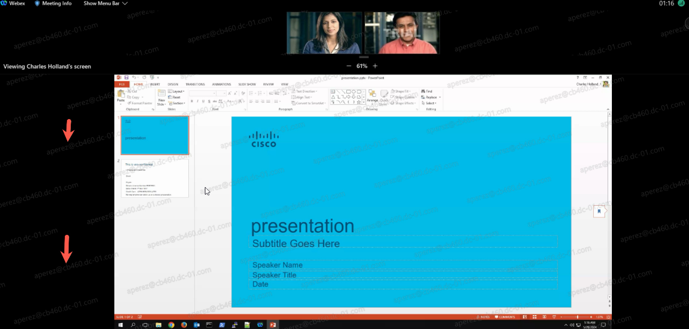

      End the meeting for all.

## Deepfake Detection with GetReal Labs and Webex.

GetReal Labs has partnered with Cisco to integrate advanced deepfake detection capabilities directly into the Webex collaboration platform, addressing the growing security threat of AI-generated synthetic media in enterprise communications.

Cisco Webex has integrated GetReal Labs' AI-powered authentication technology to provide real-time verification of meeting participants, protecting organizations from sophisticated impersonation attacks and synthetic media manipulation. This integration is part of Webex's comprehensive Zero Trust security architecture, which includes end-to-end encryption, identity verification, and content protection.

In this module we shall leverage GetReal labs and Webex for Deepfake detection. Realtime deepfake protection for meetings by integrating deepfake protection into your Cisco Webex environment enhances the security of your meetings by detecting and notifying you of impersonation attacks in real time.

**Step 1: Logging into Webex App.**

1.  In this module we will be logging into the Webex App on the actual PC and not on any of the workstations. 
2. <strong>When you are ready to begin this module reach out to your lab proctor for a specific accounts that you will leverage just for this section.</strong>
3. <strong>Stop</strong> , confirm that you are logging into the host system and not on wkst1.
4. Start a webex meeting. Log into the Webex App from the host PC with the credentials provided by the proctor, Click the meetings tab and then click "Start a Webex Meeting" and then click on start meeting.
      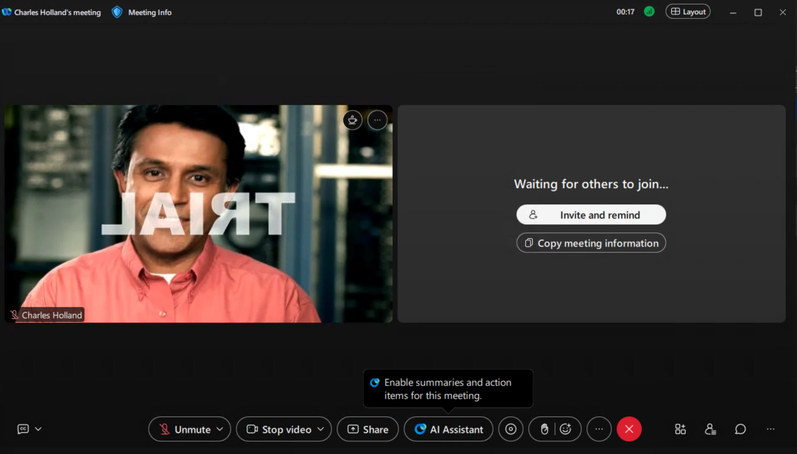

5. Go to the Apps Panel and search for GetReal Trust Advisor.
      

6. Click on Open. 
 
**Step 2: Logging into GetReal Labs and inviting participants.**

1. Once you click on Open for GetReal Trust Advisor, you will be prompted to sign in.
      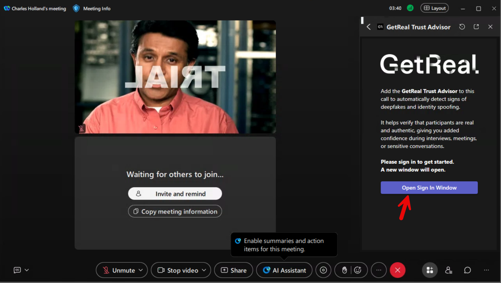

2. Sign in with the credentials that were provided to you by the proctor during the beginning of this module.

3. Once signed in , the next screen would be " Add GetReal Trust Advisor to the Call". Click on it and add the trust advisor to the call.

      

4. If you see any popups from GetReal Trust Advisor for any permissions, click on Accept
      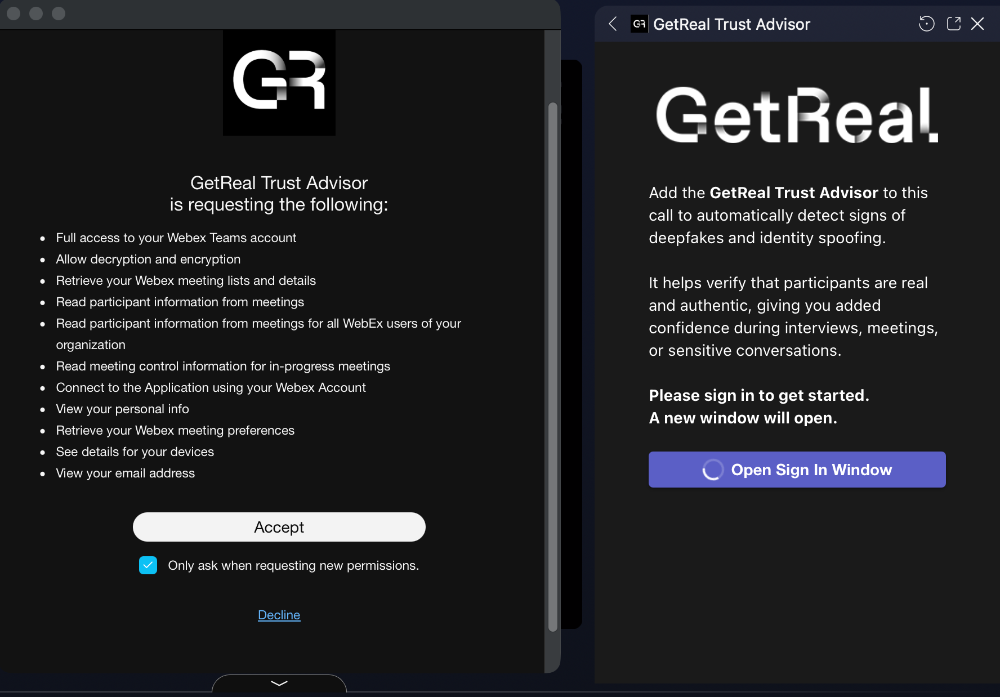

**If you dont see the option of "Add GetReal Trust Advisor to the Call" , click on the refresh icon at top of the app window.**
     

5. This process does take a couple of minutes , once its ready you will get a notification on the meeting window to "Let In" the trust advisor. 

      

6. At this point you should have two participants on the call, the person you are logged in with and the GetReal Trust Advisor.

      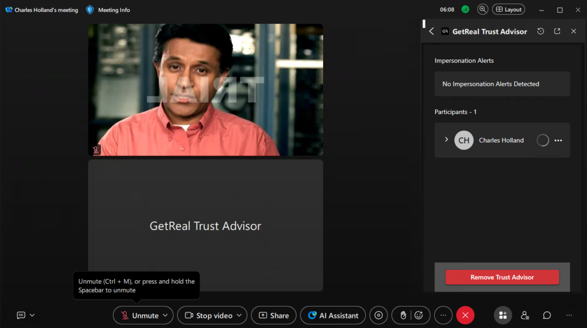

7. Invite a few participants like Charles Holland and Anita Perez from your actual lab pod and let them into the meeting. 

8. You will add one of the lab proctors to this meeting now. Feel free to reach out to one of the proctors and we will join your meeting.
      
      

**Step 3: Monitoring and detection of participants.**

1. At this point besides yourself (logged in on the local PC), you shall have the two participants from your remote workstations , GetReal Trust Advisor and one of the lab proctors on the meeting bridge.
      

2. GetReal should automatically start monitoring the participants. Incase if it doesnt for the participants that are on the call click on the elipsis symbol "..." and then click on start monitoring .

3. In a minute or two you will the real participants will have a  <strong>"Green Check" next to their name and for the participants where GetReal has detected impersonation you shall see   <strong> "Impersonation Detected".</strong></strong>
      

4. Click on the red "X" on the webex meeting window from your source workstation to end the meeting for all.

5. Since this is shared account please do not change the password or perform changes on the account that you logged into the source workstation. 

**Step 4: Preview the violations on GetReal Portal.**

1. So we have created a test case where we have GetReal Trust Advisor flagging the participant as an impersonator.
2. Let's have a quick look into how those violations are captured on GetReal.

3. On your local PC or any of the lab workstations , open an incognito instance of Chrome browser and Browse to url https://app.getreallabs.com/ , click on "Continue with Webex".

4. Login with kmelby@cb311.dc-01.com and password dCloud0831! 

5. On the left hand side you will see an option with identity violations, select "Identity Violations" and in the period option select 30 days.

      

      

6. You should your violation right up on top, however before we go there lets review the one which has id "GR-1". You will see it has not only detected a Face Swap but also a known threat actor in terms of Fake IT worker. Expand on both the options to learn more on the violation by clicking "Full Details". 
Also you will see that there is a video recording of the interaction in GR-1. Move the time stamp to 9-10 minutes into the conversation to how the user faked into a known threat actor.

      

7. Perform the same analysis for your recent violation.
8. Once completed logout of GetReal portal and ensure you are signed out of the webex app from your Local PC. 
9. Since this is a shared account, please do not make any changes on this account.

## Provision users and configure Zero Trust End-to-End Encrypted Calling

**Note: Before proceeding, please be sure to sign out of any Webex Apps on the lab PC and any of the remote workstations.**

First, it is important to understand the implementation of zero trust E2EE calling works. As with zero trust E2EE meetings, calling data can only be accessed by authorized parties. The calling media encryption key is derived by the calling party and propagated to the called party via MLS key package. As such encrypted call media **cannot** be decrypted by Webex cloud services, because Webex **DOES NOT** have access to the media encryption key - Zero Trust.

Unlike the zero trust E2EE meetings, zero trust E2EE calling will downgrade to standard encryption (where Webex services have access to the media encryption key) if one of the called party's device or features does not support zero trust E2EE (non-SIP, PSTN calls). Downgrades to standard encryption from zero trust E2EE also occur when Webex services are enabled that require access to the media encryption keys - for example, when the call is recorded or when closed captioning is enabled on the call. Note that calls can also upgrade to zero trust E2EE when Webex services are removed.

To begin, you will need to enable the zero trust end-to-end encryption feature. Then, you'll provision two Webex org users for Webex Calling including assign licenses and phone numbers.

1. Turn on zero trust E2EE calling

      The zero trust E2EE calling feature needs to be turned on explicitly for the organization.

      a. Click **Calling** (under Services in the left-hand navigation menu)
      
      b. Select **Settings** and then, click the **Webex App**. Scroll down to the 'Security' section.

      c. Enable zero trust E2EE calling by toggling on **'Enable end-to-end encryption when making calls'**.
      
      
      
      
1. Provision users for Webex Calling 

      **Note: Today, zero trust E2EE calling is only supported with Webex Calling SIP lines (<u>NOT</u> 'Call on Webex') - this is why a number is configured here to enable SIP line calling.**

      Return to WKST1 and from the Chrome browser there, if required navigate to Webex Contol Hub (https://admin.webex.com). If login is required login with: cholland@cb**XXX**.dc-**YY**.com // dCloud123! (or if you did not enable SSO in Module 1, use the default password: dCloud**ZZZZ**!).
      
      a. Select **Users** from the navigation window to load the Users page and then select user **Charles Holland**

      

      b. Scroll down to the licensing section and click **'Edit licenses'**

      

      c. On the subsequent screen, click **'Edit licenses** again. Next, click on the 'Calling' selection and tick the box next to **Webex Calling**. Ensure that the **Professional** box is also ticked.

      

      d. Click **Save**.

      e. On the next screen, select the location **CL EMEA** from the 'Location' dropdown. This will assign the user to this location.
      
      f. Next, select the 'Phone Number' dropdown and select one of the available numbers - for example, '+31 20 555 4191'. Then, configure the extension with the last 4-digits of the phone number - for example '4191'. (Note: These are just <u>examples</u>. The phone numbers and extensions available in your pod <u>will be different</u>).

      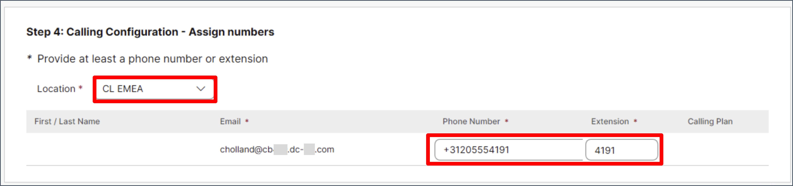
     
      g. Click **Save** to assign the Webex Calling license and phone number to the user. The user now has a SIP line and phone number. Click **Close**.

      h. Click the **Calling** tab to review the directory number and confirm it was properly allocated.

      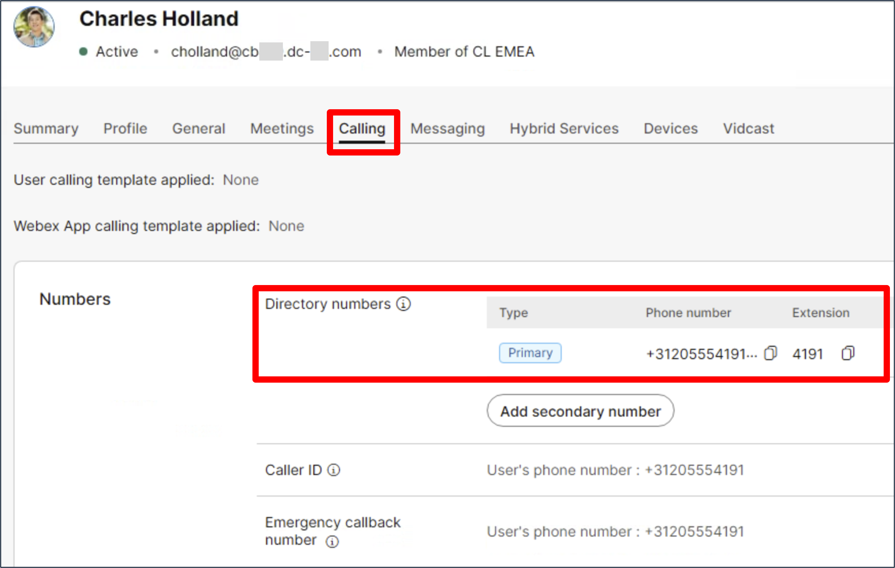 

      i. Repeat the process above to assign Webex Calling license and phone number to user **Anita Perez**. In this case, user the other available phone number (for example, +31 20 555 4192 / extension 4192). (Note: The available phone number in your pod will be different).
		
1. Enable call recording for a user.

      Enable call recording for one of the users just licensed for Webex Calling and provisioned for phone number. 

      a. Navigate back to user Charles Holland (or Anita Perez) and click the **Calling** tab. 
      b. Scroll down to the 'User calling experience' section and set Call recording to **'On'**. 
      c. Then, toggle on **Record incoming and outgoing calls...** and tick **On Demand**. This ensures the user can start/stop call recording. 
      d. Finally, tick <u>both</u> **'Play recording start/stop announcement for...'** boxes. 
      e. The rest of the settings can be left at default. Click **Save**.

      

## Zero Trust End-to-End Encrypted Calling 

Now that two users have been provisioned for Webex Calling and SIP lines, it is time to confirm that zero trust end-to-end encrypted (E2EE) is operating for Webex calls.   
		
1. Make a Zero Trust E2EE Webex Call

      a. On the local lab PC log back into the Webex App with Charles Holland's account (cholland@cb**XXX**.dc-**YY**.com // dCloud 123! - if you did <u>not</u> complete SSO in Module 1, then the password is dCloud**ZZZZ**!).

      b. On the remote PC Workstation 3 (WKST3), log back into the Webex App with Anita Perez's account (aperez@cb**XXX**.dc-**YY**.com // dCloud 123! - if you did <u>not</u> complete SSO in Module 1, then the password is dCloud**ZZZZ**!).

      Once the users are logged into the Webex App, make a call between the two users. 
      
      c. Using Charles Holland's Webex App on the local PC, click the Calling tab (1) and search for 'Anita Perez' (2). Right click on the phone icon (3) and select Audio Call (4) > Work <Work_Number> (e.g., +31 20 555 4192) (5) to place the call via the user's SIP line. Note: Do **not** select 'Call on Webex'.

      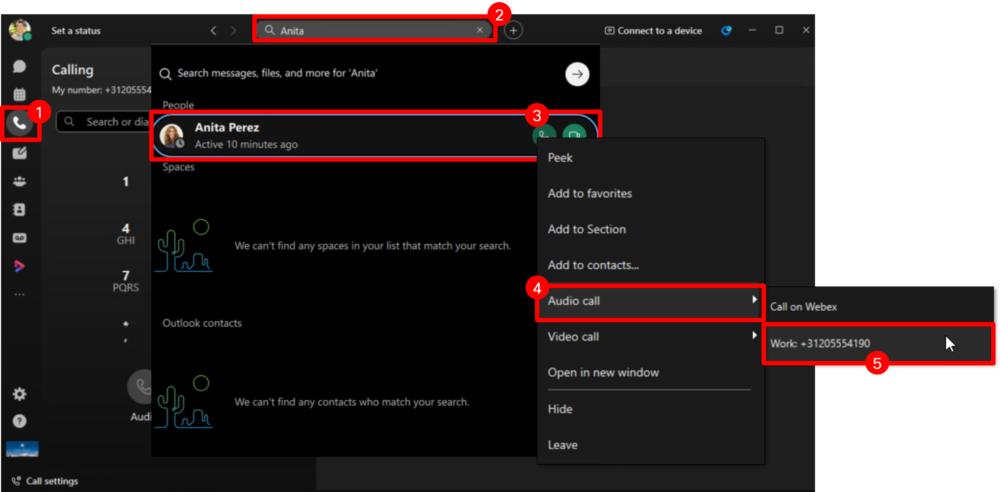

      d. On the remote WKST3, answer the incoming call from Charles on Anita Perez's Webex App.
      
      

      e. Once the call is connected, observe the **blue shield** call info icon in the upper left-hand side of the call window. Observe as this icon transitions to a **blue shield with a lock**. (Note: It may take a few seconds for this transition). The message "End-to-end encryption is active" will also be displayed.

      

      f. Click the blue shield call info icon and review the security information. Note that the call audio (and any screen/application share) is 'Zero Trust end-to-end encrypted'. It's worth noting that chat and whiteboards if present are just standard Webex end-to-end encryption (and not zero trust E2EE).

      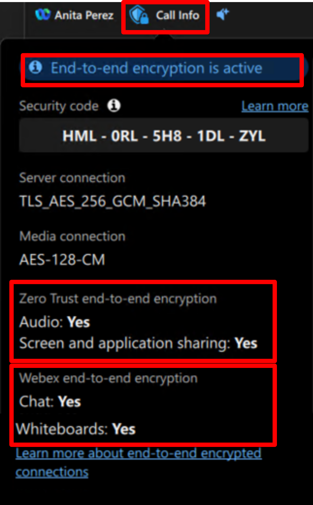

1. Downgrade call security from zero trust E2EE to standard encryption.

	a. As the call continues, on the local PC Webex App (Charles) click the record icon on the menu bar and then the **Record** button to start recording. 

      

      b. Observe that the call media is immediately **downgraded to standard encryption**. The blue shield with a lock call info icon reverts to the blue shield icon and a message appears indicating call has been moved to standard encryption ('Standard encryption is active').

      
      
      c. Again, click the blue shield icon to see security details for the call and note that call audio media (and screen/application sharing) is now **downgraded to standard encryption**.

      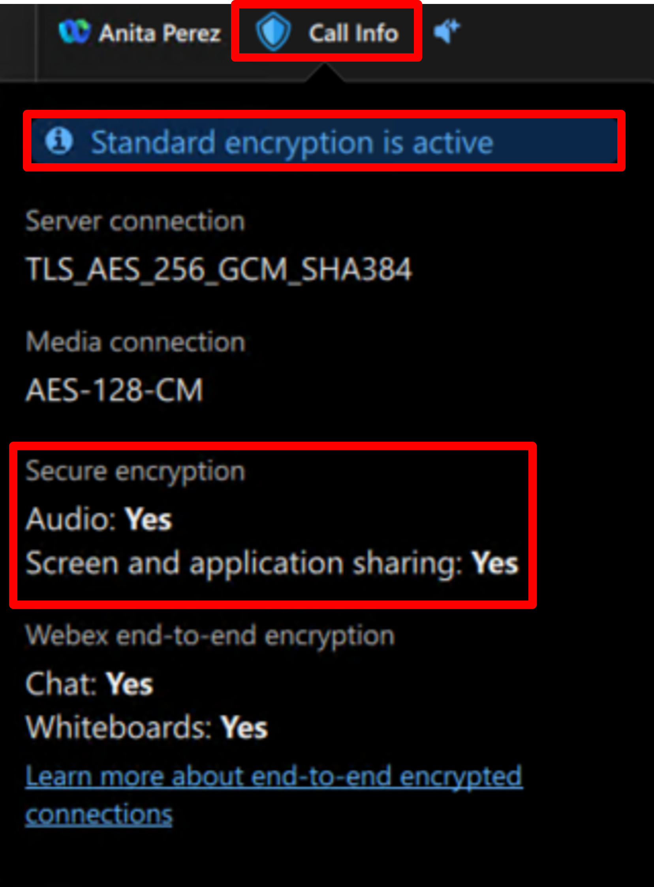

1. Upgrade call security from standard encryption back to zero trust E2EE.
	
     a. Return to Charle's Webex App on the local PC and click the recording button and then the **Stop** button. Note that the call immediately **upgrades security back to zero trust E2EE** - the blue shield icon reverts back to shield with lock, and the 'End-to-end encryption is active' message is again displayed.

      

      b. Click the 'X' button to hang up the zero trust E2EE Webex call.

This concludes Module 2

   
**\*\*\* END of MODULE 2 \*\***

Continue with either Module 1 or Module 3:

- [Module 1: Webex Identity](module1_identity.md)
- [Module 2: Zero Trust Encryption](module2_zero_trust_encryption.md) *(current)*
- [Module 3: Webex Compliance](module3_compliance.md)
- [Conclusion](conclusion.md)
