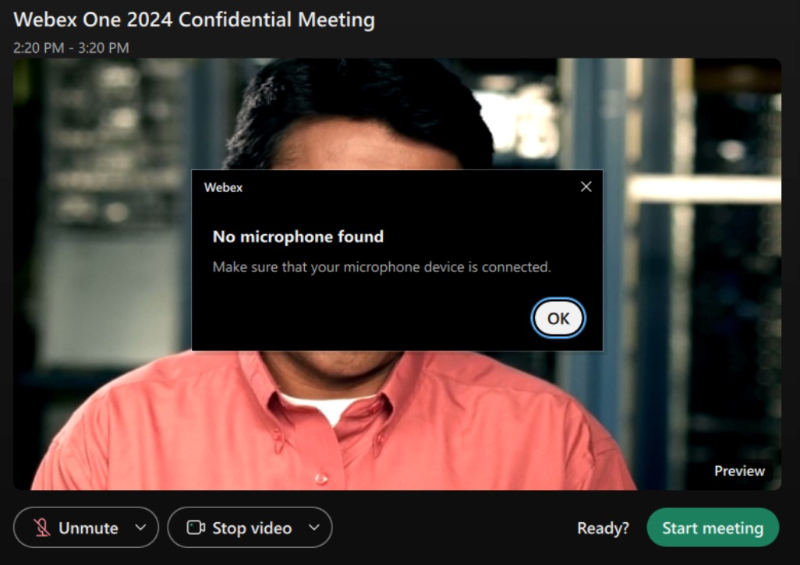
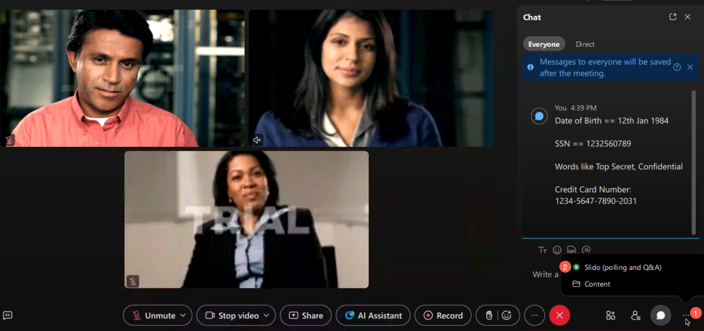
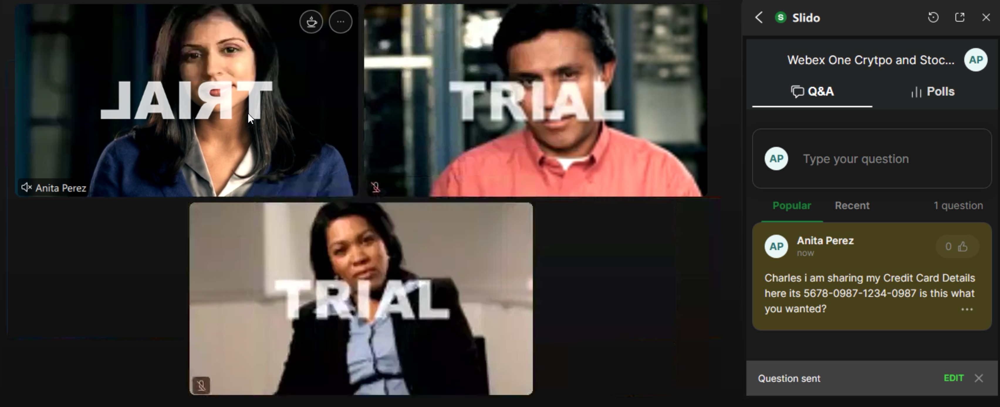
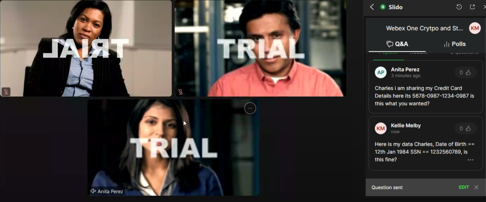
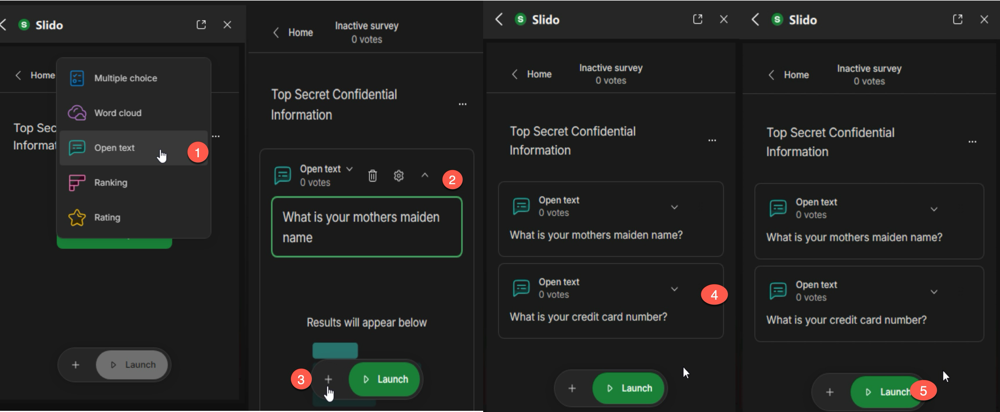
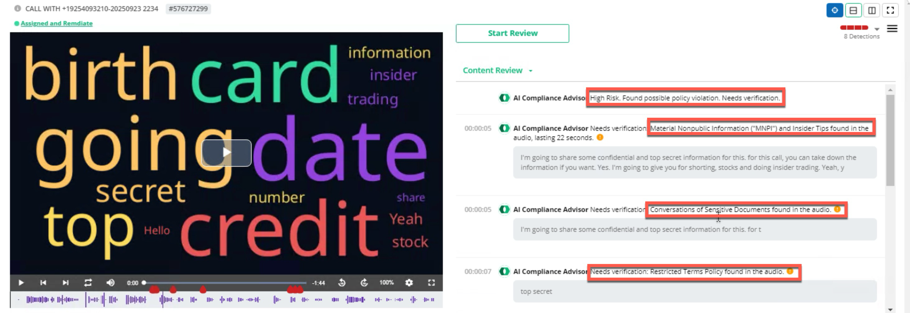

# Module 2: Webex Meetings, Calling, and Slido Compliance and End-to-End Encrypted Meetings with Zero Trust
In this module, you will learn about Zero-Trust End-to-End Encryption.
We will walk you through the process of verifying compliance policies
for your standard meetings, scheduling an end-to-end encrypted meeting,
verifying that meeting indeed is end-to-end encrypted, verifying
participants' identity, and finally setting up compliance policies for
your end-to-end encrypted meetings.

There are 7 sections in this module:

i. [Generating User Data for Compliance in Meetings](#generating-user-data-for-compliance-in-meetings)
THis is is a test line
ii. [Provision users and enable recording for Webex Calling for data compliance](#provision-users-and-enable-recording-for-webex-calling-for-data-compliance)

iii. [Explore Compliance Options for Webex Meetings in Theta Lake](#explore-compliance-options-for-webex-meetings-in-theta-lake)

iv. [Explore Compliance Options for Webex Calling in Theta Lake](#explore-compliance-options-for-webex-calling-in-theta-lake)

v. [Schedule an End-to-End Encrypted Meeting](#schedule-an-end-to-end-encrypted-meeting)

vi. [Features in an End-to-End Encrypted Meeting](#features-in-an-end-to-end-encrypted-meeting)

vii. [Audio and Visual Watermarking and Watermark Analysis](#audio-and-visual-watermarking-and-watermark-analysis)

## Generating User Data for Compliance in Meetings
**Step 1:**

1. In this section, you will learn how to configure Compliance and Supervision for Webex Meetings. Theta Lake provides AI-based archiving, eDiscovery, and supervision for Webex Meetings with automated detection of compliance risks in audio and visual content. Open a remote desktop session to WKST1, navigate to https://admin.webex.com and click **Sign in.** Enter the credentials for cholland, <cholland@cbXXX.dc-YY.com> and password **dCloud123!** (if you didn't complete module 1, refer to last 4 digits of the Session ID on eXpo dCloud Session View page for the non-SSO password).

1. Go to Services \> Meeting and copy the site name.

      { width="400" style="border: 1px solid #888; border-radius: 4px;" }

1. Open an instance of Chrome browser and navigate to the sitename e.g., cb46001.webex.com and log in with credentials for cholland, <cholland@cbXXX.dc-YY.com> and password **dCloud123!** (if you didn't complete module 1, refer to last 4-digits of Session ID on eXpo dCloud Session View page for the non-SSO password).

1. Click **Schedule** and then **Schedule a meeting**

      { width="400" style="border: 1px solid #888; border-radius: 4px;" }

1. Set your meeting type as **Webex Meetings Pro Meeting** and set a meeting topic. Invite Anita Perez and Kellie Melby.

      { width="400" style="border: 1px solid #888; border-radius: 4px;" }

      Click **Schedule** (or **Start**).

1. On WKST1, start the meeting from the Webex App. Click **OK** to the **Microphone Not Available** prompt and click on Start Meeting.

      { width="400" style="border: 1px solid #888; border-radius: 4px;" }

1. Click OK on the subsequent microphone warning once the meeting is launched.

      { width="400" style="border: 1px solid #888; border-radius: 4px;" }

1. Log in to **WKST2** and **WKST3** with Anita (aperez@cbXXX.dc-YY.com) and Kellie (kmelby@cbXXX.dc-YY.com) respectively and launch the Webex App. Click the green Join button to join the meeting.

      { width="400" style="border: 1px solid #888; border-radius: 4px;" }

1. On WKST1, click **Record the meeting** and save to the cloud option. Once Charles, Anita, and Kellie are in the meeting, open the in-meeting chat from any of the workstations and populate the chat with fake confidential or PII like date of birth, SSNs, credit card numbers, or keywords like Top Secret or Confidential.

      { width="400" style="border: 1px solid #888; border-radius: 4px;" }

      Example:

      { width="400" style="border: 1px solid #888; border-radius: 4px;" }

1. On **WKST1**, click the bottom-right ellipsis next to the chat button, then select **Slido (polling and Q&A)** and click **Open** to launch Slido.

      { width="400" style="border: 1px solid #888; border-radius: 4px;" }

1. Click **Open**

      { width="400" style="border: 1px solid #888; border-radius: 4px;" }

1. Click on **Create Slido**, click on **Add** and select **Audience Q&A**

      { width="400" style="border: 1px solid #888; border-radius: 4px;" }

      { width="400" style="border: 1px solid #888; border-radius: 4px;" }

1. Navigate to WKST2 (Anita) and WKST3 (Kellie), launch Slido (if it's not already launched) and ask questions that contain sensitive data.e.g. from Anita's WKST2, you can this question "Charles, I am sharing my Credit Card Details here. It is 5678-0987-1234-0987 - is this what you wanted?"

      { width="400" style="border: 1px solid #888; border-radius: 4px;" }

1. From Kellie's WKST3 ask the following question as e.g. "Here is my data, Charles. Date of Birth == 12th Jan 1984 SSN == 123-25-6078, is this fine?"

      { width="400" style="border: 1px solid #888; border-radius: 4px;" }

1. Now that we have provided Input on Q&A, lets launch a poll and share sensitive data.

1. Navigate to WKST1 and click on home in the Slido panel and then Add and Select Survey. Slido offers multiple poll options like Word Cloud, Multiple Choice, Quizzes, Ranking, Ratings and Surveys along with Open Text. For the lab select **Survey**. Then, select any option, and populate it with sensitive data.

      { width="400" style="border: 1px solid #888; border-radius: 4px;" }

1. Add a couple of questions to the survey and click **Launch** to start the survey.

      { width="400" style="border: 1px solid #888; border-radius: 4px;" }

1. Go to WKST2 and WKST3 and provide fake sensitive data for the questions asked like "Mothers Maiden Name" and "Credit Card Numbers". Once you have provided the inputs, from WKST1, click on Deactivate Survey and close the Slido App Panel.

      { width="400" style="border: 1px solid #888; border-radius: 4px;" }

1. The poll has confidential and sensitive information like a mother's maiden name, and credit card number. This simulates end users sharing confidential or proprietary information and demonstrates how compliance platforms like Theta Lake effectively identify and act on the offense. End the meeting from WKST1 by clicking on Red "X" and Select "End Meeting for all".

## Provision users and enable recording for Webex Calling for data compliance.
In this section, we shall setup the users with Webex calling, enable the native recording capability now available with Webex.

1. RDP to WKST1, navigate to admin.webex.com and click on Sign in with credentials for cholland, <cholland@cbXXX.dc-YY.com> and password dCloud123! (if you didn't complete module 1, refer to last 4-digits of Session ID on eXpo dCloud Session View page for the non-SSO password).

1. Navigate to Services > Calling > Service Settings

      { width="400" style="border: 1px solid #888; border-radius: 4px;" }

1. Scroll to call recording and select Provider as Webex, Storage region as United States along with Call recording failure settings to Proceed with the call with announcement, select the compliance announcements to Play Announcements for inbound as well as outbound PSTN calls.

      { width="400" style="border: 1px solid #888; border-radius: 4px;" }

      Click **Save** to save these settings.

1. Now let's allocate Webex calling Professional licenses for two users Ricardo Filice and Eric Steele.

1. Navigate to Management tab on the left and the Users option. Search for
Eric Steele and under the Summary tab, navigate to Licenses and select
Edit Licenses.

      { width="400" style="border: 1px solid #888; border-radius: 4px;" }

1. Select Edit Licenses on the next screen, go to calling and uncheck Call on Webex (1:1 call, non-PSTN) to Webex Calling option at the bottom and select Webex Calling Professional. For the purposes of this lab, you don't need to select Attendant Console and click Save.

      { width="400" style="border: 1px solid #888; border-radius: 4px;" }

1. Let's assign a calling number to Eric, in the Location Drop-down select DCloud, Phone Number leave as is and in extension provide an extension number to Eric e.g. in the screenshot, I have provided 5001 and hit Save.

      { width="400" style="border: 1px solid #888; border-radius: 4px;" }

1. Perform the same steps for Ricardo Filice (rfilice) and assign him
extension 5002.

For this lab, we are not setting up PSTN either via Local GW or Cisco
Calling plans, the aim of this module is to showcase the built-in call
recording capability now available for our calling platform in addition
to meetings.

Next, you'll use the login credentials of the **read-only compliance
officer account** to see sample data that we have compiled in a Theta
Lake tenant over the last year, including data that matches the test
meeting you just scheduled and attended.

In the subsequent two modules we shall cover with examples how Theta
Lake can flag compliance issues in Meetings, Calling, Slido Polling and
Q&A.

## Explore Compliance Options for Webex Meetings in Theta Lake

We want you to spend some time reviewing some of the compliance options for Webex meetings available via Theta Lake.

Theta Lake can process data from in-meeting chat, polls, Q&A, shared
files, and other meeting content (like the data you just generated).
Theta Lake can also detect content from users' audio/video streams such
as, files shared visually or verbally during the meeting (e.g., an
attendee holding a paper with sensitive information written on it or
verbally mentioning credit card numbers/SSN/DOB). You will learn how Theta Lake can help us flag these violations as well.

**Step 1:**

1. Navigate to <https://useast.thetalake.ai/#/users/login> on WKST1. Log in with read-only Compliance Officer credentials (**co.read.only@gmail.com** // **dCloud123!)**. You will find pre-populated data that demonstrates some of the violations and types of data that Theta Lake can process. Once logged in click the **Search** tab, enter the search term **Poll**, and click the green **Search** button. Note: the screenshot below is using the **Table** viewing format. This can be found on the right side of the screen near the **Sort by** option.

      { width="400" style="border: 1px solid #888; border-radius: 4px;" }

1. Explore and review few records that have Meeting Poll and repeat the process by changing Poll to "Q&A".

      { width="400" style="border: 1px solid #888; border-radius: 4px;" }

      { width="400" style="border: 1px solid #888; border-radius: 4px;" }

1. Close the Poll Search by clicking on the "x" next to search.

      { width="400" style="border: 1px solid #888; border-radius: 4px;" }

      In the left-hand navigation menu, under the **FAVORITES** section, click **Policy Hits**. In the resulting dialog box, scroll through the drop-down menu and select the following built-in detection rules then click **Apply**:

      **Credit Card Number (CC#) -- Audio, Chat, Attachment, and EmailsCryptoCurrency Discussions -- Video, Audio, Chat, Attachment and Emails** **Social Security Numbers(SSN) -- Audio, Chat, Attachment and Emails**

      { width="400" style="border: 1px solid #888; border-radius: 4px;" }

1. Scroll down to the **Media** category in the left-hand navigation menu and click to expand the filter. Click **Media Type** and tick the boxes for **Audio** and **Video** then click **Apply**.

      { width="400" style="border: 1px solid #888; border-radius: 4px;" }

1. Select any meeting, you will observe a recording of the meeting and flags where the users have violated policies. You can use **Record ID** 576714780 as an example.

      { width="400" style="border: 1px solid #888; border-radius: 4px;" }

      If you are reviewing record 576714780, scroll to approximately 7 minutes and 06 seconds into the meeting and you will see that Theta Lake has the ability to flag documents held up to the screen containing PII and confidential data.

      Feel free to take a few minutes and review a couple more records for various other compliance policy violations to get a good understanding of Theta Lakes detection capabilities.Once you have completed reviewing the options, clear out all the filters that you have selected by clicking "Clear All" on the top left of the screen.

      { width="400" style="border: 1px solid #888; border-radius: 4px;" }

We want you to spend some time reviewing some of the compliance options
for Webex Calling available in Theta Lake.

## Explore Compliance Options for Webex Calling in Theta Lake

Theta lake offers Compliance and Security for Webex Cloud Calling &
Customer Assist. Theta Lake's turn-key archiving, compliance,
surveillance, and data security products natively integrate with the
Webex Suite, with comprehensive support for Webex Calling, including
Webex Cloud Calling, Business Texting (SMS), Voice Recordings, and Call
Detail Records (CDRs).

In this section you will learn how to configure Compliance and
Supervision for Webex Calling using Theta Lake. Theta Lake provides
AI-based archiving, eDiscovery, and supervision for Webex Calling with
automated detection of compliance risks in audio content.

**Step 1:**

1. Navigate to <https://useast.thetalake.ai/#/users/login> on WKST1. Log in with read-only Compliance Officer credentials (**co.read.only@gmail.com** // **dCloud123!)**. You will find pre-populated data that demonstrates some of the violations and types of data that Theta Lake can process. Once logged in, navigate to Search. Click on Webex Calling option and click on the Media Type option and select Audio and select Apply. Next, click Webex Calling to add a platform filter. Note: the screenshot below is using the **Table** viewing format. This can be found on the right side of the screen near the **Sort by** option.

      { width="400" style="border: 1px solid #888; border-radius: 4px;" }

      { width="400" style="border: 1px solid #888; border-radius: 4px;" }

1. Explore and review few records that have been filtered.

      { width="400" style="border: 1px solid #888; border-radius: 4px;" }

1. I have 4 records here, traditionally these records are pairs, let's take an example record 576727299 and record 576727182, where one of is the CDR record / call details and the second one being capture of the actual call and flagged for compliance violations.Looking at record 576727182, click on the record > Content Review and Attributes. You will see that this record has CDR information and other call attributes.

      { width="400" style="border: 1px solid #888; border-radius: 4px;" }

1. Now let's look at record 576727299, you will observe a recording of the audio call and flags where the users have violated policies.

      { width="400" style="border: 1px solid #888; border-radius: 4px;" }

1. Feel free to take a few minutes and review a couple more records for various other compliance policy violations to get a good understanding of Theta Lakes detection capabilities.This concludes the compliance for Webex calling module, before you move to the next section ensure that you have cleared any filters and log out of Theta Lake.

## Schedule an End-to-End Encrypted Meeting

In this section, you will learn how to schedule an E2EE meeting and learn the benefits and features of an E2EE meeting.

Before proceeding with the configuration, it's important to understand
how an E2EE meeting works at a high level. End-to-end encrypted meetings
are designed to ensure that meeting content can only be accessed by the
desired parties. The meeting content encryption key is generated by the
meeting host, encrypted with media encryption key, and shared with other
participants. Webex cloud services DO NOT have access to content
encryption key. Without the encryption key, Webex cannot decrypt any of
the meeting content, so features like meeting chat transcripts, files, whiteboards, annotations, and recordings are not available when the meeting ends.

{ width="400" style="border: 1px solid #888; border-radius: 4px;" }

Features that can be provided by processing information locally device are available in End-to-End encrypted meetings:

- Audio and video watermarking
- Face and gesture recognition
- Room interpretation
- People presence detection
- Proximity pairing
- Background noise removal

Additionally, E2EE meetings are available to enterprise and consumer
customers and are supported by the Webex App (desktop and mobile) and
Webex devices with up to 1000 participants.

Before you start this section, lets enable watermarking capabilities in Control Hub, you will need it for the next section.

1. Log in to **WKST1** as **dCloud\\cholland** and **dCloud123!**. Open an instance of Chrome and navigate to <https://admin.webex.com/>. Login with Charles Holland's Webex credentials (if you didn't complete module 1, refer to last 4-digits of Session ID on eXpo dCloud Session View page for the non-SSO password. In **Control Hub**, navigate to **Organization Settings** and scroll down to the option for 'Add an audio watermark' and 'Show visual watermarks' and enable them. Enable all the three options below 'Show visual watermarks'. Click **Save**.

      { width="400" style="border: 1px solid #888; border-radius: 4px;" }

      This will enable the digital watermarking option to present itself to users when scheduling meetings of supported types. Please note that it will take some time in some cases about 15 minutes for the option to appear for end users once enabled in Control Hub.

      You will now schedule an end-to-end encrypted meeting.

1. RDP to WKST1, navigate to admin.webex.com and click on **Sign in** with credentials for cholland, <cholland@cbXXX.dc-YY.com> and password **dCloud123!** (if you didn't complete module 1, refer to last 4-digits of Session ID on eXpo dCloud Session View page for the non-SSO password).

      Go to Services\--\>Meeting and copy the site name.

      { width="400" style="border: 1px solid #888; border-radius: 4px;" }

1. Open an instance of Chrome browser and navigate to the sitename e.g. cb46001.webex.com and sign in with credentials for cholland, cholland@cbXXX.dc-YY.com and password dCloud123! (if you didn't complete module 1, refer to last 4-digits of Session ID on eXpo dCloud Session View page for the non-SSO password). Click Schedule \> Schedule a meeting, set the meeting type to **Webex Meetings Pro-End to End Encryption_VOIPonly**.

      { width="400" style="border: 1px solid #888; border-radius: 4px;" }

1. Set a **Meeting topic, Date/Time**, and invitees (Anita Perez <aperez@cbXXX.dc-YY.com> and Kellie Melby <kmelby@cbXXX.dc-YY.com>).

      { width="400" style="border: 1px solid #888; border-radius: 4px;" }

      { width="400" style="border: 1px solid #888; border-radius: 4px;" }

1. Click on **Schedule** and click **Start**. Click 'Open Webex' to start the meeting in the Webex App.

      { width="400" style="border: 1px solid #888; border-radius: 4px;" }

1. To start, let Charles be the only participant in the meeting. Click OK on the **No Microphone found** prompt and Click on Start Meeting.Click OK on the "No Microphone found" after starting the meeting. Observe the blue shield icon at the top left of the meeting window, the padlock indicates that this is an E2EE meeting.

      { width="400" style="border: 1px solid #888; border-radius: 4px;" }

1. In the meeting window, click the **Meeting Info** option and then **Security**. Ensure that you are seeing the security code, the server connection as **TLS with AES-256-GCM-SHA384**, and Media connection is **AEAD-AES-256-GCM**.

      { width="400" style="border: 1px solid #888; border-radius: 4px;" }

      Make a note of the security code.

      Navigate to the Participants Tab and click on the "i" icon next to Charles's name. You will see the certificate and therefore the identity of Charles is verified by **Webex**. You can click the "i" to see the certificate information.

      { width="400" style="border: 1px solid #888; border-radius: 4px;" }

1. Now login to **WKST2** with **dcloud\\aperez** (password **dCloud123!**). Launch the Webex App and login with [**aperez@cbXXX.dc-YY.com**](mailto:aperez@cbXXX.dc-YY.com) and password **dCloud123!** (if you didn't complete module 1, refer to last 4-digits of Session ID on eXpo dCloud Session View page for the non-SSO password). You will see the Join meeting notification:

      { width="400" style="border: 1px solid #888; border-radius: 4px;" }

1. Click on **Join**, click **OK** in the **No microphone found** prompt. Click Join Meeting to enter the meeting.

      Click on **Meeting Info** then select **Security** and observe the security code. It has changed now that a new attendee has joined. Feel free to verify the certificate for Anita.

      Login to **WKST3** with **dcloud\\kmelby** (password provided in the pod sheet). aunch the Webex App and login with kmelby[**\@cbXXX.dc-YY.com**](mailto:aperez@cbXXX.dc-YY.com) and password **dCloud123!** (if you didn't complete module 1, refer to last 4-digits of Session ID on eXpo dCloud Session View page for the non-SSO password). You will see the Join meeting notification, join the meeting by clicking on the green **Join** button.

      Click on **Meeting Info \> Security** and verify that the security code has changed again. Feel free to verify the certificate for Kellie.

      **Note: Message Layer Security (MLS)** uses key packages to identify users and to generate new meeting encryption keys as participants join the meeting. Note that, like the meeting security code, the meeting encryption key changes every time a new participant joins the end-to-end encrypted meeting.

Each MLS key package contains:

- Participant's Identity Info & Public Key (Verified Credentials/certificate).
- A tree hash value that represents the cryptographic group state and credentials of the group members (meeting participants).
- An identifier for the current version of the meeting encryption key.
- A new meeting encryption key is created when participants join or leave the meeting.

**Note: Secure Frames:** Secure Media Frames provide an extra layer of authenticated encryption for media.

The whole media frame is encrypted before being placed into individual SRTP payloads. SFrames use MLS to provide the encryption keys that each meeting participant needs to decrypt media.

{ width="400" style="border: 1px solid #888; border-radius: 4px;" }

## Features in an End-to-End Encrypted Meeting

In this section, you will learn some features that are made available in an End-to-End Encrypted (E2EE) meeting.

1. Record the Meeting: Navigate to WKST1 and open the meeting that is still in progress. Click the record button. The only option that is made available is 'Save to my computer'. There is no cloud recording option available because Webex does not have access to the media encryption keys needed to decrypt the media:

      { width="400" style="border: 1px solid #888; border-radius: 4px;" }

      Note the message that displays when you hover over the Record button indicating that AI summaries are only available for cloud-based recordings. Since the only option here is to record to the local computer, AI meeting summaries won't be available.This is important point to remember about end-to-end encrypted meetings.

      { width="400" style="border: 1px solid #888; border-radius: 4px;" }

1. Connect to a Video System: In an E2EE meeting, Cisco video devices (RoomOS) can seamlessly join a meeting. In this lab, there are no video endpoints available for testing. However, you should know that Cisco video devices (RoomOS) can join an E2EE meeting. Refer to the screenshots below showing a video device joining a meeting and the identity certificate issued to the device.

      { width="400" style="border: 1px solid #888; border-radius: 4px;" }

      { width="400" style="border: 1px solid #888; border-radius: 4px;" }

1. Click the arrow next to the Unmute button to review. Audio Options: Zero Trust E2EE meetings do not give Webex access to meeting encryption keys. This means that cloud services and endpoints that need to decrypt meeting content cannot participate in E2EE meetings: e.g., PSTN and SIP endpoints. So, the only audio-only option available is a computer running the Webex App.

      { width="400" style="border: 1px solid #888; border-radius: 4px;" }

1. Webex Smart Audio: Webex Smart Audio and noise removal is available in an E2EE meeting because the processing for this feature is handled locally on the device.

      { width="400" style="border: 1px solid #888; border-radius: 4px;" }

1. Gestures and Reactions: Gestures and reactions are available in an E2EE meeting.

      { width="400" style="border: 1px solid #888; border-radius: 4px;" }

1. Raise hand is available in an E2EE Meeting from both the Webex app and the video endpoint.

      { width="400" style="border: 1px solid #888; border-radius: 4px;" }

1. On WKST1, navigate to the desktop, there is PowerPoint presentation called presentation.pptx, launch the presentation.

      { width="400" style="border: 1px solid #888; border-radius: 4px;" }

1. Return to Webex App and click on share, select Show me in Front of Presentation and select Microsoft PowerPoint from the options and click Share.

      { width="400" style="border: 1px solid #888; border-radius: 4px;" }

      { width="400" style="border: 1px solid #888; border-radius: 4px;" }

1. Stop Sharing and finally the end the meeting for All.

## Audio and Visual Watermarking and Watermark Analysis
In this section, you will learn how watermarking can help with data
leak protection. Audio and visual watermarking can help identify the
source of unauthorized recordings, images, captures of confidential
meetings.

**Audio Watermark**

The audio watermark feature can't identify the person responsible for recording the meeting, but it can help identify the source client or device that was recorded.

Feature details:

- Add a unique identifier (indiscernible, hidden watermark) for each client or device in a watermarked meeting.
- Available with all Meetings.
- Admin can control availability of the audio watermarking feature for their organization.
- Admin can upload media files for watermark analysis via Control Hub to identify the source client or device that was recorded.
- Admin can get details of the meeting from identified watermarks, such as meeting number, host name, etc.
- Admin can only analyze watermarks for meetings hosted in their organization.
- Watermark information is retained for the same duration as the organization's meeting information.

**Visual Watermark**

- Visual watermarks superimpose a watermark image over the meeting video and shared content. Each meeting participant sees a watermark image with their own email address. If a meeting participant isn\'t signed in to Webex, the watermark includes their display name and email address. Users can adjust the watermark opacity, so the pattern is visible but doesn\'t cause too much distraction.
- Local recordings are disabled when audio watermarks are turned on.

Let's look at enabling and testing these features: We have already
enabled the Control Hub Toggles for these features at the beginning of
the module.

**Step 1: Audio Watermarking**

1. If not already logged in, log in to **WKST1** as **dCloud\\cholland** and **dCloud123!** Launch the Webex App and go to Meetings. Click on Schedule a Meeting and invite Anita and Kelly to the meeting. Ensure that the meeting link is set to "Generate a one-time meeting link"

      { width="400" style="border: 1px solid #888; border-radius: 4px;" }

1. Click on Advanced Settings. Select the Security tab on top and select the tick for Add watermarks to meeting audio.

      { width="400" style="border: 1px solid #888; border-radius: 4px;" }

1. Pay close attention to the capabilities available with watermarking.

      { width="400" style="border: 1px solid #888; border-radius: 4px;" }

      Click on the arrow next to Advanced Settings on the top of the window to return to basic settings.

      { width="400" style="border: 1px solid #888; border-radius: 4px;" }

1. Click on Schedule, there is no need to start the meeting as you shall
use a shared org to test watermark analysis.

**For the purpose of this lab and the practicality of multiple participants
recording audio simultaneously for testing this feature, the below part
is review only. Please see a proctor to get an audio file for testing
with a shared org in Step 2 below.**

*There are many factors involved in successfully decoding a recorded
watermark. These include distance between the recording device and the
speaker outputting the audio, audio volume, environmental noise,
etc.*

*Webex watermarking has additional resiliency to being encoded multiple
times as might happen when the media is shared. The goal of the feature
is to enable a successful decode of the watermark identifier in a broad
but reasonable set of circumstances. The goal is that a recording
device, such as a mobile phone, laying on a desk near a personal
endpoint or laptop client will create a recording that yields a
successful analysis. As the recording device is moved away from the
source or obscured from hearing the full audio spectrum it will degrade
the chances of a successful analysis. In summary, the recording device
needs a reasonable capture of the meeting audio. If a user captures the audio on the computer that is hosting the client, then no limitations should apply.*

Once about 90 seconds have elapsed, end the meeting and the stop the recording.

**Step 2: Watermark Analysis:**

Next, you will analyze if the watermarks are present in the recording.

1. Please reach out to one of the proctors for an audio file for analysis.

1. If not already logged in, log in to **WKST1** and open an incognito
instance of Chrome.

1. If you haven\'t received the file, please do not proceed to step 4.

      Navigate to admin.webex.com and login with **cholland@cb460.dc-01.com** and password as **dCloud8088!** - (please note this is a shared instance that will be used by other attendees, kindly do not make any changes).

      In **Control Hub**, navigate to **Troubleshooting** listed in the sidebar.

      Select the **Watermark Analysis** tab and select Analyze File.

      The **Analyze audio watermark** popup allows you to provide a name e.g., Pod1watermark for the analysis and some additional notes to help associate this request to any internal investigation case or point of contact. The file requirements are listed on the dialog and as of this writing we are guiding to a minimum supported length of 90 seconds.

      { width="400" style="border: 1px solid #888; border-radius: 4px;" }

1. The following audio file formats are supported: .wav, .aac, .mp3, .mp4, .avi or .mov. Upload the recorded meeting .mp4 file to the analysis tool and provide an **Analysis name** and **note** for reference:

      { width="400" style="border: 1px solid #888; border-radius: 4px;" }

1. The dialog will guide you through the process. Once the upload has completed, click **Close**. The analysis depends on the size of the file. After a short delay, you should see that the analysis is complete.

      Note that since other lab attendees are also uploading files you may see multiple instances of watermark analysis in the list.

      { width="400" style="border: 1px solid #888; border-radius: 4px;" }

1. Now, if the meeting recording was leaked, or if someone was recording the meeting using a phone or other source, an administrator could use this feature to determine which user's device, or location may have been compromised during the meeting. When you click on the analyzed file you will quickly see the leak / watermark source where this mp4/mp3 file originated from.

      { width="400" style="border: 1px solid #888; border-radius: 4px;" }

      When Audio Watermarking is enabled, the meeting audio includes a unique identifier for each participant. An administrator can upload audio recordings to Control Hub where an analysis is performed, and these watermarks can be detected.

      - To be analyzed, the recording must be an AAC, MP3, M4A, WAV, MP4, AVI, or MOV file no larger than 500MB.
      - The recording must be longer than 90 seconds.
      - You can only analyze recordings for meetings hosted by users in your organization.
      - Analyzed recordings are deleted as soon as the analysis is complete.

1. Logout of the test control hub and use the login credentials provided
in your eXpo dCloud Session for the subsequent sections.

**Step 3: Visual Watermarking**

1. If not already logged in, log in to **WKST1** as **dCloud\\cholland** and **dCloud123!** (if you didn't complete module 1, refer to last 4-digits of Session ID on eXpo dCloud Session View page for the non-SSO password).

1. If required, launch the Webex App and go to Meetings. Click on Schedule a Meeting and invite Anita and Kelly to the meeting. Ensure that the meeting link is set to "Generate a one-time meeting link"

      { width="400" style="border: 1px solid #888; border-radius: 4px;" }

1. Click on Advanced Settings. Select the Security tab on top and select the option for "Add Visual watermarks to participant videos and shared content".

1. There is a slider to adjust the watermark's opacity level with a preview of what the watermark will look like. This gives you control over how visible the watermark will be during a meeting. Lower opacity means less distraction for meeting participants, while higher opacity shows a much clearer watermark. Set the opacity level to higher than 50%.

      { width="400" style="border: 1px solid #888; border-radius: 4px;" }

1. Click on the arrow next to Advanced Settings on the top of the window to return to basic settings.

      { width="400" style="border: 1px solid #888; border-radius: 4px;" }

1. Click on **Schedule** and click on **Start meeting**.

      { width="400" style="border: 1px solid #888; border-radius: 4px;" }

1. Click **OK** in the Microphone Not Available prompt. Click 'Start meeting' to launch the meeting.

      Login to WKST2 with Anita and WKST3 as Kellie and join the meeting.

      Navigate to WKST1 and explore the recording capabilities. Only cloud recording capabilities are available when visual watermarks are enabled. Once enabled for a meeting during scheduling, the visual watermark feature cannot be turned off. To have a meeting without visual watermarking, a new meeting must be scheduled. If a user is on an older version that does not support visual watermarking and attempts to join a meeting where it is required, they will not be allowed to join the meeting. Local recording is always disabled when visual watermark is turned on for a meeting.On WKST 1, share a document named presentation.pptx, now navigate to WKST2 and see that the watermark is present on the shared content. This provides traceability of the data loss to the source that captured or took screenshots.

      { width="400" style="border: 1px solid #888; border-radius: 4px;" }

      End the meeting for all.
   
**\*\*\* END of MODULE 2 \*\***

Continue with either Module 1 or Module 3:

- [Module 1: Webex Identity](module1_identity.md)
- [Module 2: Zero Trust Encryption](module2_zero_trust_encryption.md) *(current)*
- [Module 3: Webex Compliance](module3_compliance.md)
- [Conclusion](conclusion.md)
