# Module 3: Webex Compliance with Webex and Theta Lake
In this module, you will examine Webex compliance features and capabilities for meetings and calling including eDiscovery and Archiving on an external compliance platform. You will also explore eDiscovery

There are 3 sections in this module:

i. [Webex Compliance and Preparing for Compliance Platform Integration](#webex-compliance-and-preparing-for-compliance-platform-integration)

ii. [Explore eDiscovery for Webex Meetings in Theta Lake](#explore-ediscovery-for-webex-meetings-in-theta-lake)
<!--[Integrate Webex with Cloudlock and Configure DLP Policies](#integrate-webex-with-cloudlock-and-configure-dlp-policies)-->

iii. [Explore eDiscovery for Webex Calling in Theta Lake](#explore-ediscovery-for-webex-calling-in-theta-lake)
<!--[Generate user data via Webex App and Observe DLP Operation](#generate-user-data-via-webex-app-and-observe-dlp-operation)-->

<!--iv. [Explore Theta Lake eDiscovery and Legal Hold](#explore-theta-lake-ediscovery-and-legal-hold)

v. [Observe Webex Anti-Malware Protection (AMP)](#observe-webex-anti-malware-protection-amp)-->

Compliance integrations are critical for protecting an organization's private data from leakage and ensuring that it complies with appropriate rules and laws related to maintaining business and communication records.

Webex supports both built-in compliance capabilities as well as API-based 3rd party integrations. Specifically:

- Webex provides a set of basic built-in compliance capabilities for **data loss prevention (DLP), eDiscovery/Legal Hold, and data retention (archive)**.
- Webex also integrates with 3rd party DLP, eDiscovery/Legal Hold, and Archiving applications and services for advanced compliance capabilities including automatic remediation.
- Integrations with compliance services rely on **Webex Events API** to deliver message and meeting data to compliance services.

In this module you will examine the following product-specific capabilities:

- Webex built-in compliance capabilities including:
      - Archiving with flexible data retention.
      - External communication controls, and calling and meeting specific collaboration restrictions.

- Other compliance products:
      - Theta Lake -- Archiving, eDiscovery, Legal Hold

The figure below summarizes the Webex Events API method for compliance platform integration as well as the various platforms explored in this lab and their high-level capabilities. The Webex Events API provides a polling mechanism for compliance platforms to pull user-generated data from Webex for archiving, eDiscovery, and data loss prevention (DLP). In the case of DLP, the compliance platform uses additional Webex APIs to remediate policy violations. 

**Webex Events API for Compliance Platform Integration**

<!-- Webex has also introduced Webhooks capability enabling proactive notification of messaging events (e.g., messages with file attachments) to a configured Webhook (web URL). This proactive notification provides a framework for delivering real-time file DLP -- scanning files for compliance policy violations before allowing them to be sent/received via messaging.

As shown in the figure below, once notification via the Webhook is received at the
compliance platform web service (step 1), the DLP retrieves the file
(step 2) and can then take action (e.g., scan file) and notify Webex via
API whether to allow or block the file (step 3). 

**Webex Webhooks for Real-time File DLP**

Unlike the Webex Events API method for compliance where the compliance platform must periodically poll Webex for communications events (space creation, space membership, messages, file attachments, meetings, etc.) and then take action, Webhooks enable real-time notification of events without having to wait for the next polling interval, so the compliance platform DLP service can take immediate action. Cisco Cloudlock supports real-time file DLP for Webex with Webhooks.-->

Webex Events APIs as well as remediation APIs require administrators to have the Compliance Officer role to enable and authorize these operations.

For more information for Webex compliance with Webex APIs, please refer to the Webex for Developers site for documentation including:

- Compliance and Events: <https://developer.webex.com/compliance/docs/compliance>
- Webex Events API: <https://developer.webex.com/admin/docs/api/v1/events>
- Webex Messages API: <https://developer.webex.com/messaging/docs/api/v1/messages>
- Webex Meetings API: <https://developer.webex.com/docs/api/v1/meetings>
- Webex Calling API: <https://developer.webex.com/calling/docs/webex-calling-overview>

This lab guide contains coverage for external compliance platform Theta Lake.

**Table 2: Compliance Platform Options, Capabilities, and Applicable sections of this Module**

| Compliance Platform | Capabilities Explored | Module Sections |
|---------------------|----------------------|-----------------|
| **Webex (built-in)** | - Data retention - External communications - Collaboration restrictions | [Webex Compliance and Preparing for Compliance Platform Integration](#webex-compliance-and-preparing-for-compliance-platform-integration) |
| **Theta Lake** | - eDiscovery & Legal Hold - Archival | [Explore eDiscovery for Webex Meetings in Theta Lake](#explore-ediscovery-for-webex-meetings-in-theta-lake)   [Explore eDiscovery for Webex Calling in Theta Lake](#explore-ediscovery-for-webex-calling-in-theta-lake) |

## Webex Compliance and Preparing for Compliance Platform Integration
1. Enable compliance officer role for user Anita Perez.

      To integrate compliance platforms with Webex, a full administrator with Compliance Officer privileges is required. This role gives the user permissions for DLP integrations, eDiscovery/Legal Hold, and retention and archival integrations. In this step you are assigning the organization Compliance Officer role to Anita Perez.

      Any full administrator can assign the compliance officer role to any person within their organization. However, full administrators <u>cannot</u> assign the Compliance Officer role to themselves, another full administrator must assign the role to them.

      To begin, connect to WKST1. Login will be as Charles Holland (dcloud\\**cholland** // **dCloud123!**).

      a. Open the Chrome browser on WKST1 (wkst1.dcloud.cisco.com) and navigate to Webex Control Hub at <http://admin.webex.com>.

      b. Login as full administrator, Charles Holland by entering: cholland@cb**XXX**.dc-**YY**.com (refer to the eXpo dCloud Session View Info page to find your DNS domain). Click **Sign In**.

      
   
     <!-- (Replace XXX and YYY with the values for your eXpo dCloud pod)-->

      c. Enter password: **dCloud123!** (if you did not complete Module 1 and enable SSO, then the password will be dCloud**ZZZZ**! replacing 'ZZZZ' with the last four digits of the dCloud session ID, refer to the eXpo dCloud Session View Info page for your session ID).

      

       d. Once logged in, navigate to **Users** and select Anita Perez.

      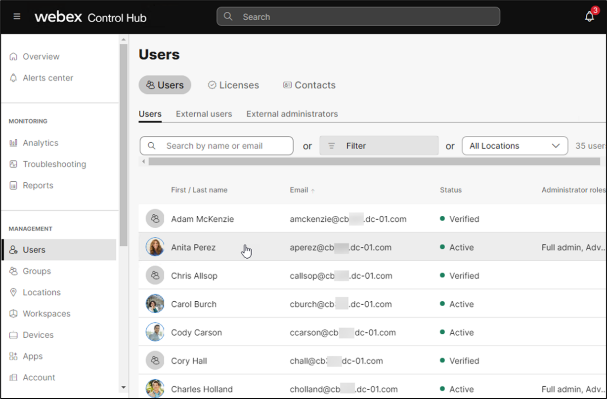

      e. Scroll down and click Administrator roles.

      f. Promote Anita Perez to Compliance Officer for the organization by ticking the box next to 'Compliance officer'. Click **Save**.

      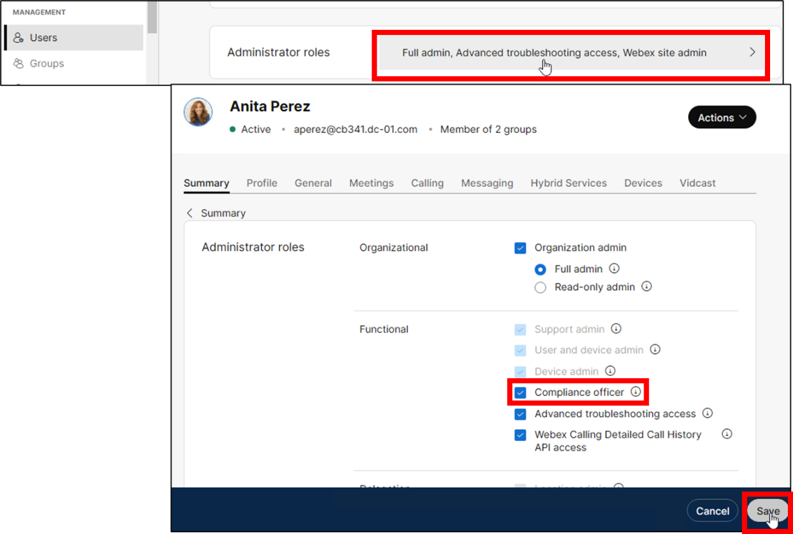

1. Review retention settings for Webex Messaging, Meetings, and Calling.

      One of the first compliance considerations is data retention. How long should data be retained before it is deleted? It's important for the compliance officer to understand the retention policies of the organization and to configure Webex to match these policies.

      Before proceeding, **move to WKST2** (wkst2.dcloud.cisco.com). If not already connected, connect to WKST2. Login will be as Anita Prerez (dcloud\\**aperez** // **dCloud123!**).

      a. Open the Chrome browser on WKST2 (wkst1.dcloud.cisco.com) and navigate to Control Hub at <https://admin.webex.com>.

      b. Login to Control Hub as the compliance officer, Anita Perez by entering: aperez@cb**XXX**.dc-**YY**.com <!--(refer to eXpo dCloud session info page for the DNS domain).--> Click **Sign In**.

      c. Enter password: **dCloud123!** (non-SSO password is dCloud**ZZZZ**! - refer to eXpo dCloud session info page for the session ID and use the last 4 digits to replace 'ZZZZ').

      d. Once logged in, navigate to Organization Settings. In the search window at the top of the page, enter 'Retention' to locate the retention settings. Notice there are separate retention policies for Webex Messaging (messages, files), Webex Meetings (recordings, transcripts, chats, Q&A, whiteboards, polls, etc.), and Webex Calling (recordings).

      

      e. Click **Settings** under Webex App Messaging Retention Policy to review current messaging retention settings.

      

      By default, the retention period is set to 360 days. Notice that separate retention periods can be set for 1:1 chat and group chat.

      For the purposes of this lab, there is no reason to change the message retention policy, so click **Cancel** to close the Webex Space retention policy window.

      f. Click **Settings** under Webex Meetings Retention Policy to review current meeting retention settings.

      

      By default, the retention period is set to 360 days. Note that recording retention can be set to purge in 30 days, but by default the recordings follow the meetings retention policy. For the purposes of this lab, there is no reason to change the meeting retention policy, so just click **Cancel** to close the Webex Meetings Retention Policy window.

      g. Click **Settings** under Webex Calling Retention Policy to review current calling retention settings.

      

      By default, the retention period for call recordings is set to 360 days. Notice that deleted recordings can be set to match the recording rentention period, but by default deleted recordings are set to purge immediately. Note that call details records (CDRs) retention is non-configurable. Again, for the purposes of this lab, there is no reason to change the calling retention policy, so just click **Cancel** to close the Webex Calling Retention Policy window.

      **Note:** Keep in mind that retention policies in Control Hub apply to data retention for data archived or stored on the Webex platform. When relying on a 3rd party archival system (e.g., Theta Lake), the retention setting of that platform will determine how long organization data is retained. Always ensure that the retention period configured in Control Hub and/or the 3rd party platform matches your organization's retention policy for data.

1. Review Webex Meeting controls and restrictions.

      On Control Hub navigate to **Meeting**, click **Settings**, and review the data and communication restriction controls available for meetings.

      The internal and external meeting configuration options allow you to control which external users can join your organization's meetings (Internal Webex meetings) and which external organization's meetings (External Webex meeting sites) your users can join. This type of restriction control allows an organization to mitigate potential data loss by disallowing certain attendees and/or meeting sites and may sufficiently address organizational requirements regarding data loss.

      

      By default, external users are allowed to attend your organization's meetings, and your users can attend external meeting sites. For the purposes of this lab, you can leave the default values (e.g., no restrictions).

      In addition to controlling which users can join meetings and which meetings users are allowed to join, you can also restrict specific meeting features for both internal and external meetings.

      Scroll down and review the various meeting capabilities that can be disabled for internal or external meetings. For example, you could disable in-meeting tools like polling, Q&A, chat, and recording. This type of meeting data restriction control allows an organization to mitigate and reduce potential data loss by disallowing certain channels of communication (e.g., Q&A, chat, polling, etc.).

      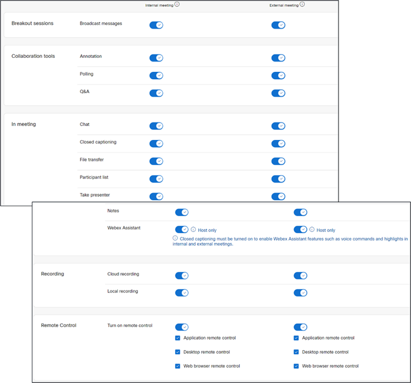

      

      For the purposes of this lab, please leave the default values (e.g., no restrictions).

1. Review Webex Calling controls and restrictions

      On Control Hub navigate to **Calling**, click **Settings**, then select **Webex App**, and scroll down to 'In-call feature access'. Review the available in-call features that can be disabled.

      An administrator can eliminate potential data leakage vectors to disable. For example, an adminstrator could prevent users from sharing content during a call (toggle off **Screen Sharing**) or sharing video on the call (toggle off **Video on desktop**/**Video on mobile**). Likewise, the administrator can prevent escalation of a call to a meeting (toggle off **Move call to meetings on desktop app**). These restrictions may sufficiently address organizational requirements regarding callingdata loss.

      

      Note that by default, there are no restrictions for in-call features. For the purposes of this lab, please leave the default values (e.g., no restrictions).

Now that you've enabled the Compliance Officer role for user Anita Perez and reviewed Webex's built-in data retention and restrictions capabilities, it's time to move on and explore Webex integration to an external compliance platform.

## Explore eDiscovery for Webex Meetings in Theta Lake

eDiscovery is the mechanism for searching through and retrieving data from the retained user-generated data archive of an organization. This ensures that the compliance officer has full access to all retained user data as needed for compliance management and enforcement. Because **eDiscovery** enables search and retrieval of data, this is often discussed together with **Archiving** capabilities which pertains with how and where the data that is being searched is stored.

Webex has built-in eDiscovery/Legal Hold and archiving or data storage capabilities which may be sufficient for some organizations. The built-in Webex eDiscovery Search and Extraction portal provides Webex organizations the ability to access Webex stored and retained user-generated data. And as discussed earlier, there are retention settings in Control Hub which determine how long user-generated data is stored on the Webex platform. Note that exploring the Webex eDiscovery Search and Extraction portal is not part of this lab. However, for your reference, the Appendix of this lab guide has a module that covers the built-in Webex eDiscovery tool. If you are interested in this module, please complete the rest of the lab before exploring.

For advanced implementations of eDiscovery and Archiving, a third-party compliance platform integration is generally preferred.

Theta Lake has a full set of compliance capabilities including eDiscovery and Archiving for collaboration platform data. In this module you'll explore the archiving and eDiscovery capabilities of the Theta Lake platform.

### Theta Lake Archiving

1. Login to Theta Lake management portal with read-only admin login.

      As you examine Theta Lake eDiscovery capabilities, it helps to have some historical user data (something beyond just data you might generate today) so you can search and review data over a period days and weeks. In this section you'll use a read-only administrator account for a Theta Lake organization which contains months of user-generated message, meeting, and calling data.

      From the Chrome browser on Anita Perez's workstation (WKST2), navigate to the Theta Lake management portal at <https://useast.thetalake.ai/>.

      Login using the read-only administrator account credentials (email / password): **co.read.only@gmail.com** / **dCloud123!**

      Once logged in navigate to the Policies page by clicking '**Policies**' in the navigation menu at the top of the page.

1. Review the Retention Library page.

      The retention library or archive is the final resting place for the data coming from the Webex platform, so it's important to understand where and how your data is archived before even thinking about eDiscovery.

      On the Theta Lake platform archiving is managed under the Policies sub-section '**Content Destination**'. Retention libraries are managed here.

      Navigate to the Archive retention libraries page by clicking 'Content Destination' in the left-hand navigation menu to expand, and then click 'Retention Libraries'.

      

      By default. Theta Lake automatically configures a retention library called 'Default' when the Theta Lake org is created.

      

      Notice that the default retention period for the default retention library is 'Forever', meaning that user data for your org will be archived and maintained indefinitely. Data records have been created and archived to this retention library (Record Count = *nnn*).

      ***Note:** You will see a second retention library called 'Delete Storage'. This retention library is for lab operational purposes. We use this library to clear data records from the Theta Lake tenant after the lab has been completed.*

      Theta Lake allows for the creation of multiple retention libraries within an organization enabling you to segment data archiving to accommodate variable retention periods and storage requirements.

      Given this is a read-only account, you won't be able to edit the retention library and see details. Below is what the retention library edit dialog [would look like if you were to edit or create a new retention library.

      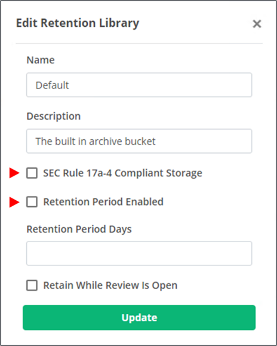

      Notice that there is a setting to enable specialized storage to meet certain archival compliance requirements for data retention and storage. Specifically, Theta Lake optionally provides SEC Rule 17a-4 compliant storage. Rule 17a-4 requires maintenance and preservation of electronic records exclusively in a non-rewriteable, non-erasable storage format -- referred to as WORM (write once, read many). We don't need WORM storage for the purposes of this lab, so this is not enabled.

      As mentioned earlier, this default library currently has no retention period set so data will be maintained indefinitely. If the compliance officer or administrator wanted to adjust the retention period, they simply enable the retention period and then specify the retention period in days.

### Theta Lake eDiscovery
1. Navigate to Theta Lake eDiscvoery.

      Click 'Search' from the navigation menu for eDiscovery where the administrator or compliance officer can search against all retained user data records across all media types including messages, files, and meeting and calling recordings. All available records are retrieved by default.

      

      Note that this Theta Lake org has many Webex Messaging, Meeting, and Calling data records and lots of filters that can be applied to search easily through the records.

### eDiscovery for Webex Meetings
Please spend some time reviewing some of the compliance options for Webex meetings available with Theta Lake.

Theta Lake can process data from in-meeting chat, polls, Q&A, shared files, and other meeting content (like the data you just generated). Theta Lake can also detect content from users' audio/video streams such as, files shared visually or verbally during the meeting (e.g., an attendee holding a paper with sensitive information written on it or
verbally mentioning credit card numbers/SSN/DOB). You will learn how Theta Lake can help us flag these violations as well.

1. Review Webex Meeting data 

      You will find pre-populated data that demonstrates some of the violations and types of data that Theta Lake can process. Once logged in click the **Search** tab, enter the search term **Poll**, and click the green **Search** button. 
      
      Note: the screenshot below is using the **Table** viewing format. This can be found on the right side of the screen near the **Sort by** option.

      

      Explore and review few records that have Meeting Poll
      
      Repeat the search process with **Q&A** as the search term and click the green **Search** button.

      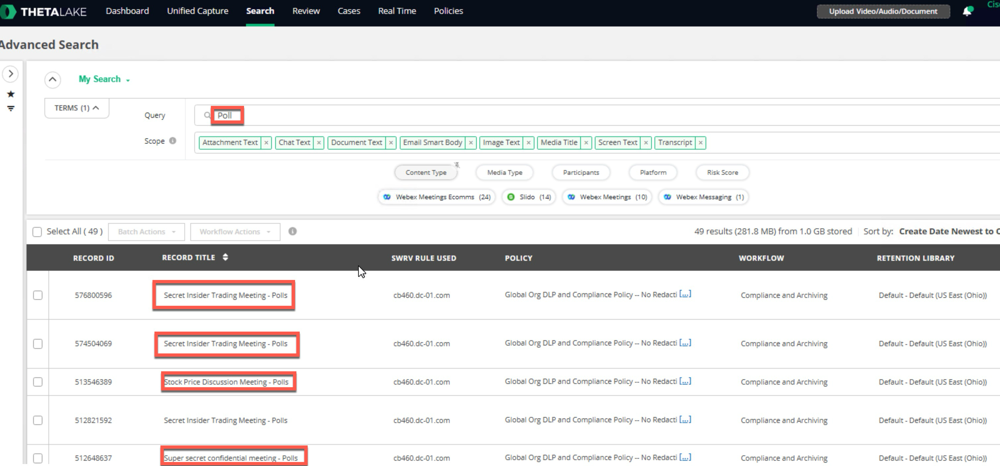

      

      Close the Poll Search by clicking on the "x" next to search.

      

1. Search for and review records with specific built-in policy violations.

      In the left-hand navigation menu, under the **FAVORITES** section, click **Policy Hits**. In the resulting dialog box, scroll through the drop-down menu and select the following built-in detection rules then click **Apply**:

      **Credit Card Number (CC#) -- Audio, Chat, Attachment, and EmailsCryptoCurrency Discussions -- Video, Audio, Chat, Attachment and Emails** **Social Security Numbers(SSN) -- Audio, Chat, Attachment and Emails**

      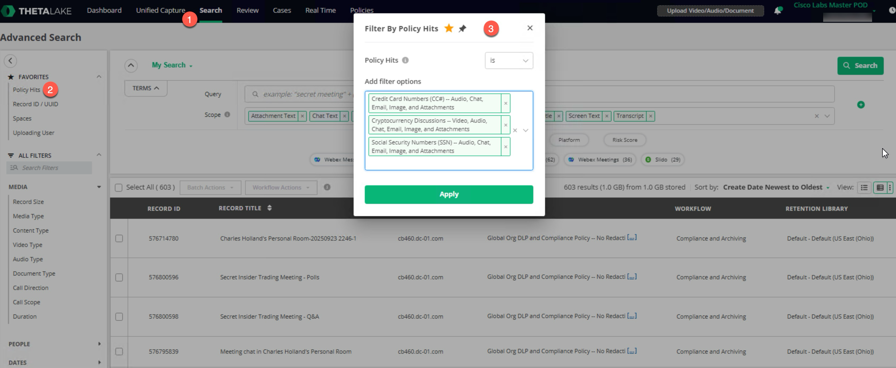

1. Refine search to include specifc media types.

      Scroll down to the **Media** category in the left-hand navigation menu and click to expand the filter. Click **Media Type** and tick the boxes for **Audio** and **Video** then click **Apply**.

      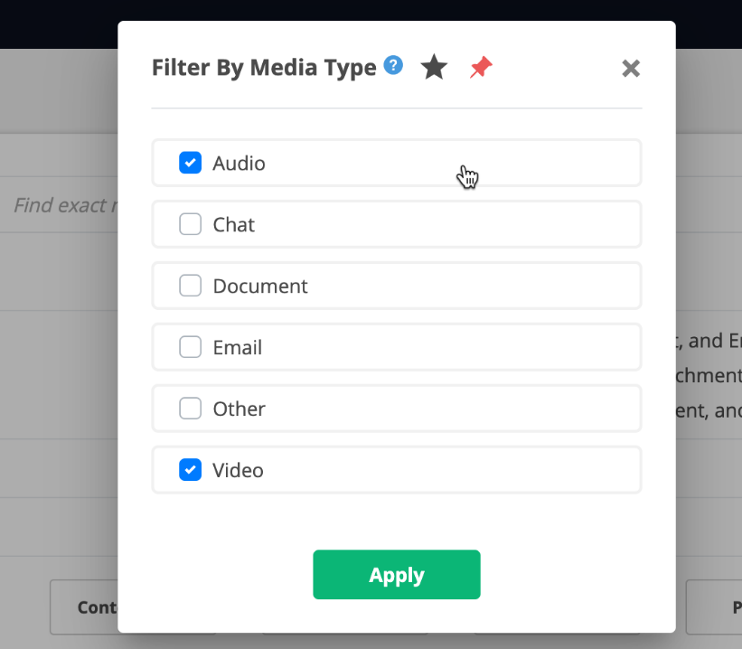

1. Review a specific meeting data record. 

      Select any meeting, you will observe a recording of the meeting and flags where the users have violated policies. You can use **Record ID** 576714780 as an example.

      

      If you are reviewing record 576714780, scroll to approximately 7 minutes and 06 seconds into the meeting and you will see that Theta Lake has the ability to flag documents held up to the screen containing PII and confidential data.

      Feel free to take a few minutes and review a couple more records for various other compliance policy violations to get a good understanding of Theta Lakes detection capabilities.Once you have completed reviewing the options, clear out all the filters that you have selected by clicking "Clear All" on the top left of the screen.

      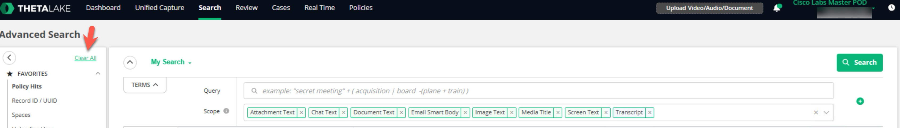

## Explore eDiscovery for Webex Calling in Theta Lake

Please spend some time reviewing some of the compliance options for Webex Calling available in Theta Lake.

Theta Lake provides archiving, eDiscovery, and supervision for Webex Calling with automated detection of compliance risks in audio content with comprehensive support for Webex Calling, including recordings, call detail records (CDRs), and business texting (SMS). 

In this section you will review Webex Calling data records in Theta Lake. 

1. Search for Webex Calling data records.

      Navigate to eDicovery by clicking **Search**. You will find pre-populated data that demonstrates some of the violations and types of data that Theta Lake can process. 
      
      Click **Webex Calling** to add a platform filter. 
      
      Note: the screenshots below show the **Table** view. This can be found on the right side of the screen near the **Sort by** option.

      

     <!--  -->

1. Review list of records.

      You will find two types of Webex Calling records here:
      - Call detail records (CDRs)
            These records have a <u>Record Title</u> that starts with **'Call between...'**.  
      - Call recordings - These records have a <u>Record Title</u> that starts with **'Call with...'** and ending with a numeric sequence corresponding to the calling number and call timestamp.

      **CDRs**

      If the call is internal (**SIP_ENTERPRISE**) you will see a pair of CDRs for each call - one for each call leg: originating, terminating.
      
      If the call is external (**SIP_NATIONAL** - to PSTN, or **SIP_INBOUND** - from PSTN) you will see a single CDR for each call - the internal call leg: originating or terminating.

      **Call Recordings**

      In addition to the CDRs described above, if the call is recorded, you will also find a corresponding recording record.  

      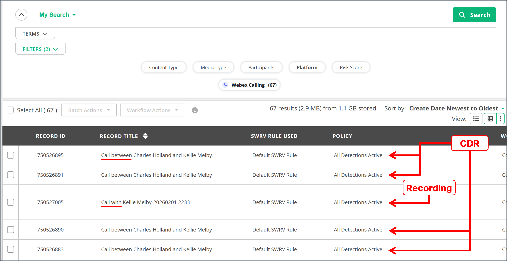

      Note: CDR data records will be the same for both standard and zero-trust end-to-end encrypted (E2EE) Webex calls. However, as discussed in Module 2, zero-trust E2EE calls do not support call recording (or other features like closed captioning). So if a call has a corresponding audio recording, then it was not a zero-trust E2EE call. On the oher hand, for any unrecorded call it would be impossible to tell the difference between a standard encrypted call and a zero-trust E2EE call.

 1. Review CDR data record details
      
      Begin to review data records for Webex Calling. Start with an internal call.

      Scroll down and locate the set of call records: 75052**6890**, 75052**6883**. These should be listed sequentially and correspond to the terminating and originating legs of an internal call.

      To review a record, click the record. Select the **Attributes** record to see the call detail information.

      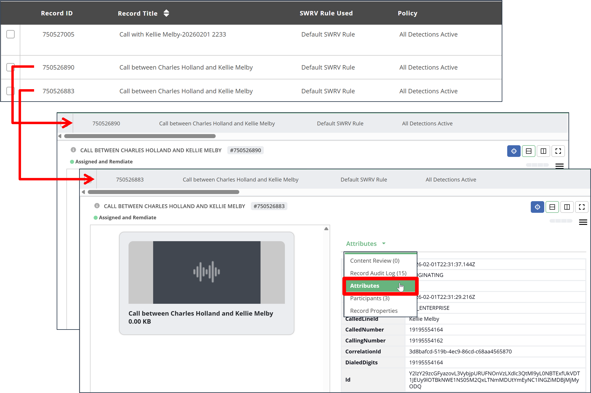

      First, note the CallType for each record is **SIP_ENTERPRISE** indicating this is an internal call.
      
      Next, look at the **CorrelationId** attribute and notice that it is the same for both records (3d8bafcd-519b-4ec9-86cd-c68aa4565870). This indicates that these two records are part of the same call. Later you will see that the call recording data record has the same CorrelationId.

      Notice one of the records (75052**6883**) is the originating leg: **CallDirection=ORIGINATING**. And the other record (75052**6890**)is the terminating leg: **CallDirection=TERMINATING**.

      Additional detailed call information is displayed including call duration (CallDurationSeconds), times (CallAnswerTime, CallStartTime), numbers (CalledNumber, CallingNumber), and caller ID (CalledLineId, CallingLineId).

      

1. Review a call recording record

      Now let's look at record 75052**7005**. This should be listed sequentially above the terminating and originating CDRs reviewed above. This record includes an audio recording of the call.

      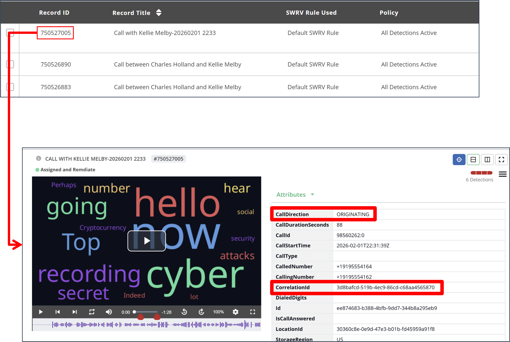

      First, review the Attributes of the record. Observe that the **CorrleationId** (3d8bafcd-519b-4ec9-86cd-c68aa4565870) matches the two CDRs we reviewed above indicating this is the corresponding recording of that call. Also notice that the **CallDirection** parameter is 'ORIGINATING' indicating the call recording was started on the originator's leg of the call  
      
      Next, select **Content Review** to display the analysis of the recording made by the Theta Lake platform AI Compliance Advisor. This automated analysis indicates locations during the call recording where potential violations of compliance policy occurred. For example, the Compliance Advisor flagged multiple cases where **'cryptopcurrency'** is mentioned during the call which is a violation of the built-in 'CryptoCurrency Discussions' policy. Likewise, the Compliance Advisor flagged instances of social security numbers, credit card numbers, material nonpublic information (insider trading), and sensitive documents being discussed on the call. This analysis is a great starting place for the Compliance Officer when reviewing data records on the Theta Lake platform.
      
       

      Review the details of this analysis noting the policies that were violated. Using the timestamps in the Content Review analysis see if you can locate one of the potential violations in the audio recording.
      
      Next, review the transcript of the recording. Select **Transcript** to display the transcript of the audio reocrding generated by the Theta Lake platform AI Compliance Advisor. This transcript along with the automated analysis by the AI Compliance Advisor keeps the Compliance Officer from having to review the audio recording saving a lot of time.

      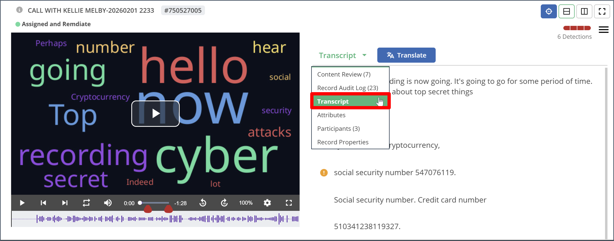      

      Finally, try translating the transcript into another language. Click **Translate**, select the language to translate to from the dropdown (e.g., Dutch) and then, click **Translate** again. Notice the transcipt has been translated into the language selected. This can be very useful if the call audio is in a language that the Compliance Officer is unable to understand.

      
      
1. Review other Webex Calling data records
      
      Take a few minutes to review some other records to see other types of calls and other possible compliance policy violations.

      For example, look at the records for a PSTN call with a single CDR data record and the corresponding audio recording data record. Scroll down and locate data recordings: 7312**5943** and 7312**5955** which are the respective CDR and audio recording for a PSTN call. (Hint: To find these records faster, use the side panel to select a 'Create Date' filter with a custom data range of January 19, 2026 12:00AM - January 19, 2026 11:00PM. This filter will return just these two data records).

      Note that under Attributes for both of these records, the **CorrelationId** (060b2e06-b871-435e-8a60-33c6be7862db) is the same indicating they are from the same call. The <u>CallType</u> attribute of the CDR is **SIP_NATIONAL** which indicates this is a PSTN call. This is an outbound call (<u>CallDirection</u> = **ORGINATING**) to the PSTN and as mentioned previously, this is the only call leg CDR available since the system has no visibility to the PSTN side of the call. 
      
      (Note: If this were an inbound PSTN call, then the <u>CallType</u> would be **SIP_INBOUND** and the <u>CallDirection</u> would be **TERMINATING**)

      Feel free to review the Content Review and Transcript details for the audio recording data record.

      Once you are done exploring other Webex Calling data records, before you proceed, ensure that you have cleared any filters and logged out of Theta Lake. 
      
      This concludes Theta Lake compliance sections.

<!--
## Integrate Webex with Cloudlock and Configure DLP Policies
In this section you will integrate Webex with Cloudlock and explore DLP policy configuration on the platform.

1. Login to the Cloudlock management portal using Webex compliance officer credentials.

      An account has already been pre-provisioned on the Cloudlock portal for the compliance officer, Anita Perez. You'll recall that in the previous section you configured this user with the Compliance Officer role in Control Hub.

      To get started with Cloudlock, make sure you can login to the Cloudlock account.

      a. From the Chrome browser on Anita Perez's workstation (WKST2), navigate to the Cloudlock portal at <https://demo.cloudlockng.com/>. Select **Webex** from the 'Sign in with' dropdown menu and click the **LOG IN** button.

      

      b. Login with the compliance officer's (Anita Perez's) Webex account.

      At the Webex login prompt, enter **aperez@cbXXX.dc-YY.com** (see the eXpo dCloud Session View for domain / 'XXX' and 'YY' values) and the password **dCloud123!** then click the **Sign In** button. Refer to eXpo dCloud Session View for the Webex password if you did not complete module 1.

      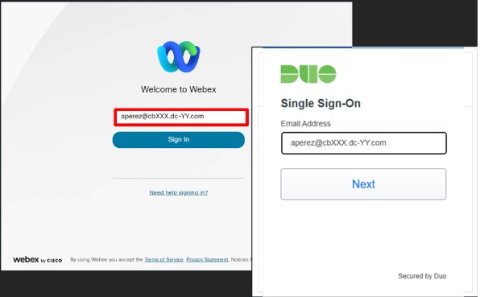

      (Note: If SSO is enabled, you may not receive a password prompt since you recently authenticated)

      If prompted, click **Accept** to grant directory read permissions to Cloudlock platform.

      Since this is the first time the compliance officer has logged into the platform, the Cloudlock terms of service is presented. Click **ACCEPT** to continue.

      

      You will be taken to the Cloudlock Dashboard page. (Note: If necessary, reload/refresh the page (F5) to get the page to finish loading)

1. Configure the initial Webex Cloudlock platform integration.

      For the Cloudlock compliance platform to receive user data from Webex, your Webex org integration to Cloudlock must be authorized.

      a. Navigate to the Settings page on the Cloudlock portal. Click **Settings** in the left-hand navigation menu to load the Settings page.

      

      On the 'Platforms' tab you'll notice that Webex platform integration needs authorization in the Cloudlock tenant.

      b. Click the **Authorize** button to authorize the platform integration for Webex.

      c. Select **Webex Teams** (messaging) and **Webex Meetings** platform services. (In this lab we'll focus on messaging, but it doesn't hurt to include meetings in the authorization).

      d. Click the **AUTHORIZE** button again.

      

      e. Login to Webex with compliance officer account credentials (aperez@cbXXX.dc-YY.com) to complete the authorization.

      

      (Note: Because SSO is enabled, you may not receive a password prompt since you recently authenticated)

      f. Grant Webex permissions to Cloudlock to complete the authorization process.

      

      g. Confirm platform authorization for Webex.

      Ensure the platform shows 'Authorized'

      

      Once the platform is authorized, Cloudlock will begin actively collecting data from the Webex org for both messaging and meetings.

1. Prepare Webex for real-time file DLP with webhooks.

      Since you will be exploring DLP including real-time DLP for files, enable webhooks. Return to Control Hub in the Chrome browser and navigate to **Messaging** and scroll down to the setting **Real-time data loss prevention for files** and toggle on.

      

      This will enable webhooks for your Webex org so that compliance platform integrations can use webhooks for monitoring Webex data.

1. Review and re-configure a built-in Cloudlock compliance policy.

      Return to the Cloudlock portal in the Chrome browser (on WKST2). Cloudlock compliance policies are managed on the Policies page.

      a. Navigate to the Policies page to begin reviewing and configuring compliance policies. Click **Policies** in the left-hand navigation menu to load the Policies page. All compliance policies for the Cloudlock platform are managed here.

      

      You will notice that there are several active compliance policies already configured in your Cloudlock tenant.

      These policies are based on pre-defined policy detection rules on the Cloudlock platform.

      b. Review the pre-defined policy list. Before looking at policies that have already been configured, let's review the built-in or pre-defined policies available on Cloudlock. Click the **ADD A POLICY** button and select '**Add Predefined Policy**'.

      

      In the Add Predefined Policy window under Predefined Policies click the '**Select policy**' dropdown and wait for the list of predefined policies to load. Scroll down to review the numerous built-in compliance policies including 'Credit Card Number' and 'US Social Security Number'. Click any of the policy names to load and review the full policy name and the description of the policy.

      

      You'll add a new policy in the next step, so click the **Cancel** button to exit without creating a policy.

      c. Update the detection criteria for the pre-configured Social Security Number compliance policy.

      Before creating a new policy of your own, it's important to understand the configuration options for a policy.

      Cloudlock enables granular control of how the platform detects policy violations and how it responds. When first creating a policy and/or after clicking the 'Edit' link in the Detection Criteria column of an existing policy, a compliance officer is able to adjust the type of content looked for (Content Criteria), the sensitivity of the detection (Threshold, Tolerance, and Proximity), when it happens (Realtime), and the context in which the policy is applied (e.g., platform, file type, ownership, sensitivity labels).

      Begin by updating the pre-configured Social Security Number compliance policy to enforce it in real-time. This will enable the use of a Webex webhook to allow Cloudlock to provide real-time DLP to files sent via Webex.

      Click the '**Edit**' link in the Detection Criteria column for the Social Security Number policy.

      

      First, note the Social Security Number policy is based upon the built-in predefined policy 'US Social Security Number'.

      Click '**Tolerance**' to configure the sensitivity of the policy. The purpose of this setting is to balance the matching of the policy against user generated data between false matches/more incidents ('Lenient') and fewer positive matches/less incidents ('Strict') where violating content may be missed.

      

      Tick the '**Moderate**' radio button to have the policy be a bit more sensitive to possible matches. This will ensure the content (messages) you generate later will violate this policy. In a production deployment you would tune the tolerance level of each policy based on the organization's policy requirements and end-user behaviors.

      

      Click '**Realtime**' to load the configuration option.

      Under Specific Platforms, tick the **Webex** box. This enables real-time policy detection (for files) on Webex using webhooks.

      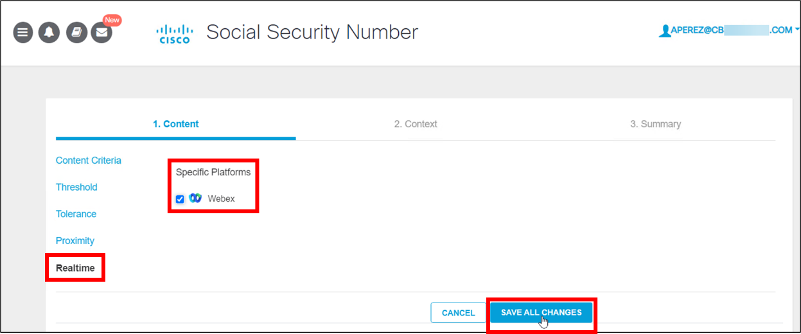

      Feel free to explore the other sensitivity content settings (Threshold and Proximity) as well as the context settings (under the 'Context' tab), but do not make any additional changes. When you are through reviewing the other settings, click the **SAVE ALL CHANGES** button.

      Now that you've seen the controls the Cloudlock platform provides for detecting policy violations, investigate the controls for how the platform responds to a policy violation.

      d. Update the response actions for a pre-configured Social Security Number compliance policy.

      Returning to the Policy page, configure the actions the platform will take in response to a policy violation. Click the '**Create**' link in the Response Actions column of the Social Security Number policy.

      

      The response action sequence builder page is displayed. To build a sequence of actions in response to a policy detection, the compliance officer drags actions from the left-hand action list to the first available action box. In some cases, the action requires configuration.

      To begin, assume that the first action you want to happen when there is a violation of the policy is that the violating message or file gets removed. To set the platform to remove a message or file on a violation select the '**Webex Teams: Delete Message and/or File**' action and drag to the open action box.

      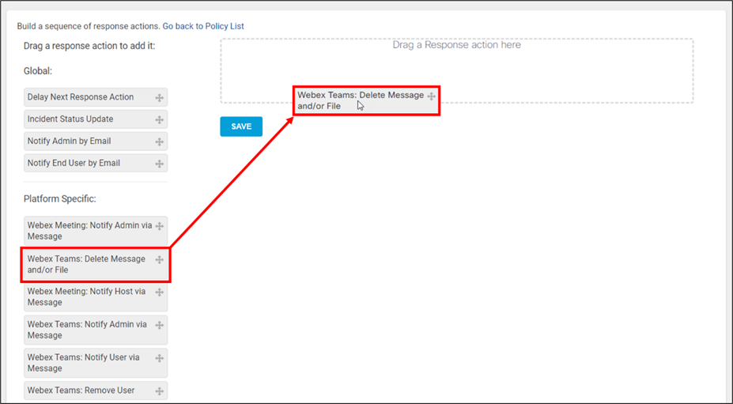

      In addition to removing the message/file, it probably makes sense to notify an administrator of the Cloudlock platform that a violation has occurred. Drag the '**Webex Teams: Notify Admin via Message**' action to the next available action box.

      **Note:** Be sure to select the '**Webex Teams**: Notify Admin via Message' action and NOT the '**Webex Meeting**: Notify Admin Via Message' action.

      This time you must configure the action. Click the 'select' drop-down and select '**aperez@cbXXX.dc-YY.com**' (where 'XXX' and 'YY' correspond to your pod domain -- refer to eXpo dCloud Session View page). The platform will notify this user by Webex message whenever this policy is violated. In this case, you are setting the compliance officer (Anita Perez) as the person to be notified.

      **Note:** It takes approximately 5 minutes from the time the Webex platform is authorized in Cloudlock until the drop-down is populated with users. If 5 minutes has not passed, please wait and select 'aperez@\...' once the drop-down is populated.

      You can customize the message that is sent to the compliance officer/administrator. Add the following message (or something similar) to the message box: *{{user}} has violated the Webex security and compliance policy regarding **SSN***. Click the **SAVE** button to save the action configuration.

      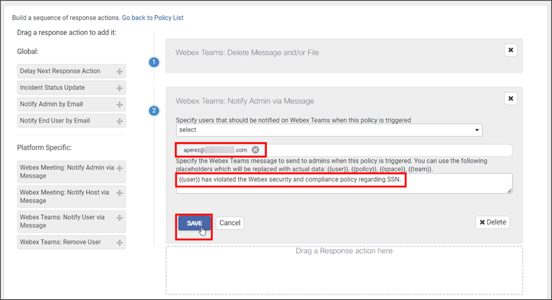

      In the interest of transparency, it makes sense to also notify the user who has committed the violation. To do that, drag the '**Webex Teams: Notify User via Message**' action to the next available action box. (Note: Be sure to drag '**Webex Teams**: Notify User...' action and NOT the '**Webex Meeting**: Notify **Host**...' action).

      There is also configuration for this action. Add the message: *You have violated the company's Webex security and compliance policy for **SSN**. The offending message/file has been deleted. The incident has been logged and reported to the compliance officer.* Now, the platform will notify any user by Webex message whenever they violate the policy. Click the **SAVE** button to save this action configuration.

      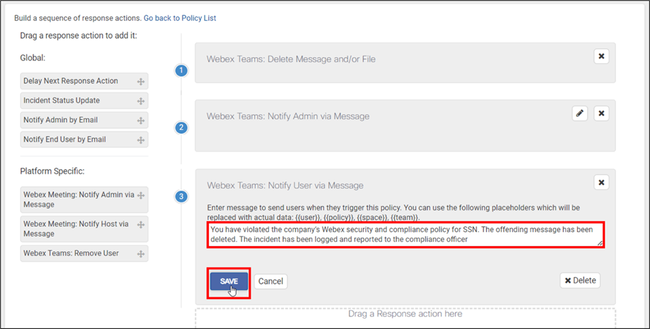

      Finally, be sure to click the **SAVE** button at the bottom of the page to save the response action sequence for this policy.

      

      To return to the Policies page, either click the '**Go back to Policy List**' link at the top of the sequence builder window or click **Policies** in the left-hand navigation window.

      You've successfully updated the configuration of both the detection criteria and the response actions for the policy. This completes the review and configuration of a compliance policy based on one of the Cloudlock platform's built-in predefined policies (Social Security Number).

      

1. Create a new custom compliance policy on the Cloudlock tenant.

      Now that you understand policy detection criteria and response actions better, you are ready to configure a new custom policy. For this policy, you'll configure a custom regular expression-based detection with the same response actions as you just configured on the Social Security Number policy.

      On the Policies page, click the **ADD A POLICY** button and select '**Build your own**'.

      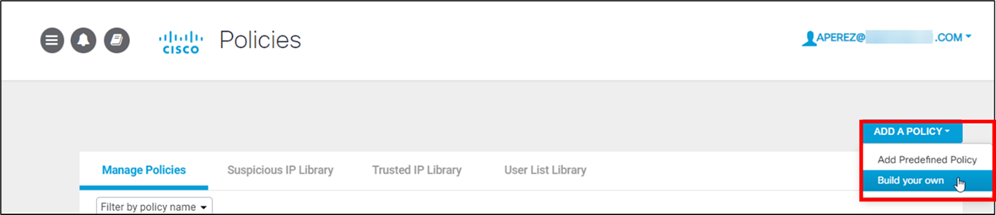

      After the 'Create New Policy' window loads, configure the following value:

      - Policy Type: Select '**Custom Regex**' from the drop-down list.
      - Severity Level: Select '**Alert**' from the drop-down list.
      - Policy Name: **My Name/User ID**
      - Policy Description: **Build your own policy to identify name/user ID**

      Click the **CONFIGURE POLICY** button to continue.

      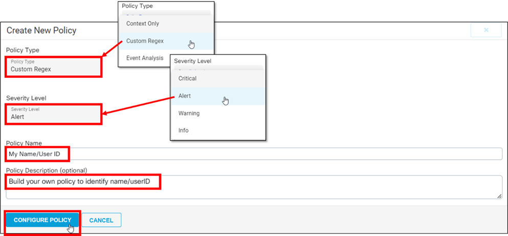

      Next, for Regex configure a regular expression to match the first letter of your first/given name and your last name/surname. In addition, ensure that the expression is case insensitive for the first two letters. For example, if your first name is *Bob* and your last name is *Smith*, you would enter: *\[Bb\]\[Ss\]mith.*

      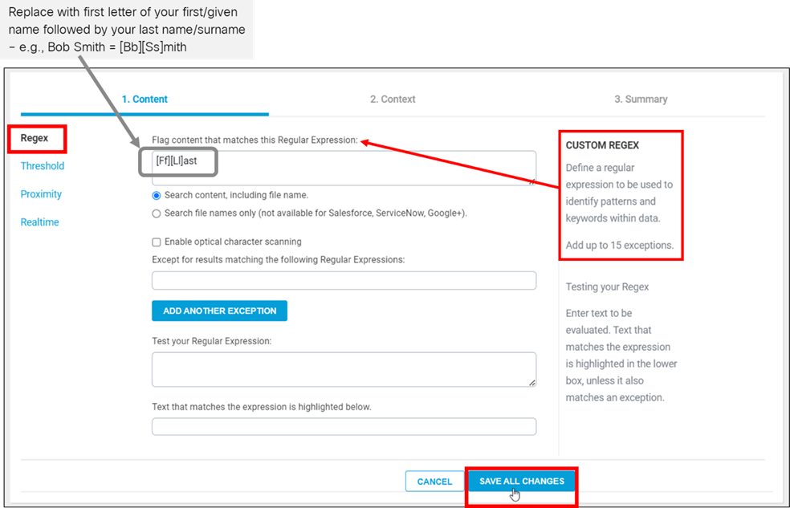

      You don't need to configure any other detection criteria (sensitivity, context) settings for this policy, so click the **SAVE ALL CHANGES** button to save the policy.

      Next, configure the response actions for this policy when violated. On the Policies page, click the '**Create**' link in the Response Actions column for the 'My Name/User ID' policy.

      

      Create the same response actions sequence as you did for the Social Security Number policy with the following configuration settings:

      - Action #1: Webex Teams: Delete Message and/or File
      - Action #2: Webex Teams: Notify Admin via Message
        - Configuration -- Specify User: '**aperez@cbXXX.dc-YY.com**' (where 'XXX' and 'YY' correspond to your pod domain -- refer to eXpo dCloud Session View)
        - Configuration -- Message: *{{user}} has violated a Webex security and compliance policy for my name/userID.*
        - (Click **SAVE**)
      - Action #3: Webex Teams: Notify User via Message
        - Configuration -- Message: *You have violated the company's Webex security and compliance policy for my name/userID. The offending message/file has been deleted. The incident has been logged and reported to the compliance officer.*
        - (Click **SAVE**)

      

      **Note**: Make sure 'Webex Teams...' actions are selected and not 'Webex Meeting...'

      Remember to click the bottom **SAVE** to save the action response configuration to the policy. Then click the '**Go back to the Policy list**' link (or just click **Policies** in the left-hand navigation menu) to return to the Polices page.

      You've successfully updated the configuration of both the detection criteria and the response actions for the new policy. This completes configuration of the new regex-based build your own compliance policy.

      

      The Cloudlock tenant has now been fully integrated with the Webex org and compliance configuration is complete. It's now time to see the compliance platform DLP in action.

## Generate user data via Webex App and Observe DLP Operation
In this section you will generate user data using the Webex App. This data will be collected by the DLP platform.

1. Test the compliance policies you created/edited in Cloudlock by generating messages with the Webex App.

      a. Open the Webex App on Charles Holland's workstation (WKST1)

      If required, RDP to WKST1 and login with the following credentials: **dCloud\\cholland** // **dCloud123!**

      Once connected to WKST1, launch the Webex App. Login with Charles Holland's account username / password: **cholland@cbXXX.dc-YY.com** / **dCloud123!** (see eXpo dCloud Session View for 'XXX' and 'YY' values and the non-SSO password if you didn't complete Module 1).

      

      For any application tour prompts, click **Got it**.

      b. Open the Webex App on Kellie Melby's workstation (WKST3)

      RDP to WKST3 and login with the following credentials: **dCloud\\kmelby** // **dCloud123!**

      Once connected to WKST3, launch the Webex App. Login with Kellie Melby's account username / password: **kmelby@cbXXX.dc-YY.com** / **dCloud123!** (see eXpo dCloud Session View for 'XXX' and 'YY' values and the non-SSO password if you didn't complete Module 1). Remember to click 'Skip Profile' when prompted for secondary email during this initial login.

      c. Return to Charles' Webex App on WKST1, create a 1:1 space with user Kellie Melby (kmelby) and send messages and a file to verify real-time file DLP. Click  and select '**Send a message**'. Type '**Kellie Melby**' in the search window and click the name when found to start a 1:1 space with Kellie.

      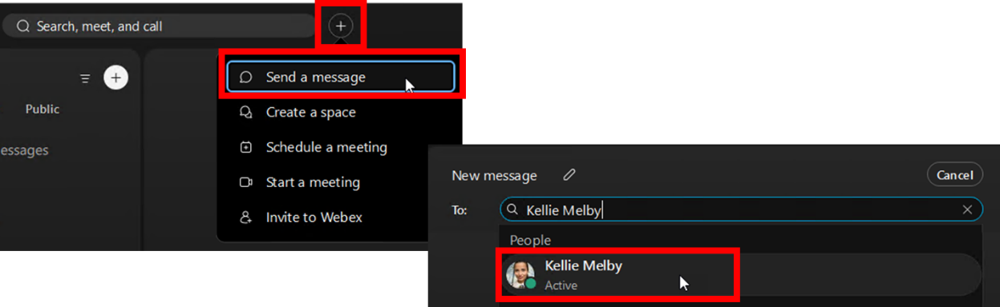

      Before proceeding, open Notepad++ by clicking the program icon on the task bar. Create a new notepad file (File \> New or click the add new icon ). Type your social security number on the first line of the file or use the following number: *405-09-7413*. Save the file to the Desktop as a text file named **dlp_test_file_ssn.txt**.

      

      Now, send a message, followed by a file with a social security number. For example:

      - *Hi Kellie, Sending along a file*

      Notice that the message is successfully sent. Now, upload the file you just created (**dlp_test_file_ssn.txt**) from the Desktop of WKST1 to the 1:1 space.

      

      Once attached, press enter to send the file.

      d. Observe Cloudlock real-time file DLP in action.

      Once the file is sent, you will see the file being processed and almost immediately you see the file is blocked and then the blocked file is deleted. Notice that the file is deleted by Anita Perez, the organization's compliance office. This deletion was triggered by the Cloudlock platform once the file was scanned and blocked in real-time by the platform. This is the 'delete message or file' policy response action you configured for the Social Security Number policy.

      

      Notice that Charles also receives a message from a Security Center bot. Click the Security Center space to review the message. This message should look familiar to you as it's the message you configured to send to the user with the 'notify user via message' policy response action.

      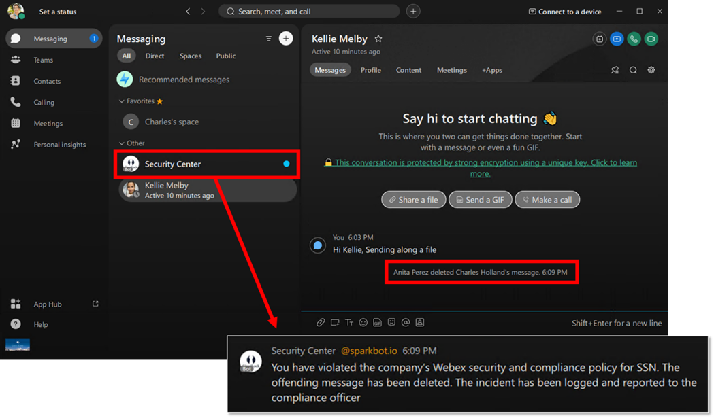

      **Note:** If you missed the file block message/indication, you can return to the Cloudlock portal (return to Chrome browser on WKST2) and remove the 'Webex Teams: Delete Message or File' response action from the **Social Security Number** policy and save the policy again.

      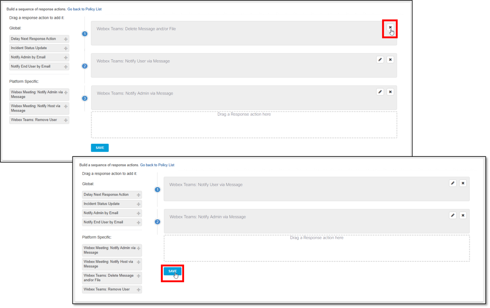

      Now, repeat the test by sending the same file. This time the file will again be blocked, but the blocked file will not be deleted.

      

      You will also see a second notification from the Security Center bot for this second violation to the user (cholland). You'll also see a second notification from the bot to the compliance officer/admin (aperez) in a later step.

      e. In Charles' Webex App on WKST1, send a message in the 1:1 space with Kellie to verify near real-time message DLP.

      Send messages including one that matches the custom regex policy (My Name/User ID) you created earlier to catch first letter of the first name and last name. For example:

      - *Hi, I'm sending my userID*
      - *FLast*

      Notice that the messages are successfully sent and received including the message that violates your custom regex policy.

      

      f. Observe Cloud near real-time message DLP in action.

      After a short period of time, you will see the second message (e.g., FLast) get deleted by the compliance officer. This near-real time message deletion is triggered by the Cloudlock platform. The message contains a pattern that matches the custom regex detection criteria defined earlier. The deletion again occurs because of the 'delete message or file' policy response action configured for the 'My Name/User ID' custom regex policy.

      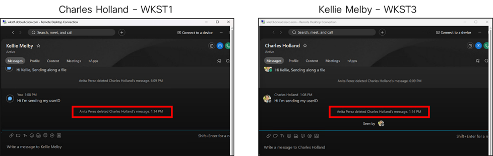

      Notice that Charles again receives a message from the Security Center bot in the Security Center space to review the message. This message should look familiar to you as it's the custom message you configured to send to the user with the 'notify user via message' policy response action for the policy.

      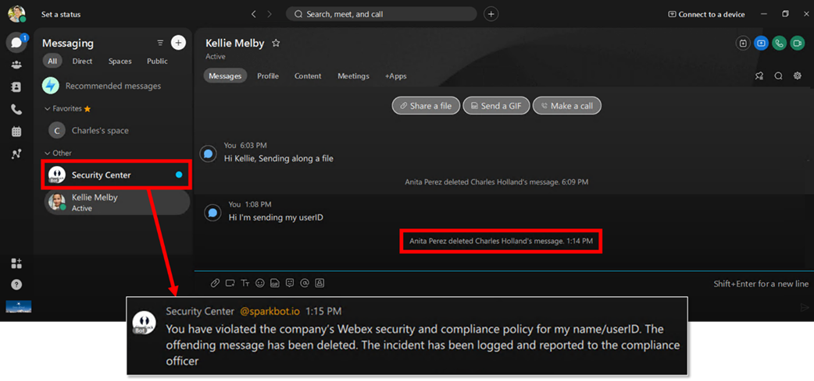

      g. Review the admin / compliance officer message notification from the Security Center bot.

      Because one of the policy response actions for both Cloudlock policies you configured was to 'notify the admin via message', confirm that the organization compliance officer (Anita Perez) receives message notification.

      Return to WKST2 -- if required RDP to the workstation and login with the following credentials: **dCloud\\aperez** // **dCloud123!**

      Once connected to WKST2, launch the Webex App. Login with Anita Perez's account username / password: **aperez@cbXXX.dc-YY.com** / **dCloud123!** (see eXpo dCloud Session View for 'XXX' and 'YY' values and the last 4-digits of the session ID for the non-SSO password if you didn't complete Module 1).

      Notice there are new messages in the Security Center space notifying Anita about Cloudlock DLP compliance policy violations. The messages match the 'notify admin via message' policy response action message you configured earlier for both of the policies.

      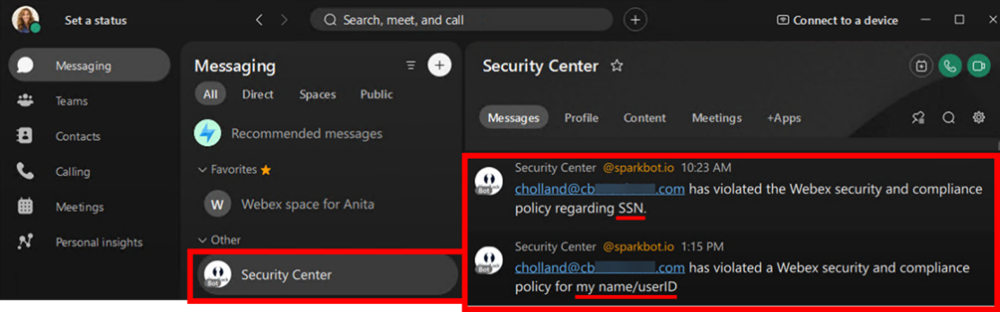

1. Review the compliance violation incident management on the Cloudlock compliance platform.

      In addition to compliance policy violation response actions, the Cloudlock platform also provides incident reporting and management capabilities. Return to the Chrome browser on WKST2 and the Cloudlock portal. Navigate to the Incidents page by clicking **Incidents** in the left-hand navigation menu.

      Once the page loads scroll down to see a list of the most recent compliance violation incidents. You should see an incident for each of the policy violations you generated with the user content you sent via Webex App. One incident is related to violation of the 'My Name/User ID' policy (custom regex policy) and the other for violation of the 'Social Security Number' policy (predefined policy).

      

      Click each incident to see a summary of the incident details including the platform, the owner/violator, and the policy that was violated. In addition, the incident summary includes detailed excerpts of the violating message or file.

      

      Click the 'Incident History' tab to get details on the on the response actions taken by the platform for the policy violation. You should see an event for each of the three policy response actions you configured for the policies:

      i. Delete content -- 'Webex Teams: Delete Message and/or File'.
      ii. Notify the compliance officer/admin -- 'Webex Teams: Notify Admin'.
      iii. Notify the compliance officer/admin -- 'Webex Teams: Notify User'.

      

## Explore Theta Lake eDiscovery and Legal Hold
eDiscovery is the mechanism for searching through and retrieving data from the retained user-generated data archive of an organization. This ensures that the compliance officer has full access to all retained user data as needed for compliance management and enforcement. Because **eDiscovery** enables search and retrieval of data, this is often discussed together with **Archiving** capabilities which pertains with how and where the data that is being searched is stored.

Webex has built-in eDiscovery/Legal Hold and archiving or data storage capabilities which may be sufficient for some organizations. The built-in Webex eDiscovery Search and Extraction portal provides Webex organizations the ability to access Webex stored and retained user-generated data. And as discussed earlier, there are retention settings in Control Hub which determine how long user-generated data is stored on the Webex platform. Note that exploring the Webex eDiscovery Search and Extraction portal is not part of this lab. However, for your reference, the Appendix of this lab guide has a module that covers the built-in Webex eDiscovery tool. If you are interested in this module, please complete the rest of the lab before exploring.

For advanced implementations of eDiscovery and Archiving, a third-party compliance platform integration is generally preferred.

Theta Lake has a full set of compliance capabilities including near real-time file and message DLP with flexible, granular DLP policies, and DLP incident management. In this module you'll explore the archiving and eDiscovery/Legal Hold capabilities of the Theta Lake platform.

### Archiving

1. Login to Theta Lake management portal with read-only admin login.

      As you examine Theta Lake eDiscovery capabilities, it helps to have some historical user data (something beyond just data you might generate today) so you can search and review data over a period days and weeks. In this section you'll use a read-only administrator account for a Theta Lake organization which contains months of user-generated message and meeting data.

      From the Chrome browser on Anita Perez's workstation (WKST2), navigate to the Theta Lake management portal at <https://useast.thetalake.ai/>.

      Login using the read-only administrator account credentials (email / password): **co.read.only@gmail.com** / **dCloud123!**

      Once logged in navigate to the Policies page by clicking '**Policies**' in the navigation menu at the top of the page.

1. Review the Retention Library page.

      The retention library or archive is the final resting place for the data coming from the Webex platform, so it's important to understand where and how your data is archived before even thinking about DLP or eDiscovery.

      On the Theta Lake platform archiving is managed under the Policies sub-section '**Content Destination**'. Retention libraries are managed here.

      Navigate to the Archive retention libraries page by clicking 'Content Destination' in the left-hand navigation menu to expand, and then click 'Retention Libraries'.

      

      By default. Theta Lake automatically configures a retention library called 'Default' when the Theta Lake org is created.

      

      Notice that the default retention period for the default retention library is 'Forever', meaning that user data for your org will be archived and maintained indefinitely. Data records have been created and archived to this retention library (Record Count = *nnn*).

      ***Note:** You will see a second retention library called 'Delete Storage'. This retention library is for lab operational purposes. We use this library to clear data records from the Theta Lake tenant after the lab has been completed.*

      Theta Lake allows for the creation of multiple retention libraries within an organization enabling you to segment data archiving to accommodate variable retention periods and storage requirements.

      Given this is a read-only account, you won't be able to edit the retention library and see details. Below is what the retention library edit dialog [would look like if you were to edit or create a new retention library.

      

      Notice that there is a setting to enable specialized storage to meet certain archival compliance requirements for data retention and storage. Specifically, Theta Lake optionally provides SEC Rule 17a-4 compliant storage. Rule 17a-4 requires maintenance and preservation of electronic records exclusively in a non-rewriteable, non-erasable storage format -- referred to as WORM (write once, read many). We don't need WORM storage for the purposes of this lab, so this is not enabled.

      As mentioned earlier, this default library currently has no retention period set so data will be maintained indefinitely. If the compliance officer or administrator wanted to adjust the retention period, they simply enable the retention period and then specify the retention period in days.

### eDiscovery / Legal Hold
1. Return to the Theta Lake portal with read-only admin login.

      As you examine Theta Lake eDiscovery capabilities, it helps to have some historical user data (something beyond just today) so you can search and review data over a period days and weeks. You'll continue to use the read-only administrator account for the Theta Lake organization which contains several months of user-generated message, meeting, and calling data.

      Once logged in, click 'Search' from the navigation menu for eDiscovery where the administrator or compliance officer can search against all retained user data records across all media types including messages, files, and meeting recordings. All available records are retrieved by default.

      

      Note that this Theta Lake org has many Webex Messaging, Meeting, and Calling data records and lots of filters that can be applied to search easily through the records.

1. eDiscovery search for user Charles Holland's Webex Messaging data.

      a. Review the Theta Lake search capabilities.

      Theta Lake provides a powerful set of search and filter capabilities for eDiscovery. Filtering data records is easy. Simply click one of the filter buttons at the top of the page just under the search bar and select one or more parameters before applying the filter.

      For example, the compliance officer can filter by collaboration platform integration by clicking the 'Platform' filter button and selecting an integration -- e.g., Webex Messaging, Webex Meetings, Zoom, etc. Likewise, they could filter by content type by clicking the 'Content' filter button and selecting a specific content format -- e.g., Adobe PDF, Microsoft PowerPoint, etc. You do **not** need to configure these search filters. These are just examples. You'll configure a set of search filters in the next step.

      

      Carefully review the left-hand navigation menu and the various search and filter categories. Click to expand categories to see the full list of search criteria in each category.

      b. Create an eDiscovery search based on a specific set of search filters.

      Let's create a custom search to narrow the displayed list of data records.

      Suppose there have been repeated compliance policy violations from a specific user over the last 12 months and the compliance officer is investigating the potential impact and whether there is a pattern of the user sharing highly restricted data like credit card numbers over chat with other employees.

      The compliance officer needs to locate all instances of credit cards numbers sent or received via the company's messaging app (Webex) by user Charles Holland. Create a simple custom search to retrieve all user data records matching these parameters.

      In the left-hand navigation menu, under the 'FAVORITES' category, click '**Policy Hits**'. In the resulting dialog box, scroll through the drop-down menu and select built-in detection rule 'Credit Card Number (CC#) -- Audio, Chat, Attachment, and Emails'. Click **Apply** to add this search filter.

      Next, click the 'PEOPLE' category to expand the filter list and click '**Participants**'. (Alternatively, click the 'Participants' filter button at the top of the search window). In the resulting dialog box, select '**FirstName**' from the Attribute dropdown and then type 'Charles' to search. Select 'Charles' from the list. Click **Apply** to add this search filter.

      Finally, locate t­he 'PLATFORM' category in the left-hand navigation menu and click to expand the filter list. Click '**Platform**' and select 'Webex Messaging' from the drop-down menu. Click **Apply** to add this third and final search filter.

      

1. Review Charles Holland Webex Messaging data search results.

      a. Confirm the search filtering on policy hits, participants, and platforms has completed.

      Theta Lake eDiscovery returns a smaller subset of user data records after this search is complete.

      The resulting list of data records are sorted from newest to oldest by default. Included in the will be records with the title 'Stock Price' (corresponding to an activity in the 'Stock Price' message space).

      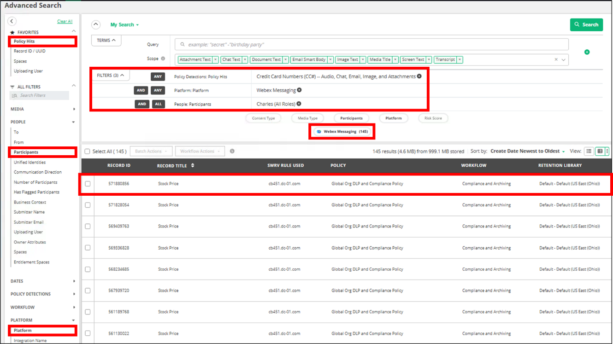

      b. Select the 'Stock Price' message space data record from the search results.

      Click the 'Stock Price' data record to expand. In the expanded record view, you'll notice that the message conversation flow for the 'Stock Price' space is displayed on the left-hand side of the record, while the Theta Lake system content analysis log is displayed on the right-hand side of the record.

      

      View message window to read messages exchanged and captured in this record and the resulting system analysis. Hover over the numbered circles next to a message to review details about the system management of the data record including flagging of possible violations for review and automatic message redaction for specific detection rule triggers.

      c. Translate the messages in the record to another language

      Close the current record and move to a record with plenty of text. Click the **Translate** button to translate the messages in the record to a different language

      

      In the 'Translate to' drop down choose a language to translate the messages to -- e.g., Portuguese. Then, click **Translate** to translate.

      

      Notice that the messages have been translated to the selected language.

      

      Click **Show Original** to revert to the original language.

      d. View the full message conversation history of the selected user data record from the search results.

      The compliance officer has visibility to the conversation contained in the selected user data record ('Stock Price' message space). This visibility provides context for this specific compliance data record; however, it is sometimes necessary to review a larger historical conversation window to determine if a particular compliance violation is an isolated event or if this is a common or frequent occurrence.

      Click the '**View Chat Timeline**' button at the bottom (or top) of the expanded data record to load a complete view of the conversation chat history for this message space.

      

      The historical conversation view provides the complete message history for the space. A scrolling conversation history timeline is provided on the left side of the window with possible compliance violations flagged along the timeline. The message conversation is displayed in the middle of the screen. And a complete set of content data analysis callouts across the message history is provided on the right side of the window.

      e. Search the full message conversation history for a specific set of words.

      This complete conversation view provides clear context to data compliance violations. Further, the entire conversation can be searched for words and phrases which are then highlighted in the main conversation in the middle of the window.

      In the 'Search the conversation' field at the top right of the screen, type in some key words to perform a search against the full conversation. For example, search for 'confidential', 'credit', and/or 'security' or similar combinations. For each search term or phrase, Theta Lake highlights all instances of the word in the message conversation flow and provides a color-coded indication on the conversation timeline for each instance of the searched term.

      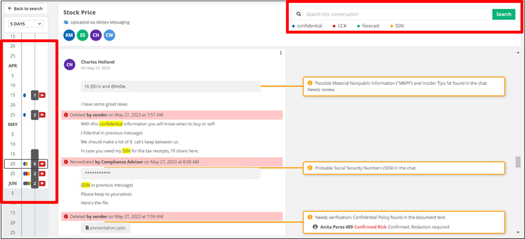

      f. Summarize the conversation to get analysis of the message history over a period of time.

      Click the 3 dots in the upper right corner and select 'Summarize Conversation' from the dropdown menu.

      

      Click **Acknowledge** to acknowledge the warning. Then, specify the date range of 1 year (e.g., June 10, 2024 -- June 10, 2025). Finally, click the **Summarize** button to begin summary generation.

      

      After a few minutes, a notification will be received. Click the bell icon in the upper right corner to load the notification pane. Click the notification 'Your summary of the conversation in "Stock Price" is ready to view to load the conversation summary.

      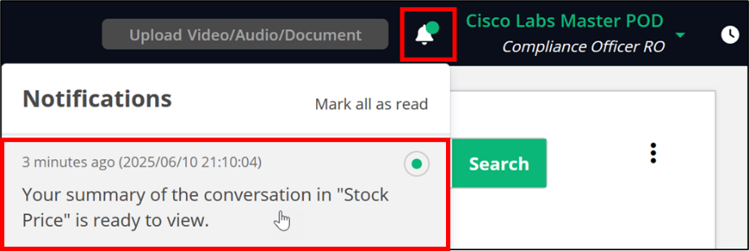

      Review the conversation history summary (scroll to see the full summary).

      

      Clearly, Charles has a long history of compliance policy violations. It might be time for his manager to have a serious conversation with him about his future at the company.

1. Examine Theta Lake Legal Hold functionality.

      The Theta Lake compliance platform also provides Legal Hold support. As mentioned earlier, Legal Hold is a mechanism for creating and managing cases related to legal investigations where specific user data records must be maintained beyond the normal corporate data retention policies. User data records associated to a Legal Hold are maintained indefinitely until the Legal Hold case is closed.

      a. Navigate to the Theta Lake Legal Hold Case Management page.

      On the Theta Lake Portal click 'Cases' on the top navigation menu to reach the Legal Hold page.

      

      b. Review existing Legal Hold case.

      Notice that a Legal Hold case already exists. Case number LHCR01003 has already been created on the Theta Lake org you are currently logged into. Since you are logged in with read-only admin access (co.read.only@gmail.com), you won't be able to create new or update existing Legal Hold cases.

      Let's review the existing Legal Hold case.

      

      Notice this existing open case has over 60 user data records already associated to it which will be maintained beyond the current retention period as long as the case remains open.

      Click the view icon (  ) on the right to review the Legal Hold case details.

      The case details screen shows the basic details about the Legal Hold case including media type and risk score content summary graphics.

      A Legal Hold case log is maintained and displayed on the right hand-side of the page providing details about this case.

      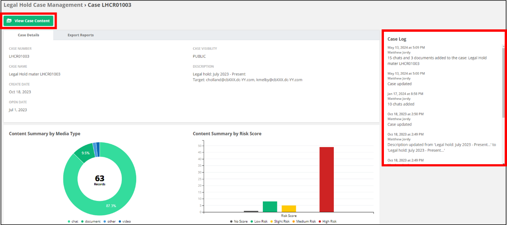

      Finally, click the '**View Case Content**' button in the upper left-hand corner to return to the eDiscovery search page and the associated set of data records for this case.

      

      c. Review workflow for adding records to a Legal Hold case.

      As mentioned previously, since we are logged in with a read-only admin access account (co.read.only@gmail.com), we cannot create or modify Legal Hold cases including associating user data records with the case.

      Instead, the following figures illustrate the process used for creating the existing Legal Hold case and associating user data records.

      **\*\* REFERENCE ONLY -- The following steps have already been completed \*\***

      On the Legal Hold / Case page, administrator/compliance officer would click the **Create Case** button (step 1). Note this option is not available with the read-only login.

      Compliance officer fills in the case details including case number, name, and start date before clicking the **Create** button to generate the legal hold (see Step 2).

      

      After the case was created, the compliance officer would associate user data records by searching for them via eDiscovery, selecting them, and then choosing '**Add to Legal Hold Case**' (step 3).

      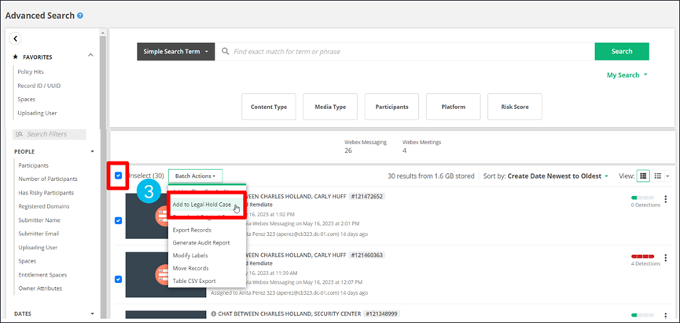

      Finally, the compliance officer selects the Legal Hold case number from the drop-down and clicks **Add** (step 4) to associate the user data records to the case.

      

      **\*\* END OF REFERENCE ONLY -- Proceed with the next section. \*\***

## Observe Webex Anti-Malware Protection (AMP)
Anti-Malware protection (AMP) comes with the Webex Control Hub Extended Security Pack. With this security pack, your organization has access to built-in AMP.

1. Enable Webex AMP on Control Hub.

      a. If not already connected to Control Hub, open the Chrome browser on WKST1 (wkst1.dcloud.cisco.com) and navigate to Control Hub at <https://admin.webex.com/>.

      b. If required, login to Control Hub as the administrator, Charles Holland by entering: **cholland@cbXXX.dc-YY.com** (refer to the eXpo dCloud Session View for domain). Click **Sign In**.

      c. Enter password: **dCloud123!** (refer to eXpo dCloud Session View for last for digits of session ID to use as values for non-SSO password -- dCloudZZZZ!).

      d. Once logged in, navigate to **Messaging** and scroll down to the Anti-Malware File Scanning section. Click to turn Virus and Malware Protection on.

      

      e. Check Scan History to confirm that currently '0' threats have been found.

      Click the '**Start date**' field and select today's date (e.g., 10/21/24 for October 21, 2024).

      Click the '**End date**' field and select tomorrow's date (e.g., 10/22/24 for October 22, 2024).

      **Note:** Ensure you specify **tomorrow's date** as the end date.

      Confirm that the '**Threat Found**' number is '**0**', indicating that no virus or malware has been detected in any files scanned in the last 2 days.

      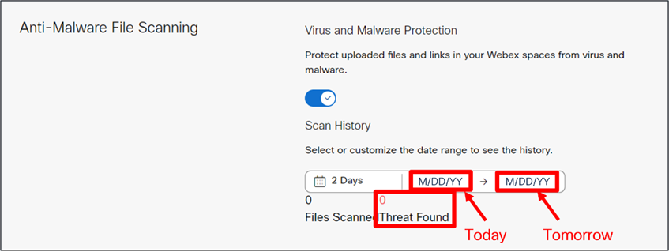

      f. Open and sign-in to the Webex App on WKST1 (wkst1.dcloud.cisco.com) -- if required.

      Login with Charles Holland's account username / password: **cholland@cbXXX.dc-YY.com** / **dCloud123!** (refer to eXpo dCloud Session View for domain and the last 4-digits of the non-SSO password if you didn't complete Module 1).

      g. Create a 1:1 space (Send a message) with user Anita Perez and upload the test_malware.com file.

      The **test_malware.com** file is located on the desktop of Workstation 1. You may have to scroll down to find the file.

      

      h. Observe AMP operation.

      Once uploaded and scanned by Webex, you will notice that the shared file has been marked as suspicious by Webex. Webex immediately blocks the file from being downloaded.

      

      All users in the space will see the attached file as blocked and will not be able to download the file. Validate this with the Webex App on WKST2 (wkst2.dcloud.cisco.com).

      Log current user out of the Webex App on WKST2 (if required) and then, login with Anita Perez's account username / password: **aperez@cbXXX.dc-YY.com** / **dCloud123!** (refer to eXpo dCloud Session View for the domain and the last 4-digits of the non-SSO password if you didn't complete Module 1).

      Once signed in, navigate to the 1:1 space with Charles Holland and note that the **test_malware.com** file cannot be downloaded.

      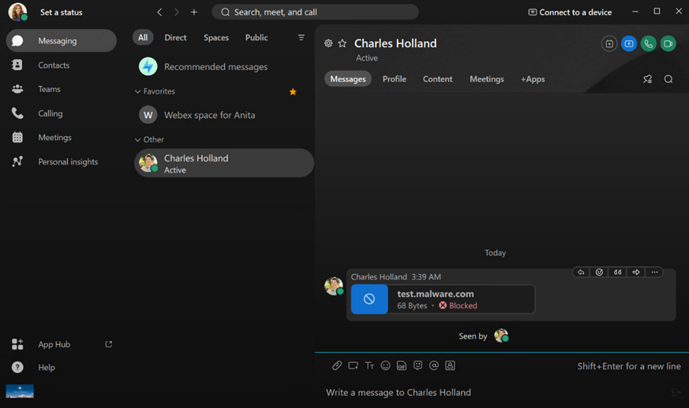

      i. Check the Scan History again to confirm that AMP has logged the threat.

      Go back to Charles Holland's workstation (WKST1). On the Chrome browser on WKST1, return to the previous Control Hub admin session.

      If necessary, navigate to **Messaging** and scroll down to the *Anti-Malware File Scanning* section again.

      Again, select today's date (e.g., 10/21/24) for the '**Start date**' and select tomorrow's date (e.g., 10/22/24) for the '**End date**'.

      **Note:** Ensure you specify **tomorrow's date** as the end date.

      Confirm that the '**Threat Found**' number is now '1', indicating that a virus or malware file has been detected in a file scanned in the last 2 days.

      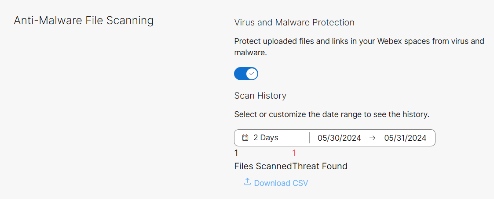

      **Note:** To see more details about the threat(s) you can also download and view an AMP report via the **Download CSV** link.

      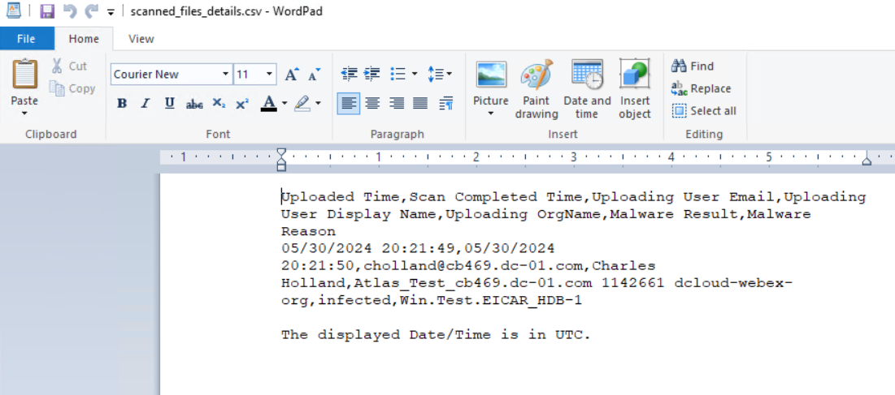
-->

**\*\*\* END of MODULE 3 \*\***

Continue with either Module 1 or Module 2:

- [Module 1: Webex Identity](module1_identity.md)
- [Module 2: Zero Trust Encryption](module2_zero_trust_encryption.md)
- [Module 3: Webex Compliance](module3_compliance.md) *(current)*
- [Conclusion](conclusion.md)
