# Module 3: Webex Compliance  with Webex Compliance Hub and Cisco Secure Access
In this module, you will examine Webex compliance features and capabilities for meetings, calling, and messaging including data loss protection (DLP), anti-malware, and eDiscovery and archiving on an external compliance platform. 

There are 6 sections in this module:

i. [Webex Compliance and Preparing for Compliance Platform Integration](#webex-compliance-and-preparing-for-compliance-platform-integration)

ii. [Explore eDiscovery for Webex Meetings in Webex Compliance Hub](#explore-ediscovery-for-webex-meetings-in-webex-compliance-hub)

iii. [Explore eDiscovery for Webex Calling in Webex Compliance Hub](#explore-ediscovery-for-webex-calling-in-webex-compliance-hub)

iv. [Cisco Secure Access Tenant and AD Onboarding](#cisco-secure-access-tenant-and-ad-onboarding)

v. [Cisco Secure Access Webex Integration and Policy Configuration](#cisco-secure-access-webex-integration-and-policy-configuration)

vi. [Generate User Data and Monitor Secure Access Operations](#generate-user-data-and-monitor-secure-access-operations)

Compliance integrations are critical for protecting an organization's private data from leakage and ensuring that it complies with appropriate rules and laws related to maintaining business and communication records.

Webex supports both built-in compliance capabilities as well as API-based 3rd party integrations. Specifically:

- Webex provides a set of basic built-in compliance capabilities for **data loss protection (DLP), anti-malware protection (AMP), eDiscovery/Legal Hold, and data retention (archive)**.
- Webex also integrates with 3rd party DLP, anti-malware, eDiscovery/Legal Hold, and Archiving applications and services for advanced compliance capabilities including automatic remediation.
- Integrations with compliance services rely on **Webex Events API** to deliver message and meeting data to compliance services.

In this module you will examine the following product-specific capabilities:

- Webex built-in compliance capabilities including:
      - Archiving with flexible data retention.
      - External communication controls, and calling and meeting specific collaboration restrictions.

- Other compliance products:
      - Webex Compliance Hub -- Archiving, eDiscovery, legal hold
      - Cisco Secure Access -- Data loss protection, anti-malware protection

The figure below summarizes the Webex Events API method for compliance platform integration as well as the various platforms explored in this lab and their high-level capabilities. The Webex Events API provides a polling mechanism for compliance platforms to pull user-generated data from Webex for archiving, eDiscovery, and data loss protection (DLP). In the case of DLP, the compliance platform uses additional Webex APIs to remediate policy violations. 

**Webex Events API for Compliance Platform Integration**

{ width="800" style="border: 1px solid #888; border-radius: 4px; background-color: white; padding: 10px;" }

Webex Events APIs as well as remediation APIs require administrators to have the Compliance Officer role to enable and authorize these operations.

For more information for Webex compliance with Webex APIs, please refer to the Webex for Developers site for documentation including:

- Compliance and Events: <https://developer.webex.com/compliance/docs/compliance>
- Webex Events API: <https://developer.webex.com/admin/docs/api/v1/events>
- Webex Messages API: <https://developer.webex.com/messaging/docs/api/v1/messages>
- Webex Meetings API: <https://developer.webex.com/docs/api/v1/meetings>
- Webex Calling API: <https://developer.webex.com/calling/docs/webex-calling-overview>

This lab guide contains coverage for external compliance platforms Webex Compliance Platform and Cisco Secure Access.

**Table 2: Compliance Platform Options, Capabilities, and Applicable sections of this Module**

| Compliance Platform | Capabilities Explored | Module Sections |
|---------------------|----------------------|-----------------|
| **Webex (built-in)** | - Data retention - External communications - Collaboration restrictions | [Webex Compliance and Preparing for Compliance Platform Integration](#webex-compliance-and-preparing-for-compliance-platform-integration) |
| **Webex Compliance Hub** | - eDiscovery & Legal Hold - Archival | [Explore eDiscovery for Webex Meetings in Webex Compliance Hub](#explore-ediscovery-for-webex-meetings-in-webex-compliance-hub)   [Explore eDiscovery for Webex Calling in Webex Compliance Hub](#explore-ediscovery-for-webex-calling-in-webex-compliance-hub) |
| **Cisco Secure Access** | - Data loss protection (DLP) - Anti-malware protection (AMP) | [Cisco Secure Access Tenant and AD Onboarding](#cisco-secure-access-tenant-and-ad-onboarding)   [Cisco Secure Access Webex Integration and Policy Configuration](#cisco-secure-access-webex-integration-and-policy-configuration)   [Generate User Data and Monitor Secure Access Operations](#generate-user-data-and-monitor-secure-access-operations) |

## Webex Compliance and Preparing for Compliance Platform Integration
1. Enable the compliance officer role for user Anita Perez.

      To integrate compliance platforms with Webex, a full administrator with Compliance Officer privileges is required. This role gives the user permissions for DLP integrations, eDiscovery/Legal Hold, and retention and archival integrations. In this step you are assigning the organization Compliance Officer role to Anita Perez.

      Any full administrator can assign the compliance officer role to any person within their organization. However, full administrators <u>cannot</u> assign the Compliance Officer role to themselves, another full administrator must assign the role to them.

      To begin, connect to WKST1. Login will be as Charles Holland (dcloud\\**cholland** // **dCloud123!**).

      a. Open the Chrome browser on WKST1 (wkst1.dcloud.cisco.com) and navigate to Collaboration Control Hub at <http://admin.webex.com>.

      b. Login as full administrator, Charles Holland by entering: cholland@cbXXX.dc-YY.com (refer to the eXpo dCloud Session View Info page to find your DNS domain). Click **Sign In**.

      { width="400" style="border: 1px solid #888; border-radius: 4px;" }
      
      c. Enter password: **dCloud123!** (if you did not complete Module 1 and enable SSO, then the password will be dCloudZZZZ!)

      { width="400" style="border: 1px solid #888; border-radius: 4px;" }

       d. Once logged in, navigate to **Users** and select Anita Perez.

      { width="400" style="border: 1px solid #888; border-radius: 4px;" }

      e. Scroll down and click Administrator roles.

      f. Promote Anita Perez to Compliance Officer for the organization by ticking the box next to 'Compliance officer'. Click **Save**.

      { width="400" style="border: 1px solid #888; border-radius: 4px;" }

1. Review retention settings for Webex Messaging, Meetings, and Calling.

      One of the first compliance considerations is data retention. How long should data be retained before it is deleted? It's important for the compliance officer to understand the retention policies of the organization and to configure Webex to match these policies.

      Before proceeding, **move to WKST2** (wkst2.dcloud.cisco.com). If not already connected, connect to WKST2. Login will be as Anita Prerez (dcloud\\**aperez** // **dCloud123!**).

      a. Open the Chrome browser on WKST2 (wkst1.dcloud.cisco.com) and navigate to Collaboration Control Hub at <https://admin.webex.com>.

      b. Login to Control Hub as the compliance officer, Anita Perez by entering: aperez@cbXXX.dc-YY.com. Click **Sign In**.

      c. Enter password: **dCloud123!** (non-SSO password is dCloudZZZZ!)

      d. Once logged in, navigate to Organization Settings. In the search window at the top of the page, enter 'Retention' to locate the retention settings. Notice there are separate retention policies for Webex Messaging (messages, files), Webex Meetings (recordings, transcripts, chats, Q&A, whiteboards, polls, etc.), and Webex Calling (recordings).

      { width="400" style="border: 1px solid #888; border-radius: 4px;" }

      e. Click **Settings** under Webex App Messaging Retention Policy to review current messaging retention settings.

      { width="400" style="border: 1px solid #888; border-radius: 4px;" }

      By default, the retention period is set to 360 days. Notice that separate retention periods can be set for 1:1 chat and group chat.

      For the purposes of this lab, there is no reason to change the message retention policy, so click **Cancel** to close the Webex Space retention policy window.

      f. Click **Settings** under Webex Meetings Retention Policy to review current meeting retention settings.

      { width="400" style="border: 1px solid #888; border-radius: 4px;" }

      By default, the retention period is set to 360 days. Note that recording retention can be set to purge in 30 days, but by default the recordings follow the meetings retention policy. For the purposes of this lab, there is no reason to change the meeting retention policy, so just click **Cancel** to close the Webex Meetings Retention Policy window.

      g. Click **Settings** under Webex Calling Retention Policy to review current calling retention settings.

      { width="400" style="border: 1px solid #888; border-radius: 4px;" }

      By default, the retention period for call recordings is set to 360 days. Notice that deleted recordings can be set to match the recording rentention period, but by default deleted recordings are set to purge immediately. Note that call details records (CDRs) retention is non-configurable. Again, for the purposes of this lab, there is no reason to change the calling retention policy, so just click **Cancel** to close the Webex Calling Retention Policy window.

      **Note:** Keep in mind that retention policies in Control Hub apply to data retention for data archived or stored on the Webex platform. When relying on a external archival system (e.g., Webex Compliance Hub), the retention setting of that platform will determine how long organization data is retained. Always ensure that the retention period configured in Control Hub and/or the 3rd party platform matches your organization's retention policy for data.

1. Review Webex Meeting controls and restrictions.

      On Control Hub navigate to **Meeting**, click **Settings**, and scroll down to review the data and communication restriction controls available for meetings.

      The internal and external meeting configuration options allow you to control which external users can join your organization's meetings (Internal Webex meetings) and which external organization's meetings (External Webex meeting sites) your users can join. This type of restriction control allows an organization to mitigate potential data loss by disallowing certain attendees and/or meeting sites and may sufficiently address organizational requirements regarding data loss.

      { width="400" style="border: 1px solid #888; border-radius: 4px;" }

      By default, external users are allowed to attend your organization's meetings, and your users can attend external meeting sites. For the purposes of this lab, you can leave the default values (e.g., no restrictions).

      In addition to controlling which users can join meetings and which meetings users are allowed to join, you can also restrict specific meeting features for both internal and external meetings.

      Scroll down and review the various meeting capabilities that can be disabled for internal or external meetings. For example, you could disable in-meeting tools like polling, Q&A, chat, and recording. This type of meeting data restriction control allows an organization to mitigate and reduce potential data loss by disallowing certain channels of communication (e.g., Q&A, chat, polling, etc.).

      { width="400" style="border: 1px solid #888; border-radius: 4px;" }

      { width="400" style="border: 1px solid #888; border-radius: 4px;" }

      For the purposes of this lab, please leave the default values (e.g., no restrictions).

1. Review Webex Calling controls and restrictions

      On Control Hub navigate to **Calling**, click **Settings**, then select **Webex App**, and scroll down to 'In-call feature access'. Review the available in-call features that can be disabled.

      An administrator can eliminate potential data leakage vectors to disable. For example, an adminstrator could prevent users from sharing content during a call (toggle off **Screen Sharing**) or sharing video on the call (toggle off **Video on desktop**/**Video on mobile**). Likewise, the administrator can prevent escalation of a call to a meeting (toggle off **Move call to meetings on desktop app**). These restrictions may sufficiently address organizational requirements regarding calling data loss.

      { width="400" style="border: 1px solid #888; border-radius: 4px;" }

      Note that by default, there are no restrictions for in-call features. For the purposes of this lab, please leave the default values (e.g., no restrictions).

Now that you've enabled the Compliance Officer role for user Anita Perez and reviewed Webex's built-in data retention and restrictions capabilities, it's time to move on and explore Webex integration to an external compliance platform.

## Explore eDiscovery for Webex Meetings in Webex Compliance Hub

eDiscovery is the mechanism for searching through and retrieving data from the retained user-generated data archive of an organization. This ensures that the compliance officer has full access to all retained user data as needed for compliance management and enforcement. Because **eDiscovery** enables search and retrieval of data, this is often discussed together with **Archiving** capabilities which pertains with how and where the data that is being searched is stored.

Webex has built-in eDiscovery/Legal Hold and archiving or data storage capabilities which may be sufficient for some organizations. The built-in Webex eDiscovery Search and Extraction portal provides Webex organizations the ability to access Webex stored and retained user-generated data. And as discussed earlier, there are retention settings in Control Hub which determine how long user-generated data is stored on the Webex platform. Note that exploring the Webex eDiscovery Search and Extraction portal is not part of this lab. However, for your reference, the [Appendix](appendix.md#explore-webex-ediscovery-search-and-extraction-portal) of this lab guide has a module that covers the built-in Webex eDiscovery tool. If you are interested in this module, please complete the rest of the lab before exploring.

For advanced implementations of eDiscovery and Archiving, an external compliance platform integration is generally preferred.

Webex Compliance Hub has a full set of compliance capabilities including eDiscovery, legal hold, and archiving for collaboration platform data. In this module you'll explore the archiving, legal hold and eDiscovery capabilities of Webex Compliance Hub.

### Webex Compliance Hub Archiving

1. Login to Webex Compliance Hub management portal with read-only admin login.

      As you examine Webex Compliance Hub eDiscovery capabilities, it helps to have some historical user data (something beyond just data you might generate today) so you can search and review data over a period days and weeks. In this section you'll use a read-only administrator account for a Webex Compliance Hub organization which contains months of user-generated message, meeting, and calling data.

      From the Chrome browser on Anita Perez's workstation (WKST2), navigate to the Webex Compliance Hub management portal at <https://useast.thetalake.ai/>.

      Login using the read-only administrator account credentials (email / password): **co.read.only@gmail.com** / **dCloud123!**

      Once logged in navigate to the Policies page by clicking '**Policies**' in the navigation menu at the top of the page.

1. Review the Retention Library page.

      The retention library or archive is the final resting place for the data coming from the Webex platform, so it's important to understand where and how your data is archived before even thinking about eDiscovery.

      On the Webex Compliance Hub platform archiving is managed under the Policies sub-section '**Content Destination**'. Retention libraries are managed here.

      Navigate to the Archive retention libraries page by clicking 'Content Destination' in the left-hand navigation menu to expand, and then click 'Retention Libraries'.

      { width="400" style="border: 1px solid #888; border-radius: 4px;" }

      By default. Webex Compliance Hub automatically configures a retention library called 'Default' when the Webex Compliance Hub org is created.

      { width="400" style="border: 1px solid #888; border-radius: 4px;" }

      Notice that the default retention period for the default retention library is 'Forever', meaning that user data for your org will be archived and maintained indefinitely. Data records have been created and archived to this retention library (Record Count = *nnn*).

      **Note:** *You will see a second retention library called 'Delete Storage'. This retention library is for lab operational purposes. We use this library to clear data records from the Webex Compliance Hub tenant after the lab has been completed.*

      Webex Compliance Hub allows for the creation of multiple retention libraries within an organization enabling you to segment data archiving to accommodate variable retention periods and storage requirements.

      Given this is a read-only account, you won't be able to edit the retention library and see details. Below is what the retention library edit dialog [would look like if you were to edit or create a new retention library.

      { width="400" style="border: 1px solid #888; border-radius: 4px;" }

      As mentioned earlier, this default library currently has no retention period set so data will be maintained indefinitely. If the compliance officer or administrator wanted to adjust the retention period, they simply enable the retention period and then specify the retention period in days.

### Webex Compliance Hub Legal Hold

Webex Compliance Hub also provides Legal Hold support. Legal Hold is a mechanism for creating and managing cases related to legal investigations where specific user data records must be maintained beyond the normal corporate data retention policies. User data records associated to a Legal Hold are maintained indefinitely until the Legal Hold case is closed.

Webex Compliance Hub supports two types of Legal Hold:

- Cases - A case functions as an active eDiscovery workshop or a subset of an investigation. It is focused on specific artifacts rather than identities or custodians.
- Matters – A matter is a traditional, custodian-heavy legal hold vehicle. It is designed to mitigate the risk of data spoliation from the moment a duty to preserve arises.

<!-- list break -->

1. Review Case Holds.

      a. Navigate to the Webex Compliance Hub legal hold Cases page.
      On Webex Compliance Hub navigate to **Holds > Cases** on the top navigation menu to reach the Cases page.

      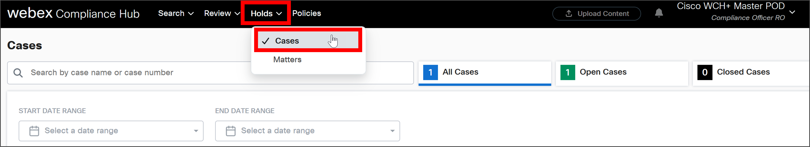{ width="400" style="border: 1px solid #888; border-radius: 4px;" }

      b. Review existing legal hold case.
      Notice that a legal hold case already exists. Case number **LHCR01003** has already been created on the Webex Compliance Hub org you are currently logged into.

      Let’s review the existing legal hold case.

      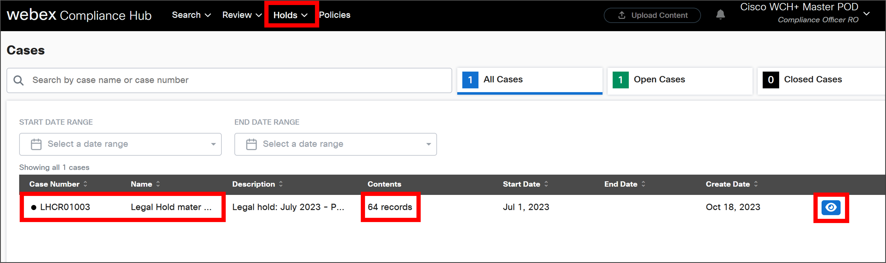{ width="400" style="border: 1px solid #888; border-radius: 4px;" }

      Notice this existing open case has 64 user data records already associated to it which will be maintained beyond the current retention period as long as the case remains open.

      Click the view icon ({ width="20" style="border: 1px solid #888; border-radius: 4px;" }) on the right to review the case details.

      The case details screen shows the basic details about the case including media type and risk score content summary graphics.
      
      A case log is maintained and displayed on the right hand-side of the page providing details about this case.

      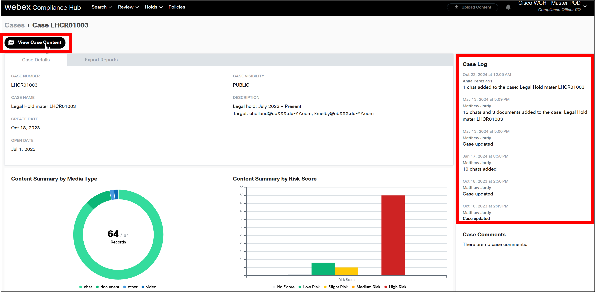{ width="400" style="border: 1px solid #888; border-radius: 4px;" }

      After a case is created, the compliance officer associates user data records to the case by searching for them via eDiscovery (Search), selecting them individually or in bulk, and then choosing ‘Add to Case’.

      Finally, click the ‘**View Case Content**’ button in the upper left-hand corner to navigate to the eDiscovery search page for the associated set of data records in this case.

      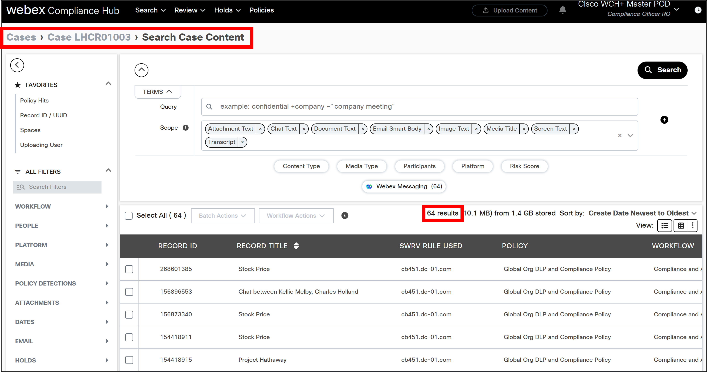{ width="400" style="border: 1px solid #888; border-radius: 4px;" }

1. Review Matter Holds.

      a. Navigate to the Webex Compliance Hub legal hold Matters page.

      On Webex Compliance Hub navigate to **Holds > Matters** on the top navigation menu to reach the Cases page.

      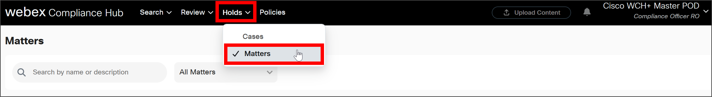{ width="400" style="border: 1px solid #888; border-radius: 4px;" }

      b. Review existing legal hold matter.

      Notice that a legal hold matter already exists. Matter ‘Patent Matter’ has already been created on the Webex Compliance Hub org you are currently logged into.

      Let’s review the existing legal hold matter.

      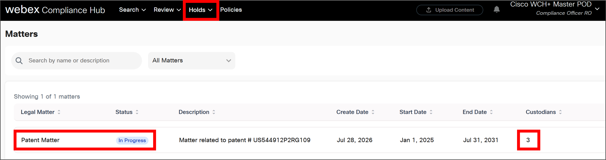{ width="400" style="border: 1px solid #888; border-radius: 4px;" }

      Notice this existing in-progress case called ‘Patent Matter’ has 3 data custodians associated to it which means these users’ data will be preserved beyond the current retention period as long as the matter remains open.

      Click the matter to load the details screen which shows basic information about the matter including description, matter start and end dates.

      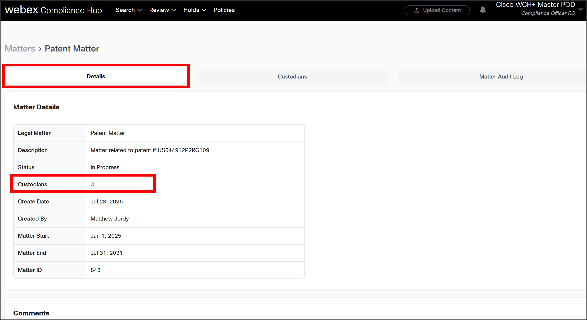{ width="400" style="border: 1px solid #888; border-radius: 4px;" }

      Click the ‘Custodians’ button at the top to load the list of data custodians associated to this matter. Additional custodians can be added or deleted as required. 

      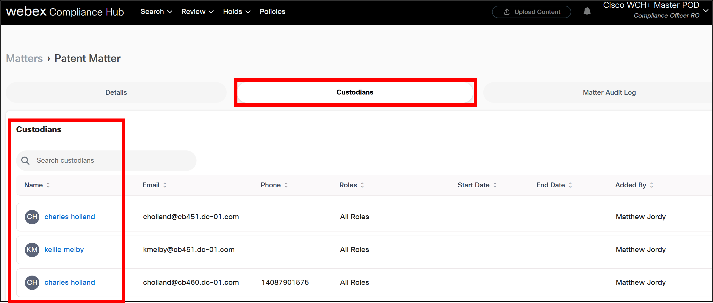{ width="400" style="border: 1px solid #888; border-radius: 4px;" }

      A matter audit log is maintained and displayed on the right hand-side of the page providing details about this case.

      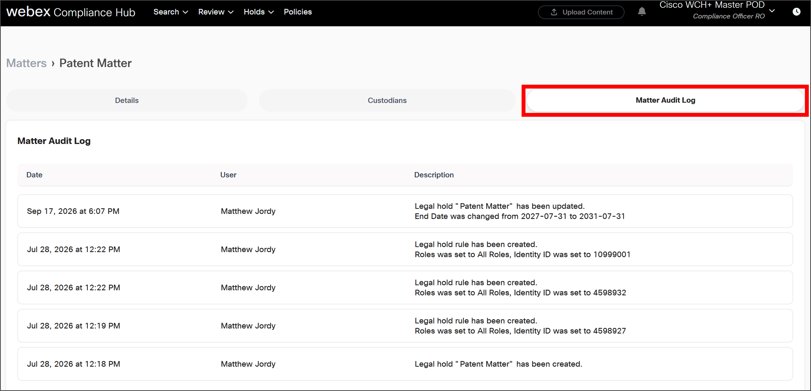{ width="400" style="border: 1px solid #888; border-radius: 4px;" }

      Once the matter is created, any data records created by any of the associated custodians are automatically added to the matter data set. 
      To review data records for this legal hold matter, navigate to **Search > Search**. In the left-hand side panel, scroll down and click ‘HOLDS’ to expand the filter and then, select ‘Legal Matter’.  

      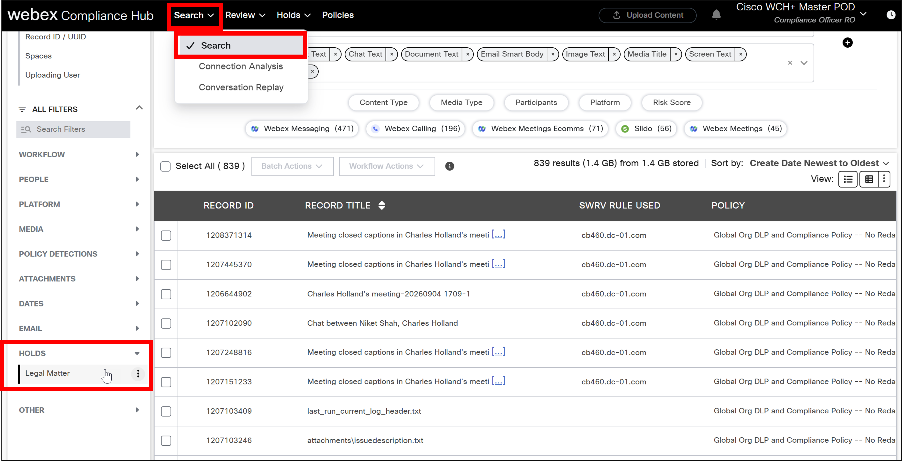{ width="400" style="border: 1px solid #888; border-radius: 4px;" }

      Finally, select ‘*Patent Matter (3 custodians)*’ from the drop-down list and then click ‘Apply’ to filter the list of records.

      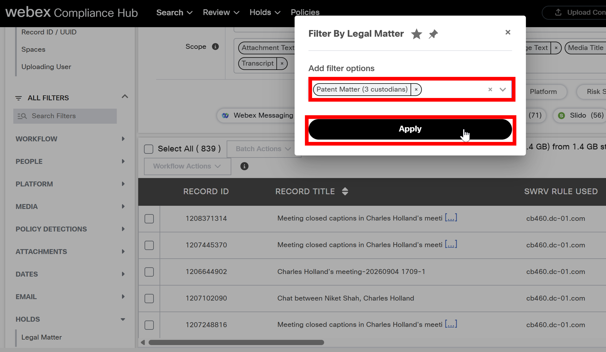{ width="400" style="border: 1px solid #888; border-radius: 4px;" }

      Notice that 262 records have automatically been associated to this matter based on the 3 assigned custodians.

      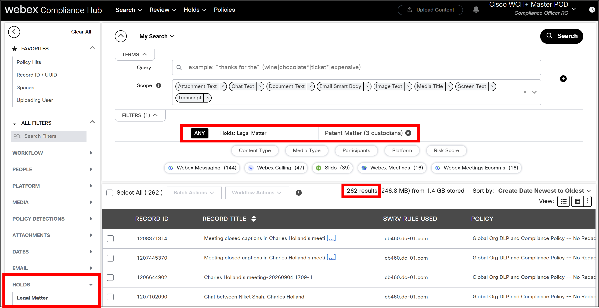{ width="400" style="border: 1px solid #888; border-radius: 4px;" }

Before proceeding click ‘Clear All’ at the top of the left-hand navigation window to clear the search parameters.

### Webex Compliance Hub eDiscovery
1. Navigate to Webex Compliance Hub eDiscvoery.

      Click 'Search' from the navigation menu and select 'Search' for eDiscovery where the administrator or compliance officer can search against all retained user data records across all media types including messages, files, and meeting and calling recordings. All available records are retrieved by default.

      { width="400" style="border: 1px solid #888; border-radius: 4px;" }

      Note that this Webex Compliance Hub org has many Webex Messaging, Meeting, and Calling data records and lots of filters that can be applied to search easily through the records.

### eDiscovery for Webex Meetings
Please spend some time reviewing some of the compliance options for Webex meetings available with Webex Compliance Hub.

Webex Compliance Hub processes data from in-meeting chat, polls, Q&A, shared files, and other meeting content (like the data you just generated). Webex Compliance Hub can also detect content from users' audio/video streams such as, files shared visually or verbally during the meeting (e.g., an attendee holding a paper with sensitive information written on it or verbally mentioning credit card numbers/SSN/DOB). You will learn how Webex Compliance Hub can help us flag these violations as well.

1. Review Webex Meeting data 

      You will find pre-populated data that demonstrates some of the violations and types of data that Webex Copmliance Hub can process. Once logged in click the **Search** tab (1), click the **Search** option (2), enter the search term **Poll** (3), and click the **Search** (4) button. 
      
      Note: the screenshot below is using the **Table** viewing format. This can be found on the right side of the screen near the **Sort by** option (5).

      { width="400" style="border: 1px solid #888; border-radius: 4px;" }

      Explore and review few records that have Meeting Poll
      
      Close the Poll Search by clicking on the "x" next to search.

      { width="400" style="border: 1px solid #888; border-radius: 4px;" }
    
      Repeat the search process with **Q&A** (1) as the search term, select **Slido** (2) as filter and click the **Search** button (3).

      { width="400" style="border: 1px solid #888; border-radius: 4px;" }

      Before proceeding, close the Q&A Search by clicking on the "x" next to search and the 'x' next to 'Slido'

1. Search for and review records with specific built-in policy violations.

      In the left-hand navigation menu, under the **FAVORITES** section, click **Policy Hits**. In the resulting dialog box, scroll through the drop-down menu and select the following built-in detection rules then click **Apply**:

      **'Credit Card Number (CC#) -- Audio, Chat, Email, Image, AI Interaction, and Attachment'**, **'CryptoCurrency Discussions -- Video, Audio, Chat, Eamail, Image, AI Interaction, and Attachments'**, and **'Social Security Numbers(SSN) -- Audio, Chat, Email, Image, AI Interaction, and Attachments'**

      { width="400" style="border: 1px solid #888; border-radius: 4px;" }

1. Refine search to include specifc media types.

      Scroll down to the **Media** category in the left-hand navigation menu and click to expand the filter. Click **Media Type** and tick the boxes for **Audio** and **Video** then click **Apply**.

      { width="400" style="border: 1px solid #888; border-radius: 4px;" }

1. Review a specific meeting data record. 

      Select any meeting, you will observe a recording of the meeting and flags where the users have violated policies. You can use **Record ID** 576714780 as an example.

      { width="400" style="border: 1px solid #888; border-radius: 4px;" }

      If you are reviewing record 576714780, scroll to approximately 7 minutes and 06 seconds into the meeting and you will see that Webex Compliance Hub has the ability to flag documents held up to the screen containing PII and confidential data.

      Feel free to take a few minutes and review a couple more records for various other compliance policy violations to get a good understanding of Webex Compliance Hub detection capabilities. Once you have completed reviewing the options, clear out all the filters that you have selected by clicking "Clear All" on the top left of the screen.

      { width="400" style="border: 1px solid #888; border-radius: 4px;" }

## Explore eDiscovery for Webex Calling in Webex Compliance Hub

Please spend some time reviewing some of the compliance options for Webex Calling available in Webex Compliance Hub.

Webex Compliance Hub provides archiving, eDiscovery, and supervision for Webex Calling with automated detection of compliance risks in audio content with comprehensive support for Webex Calling, including recordings, call detail records (CDRs), and business texting (SMS). 

In this section you will review Webex Calling data records in Webex Compliance Hub. 

1. Search for Webex Calling data records.

      Navigate to eDicovery by clicking **Search** and then selecting **Search**. You will find pre-populated data that demonstrates some of the violations and types of data that Webex Compliance Hub can process. 
      
      Click **Webex Calling** to add a platform filter. 
      
      Note: the screenshots below show the **Table** view. This can be found on the right side of the screen near the **Sort by** option.

      { width="400" style="border: 1px solid #888; border-radius: 4px;" }

1. Review list of records.

      You will find two types of Webex Calling records here:

      - Call detail records (CDRs)
            These records have a <u>Record Title</u> that starts with **'Call between...'**.  
      - Call recordings
            These records have a <u>Record Title</u> that starts with **'Call with...'** and ending with a numeric sequence corresponding to the calling number and call timestamp.

      **CDRs**

      If the call is internal (**SIP_ENTERPRISE**) you will see a pair of CDRs for each call - one for each call leg: originating, terminating.
      
      If the call is external (**SIP_NATIONAL** - to PSTN, or **SIP_INBOUND** - from PSTN) you will see a single CDR for each call - the internal call leg: originating or terminating.

      **Call Recordings**

      In addition to the CDRs described above, if the call is recorded, you will also find a corresponding recording record.  

      { width="400" style="border: 1px solid #888; border-radius: 4px;" }

      Note: CDR data records will be the same for both standard and zero trust end-to-end encrypted (E2EE) Webex calls. However, as discussed in Module 2, zero trust E2EE calls do not support call recording (or other features like closed captioning) and as such the call will fall back to standard encryption. So if a call has a corresponding audio recording, then it was not a zero trust E2EE call. On the oher hand, for any unrecorded call it would be impossible to tell the difference between a standard encrypted call and a zero trust E2EE call.

 1. Review CDR data record details
      
      Begin to review data records for Webex Calling. Start with an internal call.

      Scroll down and locate the set of call records: 75052**6890**, 75052**6883**. These should be listed sequentially and correspond to the terminating and originating legs of an internal call.

      To review a record, click the record. Select the **Attributes** record to see the call detail information.

      { width="400" style="border: 1px solid #888; border-radius: 4px;" }

      First, note the CallType for each record is **SIP_ENTERPRISE** indicating this is an internal call.
      
      Next, look at the **CorrelationId** attribute and notice that it is the same for both records (3d8bafcd-519b-4ec9-86cd-c68aa4565870). This indicates that these two records are part of the same call. Later you will see that the call recording data record has the same CorrelationId.

      Notice one of the records (75052**6883**) is the originating leg: **CallDirection=ORIGINATING**. And the other record (75052**6890**)is the terminating leg: **CallDirection=TERMINATING**.

      Additional detailed call information is displayed including call duration (CallDurationSeconds), times (CallAnswerTime, CallStartTime), numbers (CalledNumber, CallingNumber), and caller ID (CalledLineId, CallingLineId).

      { width="400" style="border: 1px solid #888; border-radius: 4px;" }

1. Review a call recording record

      Now let's look at record 75052**7005**. This should be listed sequentially above the terminating and originating CDRs reviewed above. This record includes an audio recording of the call.

      { width="400" style="border: 1px solid #888; border-radius: 4px;" }

      First, review the Attributes of the record. Observe that the **CorrleationId** (3d8bafcd-519b-4ec9-86cd-c68aa4565870) matches the two CDRs we reviewed above indicating this is the corresponding recording of that call. Also notice that the **CallDirection** parameter is 'ORIGINATING' indicating the call recording was started on the originator's leg of the call  
      
      Next, select **Content Review** to display the analysis of the recording made by the Webex Compliance Hub platform AI Compliance Advisor. This automated analysis indicates locations during the call recording where potential violations of compliance policy occurred. For example, the Compliance Advisor flagged multiple cases where **'cryptopcurrency'** is mentioned during the call which is a violation of the built-in 'CryptoCurrency Discussions' policy. Likewise, the Compliance Advisor flagged instances of social security numbers, credit card numbers, material nonpublic information (insider trading), and sensitive documents being discussed on the call. This analysis is a great starting place for the Compliance Officer when reviewing data records on the Webex Compliance Hub platform.
      
       

      Review the details of this analysis noting the policies that were violated. Using the timestamps in the Content Review analysis see if you can locate one of the potential violations in the audio recording.
      
      Next, review the transcript of the recording. Select **Transcript** to display the transcript of the audio reocrding generated by the Webex Compliance Hub platform AI Compliance Advisor. This transcript along with the automated analysis by the AI Compliance Advisor keeps the Compliance Officer from having to review the audio recording saving a lot of time.

            

      Finally, try translating the transcript into another language. Click **Translate**, select the language to translate to from the dropdown (e.g., Spanish) and then, click **Translate** again. Notice the transcript has been translated into the language selected. This can be very useful if the call audio is in a language that the Compliance Officer is unable to understand.

      { width="400" style="border: 1px solid #888; border-radius: 4px;" }
      
1. Review other Webex Calling data records
      
      Take a few minutes to review some other records to see other types of calls and other possible compliance policy violations.

      For example, look at the records for a PSTN call with a single CDR data record and the corresponding audio recording data record. Scroll down and locate data recordings: 7312**5943** and 7312**5955** which are the respective CDR and audio recording for a PSTN call. (Hint: To find these records faster, use the side panel to select a 'Create Date' filter with a custom data range of January 19, 2026 12:00AM - January 19, 2026 11:00PM. This filter will return just these two data records).

      Note that under Attributes for both of these records, the **CorrelationId** (060b2e06-b871-435e-8a60-33c6be7862db) is the same indicating they are from the same call. The <u>CallType</u> attribute of the CDR is **SIP_NATIONAL** which indicates this is a PSTN call. This is an outbound call (<u>CallDirection</u> = **ORGINATING**) to the PSTN and as mentioned previously, this is the only call leg CDR available since the system has no visibility to the PSTN side of the call. 
      
      (Note: If this were an inbound PSTN call, then the <u>CallType</u> would be **SIP_INBOUND** and the <u>CallDirection</u> would be **TERMINATING**)

      Feel free to review the Content Review and Transcript details for the audio recording data record.

      Once you are done exploring other Webex Calling data records, before you proceed, ensure that you have cleared any filters and logged out of Webex Compliance Hub. 
      
      This concludes Webex Compliance Hub compliance sections.

      Note: Performing a Webex integration to Webex Compliance Hub with your Webex org is not part of this lab. However, for your reference, the [Appendix](appendix.md#webex-integration-to-webex-compliance-hub) of this lab guide has a module that covers the integration of a Webex org to a Webex Compliance Hub tenant. If you are interested in this exercise, please complete any portion of the main lab you plan to do before exploring the exercises in the Appendix.

## Cisco Secure Access Tenant and AD Onboarding
In this section of the lab, you will integrate the on-premises Active Directory (AD) to your Secure Access tenant. Integrating your on-premises directory with Secure Access ensures that data compliance is applied to the common identities across your organization.

At the end of this section, you will have synchronized on-premises AD users into Secure Access.

**Initial Secure Access Login**

First, you need to access your Secure Access tenant so you can set up a connection between Secure Access and your Active Directory (AD) server.

1. Connect to the AD server (ad1) via Remote Desktop.
      
      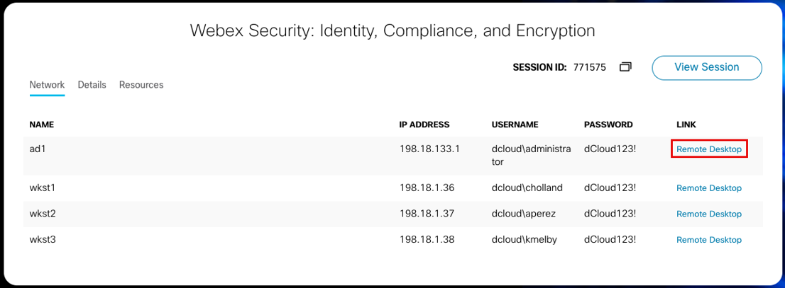{ width="400" style="border: 1px solid #888; border-radius: 4px;" }
**
1. Open the **DUO – Secure Access** folder on the desktop, then open the *SA-URL.txt* document.
      
      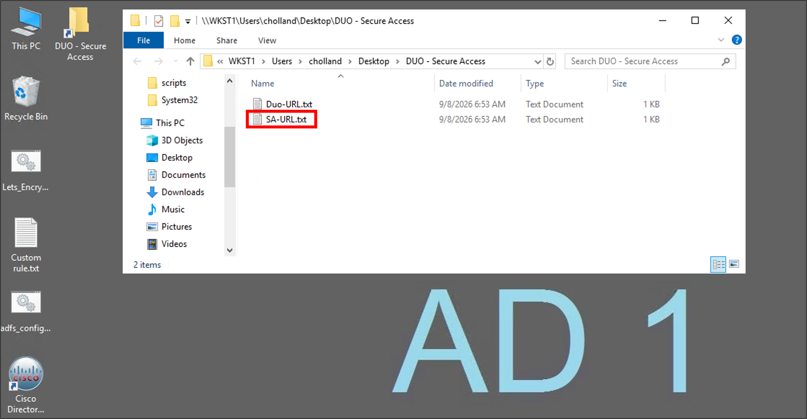{ width="400" style="border: 1px solid #888; border-radius: 4px;" }

1. Copy and paste the URL in this document into the browser.
      
      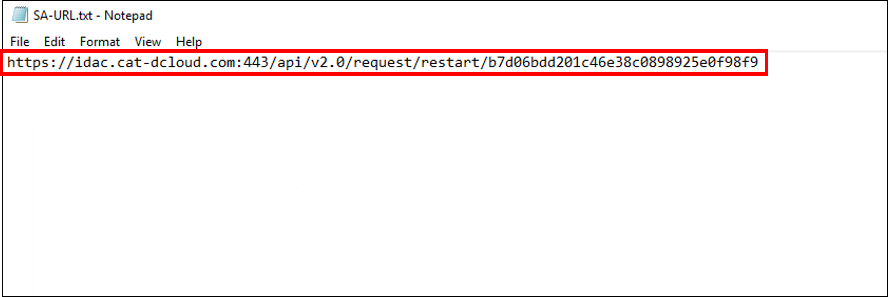{ width="400" style="border: 1px solid #888; border-radius: 4px;" }

1. Begin initial login to Secure Access with the copied link.
      
      In the Chrome browser on AD1, enter the copied Secure Access URL The browser will return a 403 App Not Assigned, scroll down and click ‘Go to login page’
      
      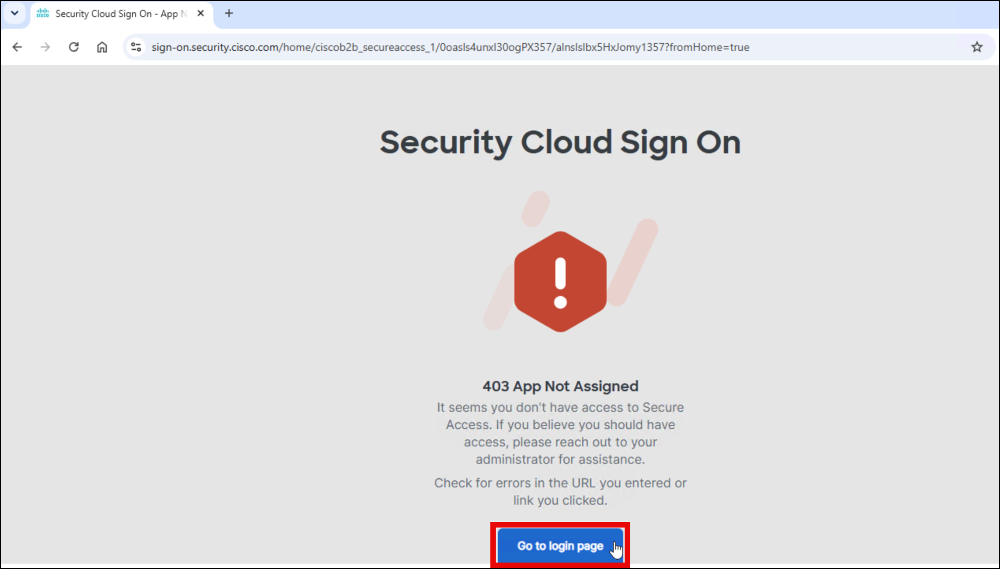{ width="400" style="border: 1px solid #888; border-radius: 4px;" }
      
      On the Application Portal page click the ‘Launch ’ button in the Secure Access tile under Applications to login to the Secure Access portal.
      
      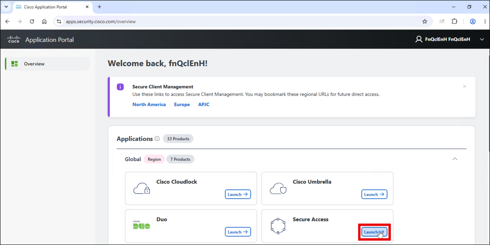{ width="400" style="border: 1px solid #888; border-radius: 4px;" }
      
      Accept the license agreement and click through any additional prompts.
      
      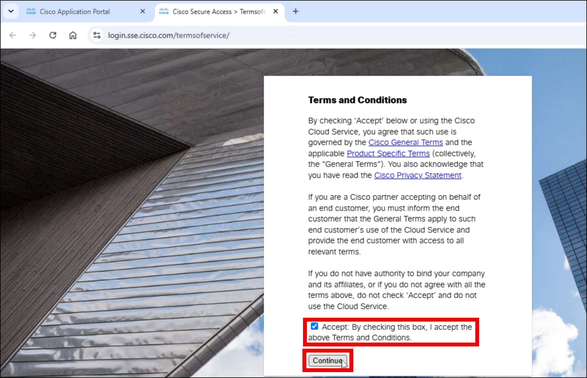{ width="400" style="border: 1px solid #888; border-radius: 4px;" }
      
      If a log in dialog appears, click the ‘X’ in the upper right-hand corner to close the window and proceed to the Secure Access portal.
      
      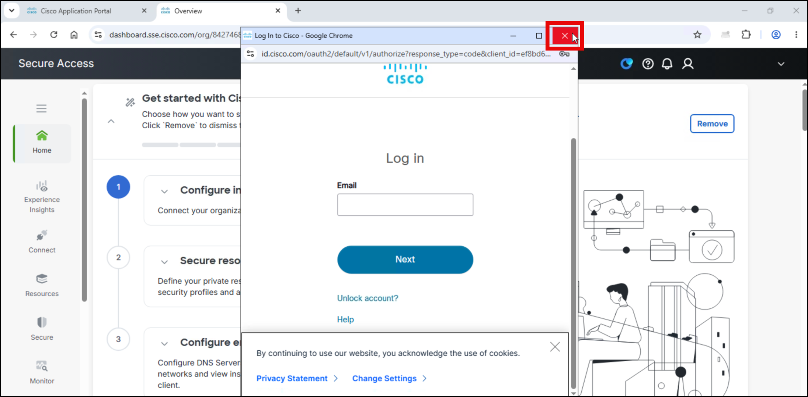{ width="400" style="border: 1px solid #888; border-radius: 4px;" }
      
      The Secure Access portal is used throughout the lab to configure and manage the Secure Access tenant.

**Directory/User Onboarding**

Now that the Secure Access portal is ready, the first task is to integrate the organization’s directory (in this case Active Directory) with the Secure Access platform, so it has visibility to the organization’s users. This is important not only for identifying users in the context of compliance violations (e.g., data loss prevention, anti-malware protection), but also if the organization plans to leverage Secure Access for network, user, and application access control. 

For the purposes of this lab, the focus is on user identity for data loss prevention (DLP) policy violations.

1. Prepare Active Directory for Integration with Secure Access. 
      
      a. Add a user account in AD for authenticating the Secure Access cloud connecter
      
      On the Active Directory/Domain Controller (DC)) server (AD1) open Active Directory Users and Computers
      
      Right-click the dCloud object and select New > User
      
      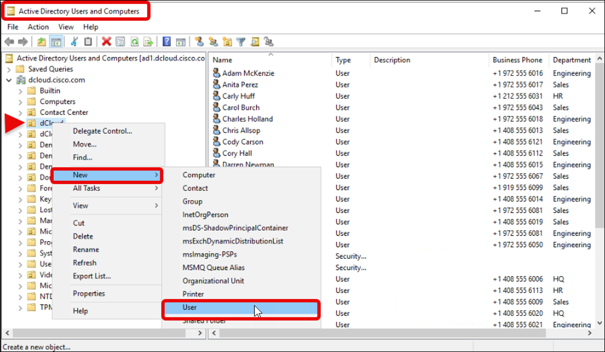{ width="400" style="border: 1px solid #888; border-radius: 4px;" }
      
      Configure user as follows:

      - First name:**Cisco**
      - Last name: **Connector**
      - User login name: **Cisco_Connector**
      
      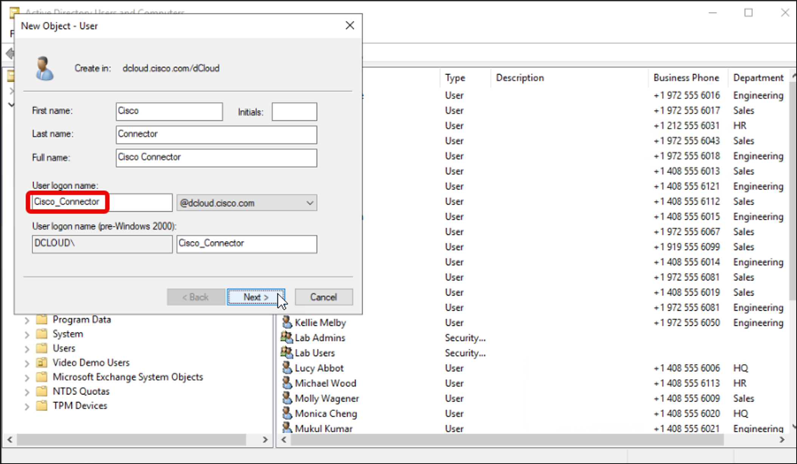{ width="400" style="border: 1px solid #888; border-radius: 4px;" }
      
      Click ‘Next’ and enter password (**dCloud123!**) twice to confirm and untick all boxes except ‘Password never expires’
      
      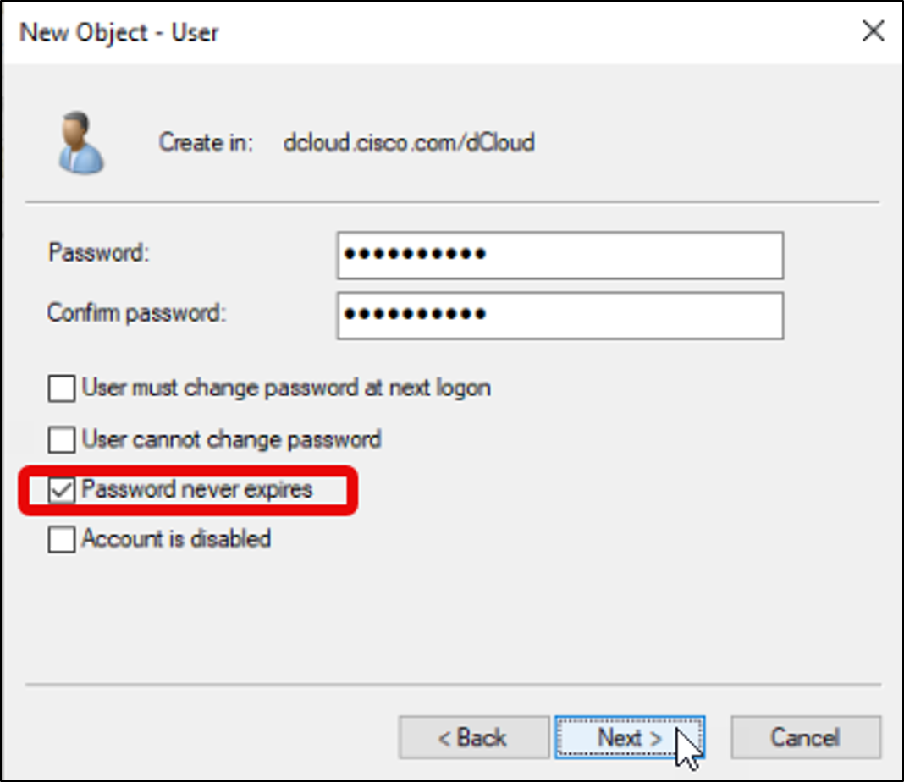{ width="400" style="border: 1px solid #888; border-radius: 4px;" }
      
      Click ‘Next’ and then ‘Finish’ to complete user creation.
      
      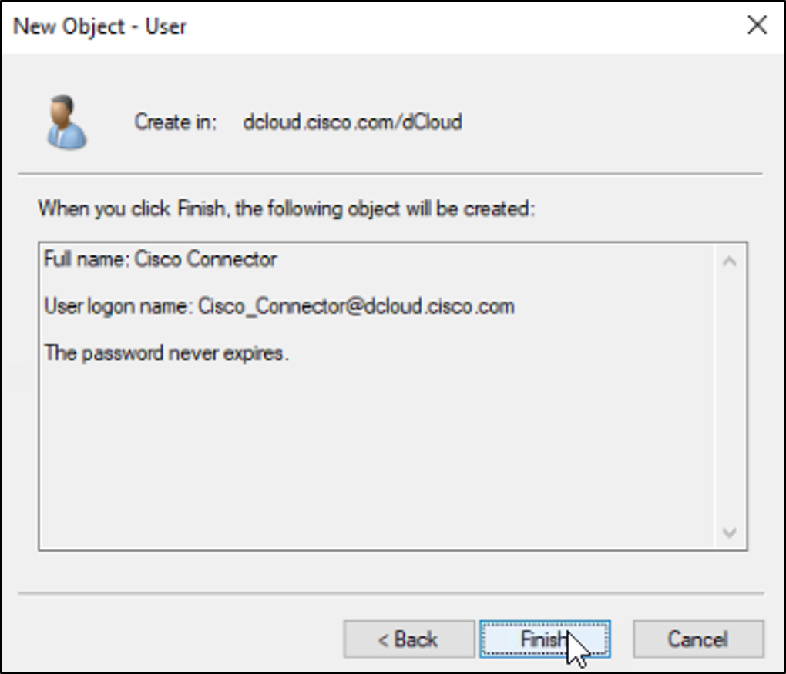{ width="400" style="border: 1px solid #888; border-radius: 4px;" }
      
      b. Configure account group membership.
      
      To ensure the Cisco_Connector account has appropriate permissions to enable directory synchronization to Secure Access, make the account a member of the Enterprise Read-only Domain Controller group.
      
      Right-click the **Cisco_Connector** user and select ‘Properties’ and then select the ‘Member Of’ tab
      
      Click ‘Add’ and on the subsequent dialog, type ‘Enterprise Read-only’ and click ‘Check Name’ to load the ‘Enterprise Read-only Domain Controller’ group name and then click 'OK’ to add the account to this group
      
      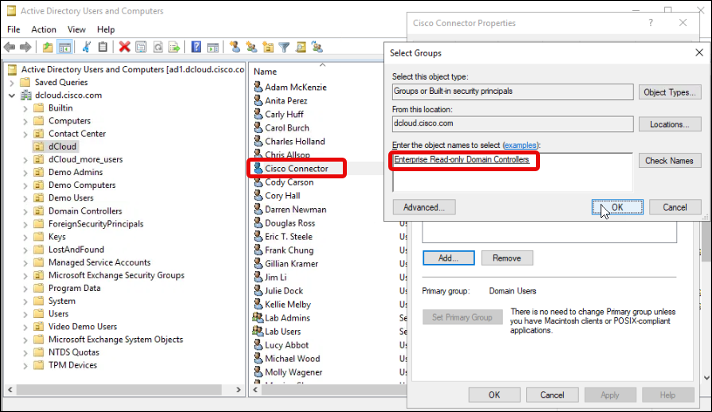{ width="400" style="border: 1px solid #888; border-radius: 4px;" }
      
      Confirm the group is now showing in the member of list and click ‘OK’ to save.
      
      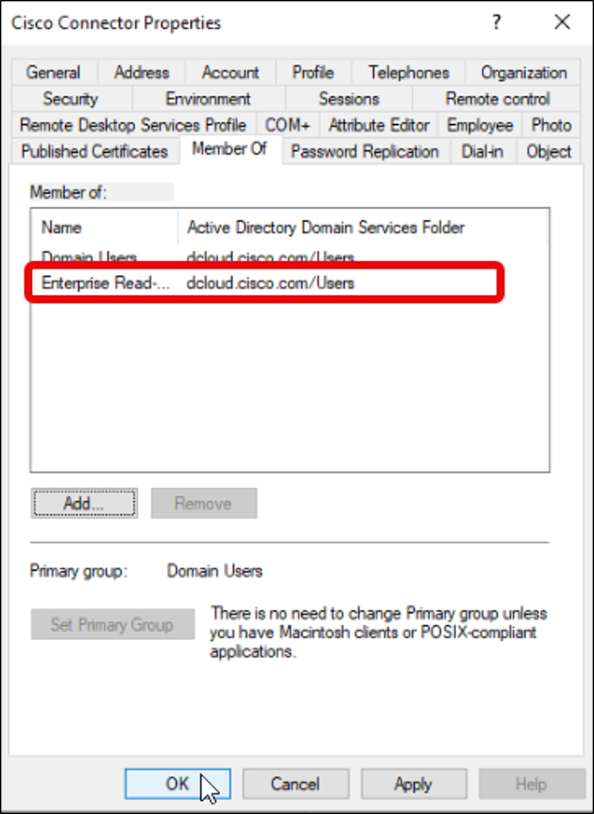{ width="400" style="border: 1px solid #888; border-radius: 4px;" }
      
      c. Set Audit account logon events group policy to both success and failure 
      
      Open the Group Policy Management application, and under Domain Controllers, right-click ‘Default Domain Controllers Policy’ and select ‘Edit…’ to edit the policy.
      
      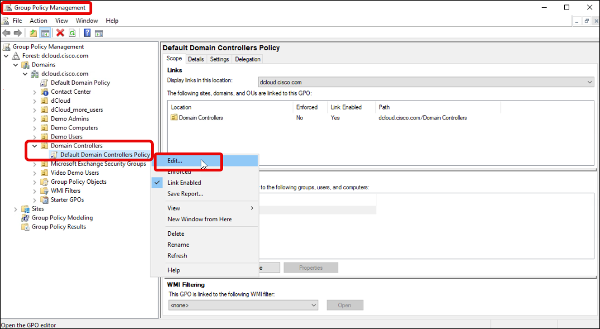{ width="400" style="border: 1px solid #888; border-radius: 4px;" }
      
      Then, under *Computer Configuration > Policies > Windows Settings > Security Settings > Local Policies > Audit Policy* right-click 'Audit logon events' and select Properties. Finally, tick ‘Define these policy settings’ and then, tick 'Success’ and ‘Failure' and click ‘OK’ to save.
      
      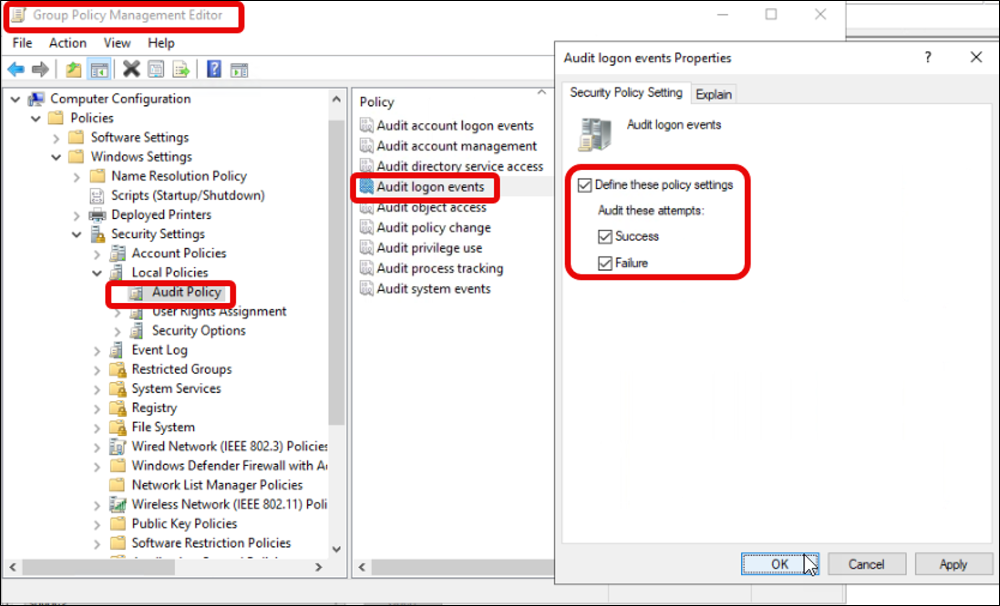{ width="400" style="border: 1px solid #888; border-radius: 4px;" }

1. Prepare Secure Access Platform for Directory Integration 
API keys are required for securing the integration between Secure Access and the Active Directory server
      
      a. Generate KeyAdmin Key
      
      Return to Secure Access portal in the Chrome browser on AD1. If the login has timed out, re-enter the Secure Access encoded URL (or click on the bookmark created earlier)
      
      Navigate to **Admin > API Keys** and notice there are 0 API Keys and 0 KeyAdmin Keys. You must create a KeyAdmin Key in order to generate an API Key.
      
      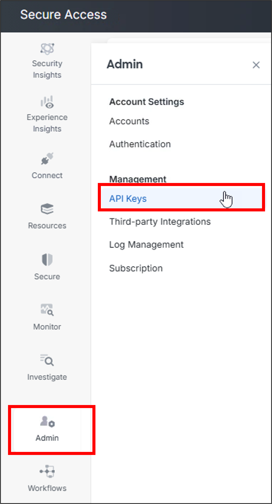{ width="400" style="border: 1px solid #888; border-radius: 4px;" }
      
      To add an Admin key, click ‘KeyAdmin Keys’ and the +Add button. 
      
      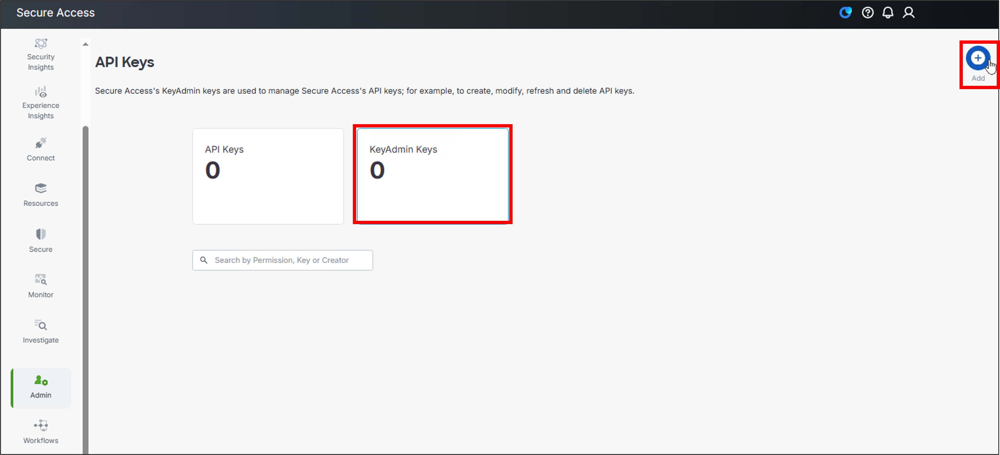{ width="400" style="border: 1px solid #888; border-radius: 4px;" }
      
      On the subsequent screen enter ‘**ADadmin Key**’ for the name  and tick the box next to all permissions and click ‘**CREATE KEY**’ to generate the key.
      
      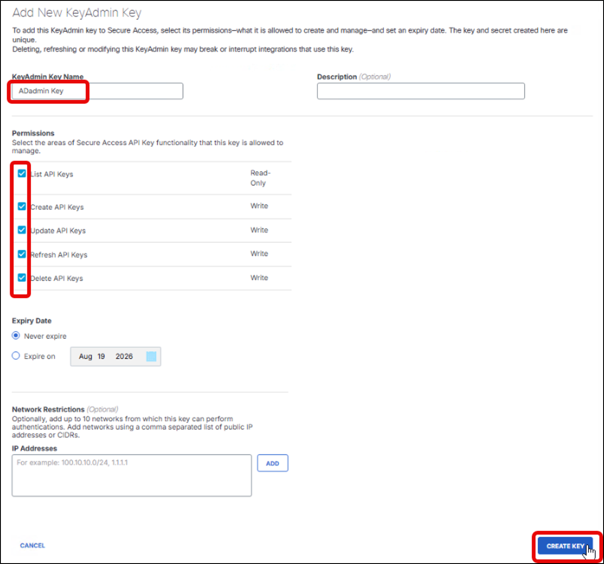{ width="400" style="border: 1px solid #888; border-radius: 4px;" }
      
      Copy both the Admin API Key and the Admin API Key Secret to a text file for safe keeping and reuse.
      
      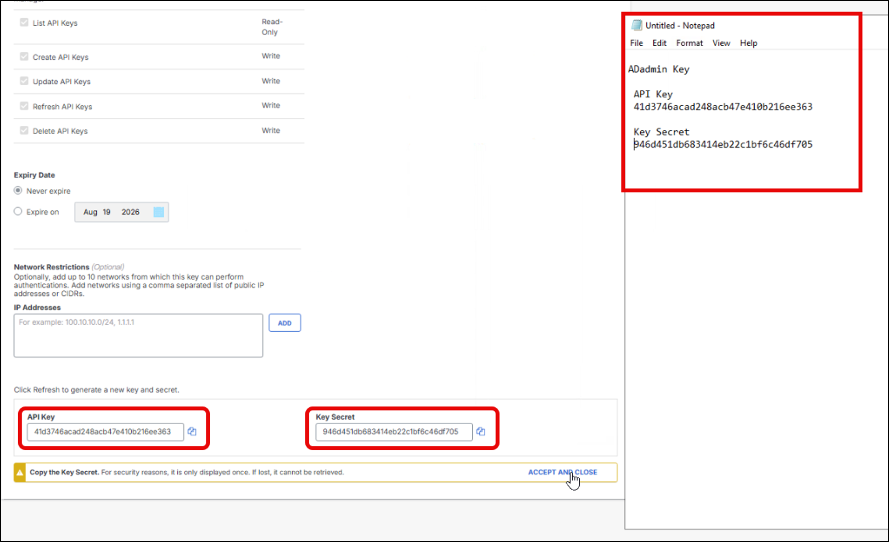{ width="400" style="border: 1px solid #888; border-radius: 4px;" }
      Note: The API Key and Key Secret for the Secure Access tenant will be different in your pod.
      
      b. Generate API Key for authentication using the Admin API Key
      
      Navigate to **Connect > Users, Groups and Endpoint Devices**. Click the ‘Configuration Management’ and then select the ‘Advanced Settings’ tab.
      
      In the API Authentication section paste in both Key Admin API Key and Admin API Key Secret (from the ADadmin Key created in the previous step). Click the ‘Generate Client API Key Pair’ button to generate an API Client Key and Client Key Secret. 
      
      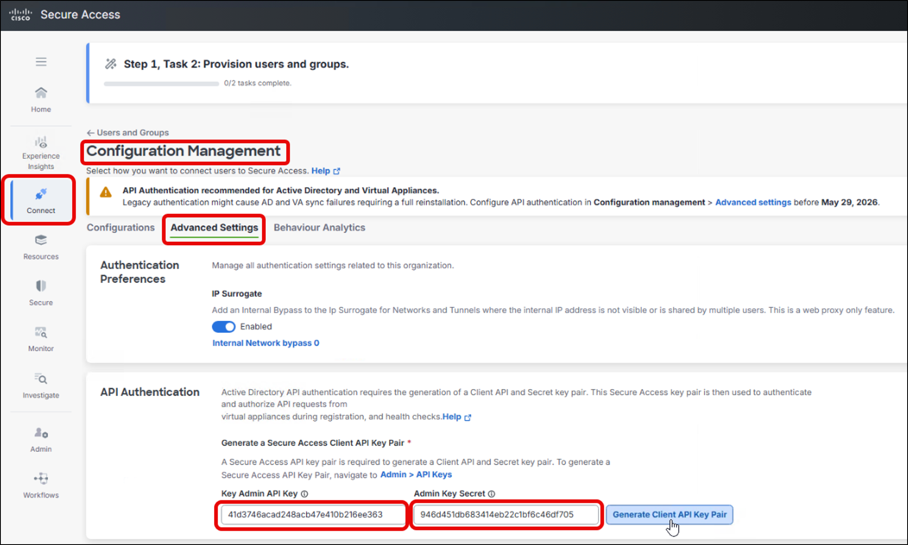{ width="400" style="border: 1px solid #888; border-radius: 4px;" }
      Note: The Key AdminAPI Key and Admin Key Secret for the Secure Access tenant will be different in your pod.
      
      Once generated, as before copy both the key and secret to the previous text file for safe keeping and reuse.
      
      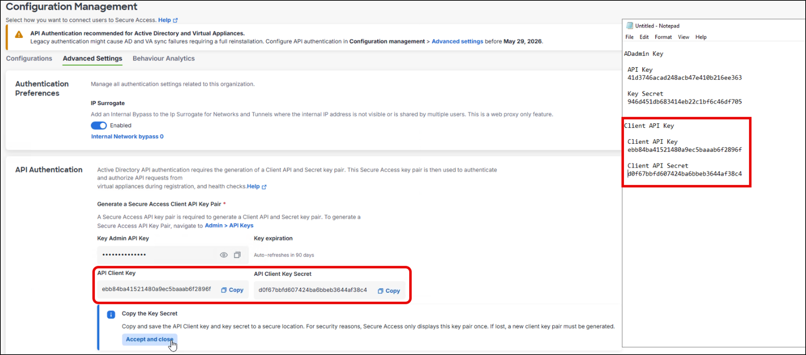{ width="400" style="border: 1px solid #888; border-radius: 4px;" }

1. Configure Directory Integration (Secure Access)
      
      Navigate to **Connect > User, Groups, and Endpoint Devices**
      
      a. Start the configuration flow for integration with Active Directory
      
      Click the ‘Configuration management’ button and then, click ‘Integrate directories’ button. Select ‘Active Directory’ and then click ‘Next’
      
      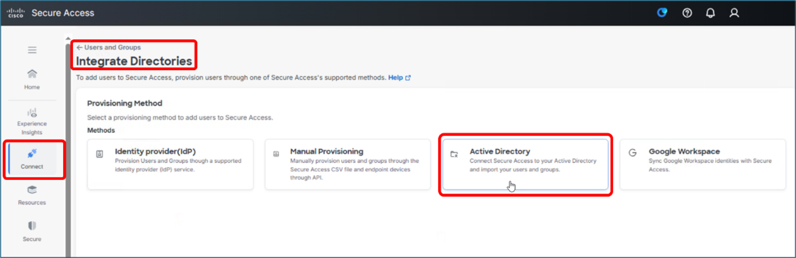{ width="400" style="border: 1px solid #888; border-radius: 4px;" }
      
      b. Register the Active Directory component 
      
      Fill in the form with the following settings:

      - Select ‘**Domain Controller**’
      - Hostname: **ad1**
      - Internal IPv4 address: **198.18.133.1**
      - Domain: **dcloud.cisco.com**
      - Active Directory site: **(1) Site (default site)**
      
      Click ‘Next’
      
      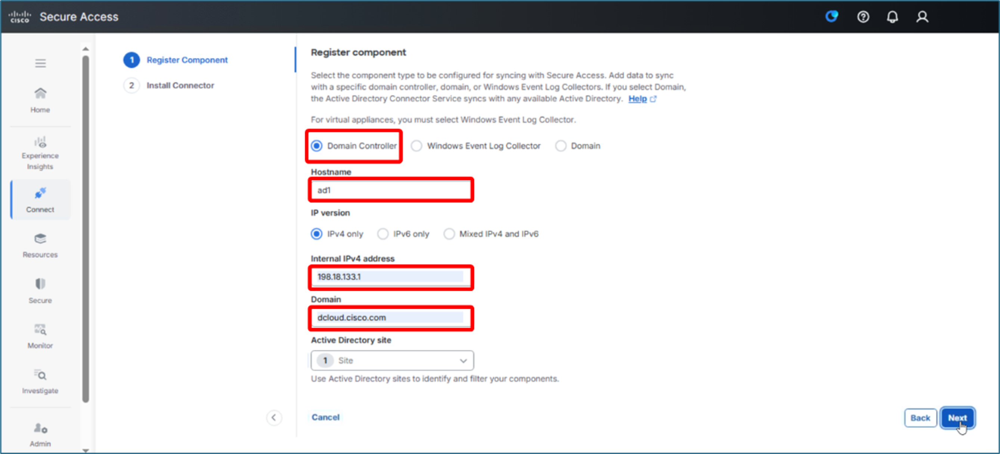{ width="400" style="border: 1px solid #888; border-radius: 4px;" }

1. Download Active Directory Integration files
      
      Click to download to Active Directory/DC both of the following files:
      
      - Active Directory Connector (zip file – Cisco-Windows-Service.zip)
      - Windows Configuration Script for Domain Controller (wsf file – Cisco-WindowsConfigurationScript-YYYY-MM-DD.wsf)
      
      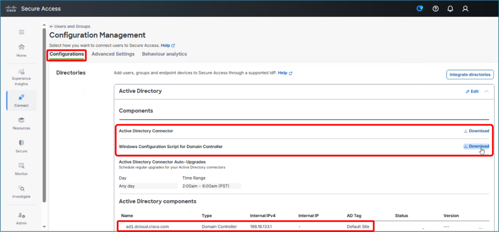{ width="400" style="border: 1px solid #888; border-radius: 4px;" }
      
      Once downloads complete, proceed to the next step.
      
      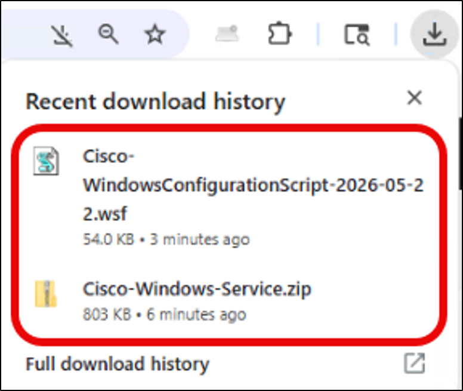{ width="400" style="border: 1px solid #888; border-radius: 4px;" }
      Note: The name of the Windows Configuration Script will be based on today’s date (e.g., Cisco-WIndowsConfigurationScript-2026-10-08.wsf).
      
      If you receive a message in Chrome regarding the .wsf file being a suspicious download, click ‘Download suspicious file’ to allow the download.
      
      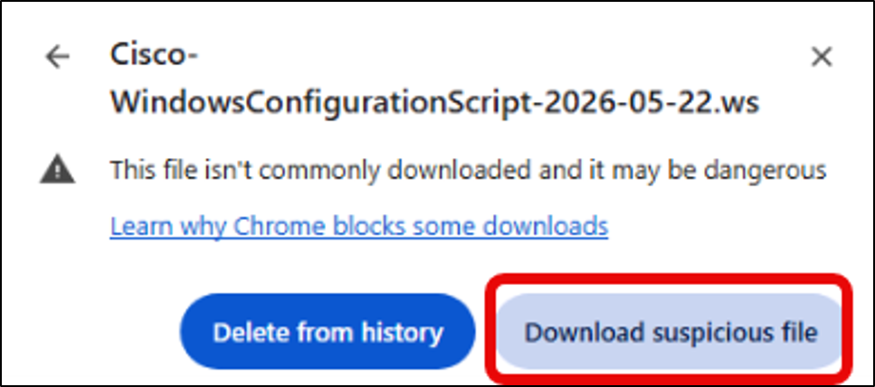{ width="400" style="border: 1px solid #888; border-radius: 4px;" }
      Note: The name of the Windows Configuration Script will be based on today’s date (e.g., Cisco-WIndowsConfigurationScript-2026-10-08.wsf).

1. Install and Configure Cisco AD Connector (@Active Directory/DC)
      
      a. Unzip AD Connector software and prepare for install
      
      On AD1 server, navigate to the downloaded files from previous step and unzip the AD Connector application (Cisco-Windows-Services.zip)
      
      Open the Config.dat file in Wordpad and and ensure the ‘Credential’ parameters in the dat file match the Client API Key and Client API Secret generated previously and copied to Notepad for safe keeping. 
      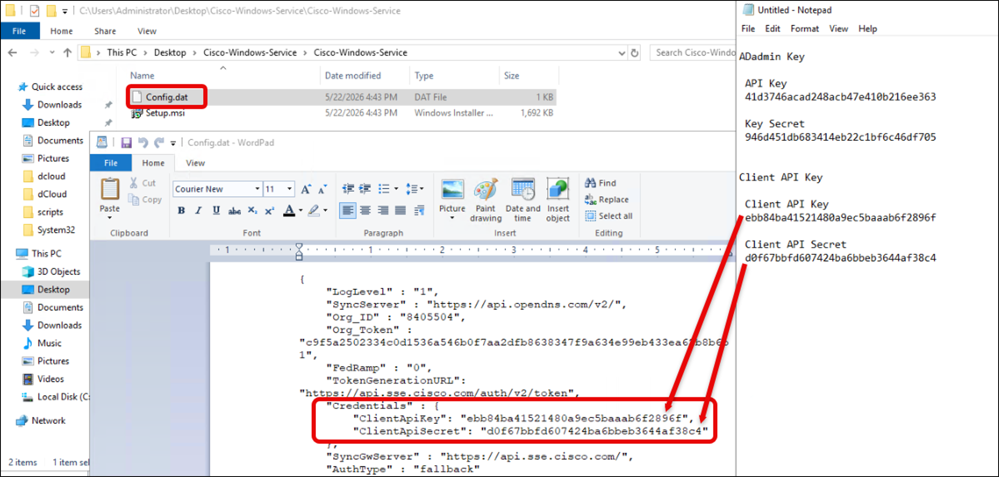{ width="400" style="border: 1px solid #888; border-radius: 4px;" }
      Note: The API keys and secrets in your pod will be different from those shown in the figure above.
      
      If they key and secret do not match, update the dat file to match and save. 
      
      b. Install the Cisco AD Connector and start the service.
      
      Double-click 'Setup.msi' and click through the install wizard to install the Cisco AD Connector. Accept the default settings including ‘AD Lookup (using LDAP/LDAPS)’.
      
      When prompted for Active Directory credentials enter the Cisco_Connector account and password created earlier (Cisco_Connector // dCloud123!).
      
      Click through the rest of the wizard accepting the defaults and click the ‘Install’ button.
      
      Wait while the application is installed and the service is started. Click ‘Finish’ to complete the installation.

1. Register AD DC to Complete the Integration with Secure Access (@Active Directory/DC)
      
      a. Run the Windows Configuration Script downloaded previously 
      
      This script enables the integration of the Domain Controller (AD DC) to Secure Access.
      
      Open a command prompt on AD1 and navigate to C:\Users\Administrator\Desktop\. 
      
      Then, run the script using the ‘cscript’ utility (e.g. ‘cscript Cisco-WindowsConfigurationScript-2026-10-08.wsf'). As the script runs, respond with ‘y’ when prompted with:

      - ‘Do you want us to auto configure this Domain Controller (y or n)?’
      - ‘Would you like to register this Domain Controller (y or n)?’
      
      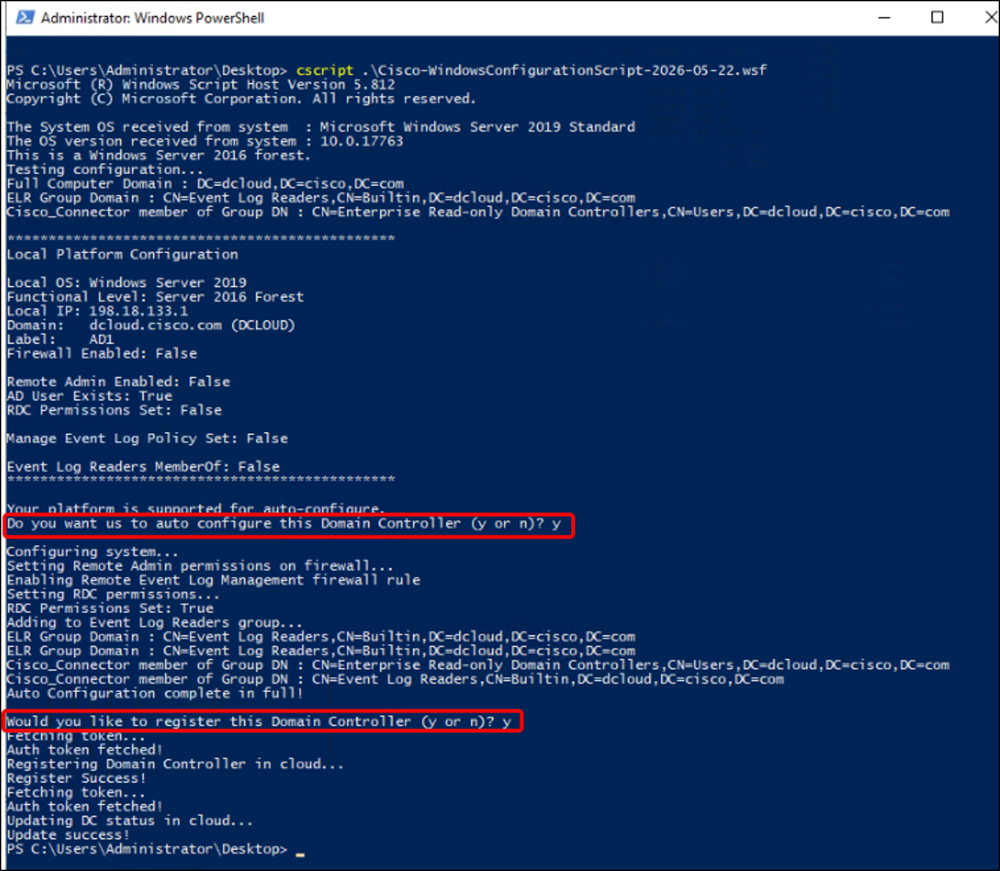{ width="400" style="border: 1px solid #888; border-radius: 4px;" }
      
      Ensure the script completes successfully – e.g., ‘Update success!’

1. Confirm Users/Groups are Synced from AD to Secure Access
      
      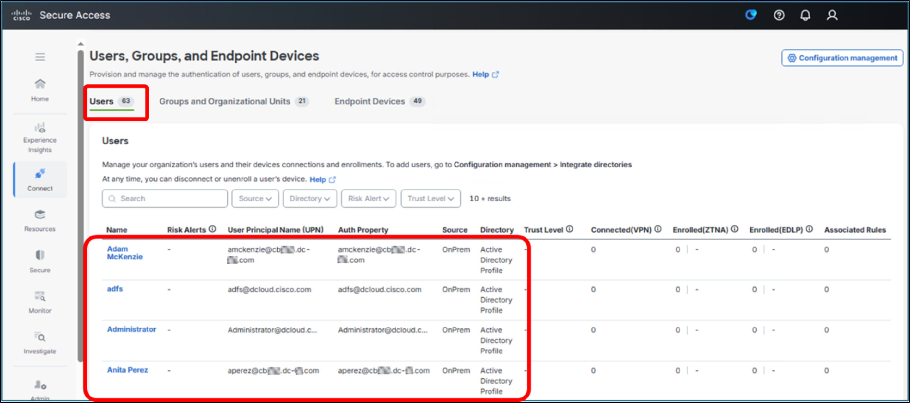{ width="400" style="border: 1px solid #888; border-radius: 4px;" }
      
      Note: It may take as long as 30 minutes for the AD connector and domain controller to show the green check mark (‘Okay’). Continue with the next section of the lab and return to check the status of the connector later.
      
      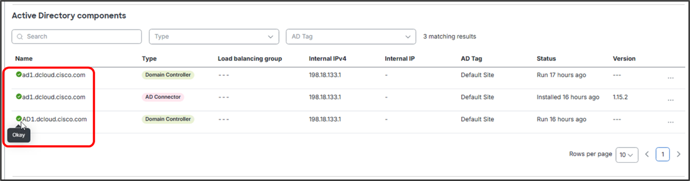{ width="400" style="border: 1px solid #888; border-radius: 4px;" }

## Cisco Secure Access Webex Integration and Policy Configuration

**Webex Authentication for Secure Access Integration**

Now that users have been synced to Secure Access, it’s time to enable the integration with Webex.

Before authorizing the Webex integration to Secure Access, ensure the ‘Compliance Officer’ role has been assigned to Anita Perez’s user account (aperez@cbXXX.dc-YY.com). 

1. Confirm the Compliance Officer Role for org Compliance Officer
      
      Open another Chrome browser tab on AD1 and navigate to Collaboration Control Hub (https://admin.webex.com)
	
      Because an administrator is not able to assign the Compliance Officer role to their own account, login with administrator Charles Holland’s credentials: cholland@cbXXX.dc-YY.com // dCloud123! (if you didn't complete module 1, the password will be dCloudZZZZ!).
      
      Navigate to **Users** and click user ‘Anita Perez’. On the main user page scroll down to the ‘Administrator role’ section and click to start the ‘Assign admin roles’ dialog. Ensure the box next to ‘Compliance officer’ is already ticked and then, click ‘Cancel’. Otherwise, tick the box and then, click ‘Save’ to complete the role assignment.
      
      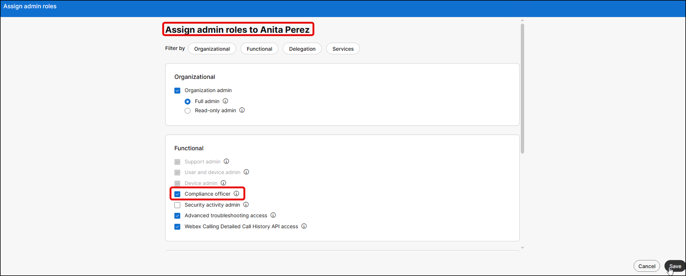{ width="400" style="border: 1px solid #888; border-radius: 4px;" }
      
      Now that the compliance office role has been confirmed for / assigned to user Anita Perez, close the Control Hub Chrome browser tab.

1. Authorize the Webex Platform for Secure Access Cloud Malware 
      
      Before proceeding, <u>**connect to Workstation 2 (WKST2)**</u> via Remote Desktop.
      
      Now use Anita Perez’s account with compliance officer roles to authorize the Webex integration to Secure Access for data loss prevention (DLP) and malware. Webex integrates to Secure Access using the **SaaS API** method.
      
      Open the Chrome browser on WKST2 and navigate to the Secure Access portal by selecting ‘Cisco Secure Access’ from the Identity and Misc. Links menu on the default home page. 
      
      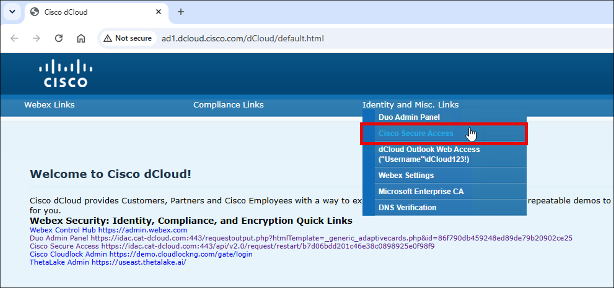{ width="400" style="border: 1px solid #888; border-radius: 4px;" }
      
      Once connected to the Secure Access portal, navigate to **Admin > Authentication** to load the SaaS API Platforms list for integration to Secure Access.
      
      Scroll down to ‘Webex Teams’ at the bottom of the screen and click to expand and load the list of available Webex SaaS API authorizations: Cloud Malware and DLP (data loss prevention). 
      
      Click ‘Authorize New Tenant’ under Cloud Malware to authorize Webex for Secure Access cloud malware.
      
      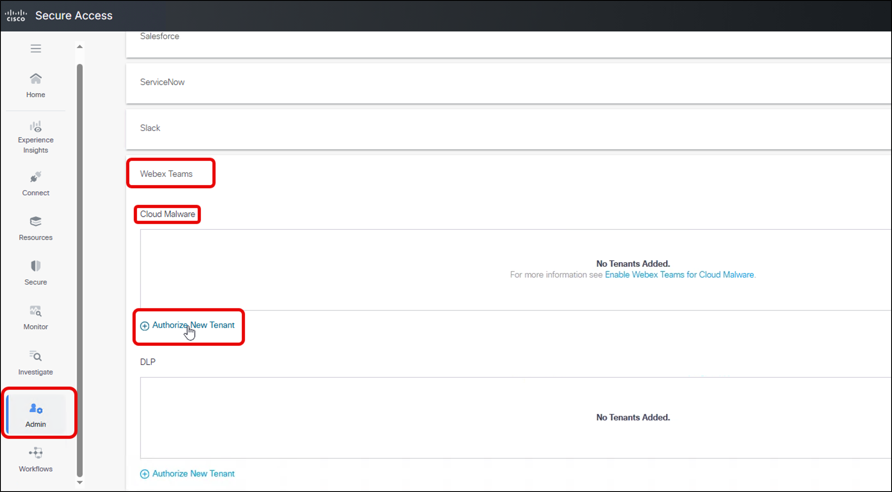{ width="400" style="border: 1px solid #888; border-radius: 4px;" }
      
      Tick the box to acknowledge the requirement for full administrator privileges with compliance officer role and click ‘Next’ to continue.
      
      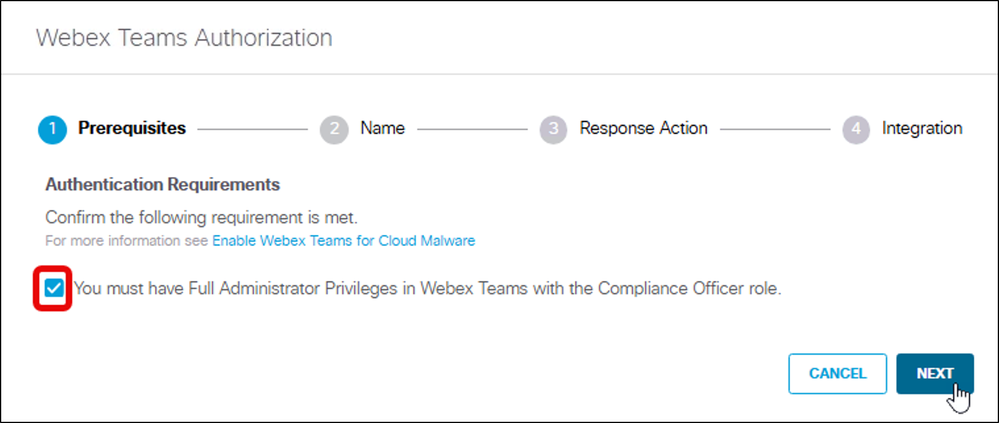{ width="400" style="border: 1px solid #888; border-radius: 4px;" }
      
      Next, provide a name for the tenant – for example, ‘*Webex AMP (cbXXX)*’. Click ‘Next’ to continue.
      
      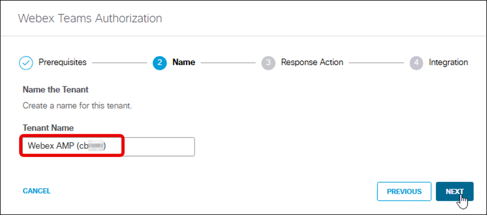{ width="400" style="border: 1px solid #888; border-radius: 4px;" }
      
      Select ‘Delete’ from the Response Action drop-down to ensure that any detected malware or virus files will be deleted. Click ‘Next’ to continue.
      
      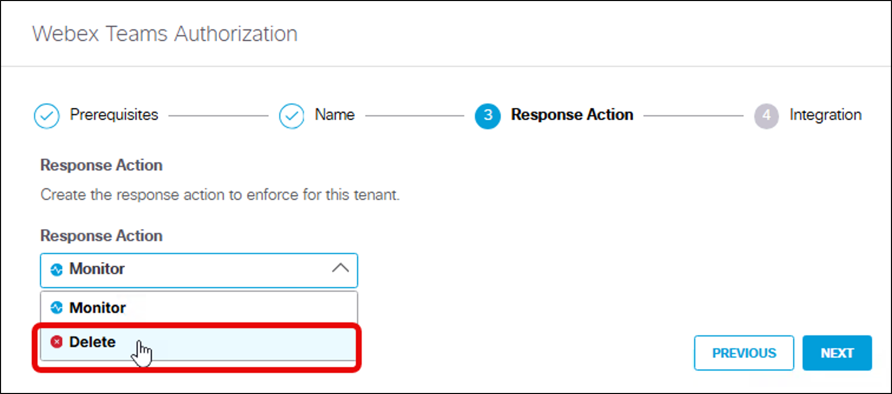{ width="400" style="border: 1px solid #888; border-radius: 4px;" }
      
      Finish the integration by clicking ‘Next’ to begin the authorization process
      
      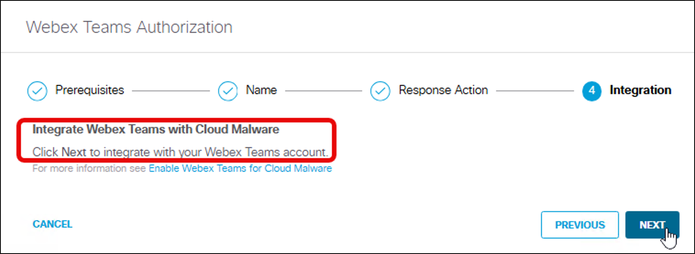{ width="400" style="border: 1px solid #888; border-radius: 4px;" }
      
      When prompted provide Anita Perez’s Webex credentials (aperez@cbXXX.dc-YY.com // dCloud123! - if you didn't complete module 1, the password will be dCloudZZZZ!). When prompted by the Secure Access platform (Umbrella) to accept the required permissions, click ‘Accept’.
      
      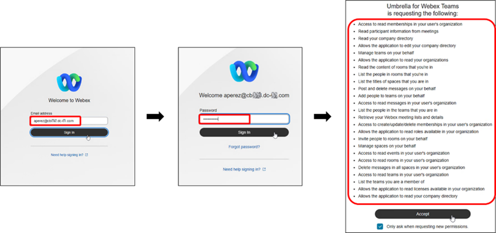{ width="400" style="border: 1px solid #888; border-radius: 4px;" }
      
      Finally, click ‘Done’ after successful authorization to complete the integration dialog.
      
      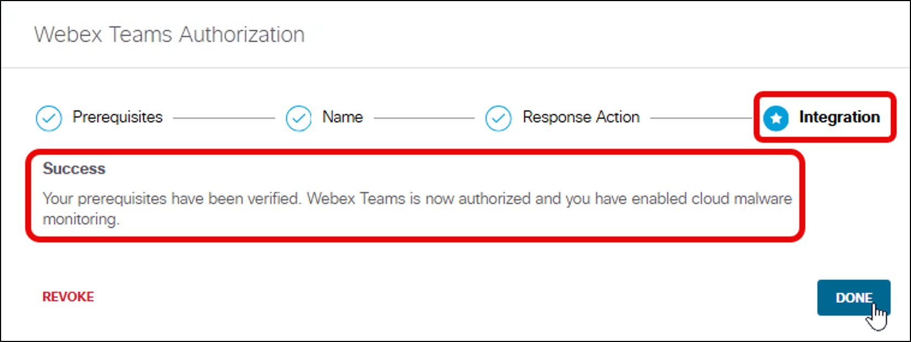{ width="400" style="border: 1px solid #888; border-radius: 4px;" }
      
      Returning to the Authentication page under Webex Teams, the Cloud Malware section should now show that the Webex platform integration named ‘*Webex AMP (cbXXX)*’ with response action ‘Delete’ has been ‘Authorized’.
      
      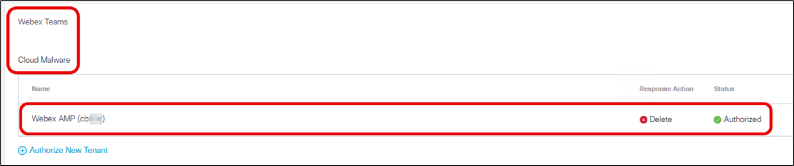{ width="400" style="border: 1px solid #888; border-radius: 4px;" }

1. Authorize the Webex Platform for Secure Access DLP 
      
      Now repeat the authorization flow for Secure Access DLP using the compliance officer account as before (Anita Perez). 
      
      Click ‘Authorize New Tenant’ under DLP to authorize Webex for Secure Access data loss protection.
      
      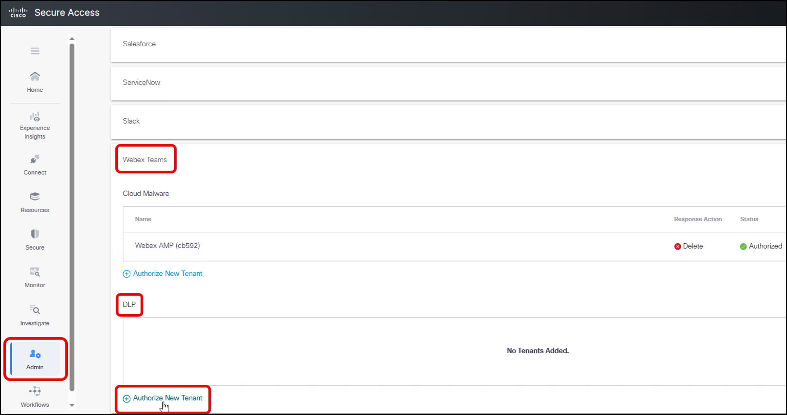{ width="400" style="border: 1px solid #888; border-radius: 4px;" }
      
      Again, click through the dialogs acknowledging the compliance officer requirement, providing a name for the tenant – for example, ‘*Webex DLP (cbXXX)*’, and authorizing the integration by logging into Webex again. Note for this second integration, there is not a prompt to accept permissions as the permissions granted previously for malware are sufficient for DLP as well.
      
      Once the authorization flow is complete, return to the Authentication page. Under the Webex Teams section the DLP sub-section should now show that the Webex platform integration named ‘*Webex DLP (cbXXX)*’ has been ‘Authorized’.
      
      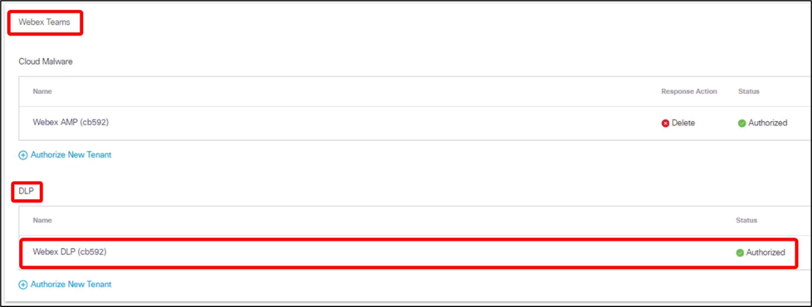{ width="400" style="border: 1px solid #888; border-radius: 4px;" }
      
      With Webex authorizations done the integration to Secure Access for cloud malware and DLP is complete. Configuration of cloud malware and DLP functionality can begin.

**Enable Cloud Malware Protection**

To begin leveraging cloud malware protection it needs to be enabled via security profiles.

1. Enable Secure Access malware protection 
      
      Navigate to **Secure > Security Profiles** to load the list of profiles. Two system provided profiles are available by default: ‘Internet Access’ and ‘Private Access’.
      
      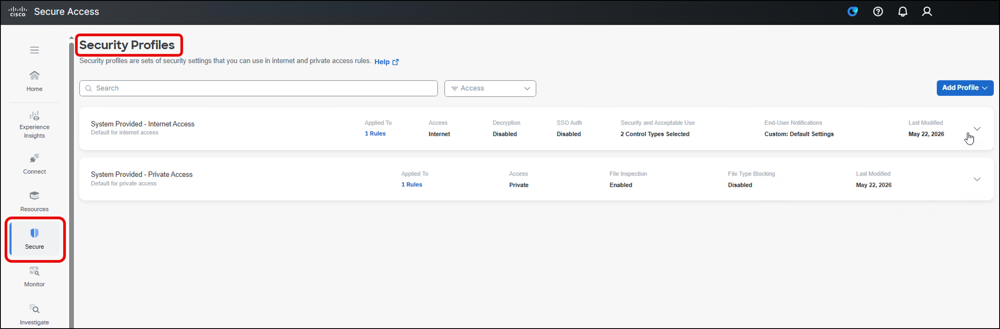{ width="400" style="border: 1px solid #888; border-radius: 4px;" }
      
      Click to expand the ‘System Provided – Internet Access’ profile and scroll down to the ‘Security and Acceptable Use Controls’ section. Notice that the ‘File Inspection’ row includes a note indicating that malware analytics is disabled: ‘Cisco Secure Malware Analytics: Disabled’
      
      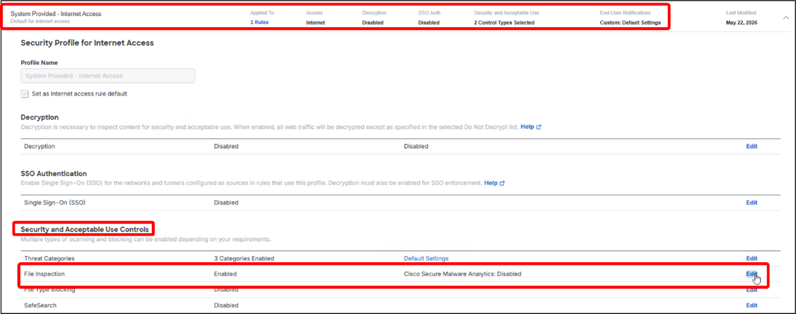{ width="400" style="border: 1px solid #888; border-radius: 4px;" }
      
      Click ‘Edit’ and then click the ‘Cisco Secure Malware Analytics is Disabled’ toggle to enable the malware protection
      
      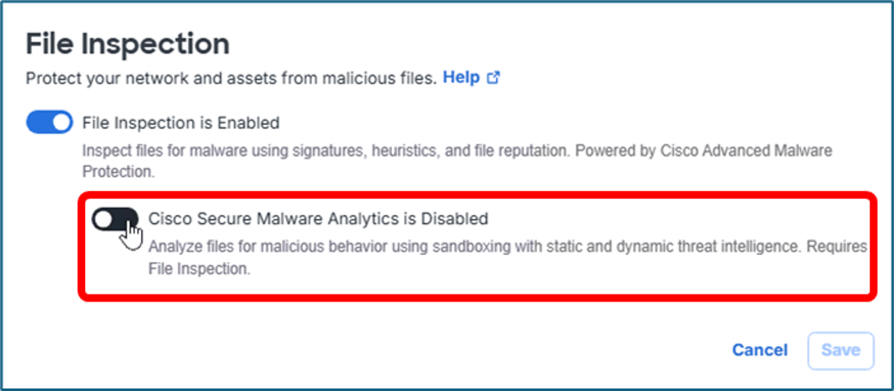{ width="400" style="border: 1px solid #888; border-radius: 4px;" }
      
      Select ‘North America’ from the Sandbox Region drop-down and then tick to acknowledge the warning about the region configuration being permanent.
      
      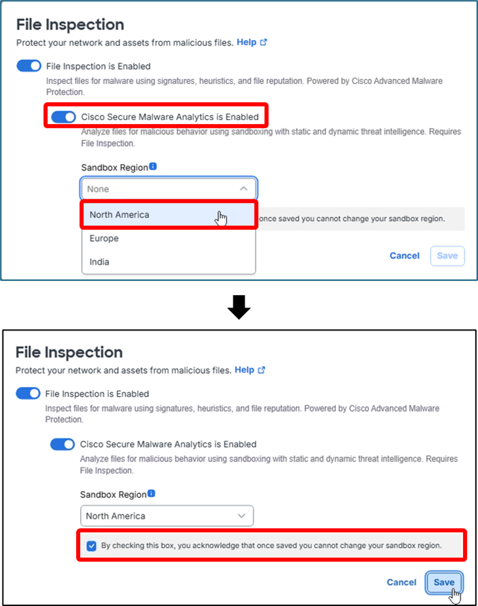{ width="400" style="border: 1px solid #888; border-radius: 4px;" }
      
      Click ‘Save’ to enable malware analytics.
      
      Finally, click to expand the ‘System Provided – Private Access’ profile and repeat the same steps to enable malware analytics for this profile. Note that this time the sandbox region is hard-coded based on the previous profile selection.
      
      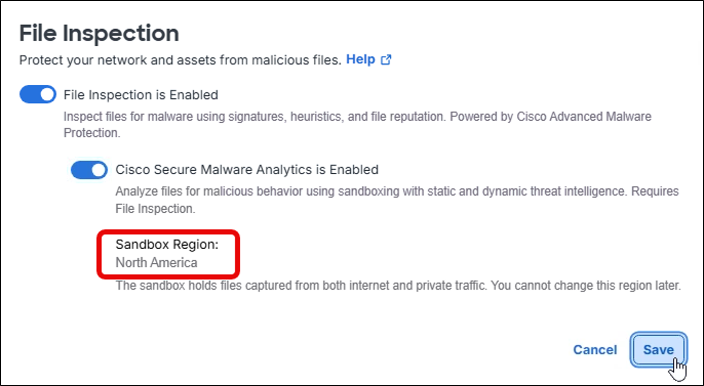{ width="400" style="border: 1px solid #888; border-radius: 4px;" }

**Configure DLP Data Classification and Policy**

By default, there are no DLP policies in place on the Secure Access platform. In order to begin leveraging DLP, a DLP policy must be configured. 

1. Configure Data Classification 
      Because DLP policies consist of one or more data classifications, a data classification should be configured before adding a DLP policy
      
      Configure a data classification that includes a combination of standard built-in identifier, machine learning (ML) built-in identifier, and custom identifier. 
      
      Here is a summary of the data classification’s identifier to assign:
      
      - Credit Card Numbers (lenient) – identify instances of credit card number 
      - IRS Forms – identify US Internal Revenue Service tax forms
      - NDA – identify non-disclosure agreements (NDAs)
      - Custom regex – identify defined character string(s) 
      
      This data classification will be used later in a DLP policy.
      
      a. Add a Custom Identifier
      
      Navigate to **Secure > Data Classification**. Note that by default there are a handful of data classifications already configured on the platform. Each of these data classifications consists of a set of built-in data identifiers.
      
      To begin, click ‘ADD CUSTOM IDENTIFIER’
      
      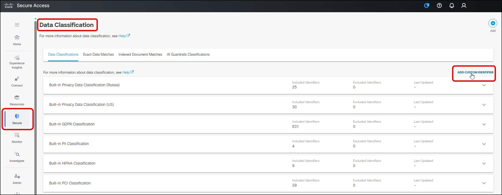{ width="400" style="border: 1px solid #888; border-radius: 4px;" }
      
      On the subsequent screen enter the following information:
      
      - Name: **Secure Regex**
      - Threshold: Leave ‘**None**’ and ‘**Equal to**’, enter ‘**1**’, and click ‘ADD’
      - Entry Type: Tick ‘**Pattern**’
      - Pattern:
           - Enter 1st pattern: ‘**[Tt][Oo][Pp] [Ss][Ee][Cc][Rr][Ee][Tt]**’ and click ‘ADD’
           - Enter 2nd pattern ‘**[Ss][Uu][Pp][Ee][Rr] [Ss][Ee][Cc][Rr][Ee][Tt]**’ and click ‘ADD’
      - Click ‘SAVE’ to save the customer identifier
      
      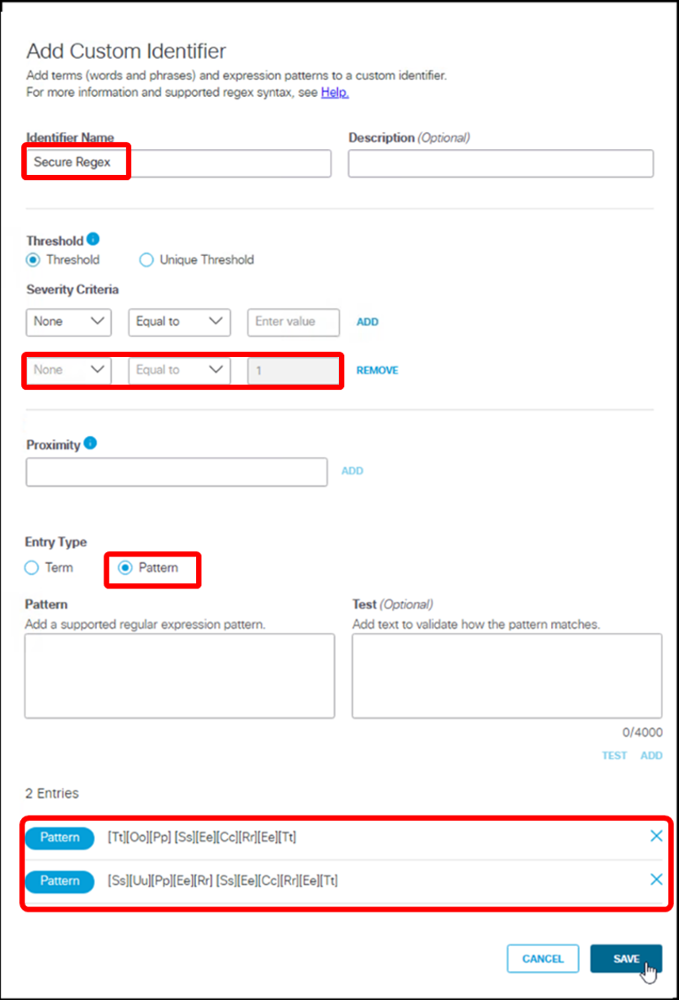{ width="400" style="border: 1px solid #888; border-radius: 4px;" }
      
      b. Add a New Data Classification
      
      Click ‘**+ Add**’ button to add new Data Classification.
      
      On the subsequent screen configure the following information:
      
      - Data Classification Name: **Webex DLP**
      - Include Data Identifiers: 
          - Select Boolean Operator: **OR** (default)
          - Built-in Data Identifiers: 
            - Built-in Identifiers: **Credit Card Number – Lenient**
            - ML Built-in Identifiers: **IRS Forms**, **NDA**
                  (Note: When the box next to a built-in identifier is ticked, the identifier is immediately moved to the ‘Included Data Identifiers’ list near the top of the page)  
          - Custom Identifiers: 
            - **Secure Regex** (the customer identifier configured earlier)
                  
      Click ‘SAVE’ to save the new data classification.
      
      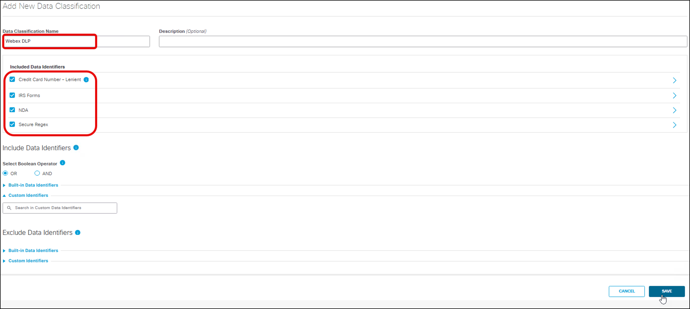{ width="400" style="border: 1px solid #888; border-radius: 4px;" }
      
      Confirm the data classification has been added.
      
      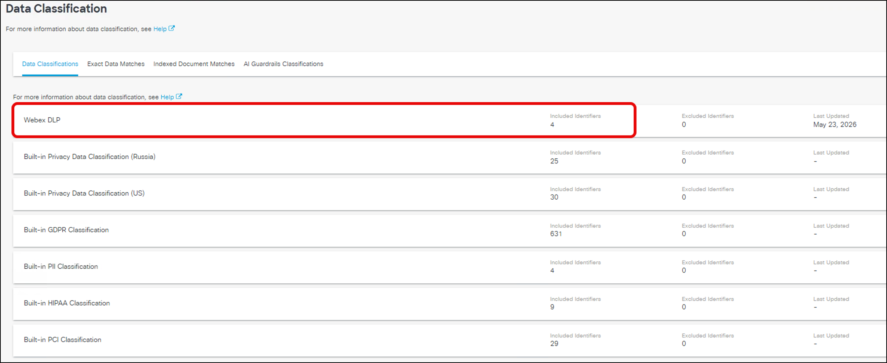{ width="400" style="border: 1px solid #888; border-radius: 4px;" }
      
      This data classification will be added to the DLP policy in the next step.

1. Configure Data Loss Prevention Policy

      The DLP policies or rules configured on the system are applied to data received from integrated platforms. In this case, a DLP policy rule will be configured and applied to data received from the Webex SaaS API platform integration. 

      a. Add a SaaS API Rule 
      
      Navigate to **Secure > Data Loss Prevention Policy**.
      
      Click ‘ADD RULE’ and select ‘SaaS API Rule’ from the drop-down menu to begin configuring the policy
      
      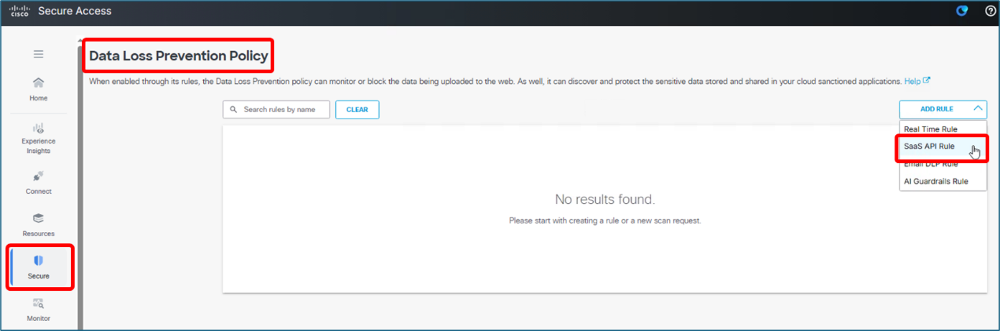{ width="400" style="border: 1px solid #888; border-radius: 4px;" }

      b. Set Rule Name and Severity
      
      Enter a name for the rule – e.g., ‘**Webex DLP**’. 
      
      Select ‘**Critical**’ from the Severity drop-down. This sets the severity level for any events/incidents triggered by this rule. 
      
      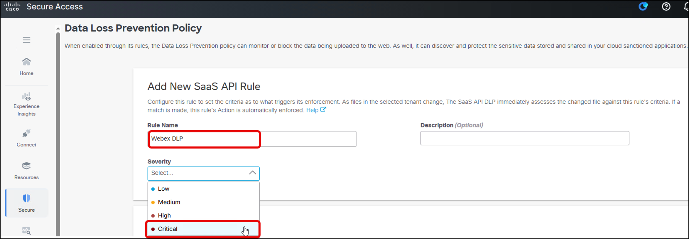{ width="400" style="border: 1px solid #888; border-radius: 4px;" }

      c. Select the Data Classification
      
      Under Data Classifications tick ‘**Content and File Name**’ and select the ‘**Webex DLP**’ Data Classification created earlier. Hover over ‘PREVIEW’ next to the ‘Webex DLP’ classification to review the details.
      
      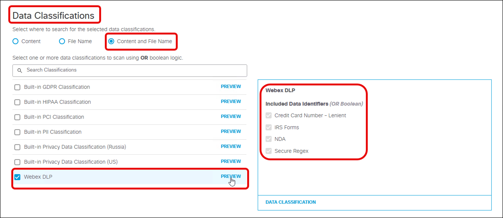{ width="400" style="border: 1px solid #888; border-radius: 4px;" }
      
      This sets the rule to generate events for any credit card numbers, IRS forms, NDAs, and the terms ‘top secret’ and ‘super secret’ (Secure Regex custom identifier) found in the data received by the platform.
      
      d. Apply the Rule to the Webex Platform
      
      Under Platform apply the rule to Webex data by ticking ‘**Webex Teams**’ and then ‘**Webex (cbXXX)**’.
      
      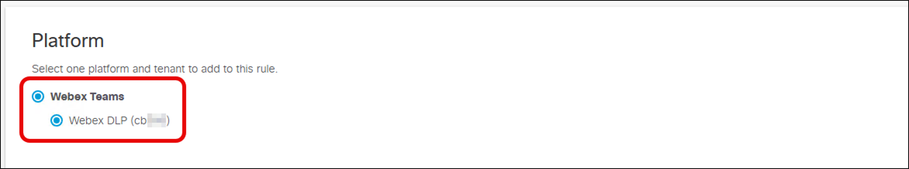{ width="400" style="border: 1px solid #888; border-radius: 4px;" }
      
      e. Configure the User and Resource Scope
      
      By default, the rule should apply to all Webex users and the data from all resources. Under *Include and Exclude* ensure ‘**Include all users**’ is ticked. Under Resources ensure ‘**Include All Resources**’ is ticked.
      
      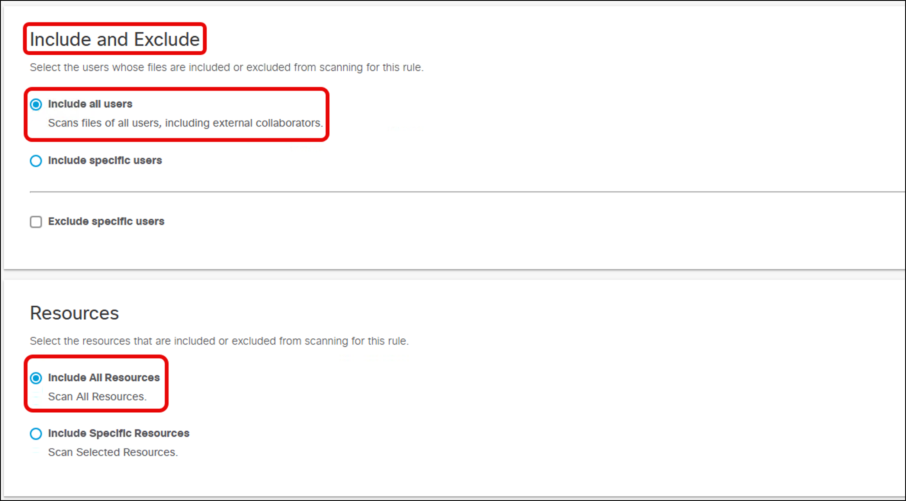{ width="400" style="border: 1px solid #888; border-radius: 4px;" }
      
      f. Set the Exposure and Action
      
      Under Exposure, tick ‘**Shared with external users**’ and ‘**Shared with internal users**’. This ensures that all file sharing will be monitored by the rule.
      
      For full remediation of DLP policy events, set the policy response action to delete violating data.  Under Action, select ‘**Delete**’ from the drop-down.
      
      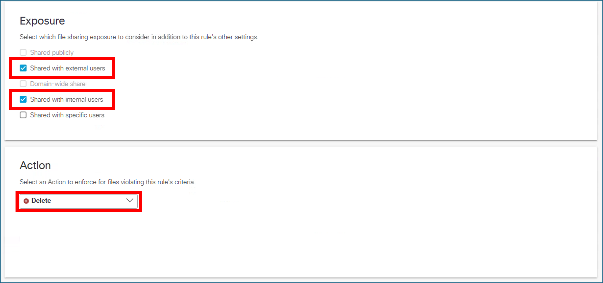{ width="400" style="border: 1px solid #888; border-radius: 4px;" }
      
      g. Configure Notification
      
      To ensure notification is provided to users that violate DLP policy rules, enable email notification. Under User Notifications toggle on ‘**Email Message enabled**’. 
      
      Next, ensure all recipient types are ticked (‘**File owner**’, ‘**Event actor**’, ‘**Actor’s manager**’, and ‘**Custom recipient**’). Under ‘**Custom recipient**’ type the compliance officer’s email: **aperez@cbXXX.dc-YY.com** and press enter to add the email to the list.
      
      Finally, tick ‘**Default Email**’ to configure the email notification. 
      
      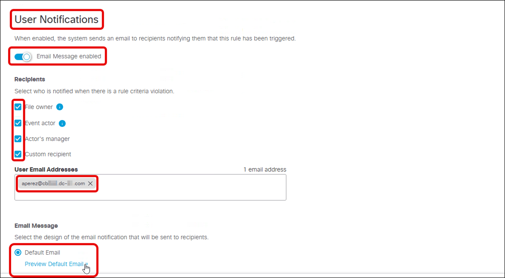{ width="400" style="border: 1px solid #888; border-radius: 4px;" }
      
      Click ‘**Preview Default Email >>**’ to review the email notification the system will send for policy violation(s).
      
      Now, click ‘Save’ to complete the DLP policy rule configuration.
      
      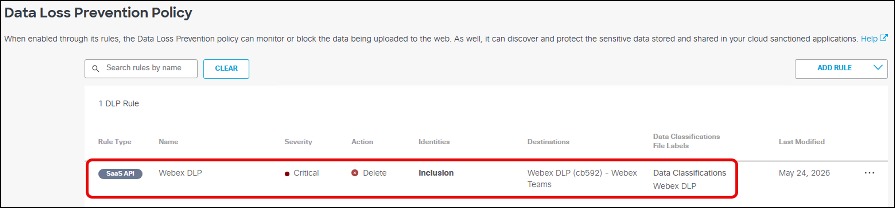{ width="400" style="border: 1px solid #888; border-radius: 4px;" }

Secure Access is now monitoring all Webex data from the integrated organization and applying both cloud malware and DLP to the data stream based on the configuration applied.
  

## Generate User Data and Monitor Secure Access Operations

With the Webex org integrated to Secure Access, cloud malware and DLP enabled, and data classifications and policies in place, it's time to generate user data and see the Secure Access platform in action.

Note: Before continuing, return to check that the AD connector and domain controller show a green check mark ( ‘Okay’) (Navigate to **Connect > Uses, Groups, and Endpoint Devices) > Configuration management**)

{ width="400" style="border: 1px solid #888; border-radius: 4px;" }

**Data Loss Prevention Validation**

1. Prepare Environment for Webex Messaging Data Generation.

      To validate Secure Access DLP operation, messaging data needs to be generated. The data will be generated using the Webex App on the Windows workstation.
      
      a. Webex App Login for Org Users on Workstations 
      
      Login to the Webex App on WKST1 with Charles Holland’s account: cholland@cbXXX.dc-YY.com // dCloud123! (if you didn't complete module 1, the password will be dCloudZZZZ!)
      
      Login to the Webex App on WKST3 with Kellie Melby’s account: kmelby@cbXXX.dc-YY.com // dCloud123! (if you didn't complete module 1, the password will be dCloudZZZZ!)
      
      b. Create a Webex Messaging Space
      
      On WKST1 Webex App create a new Webex messaging space:
      
      - Space name: **Secure Access – DLP**
      - Add member: **Kellie Melby (kmelby)**
      
      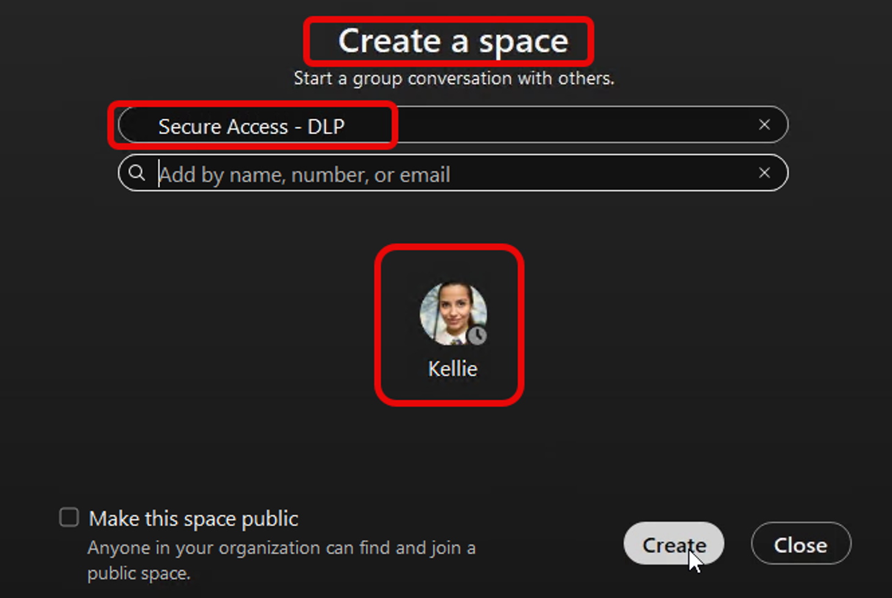{ width="400" style="border: 1px solid #888; border-radius: 4px;" }
      
      Once the space is created, confirm creation on WKST1 and then, return to WKST3 and confirm Kellie has been added to the ‘Secure Access – DLP’ space.
      
      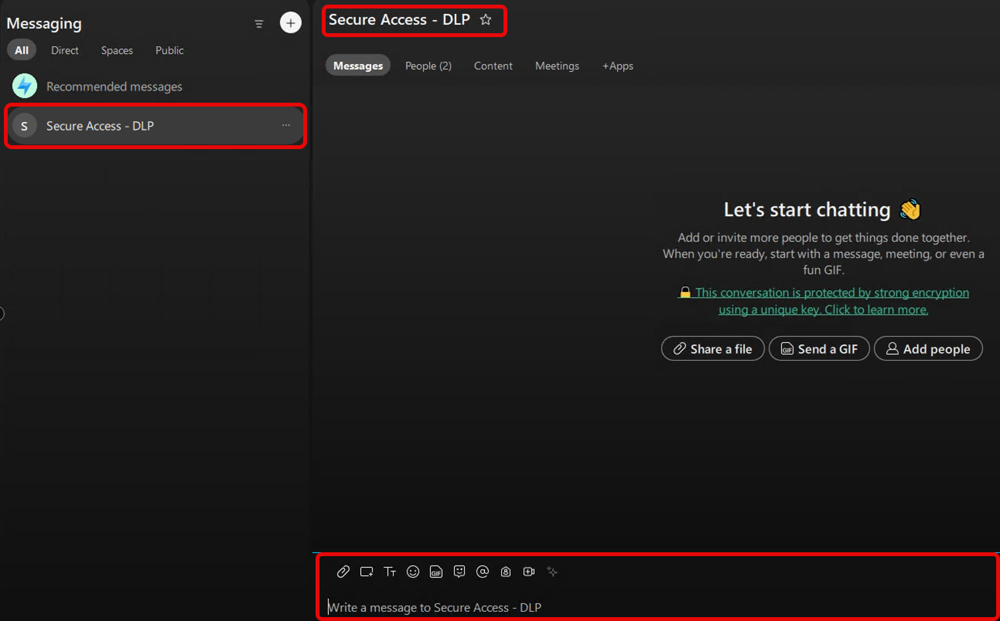{ width="400" style="border: 1px solid #888; border-radius: 4px;" }

1. Generate Webex Messaging Data
      Send messages and files from Charles Holland’s Webex App on WKST1 in the ‘Secure Access – DLP’ space as described in the table below. The table indicates the DLP data classification the message or file should match on the Secure Access platform. 
      
      On WKST1 the files listed in the table below are available in the following directory: C:\Users\cholland\Downloads\file-dlp-amp\

      **Table 3: Secure Access DLP Data Generation**

      | Sender | Recipient / Space | Message / File | Details |	DLP Classifier |
      |-------------------|-------------------|-------------------|-------------------|-------------------|
      | cholland | Secure Access DLP | Message | “Hi, Here’s some <strong>TOP secret</strong> information” | Secure Regex   *(Custom Identifier)* |
      | cholland | Secure Access DLP | File | ccn.txt | Credit Card Number - Lenient   *(Built-in Identifier)* |
      | cholland | Secure Access DLP | Message | “In case you didn't get the file. My credit care number is <strong>4508-1304-5718-5563</strong>. This is a Visa credit card. The expiration data is 09/2028 and the CVC is 233"information” | Credit Card Number - Lenient   *(Built-in Identifier)* |
      | cholland | Secure Access DLP | File | nda.pdf | NDA   *(ML Built-in Identifier)* |
      | cholland | Secure Access DLP | File | fw9.pdf | IRS Forms   *(ML Built-in Identifier)* |

      When sending messages and files, periodically return to Kellie Melby’s Webex App on WKST3 to confirm that all messages and files have been received in the space.
      
      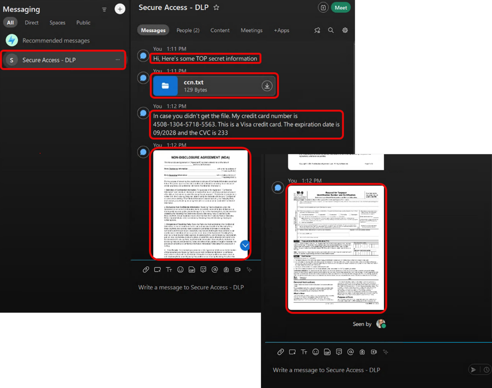{ width="400" style="border: 1px solid #888; border-radius: 4px;" }
      
      All messages and files should be remediated (deleted) by the Secure Access platform (on behalf of the compliance officer (Anita Perez- aperez) after a short period of time.
      
      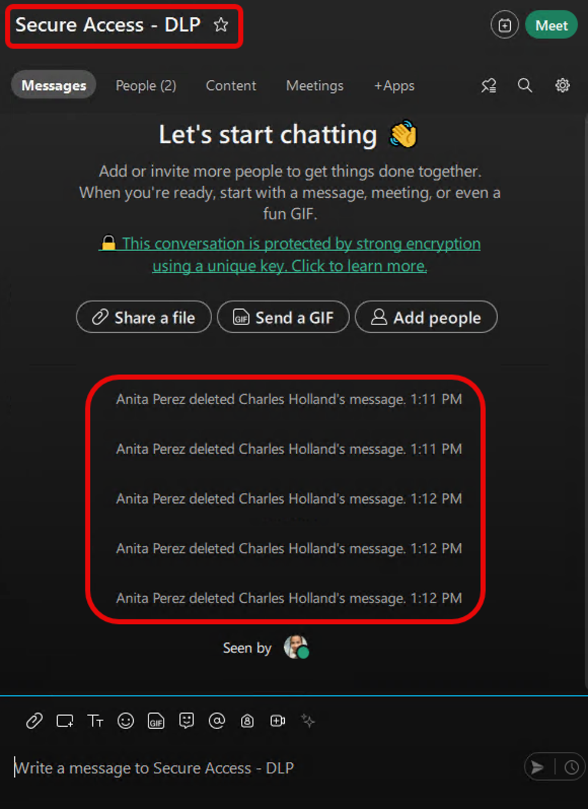{ width="400" style="border: 1px solid #888; border-radius: 4px;" }

      <strong>[Note: Currently it takes between 7 and 15 minutes before files and messages are remediated.]</strong>
      
      In the meantime, move on and start validating cloud malware functionality.

**Cloud Malware Validation:**

1. Prepare Environment for Webex Messaging AMP Data Generation.
      
      a. Create a Webex Messaging Space for sharing AMP sample files
      
      On WKST1 Webex App create a new Webex messaging space:
      
      - Space name: **Secure Access – AMP**
      - Add member: **Kellie Melby (kmelby)**
      
      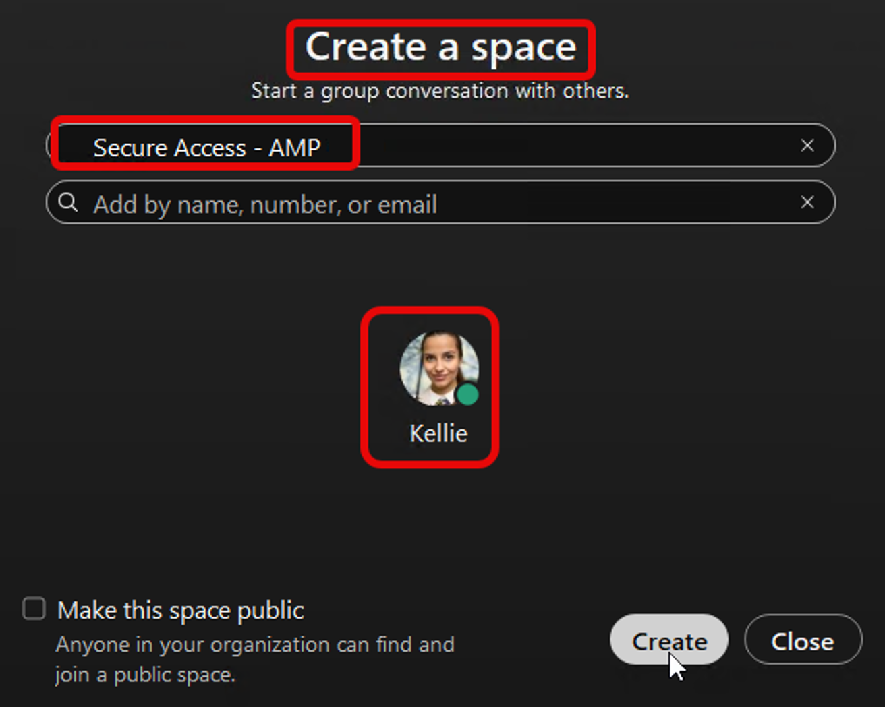{ width="400" style="border: 1px solid #888; border-radius: 4px;" }
      
      Once the space is created, return to WKST3 and confirm Kellie has been added to the ‘Secure Access – AMP’ space.
      
      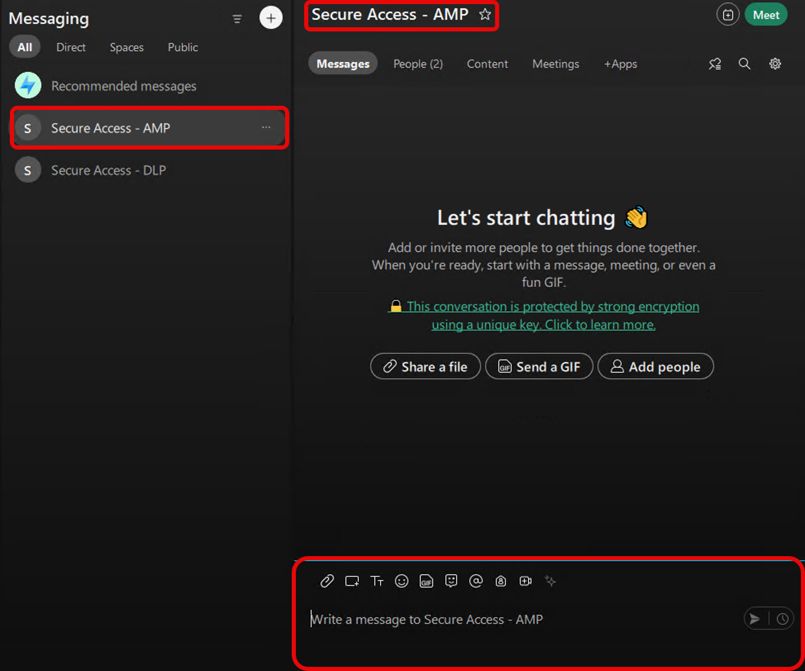{ width="400" style="border: 1px solid #888; border-radius: 4px;" }

1. Generate Webex Messaging AMP Data
      
      Send files from Charles Holland’s Webex App on WKST1 in the ‘Secure Access – AMP’ space as described in the table below.
      
      On WKST1 the malware files listed in the table below are available in the following directory: C:\Users\cholland\Downloads\file-dlp-amp\quarantine\

      
      **Table 4: Secure Access Cloud Malware Data Generation**

      | Sender | Recipient / Space | Message / File | Sample File | Sample Detail |
      |-------------------|-------------------|-------------------|-------------------|-------------------|
      | cholland | Secure Access AMP | File | 5c0987d0ee…f9b9bf8 |  2023-06-MysticStealer |
      | cholland | Secure Access AMP | File | 6be18e3afe…14aed8f.txt |  2019-06-Frankenstein |
      | cholland | Secure Access AMP | File | 0cba53c36…1e976e4.js|  2018-04-GandCrab-Swarm (javascript) |
      | cholland | Secure Access AMP | File | 0e8c2f38…79d4932.macro |  2018-04-GandCrab-Swarm (macros) |

      When sending files, periodically return to Kellie Melby’s Webex App on WKST3 to confirm that all the files have been received in the space.
      
      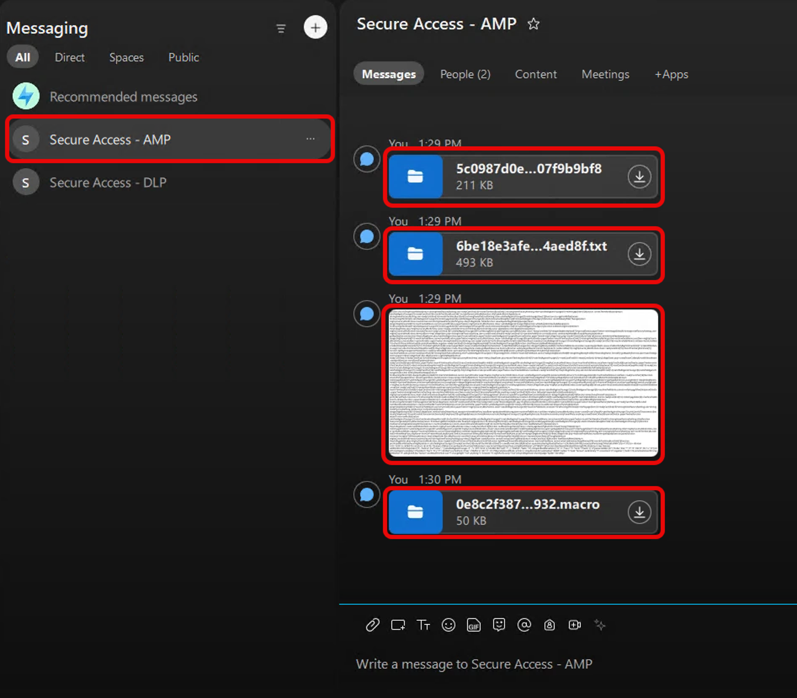{ width="400" style="border: 1px solid #888; border-radius: 4px;" }
      
      Because all the files sent in the ‘Secure Access – AMP’ contained malware, they should be remediated (deleted) by the Secure Access platform (on behalf of the compliance officer (Anita Perez) after a short period of time.
      
      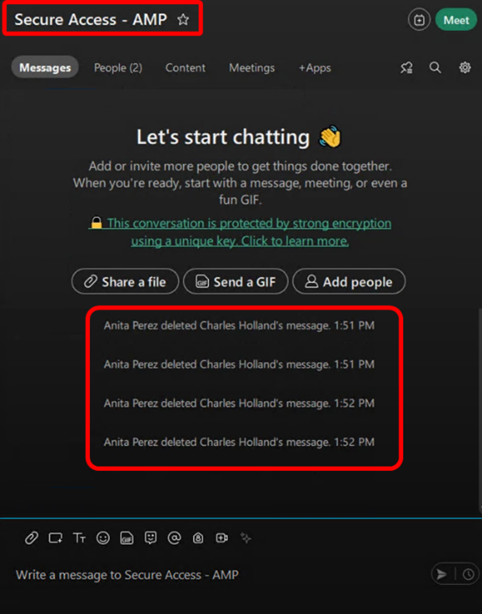{ width="400" style="border: 1px solid #888; border-radius: 4px;" }
      
      <strong>[Note: Currently it takes between 7 and 15 minutes before files and messages are remediated.]</strong>

**Monitor Secure Access DLP and Malware Operation**

Because messages and files have been shared in Webex by users of the organization, Secure Access which has been monitoring Webex data now has some actual data to analyze. When monitoring and analyzing data from the Webex org Secure Access will apply configured DLP and malware policy and log events for any violations of policy. It is now time to review Secure Access policy violation events to validate operation 

1. Review DLP Events Generated by Secure Access for DLP Policy Violations 
      
      Since all of the previous messages and files sent in the Webex App contain content that violates the ‘Webex DLP’ data loss prevention policy (due to the ‘Webex DLP’ data classification included in the policy), there should be several events logged on the system.
      
      a. Review DLP Monitor List of Events
      
      Return to the Secure Access portal (use the encoded URL or the browser bookmark to login again, if required). 
      
      Navigate to **Monitor > Data Loss Prevention** to load a list of the latest events.
      
      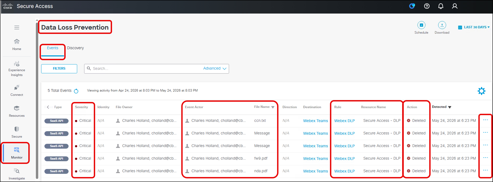{ width="400" style="border: 1px solid #888; border-radius: 4px;" }
      
      There should be an event listed for each DLP policy violation corresponding to the messages and files sent earlier.
      
      Note there are five events logged (for the two messages and the three files): 
      
      - All events have a severity level of ‘Critical’ and were all initiated by the event actor ‘Charles Holland, cholland@...’
      - The name of any files shared are displayed in the ‘File Name’ column (ccn.txt, fw9.pdf, nda.pdf), otherwise ‘Message’ is shown indicating the event corresponds to a specific message.
      - The name of the DLP policy the event violates is shown (e.g, ‘Webex DLP’ the policy configured earlier in this lab) as well as the space where the policy violation occurred (e.g., ‘Secure Access – DLP’).
      - In all cases the response action to the policy violation was to delete the message or file (e.g., ‘Deleted’).
      - Click the three dot (ellipsis) in the far right column for any event to view more details about the event
      
      b. Review DLP Event Details
      
      Click the three dots (‘…’) in the far-right column next to any event and select ‘View details’ to see additional information about the event including the timeline of operations, application/platform tenant details, violated rule details, and data classification matching details.
      
      Review the event details for at least one message (‘File Name’ = Message) and one file (‘File Name’ = ...txt or ...pdf).
      
      **Message:**
      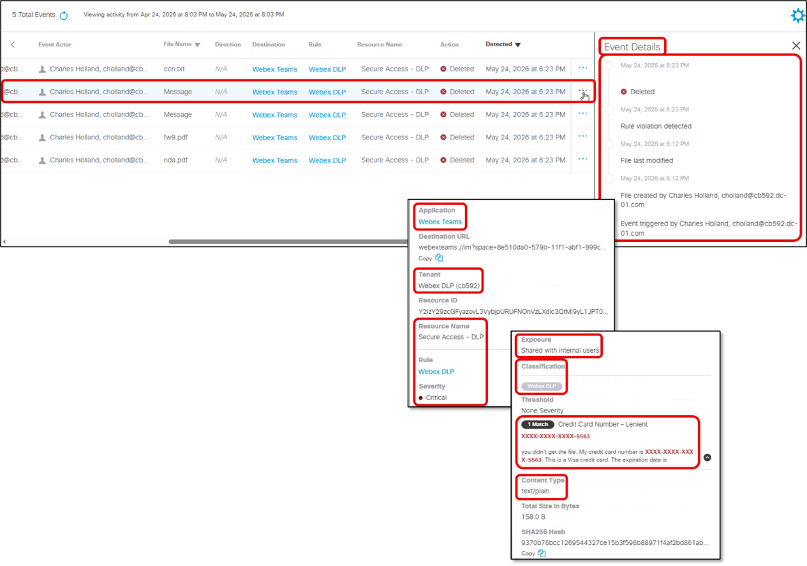{ width="400" style="border: 1px solid #888; border-radius: 4px;" }
      
      **File:**
      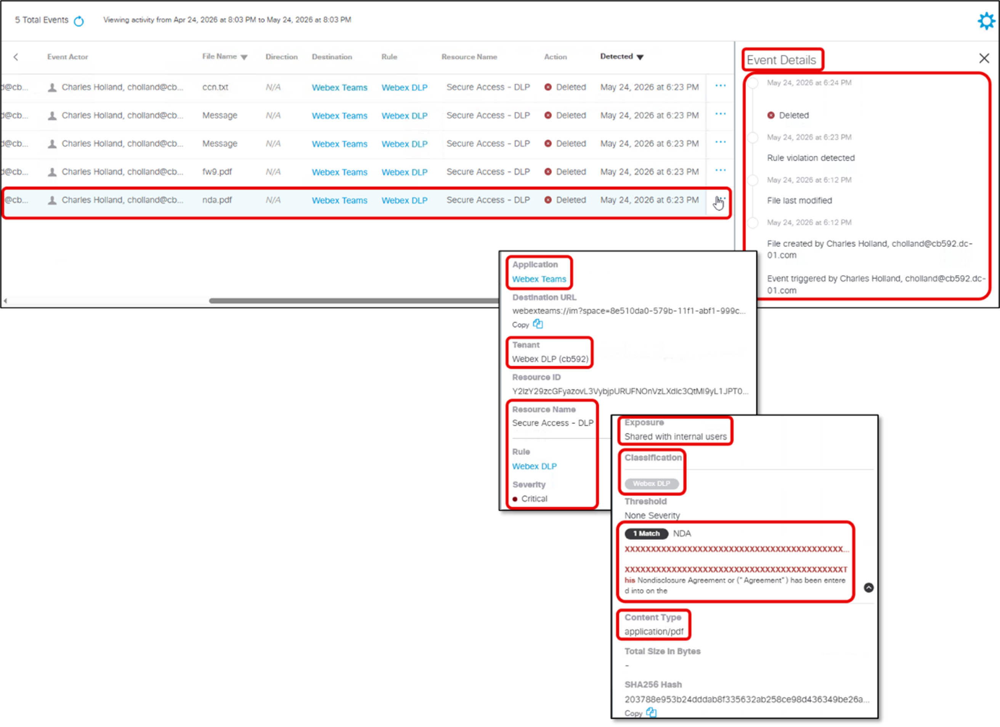{ width="400" style="border: 1px solid #888; border-radius: 4px;" }

1. Review Malware Files Detected by Secure Access Cloud Malware
      
      Since the last four files sent in the Webex App contained malware, the cloud malware should have detected and logged as malicious files on the system.
      
      a. Review Cloud Malware Malicious File List
      
      On the Secure Access portal navigate to **Monitor > Cloud Malware** to load malware scanning information and the list malicious files detected.
      
      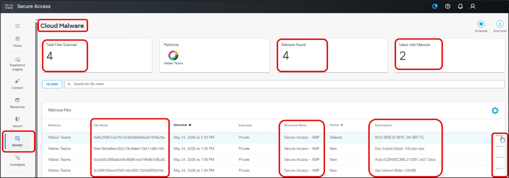{ width="400" style="border: 1px solid #888; border-radius: 4px;" }
      
      In addition to the counters for number of files scanned (4), malware found (4), and users with malware (2), the list of malicious files should contain an entry for each detected malware file. Note there are four malicious files detected (corresponding to the four malware files previously sent). 
      
      For each malicious file note the: 
      
      - ‘File Name’ (e.g., ‘0e8c2f387c4a76c024dc69e69ee8163fac5a...’, ‘6be18e3afeec482c79c9dea119d11d9c159...’, ‘0cba53c366aeb34bd6dfb1ed1f9b9b7d8ca6...’, ‘5c0987d0ee43f2d149a38fc7320d9ffd0254...’)
      - ‘Resource Name’ (name of the space, e.g., ‘Secure Access – AMP’)
      - ‘Description’ (name of the identified malware/virus signature – e.g., ‘W32.0E8C2F387C-95.SBX.TG’, ‘Doc.Exploit.Xploit::100.sbx.vioc’, ‘Auto.0CBA53C366.212551.in07.Talos’, ‘Gen:Variant.Midie.125365’).
      
      b. Review Malicious File Full Details
      
      Click the three dots (‘…’) in the far-right column for any malicious file and select ‘See Full Details’ to see detailed information about the detected malware/virus file. Details include the platform/instance, file owner, resource name, AMP scan detection, and an external link to the malware/virus detection page on the Virus Total website with more information.
      
      Review the full details for at least one of the detected malicious files.
      
      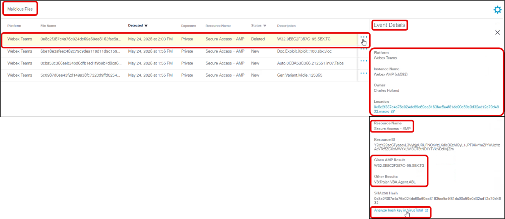{ width="400" style="border: 1px solid #888; border-radius: 4px;" }
      
      **Virus Total:**
      
      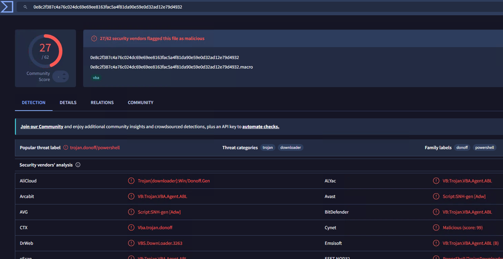{ width="400" style="border: 1px solid #888; border-radius: 4px;" }
      
      This completes the lab exercises. Feel free to continue exploring the DLP and malware protection capabilities of the Secure Access platform for Webex data – for example:

      - Review previous events and malicious file details.
      - Review and configure new or updated data classifications.
      - Generate additional Webex data to trigger new data classification/DLP policy violations or malicious file detection for additional in-depth review of Secure Access operational behavior and response.

**\*\*\* END of MODULE 3 \*\***

Continue with Appendix or return to either Module 1 or Module 2:

- [Module 1: Webex Identity](module1_identity.md)
- [Module 2: Zero Trust Encryption](module2_zero_trust_encryption.md)
- [Module 3: Webex Compliance](module3_compliance.md) *(current)*
- [Appendix](appendix.md)
- [Conclusion](conclusion.md)
