# Module 3: Webex Compliance with Webex and Theta Lake
In this module, you will examine Webex compliance features and capabilities for meetings, calling, and messaging including data loss protection (DLP), anti-malware, and eDiscovery and Archiving on an external compliance platform. 

There are 6 sections in this module:

i. [Webex Compliance and Preparing for Compliance Platform Integration](#webex-compliance-and-preparing-for-compliance-platform-integration)

ii. [Explore eDiscovery for Webex Meetings in Webex Compliance Hub](#explore-ediscovery-for-webex-meetings-in-webex-compliance-hub)

iii. [Explore eDiscovery for Webex Calling in Webex Compliance Hub](#explore-ediscovery-for-webex-calling-in-webex-compliance-hub)

iv. [Cisco Secure Access Tenant and AD Onboarding](#cisco-secure-access-tenant-and-ad-onboarding)

v. [Cisco Secure Access Webex Integration and Policy Configuration](#cisco-secure-access-webex-integration-and-policy-configuration)

vi. [Generate User Data and Monitor Secure Access Operations](#generate-user-data-and-monitor-secure-access-operations)

Compliance integrations are critical for protecting an organization's private data from leakage and ensuring that it complies with appropriate rules and laws related to maintaining business and communication records.

Webex supports both built-in compliance capabilities as well as API-based 3rd party integrations. Specifically:

- Webex provides a set of basic built-in compliance capabilities for **data loss protection (DLP), anti-malware protection (AMP), eDiscovery/Legal Hold, and data retention (archive)**.
- Webex also integrates with 3rd party DLP, anti-malware, eDiscovery/Legal Hold, and Archiving applications and services for advanced compliance capabilities including automatic remediation.
- Integrations with compliance services rely on **Webex Events API** to deliver message and meeting data to compliance services.

In this module you will examine the following product-specific capabilities:

- Webex built-in compliance capabilities including:
      - Archiving with flexible data retention.
      - External communication controls, and calling and meeting specific collaboration restrictions.

- Other compliance products:
      - Webex Compliance Hub -- Archiving, eDiscovery
      - Cisco Secure Access -- Data loss protection, anti-malware protection

The figure below summarizes the Webex Events API method for compliance platform integration as well as the various platforms explored in this lab and their high-level capabilities. The Webex Events API provides a polling mechanism for compliance platforms to pull user-generated data from Webex for archiving, eDiscovery, and data loss protection (DLP). In the case of DLP, the compliance platform uses additional Webex APIs to remediate policy violations. 

**Webex Events API for Compliance Platform Integration**

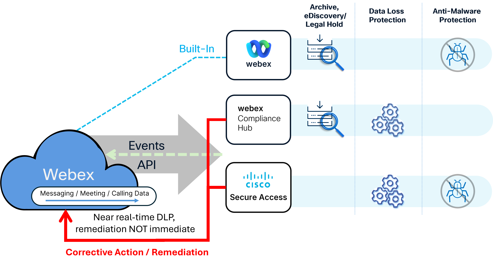{ width="800" style="border: 1px solid #888; border-radius: 4px; background-color: white; padding: 10px;" }

Webex Events APIs as well as remediation APIs require administrators to have the Compliance Officer role to enable and authorize these operations.

For more information for Webex compliance with Webex APIs, please refer to the Webex for Developers site for documentation including:

- Compliance and Events: <https://developer.webex.com/compliance/docs/compliance>
- Webex Events API: <https://developer.webex.com/admin/docs/api/v1/events>
- Webex Messages API: <https://developer.webex.com/messaging/docs/api/v1/messages>
- Webex Meetings API: <https://developer.webex.com/docs/api/v1/meetings>
- Webex Calling API: <https://developer.webex.com/calling/docs/webex-calling-overview>

This lab guide contains coverage for external compliance platform Theta Lake.

**Table 2: Compliance Platform Options, Capabilities, and Applicable sections of this Module**

| Compliance Platform | Capabilities Explored | Module Sections |
|---------------------|----------------------|-----------------|
| **Webex (built-in)** | - Data retention - External communications - Collaboration restrictions | [Webex Compliance and Preparing for Compliance Platform Integration](#webex-compliance-and-preparing-for-compliance-platform-integration) |
| **Webex Compliance Hub** | - eDiscovery & Legal Hold - Archival | [Explore eDiscovery for Webex Meetings in Webex Compliance Hub](#explore-ediscovery-for-webex-meetings-in-webex-compliance-hub)   [Explore eDiscovery for Webex Calling in Webex Compliance Hub](#explore-ediscovery-for-webex-calling-in-webex-compliance-hub) |
| **Cisco Secure Access** | - Data loss protection (DLP) - Anti-malware protection (AMP) | [Cisco Secure Access Tenant and AD Onboarding](#cisco-secure-access-tenant-and-ad-onboarding)   [Cisco Secure Access Webex Integration and Policy Configuration](#cisco-secure-access-webex-integration-and-policy-configuration)   [Generate User Data and Monitor Secure Access Operations](#generate-user-data-and-monitor-secure-access-operations) |

## Webex Compliance and Preparing for Compliance Platform Integration
1. Enable the compliance officer role for user Anita Perez.

      To integrate compliance platforms with Webex, a full administrator with Compliance Officer privileges is required. This role gives the user permissions for DLP integrations, eDiscovery/Legal Hold, and retention and archival integrations. In this step you are assigning the organization Compliance Officer role to Anita Perez.

      Any full administrator can assign the compliance officer role to any person within their organization. However, full administrators <u>cannot</u> assign the Compliance Officer role to themselves, another full administrator must assign the role to them.

      To begin, connect to WKST1. Login will be as Charles Holland (dcloud\\**cholland** // **dCloud123!**).

      a. Open the Chrome browser on WKST1 (wkst1.dcloud.cisco.com) and navigate to Webex Control Hub at <http://admin.webex.com>.

      b. Login as full administrator, Charles Holland by entering: cholland@cbXXX.dc-YY.com (refer to the eXpo dCloud Session View Info page to find your DNS domain). Click **Sign In**.

      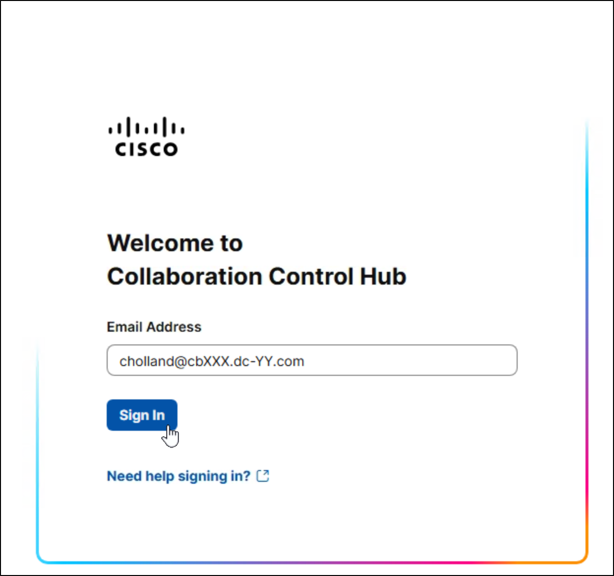{ width="400" style="border: 1px solid #888; border-radius: 4px;" }
   
     <!-- (Replace XXX and YYY with the values for your eXpo dCloud pod)-->

      c. Enter password: **dCloud123!** (if you did not complete Module 1 and enable SSO, then the password will be dCloudZZZZ!)

      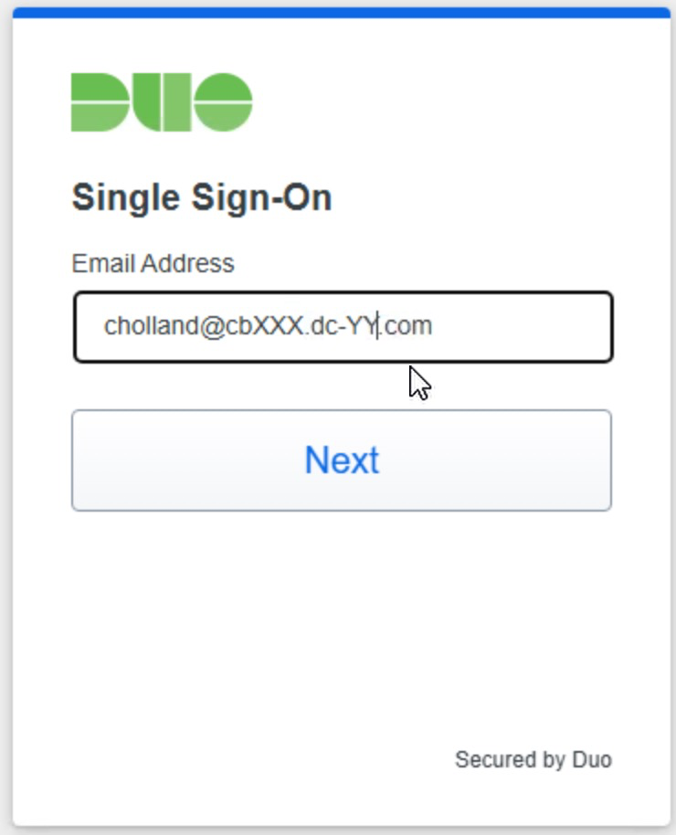{ width="400" style="border: 1px solid #888; border-radius: 4px;" }

       d. Once logged in, navigate to **Users** and select Anita Perez.

      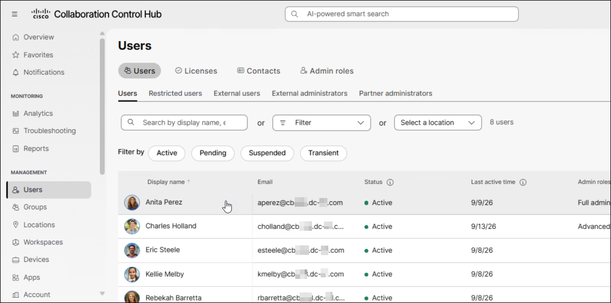{ width="400" style="border: 1px solid #888; border-radius: 4px;" }

      e. Scroll down and click Administrator roles.

      f. Promote Anita Perez to Compliance Officer for the organization by ticking the box next to 'Compliance officer'. Click **Save**.

      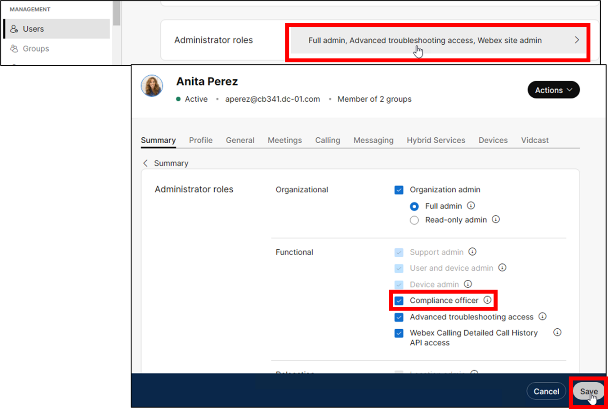{ width="400" style="border: 1px solid #888; border-radius: 4px;" }

1. Review retention settings for Webex Messaging, Meetings, and Calling.

      One of the first compliance considerations is data retention. How long should data be retained before it is deleted? It's important for the compliance officer to understand the retention policies of the organization and to configure Webex to match these policies.

      Before proceeding, **move to WKST2** (wkst2.dcloud.cisco.com). If not already connected, connect to WKST2. Login will be as Anita Prerez (dcloud\\**aperez** // **dCloud123!**).

      a. Open the Chrome browser on WKST2 (wkst1.dcloud.cisco.com) and navigate to Control Hub at <https://admin.webex.com>.

      b. Login to Control Hub as the compliance officer, Anita Perez by entering: aperez@cbXXX.dc-YY.com <!--(refer to eXpo dCloud session info page for the DNS domain).--> Click **Sign In**.

      c. Enter password: **dCloud123!** (non-SSO password is dCloudZZZZ!)

      d. Once logged in, navigate to Organization Settings. In the search window at the top of the page, enter 'Retention' to locate the retention settings. Notice there are separate retention policies for Webex Messaging (messages, files), Webex Meetings (recordings, transcripts, chats, Q&A, whiteboards, polls, etc.), and Webex Calling (recordings).

      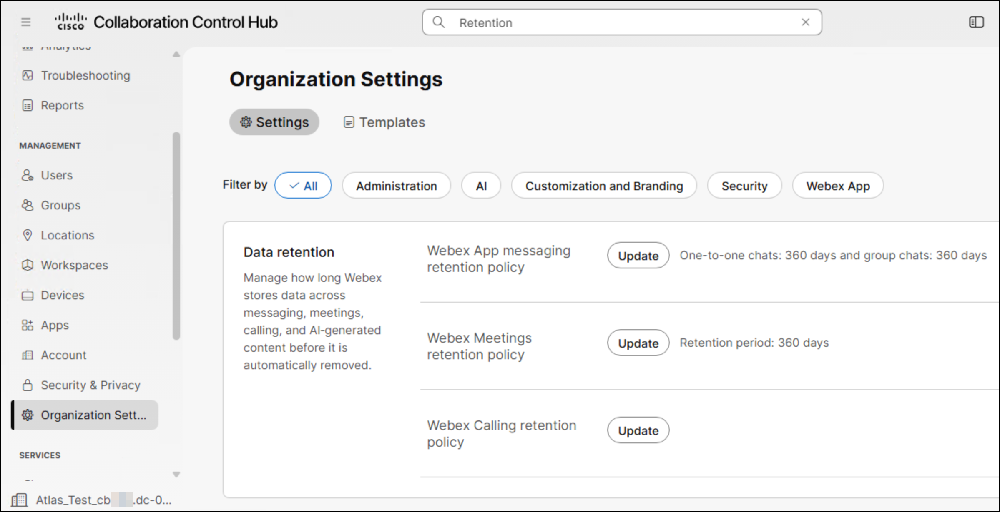{ width="400" style="border: 1px solid #888; border-radius: 4px;" }

      e. Click **Settings** under Webex App Messaging Retention Policy to review current messaging retention settings.

      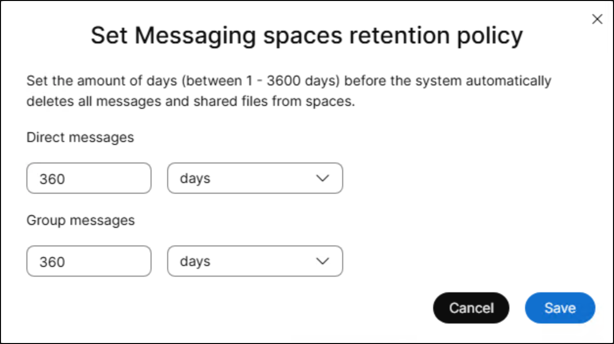{ width="400" style="border: 1px solid #888; border-radius: 4px;" }

      By default, the retention period is set to 360 days. Notice that separate retention periods can be set for 1:1 chat and group chat.

      For the purposes of this lab, there is no reason to change the message retention policy, so click **Cancel** to close the Webex Space retention policy window.

      f. Click **Settings** under Webex Meetings Retention Policy to review current meeting retention settings.

      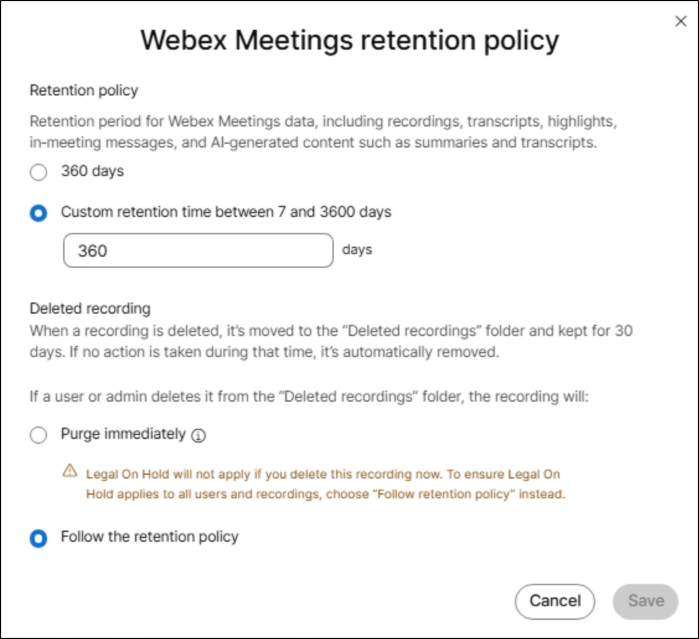{ width="400" style="border: 1px solid #888; border-radius: 4px;" }

      By default, the retention period is set to 360 days. Note that recording retention can be set to purge in 30 days, but by default the recordings follow the meetings retention policy. For the purposes of this lab, there is no reason to change the meeting retention policy, so just click **Cancel** to close the Webex Meetings Retention Policy window.

      g. Click **Settings** under Webex Calling Retention Policy to review current calling retention settings.

      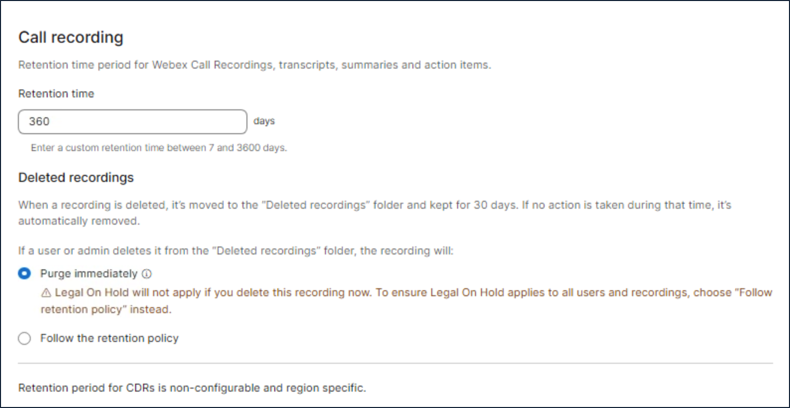{ width="400" style="border: 1px solid #888; border-radius: 4px;" }

      By default, the retention period for call recordings is set to 360 days. Notice that deleted recordings can be set to match the recording rentention period, but by default deleted recordings are set to purge immediately. Note that call details records (CDRs) retention is non-configurable. Again, for the purposes of this lab, there is no reason to change the calling retention policy, so just click **Cancel** to close the Webex Calling Retention Policy window.

      **Note:** Keep in mind that retention policies in Control Hub apply to data retention for data archived or stored on the Webex platform. When relying on a 3rd party archival system (e.g., Theta Lake), the retention setting of that platform will determine how long organization data is retained. Always ensure that the retention period configured in Control Hub and/or the 3rd party platform matches your organization's retention policy for data.

1. Review Webex Meeting controls and restrictions.

      On Control Hub navigate to **Meeting**, click **Settings**, and scroll down to review the data and communication restriction controls available for meetings.

      The internal and external meeting configuration options allow you to control which external users can join your organization's meetings (Internal Webex meetings) and which external organization's meetings (External Webex meeting sites) your users can join. This type of restriction control allows an organization to mitigate potential data loss by disallowing certain attendees and/or meeting sites and may sufficiently address organizational requirements regarding data loss.

      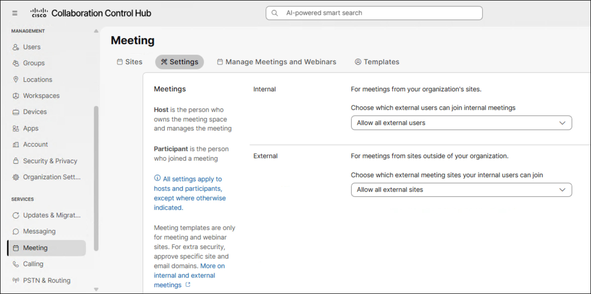{ width="400" style="border: 1px solid #888; border-radius: 4px;" }

      By default, external users are allowed to attend your organization's meetings, and your users can attend external meeting sites. For the purposes of this lab, you can leave the default values (e.g., no restrictions).

      In addition to controlling which users can join meetings and which meetings users are allowed to join, you can also restrict specific meeting features for both internal and external meetings.

      Scroll down and review the various meeting capabilities that can be disabled for internal or external meetings. For example, you could disable in-meeting tools like polling, Q&A, chat, and recording. This type of meeting data restriction control allows an organization to mitigate and reduce potential data loss by disallowing certain channels of communication (e.g., Q&A, chat, polling, etc.).

      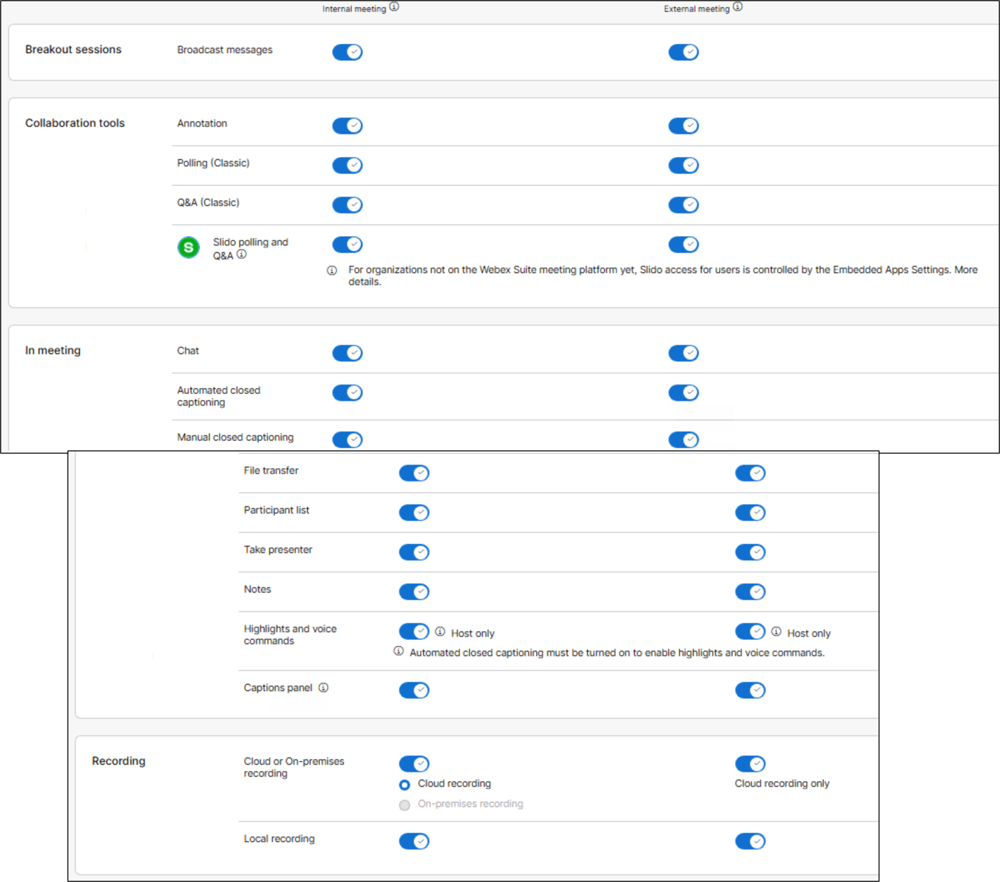{ width="400" style="border: 1px solid #888; border-radius: 4px;" }

      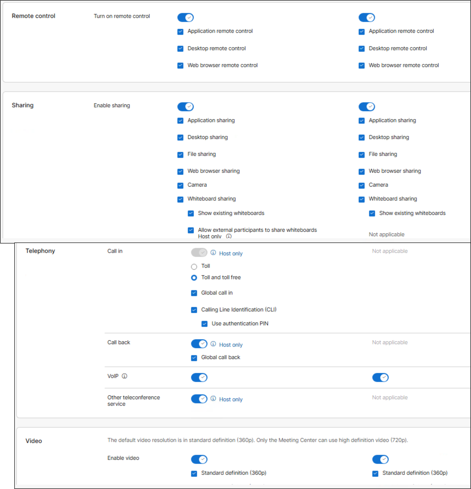{ width="400" style="border: 1px solid #888; border-radius: 4px;" }

      For the purposes of this lab, please leave the default values (e.g., no restrictions).

1. Review Webex Calling controls and restrictions

      On Control Hub navigate to **Calling**, click **Settings**, then select **Webex App**, and scroll down to 'In-call feature access'. Review the available in-call features that can be disabled.

      An administrator can eliminate potential data leakage vectors to disable. For example, an adminstrator could prevent users from sharing content during a call (toggle off **Screen Sharing**) or sharing video on the call (toggle off **Video on desktop**/**Video on mobile**). Likewise, the administrator can prevent escalation of a call to a meeting (toggle off **Move call to meetings on desktop app**). These restrictions may sufficiently address organizational requirements regarding calling data loss.

      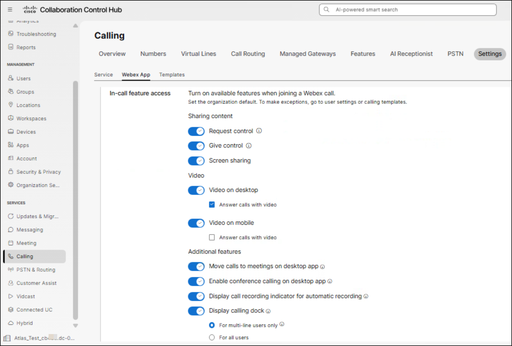{ width="400" style="border: 1px solid #888; border-radius: 4px;" }

      Note that by default, there are no restrictions for in-call features. For the purposes of this lab, please leave the default values (e.g., no restrictions).

Now that you've enabled the Compliance Officer role for user Anita Perez and reviewed Webex's built-in data retention and restrictions capabilities, it's time to move on and explore Webex integration to an external compliance platform.

## Explore eDiscovery for Webex Meetings in Webex Compliance Hub

eDiscovery is the mechanism for searching through and retrieving data from the retained user-generated data archive of an organization. This ensures that the compliance officer has full access to all retained user data as needed for compliance management and enforcement. Because **eDiscovery** enables search and retrieval of data, this is often discussed together with **Archiving** capabilities which pertains with how and where the data that is being searched is stored.

Webex has built-in eDiscovery/Legal Hold and archiving or data storage capabilities which may be sufficient for some organizations. The built-in Webex eDiscovery Search and Extraction portal provides Webex organizations the ability to access Webex stored and retained user-generated data. And as discussed earlier, there are retention settings in Control Hub which determine how long user-generated data is stored on the Webex platform. Note that exploring the Webex eDiscovery Search and Extraction portal is not part of this lab. However, for your reference, the Appendix of this lab guide has a module that covers the built-in Webex eDiscovery tool. If you are interested in this module, please complete the rest of the lab before exploring.

For advanced implementations of eDiscovery and Archiving, a third-party compliance platform integration is generally preferred.

Webex Compliance Hub has a full set of compliance capabilities including eDiscovery and Archiving for collaboration platform data. In this module you'll explore the archiving and eDiscovery capabilities of Webex Compliance Hub.

### Webex Compliance Hub Archiving

1. Login to Webex Compliance Hub management portal with read-only admin login.

      As you examine Webex Compliance Hub eDiscovery capabilities, it helps to have some historical user data (something beyond just data you might generate today) so you can search and review data over a period days and weeks. In this section you'll use a read-only administrator account for a Webex Compliance Hub organization which contains months of user-generated message, meeting, and calling data.

      From the Chrome browser on Anita Perez's workstation (WKST2), navigate to the Webex Compliance Hub management portal at <https://useast.thetalake.ai/>.

      Login using the read-only administrator account credentials (email / password): **co.read.only@gmail.com** / **dCloud123!**

      Once logged in navigate to the Policies page by clicking '**Policies**' in the navigation menu at the top of the page.

1. Review the Retention Library page.

      The retention library or archive is the final resting place for the data coming from the Webex platform, so it's important to understand where and how your data is archived before even thinking about eDiscovery.

      On the Webex Compliance Hub platform archiving is managed under the Policies sub-section '**Content Destination**'. Retention libraries are managed here.

      Navigate to the Archive retention libraries page by clicking 'Content Destination' in the left-hand navigation menu to expand, and then click 'Retention Libraries'.

      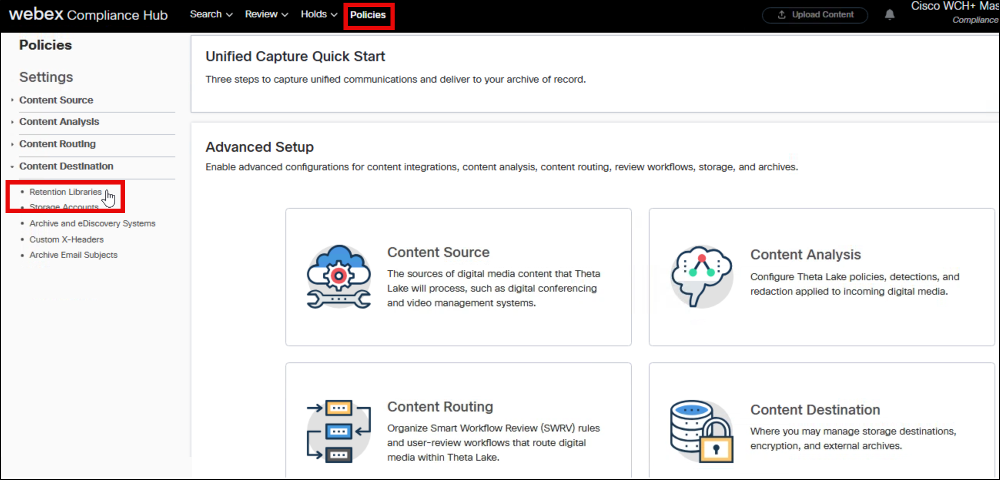{ width="400" style="border: 1px solid #888; border-radius: 4px;" }

      By default. Webex Compliance Hub automatically configures a retention library called 'Default' when the Webex Compliance Hub org is created.

      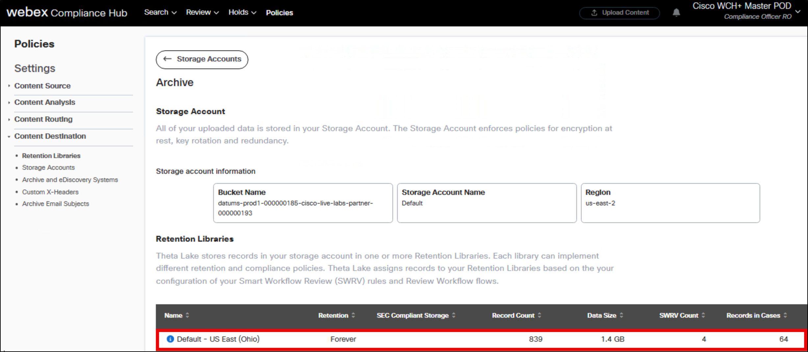{ width="400" style="border: 1px solid #888; border-radius: 4px;" }

      Notice that the default retention period for the default retention library is 'Forever', meaning that user data for your org will be archived and maintained indefinitely. Data records have been created and archived to this retention library (Record Count = *nnn*).

      ***Note:** You will see a second retention library called 'Delete Storage'. This retention library is for lab operational purposes. We use this library to clear data records from the Webex Compliance Hub tenant after the lab has been completed.*

      Webex Compliance Hub allows for the creation of multiple retention libraries within an organization enabling you to segment data archiving to accommodate variable retention periods and storage requirements.

      Given this is a read-only account, you won't be able to edit the retention library and see details. Below is what the retention library edit dialog [would look like if you were to edit or create a new retention library.

      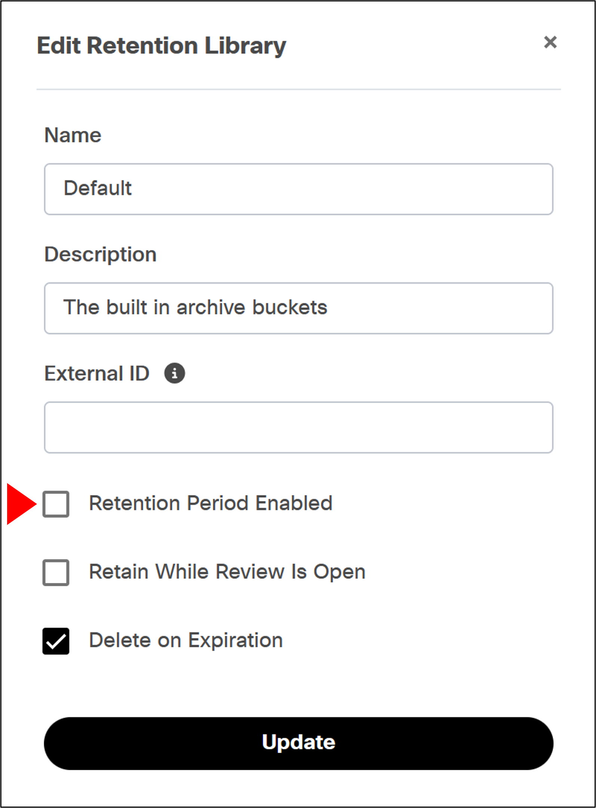{ width="400" style="border: 1px solid #888; border-radius: 4px;" }

      As mentioned earlier, this default library currently has no retention period set so data will be maintained indefinitely. If the compliance officer or administrator wanted to adjust the retention period, they simply enable the retention period and then specify the retention period in days.

### Webex Compliance Hub eDiscovery
1. Navigate to Webex Compliance Hub eDiscvoery.

      Click 'Search' from the navigation menu and select 'Search' for eDiscovery where the administrator or compliance officer can search against all retained user data records across all media types including messages, files, and meeting and calling recordings. All available records are retrieved by default.

      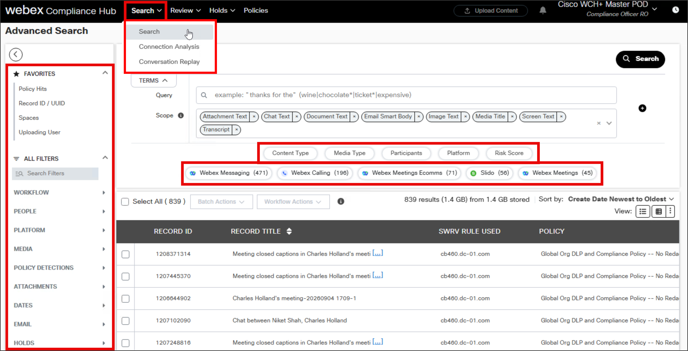{ width="400" style="border: 1px solid #888; border-radius: 4px;" }

      Note that this Webex Compliance Hub org has many Webex Messaging, Meeting, and Calling data records and lots of filters that can be applied to search easily through the records.

### eDiscovery for Webex Meetings
Please spend some time reviewing some of the compliance options for Webex meetings available with Webex Compliance Hub.

Webex Compliance Hub processes data from in-meeting chat, polls, Q&A, shared files, and other meeting content (like the data you just generated). Webex Compliance Hub can also detect content from users' audio/video streams such as, files shared visually or verbally during the meeting (e.g., an attendee holding a paper with sensitive information written on it or verbally mentioning credit card numbers/SSN/DOB). You will learn how Webex Compliance Hub can help us flag these violations as well.

1. Review Webex Meeting data 

      You will find pre-populated data that demonstrates some of the violations and types of data that Webex Copmliance Hub can process. Once logged in click the **Search** tab (1), click the **Search** option (2), enter the search term **Poll** (3), and click the **Search** (4) button. 
      
      Note: the screenshot below is using the **Table** viewing format. This can be found on the right side of the screen near the **Sort by** option (5).

      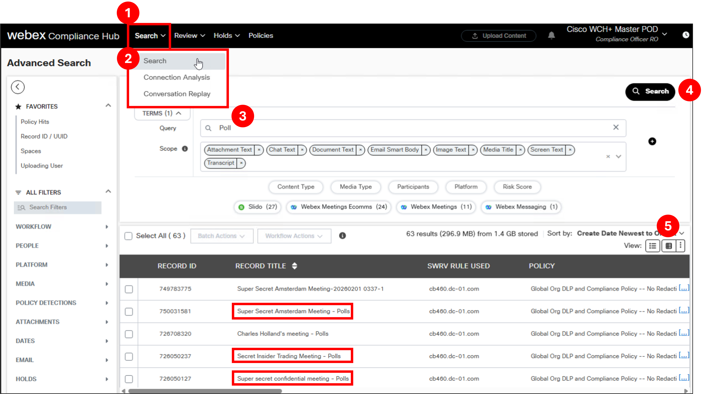{ width="400" style="border: 1px solid #888; border-radius: 4px;" }

      Explore and review few records that have Meeting Poll
      
      Close the Poll Search by clicking on the "x" next to search.

      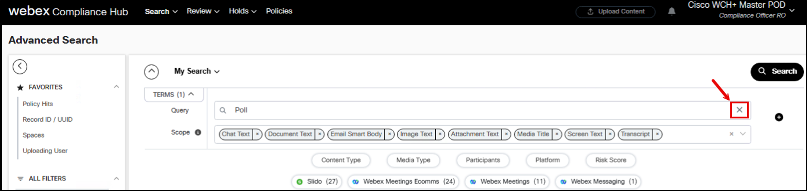{ width="400" style="border: 1px solid #888; border-radius: 4px;" }
    
      Repeat the search process with **Q&A** (1) as the search term, select **Slido** (2) as filter and click the **Search** button (3).

      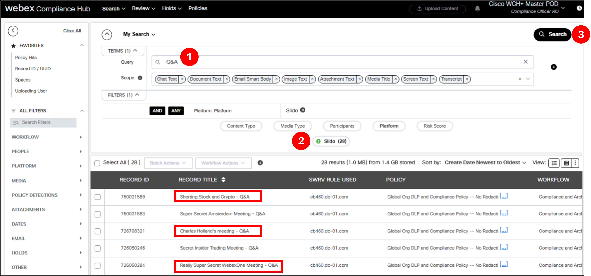{ width="400" style="border: 1px solid #888; border-radius: 4px;" }

      Before proceeding, close the Q&A Search by clicking on the "x" next to search and the 'x' next to 'Slido'

1. Search for and review records with specific built-in policy violations.

      In the left-hand navigation menu, under the **FAVORITES** section, click **Policy Hits**. In the resulting dialog box, scroll through the drop-down menu and select the following built-in detection rules then click **Apply**:

      **'Credit Card Number (CC#) -- Audio, Chat, Email, Image, AI Interaction, and Attachment'**, **'CryptoCurrency Discussions -- Video, Audio, Chat, Eamail, Image, AI Interaction, and Attachments'**, and **'Social Security Numbers(SSN) -- Audio, Chat, Email, Image, AI Interaction, and Attachments'**

      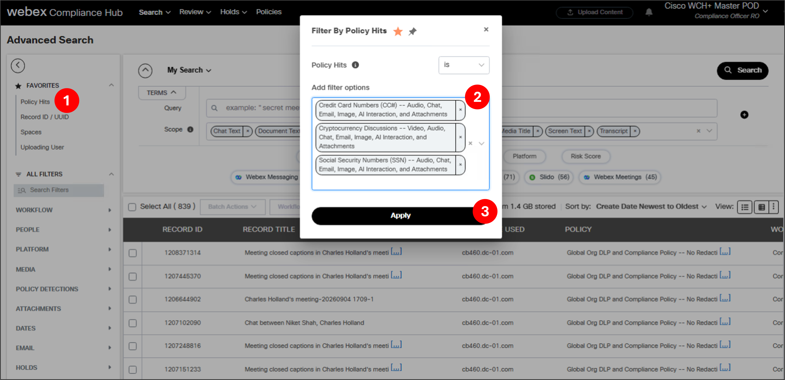{ width="400" style="border: 1px solid #888; border-radius: 4px;" }

1. Refine search to include specifc media types.

      Scroll down to the **Media** category in the left-hand navigation menu and click to expand the filter. Click **Media Type** and tick the boxes for **Audio** and **Video** then click **Apply**.

      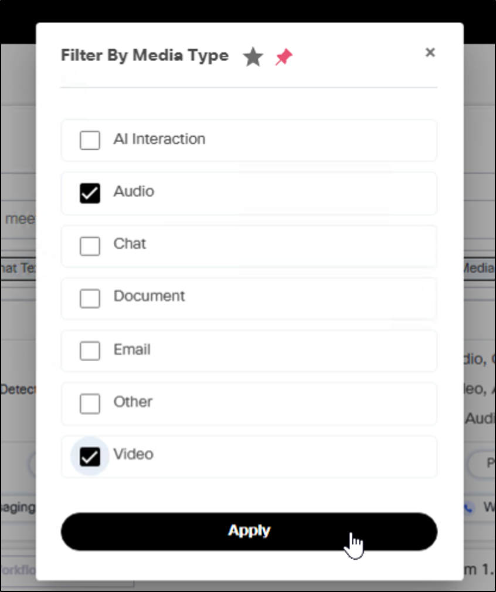{ width="400" style="border: 1px solid #888; border-radius: 4px;" }

1. Review a specific meeting data record. 

      Select any meeting, you will observe a recording of the meeting and flags where the users have violated policies. You can use **Record ID** 576714780 as an example.

      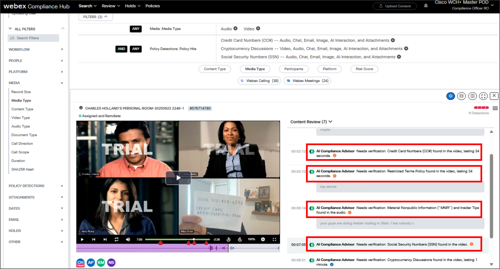{ width="400" style="border: 1px solid #888; border-radius: 4px;" }

      If you are reviewing record 576714780, scroll to approximately 7 minutes and 06 seconds into the meeting and you will see that Webex Compliance Hub has the ability to flag documents held up to the screen containing PII and confidential data.

      Feel free to take a few minutes and review a couple more records for various other compliance policy violations to get a good understanding of Webex Compliance Hub detection capabilities. Once you have completed reviewing the options, clear out all the filters that you have selected by clicking "Clear All" on the top left of the screen.

      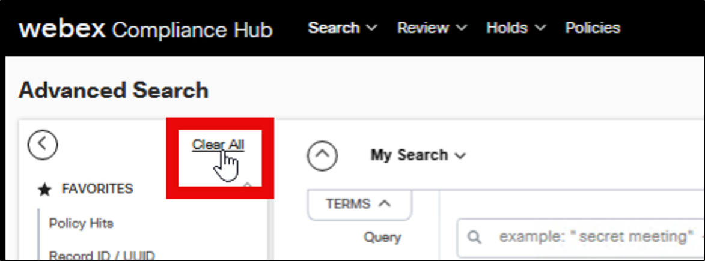{ width="400" style="border: 1px solid #888; border-radius: 4px;" }

## Explore eDiscovery for Webex Calling in Webex Compliance Hub

Please spend some time reviewing some of the compliance options for Webex Calling available in Webex Compliance Hub.

Webex Compliance Hub provides archiving, eDiscovery, and supervision for Webex Calling with automated detection of compliance risks in audio content with comprehensive support for Webex Calling, including recordings, call detail records (CDRs), and business texting (SMS). 

In this section you will review Webex Calling data records in Webex Compliance Hub. 

1. Search for Webex Calling data records.

      Navigate to eDicovery by clicking **Search** and then selecting **Search**. You will find pre-populated data that demonstrates some of the violations and types of data that Webex Compliance Hub can process. 
      
      Click **Webex Calling** to add a platform filter. 
      
      Note: the screenshots below show the **Table** view. This can be found on the right side of the screen near the **Sort by** option.

      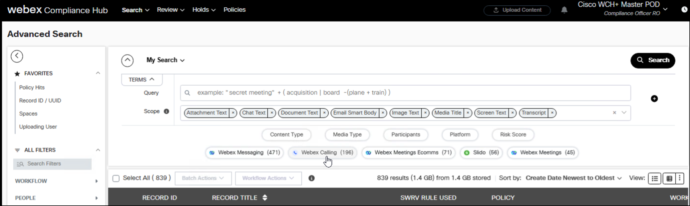{ width="400" style="border: 1px solid #888; border-radius: 4px;" }

1. Review list of records.

      You will find two types of Webex Calling records here:
      - Call detail records (CDRs)
            These records have a <u>Record Title</u> that starts with **'Call between...'**.  
      - Call recordings - These records have a <u>Record Title</u> that starts with **'Call with...'** and ending with a numeric sequence corresponding to the calling number and call timestamp.

      **CDRs**

      If the call is internal (**SIP_ENTERPRISE**) you will see a pair of CDRs for each call - one for each call leg: originating, terminating.
      
      If the call is external (**SIP_NATIONAL** - to PSTN, or **SIP_INBOUND** - from PSTN) you will see a single CDR for each call - the internal call leg: originating or terminating.

      **Call Recordings**

      In addition to the CDRs described above, if the call is recorded, you will also find a corresponding recording record.  

      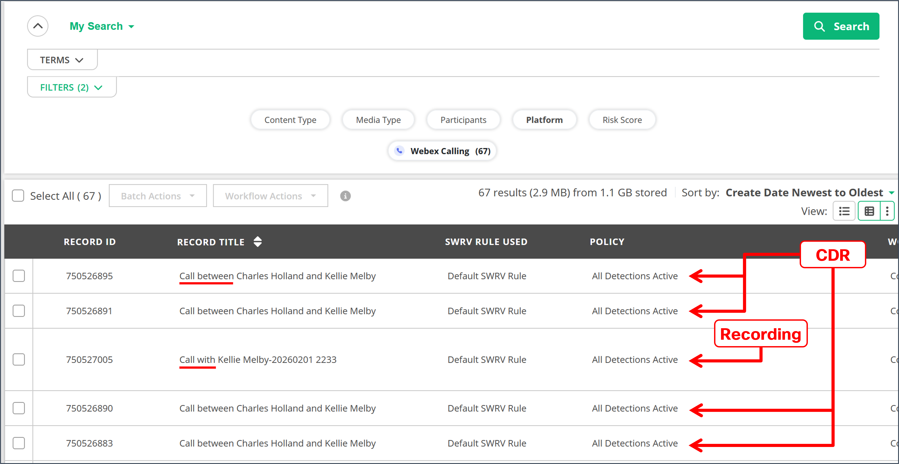{ width="400" style="border: 1px solid #888; border-radius: 4px;" }

      Note: CDR data records will be the same for both standard and zero trust end-to-end encrypted (E2EE) Webex calls. However, as discussed in Module 2, zero trust E2EE calls do not support call recording (or other features like closed captioning) and as such the call will fall back to standard encryption. So if a call has a corresponding audio recording, then it was not a zero trust E2EE call. On the oher hand, for any unrecorded call it would be impossible to tell the difference between a standard encrypted call and a zero trust E2EE call.

 1. Review CDR data record details
      
      Begin to review data records for Webex Calling. Start with an internal call.

      Scroll down and locate the set of call records: 75052**6890**, 75052**6883**. These should be listed sequentially and correspond to the terminating and originating legs of an internal call.

      To review a record, click the record. Select the **Attributes** record to see the call detail information.

      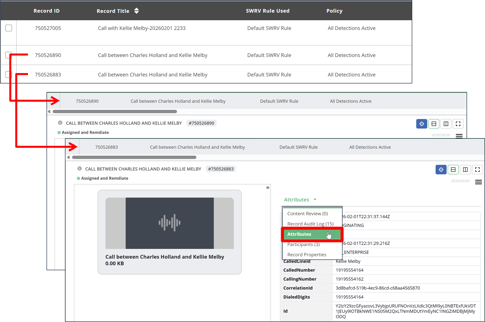{ width="400" style="border: 1px solid #888; border-radius: 4px;" }

      First, note the CallType for each record is **SIP_ENTERPRISE** indicating this is an internal call.
      
      Next, look at the **CorrelationId** attribute and notice that it is the same for both records (3d8bafcd-519b-4ec9-86cd-c68aa4565870). This indicates that these two records are part of the same call. Later you will see that the call recording data record has the same CorrelationId.

      Notice one of the records (75052**6883**) is the originating leg: **CallDirection=ORIGINATING**. And the other record (75052**6890**)is the terminating leg: **CallDirection=TERMINATING**.

      Additional detailed call information is displayed including call duration (CallDurationSeconds), times (CallAnswerTime, CallStartTime), numbers (CalledNumber, CallingNumber), and caller ID (CalledLineId, CallingLineId).

      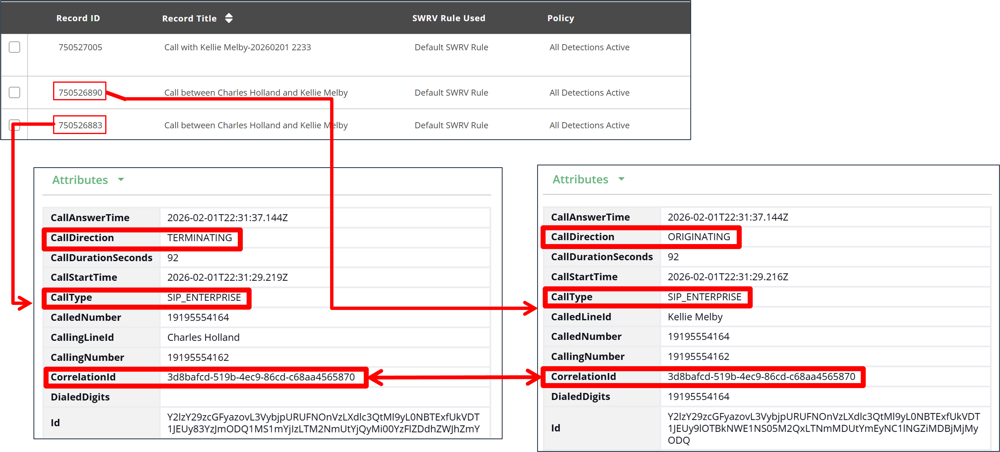{ width="400" style="border: 1px solid #888; border-radius: 4px;" }

1. Review a call recording record

      Now let's look at record 75052**7005**. This should be listed sequentially above the terminating and originating CDRs reviewed above. This record includes an audio recording of the call.

      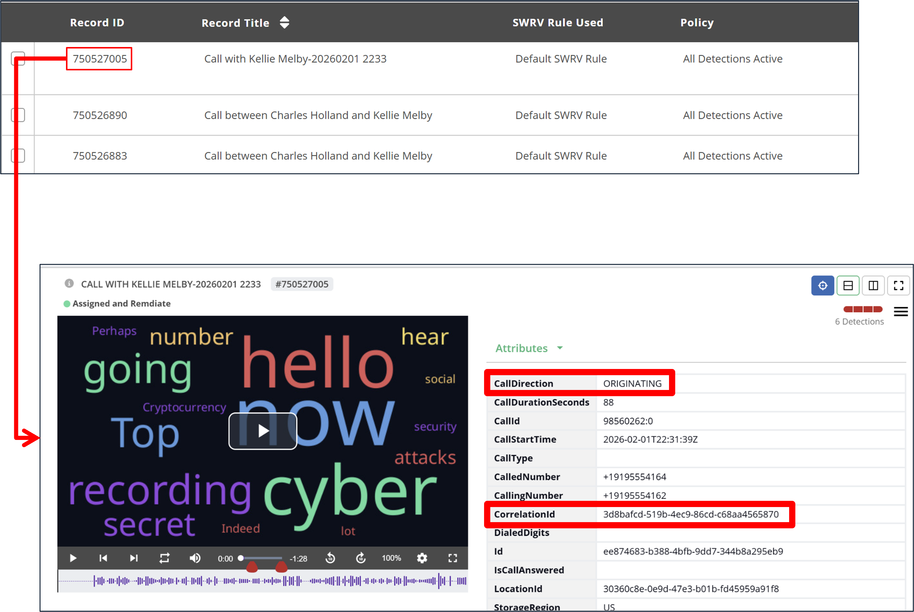{ width="400" style="border: 1px solid #888; border-radius: 4px;" }

      First, review the Attributes of the record. Observe that the **CorrleationId** (3d8bafcd-519b-4ec9-86cd-c68aa4565870) matches the two CDRs we reviewed above indicating this is the corresponding recording of that call. Also notice that the **CallDirection** parameter is 'ORIGINATING' indicating the call recording was started on the originator's leg of the call  
      
      Next, select **Content Review** to display the analysis of the recording made by the Theta Lake platform AI Compliance Advisor. This automated analysis indicates locations during the call recording where potential violations of compliance policy occurred. For example, the Compliance Advisor flagged multiple cases where **'cryptopcurrency'** is mentioned during the call which is a violation of the built-in 'CryptoCurrency Discussions' policy. Likewise, the Compliance Advisor flagged instances of social security numbers, credit card numbers, material nonpublic information (insider trading), and sensitive documents being discussed on the call. This analysis is a great starting place for the Compliance Officer when reviewing data records on the Theta Lake platform.
      
      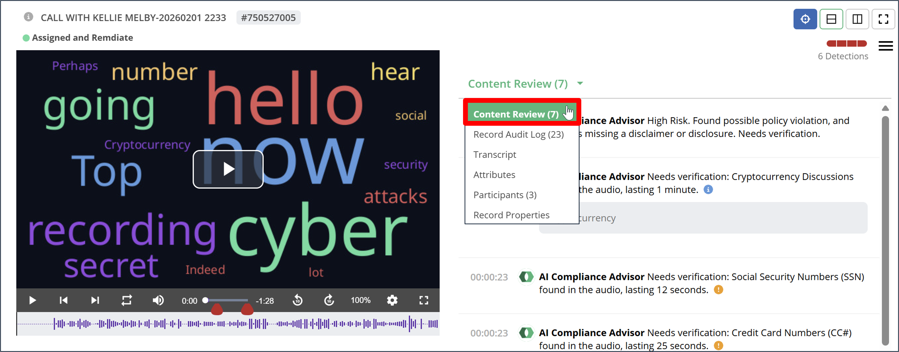 

      Review the details of this analysis noting the policies that were violated. Using the timestamps in the Content Review analysis see if you can locate one of the potential violations in the audio recording.
      
      Next, review the transcript of the recording. Select **Transcript** to display the transcript of the audio reocrding generated by the Webex Compliance Hub platform AI Compliance Advisor. This transcript along with the automated analysis by the AI Compliance Advisor keeps the Compliance Officer from having to review the audio recording saving a lot of time.

      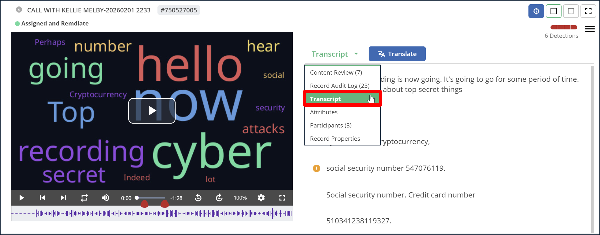      

      Finally, try translating the transcript into another language. Click **Translate**, select the language to translate to from the dropdown (e.g., Spanish) and then, click **Translate** again. Notice the transcipt has been translated into the language selected. This can be very useful if the call audio is in a language that the Compliance Officer is unable to understand.

      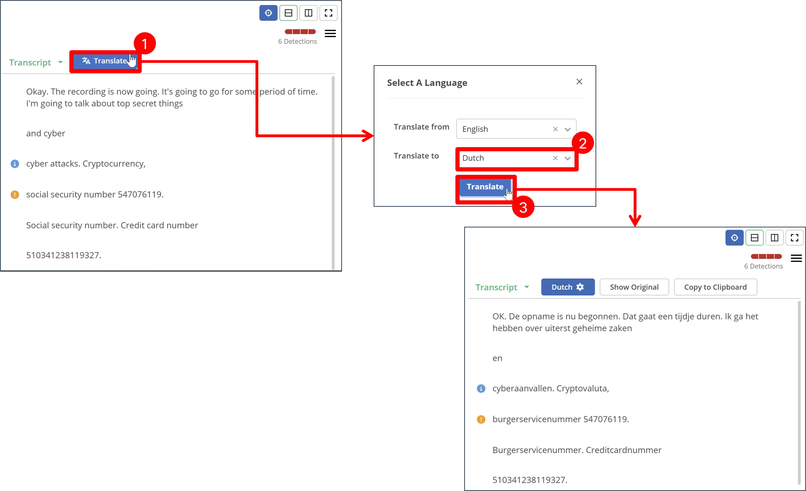{ width="400" style="border: 1px solid #888; border-radius: 4px;" }
      
1. Review other Webex Calling data records
      
      Take a few minutes to review some other records to see other types of calls and other possible compliance policy violations.

      For example, look at the records for a PSTN call with a single CDR data record and the corresponding audio recording data record. Scroll down and locate data recordings: 7312**5943** and 7312**5955** which are the respective CDR and audio recording for a PSTN call. (Hint: To find these records faster, use the side panel to select a 'Create Date' filter with a custom data range of January 19, 2026 12:00AM - January 19, 2026 11:00PM. This filter will return just these two data records).

      Note that under Attributes for both of these records, the **CorrelationId** (060b2e06-b871-435e-8a60-33c6be7862db) is the same indicating they are from the same call. The <u>CallType</u> attribute of the CDR is **SIP_NATIONAL** which indicates this is a PSTN call. This is an outbound call (<u>CallDirection</u> = **ORGINATING**) to the PSTN and as mentioned previously, this is the only call leg CDR available since the system has no visibility to the PSTN side of the call. 
      
      (Note: If this were an inbound PSTN call, then the <u>CallType</u> would be **SIP_INBOUND** and the <u>CallDirection</u> would be **TERMINATING**)

      Feel free to review the Content Review and Transcript details for the audio recording data record.

      Once you are done exploring other Webex Calling data records, before you proceed, ensure that you have cleared any filters and logged out of Webex Compliance Hub. 
      
      This concludes Webex Compliance Hub compliance sections.

## Cisco Secure Access Tenant and AD Onboarding
In this section you will perform the initial tenant provisioning and then configure Active Directory integration to bring users into the Secure Access tenant.

1. Enable     

## Cisco Secure Access Webex Integration and Policy Configuration
In this section you will integrate your Webex org with the Secure Access tenant for data loss protection and cloud malware. After completing these integrations, you will explore and configure cloud malware and data loss protection policies.

1. Enable     

## Generate User Data and Monitor Secure Access Operations
In this section you will use the Webex App to generate messaging data that violates policies configured in the previous section. Then you will monitor the Secure Access platform data loss protection and cloud anti-malare operations as the message data is ingested.

1. Enable     

**\*\*\* END of MODULE 3 \*\***

Continue with either Module 1 or Module 2:

- [Module 1: Webex Identity](module1_identity.md)
- [Module 2: Zero Trust Encryption](module2_zero_trust_encryption.md)
- [Module 3: Webex Compliance](module3_compliance.md) *(current)*
- [Conclusion](conclusion.md)
